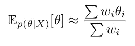

# 贝叶斯推理算法:MCMC 和 VI

> 原文：<https://towardsdatascience.com/bayesian-inference-algorithms-mcmc-and-vi-a8dad51ad5f5?source=collection_archive---------9----------------------->

## 直觉和诊断

与机器学习(ML)的其他领域不同，贝叶斯 ML 要求我们知道输出何时不可信。当您定型一个回归或 xgboost 模型时，在给定设置和数据的情况下，可以从表面上接受该模型。使用贝叶斯 ML，不能保证输出是正确的。

贝叶斯工作流程可以分为三个主要部分:建模、推理和批评。即使我们已经编写了一个合理的概率模型，由于推理算法，无论是因为算法失败还是因为我们选择了一个不合适的算法，结果都可能是误导的。本文将解释每种算法的工作原理，讨论每种算法的优缺点，以及如何诊断它们的性能。

贝叶斯计算的主要目标是找到贝叶斯定理中分母的变通方法:


除了最简单的模型，这个积分是不可能计算的。推理算法是获得 p(θ|X)的方法，而无需对积分求值。

# MCMC

马尔可夫链蒙特卡罗，顾名思义，使用必须满足某些条件的马尔可夫链来运行蒙特卡罗模拟，因此无论起点如何，我们总是以我们期望的平稳分布(后验分布)结束。

想象后验分布是某种丘陵地形。你想要探索地形，并在与土堆高度成比例的任何地点花费时间。需要注意的是，雾太大了，你什么也看不见。即使你站在山顶上，你也不知道与其他山相比，这是一座高的山还是一座矮的山。你可以知道你站在海拔 2 千米的地方，但是其他的山只有 1 千米高，还是有 5 千米高的山？只配备了一个测量高度的装置，你需要想出一个规则来实现你的目标。

马尔可夫链必须具有:

*   [**遍历性**](https://en.wikipedia.org/wiki/Markov_chain#Ergodicity) 。你可以在有限的时间内从任何状态到达一个状态(因此可以回到你的初始状态)。没有确定的循环。
*   [**明细平衡**](https://en.wikipedia.org/wiki/Detailed_balance#Reversible_Markov_chains) 。p(x|y)q(y) = p(y|x)q(x)

有些规则比其他规则更有效。实际上，大多数 MCMC 都是[螺母](http://www.stat.columbia.edu/~gelman/research/published/nuts.pdf)(不掉头采样器)，在需要时(主要是当参数离散时)加入一些 Gibbs。

## 吉布斯

假设我们要求 x 和 y 两个参数的后验分布，我们可以不受限制地从一个点跳到另一个点，也可以把每次跳跃分解成一个水平运动+一个垂直运动。这就是吉布斯的工作。我们举起双手说:我们不知道如何为前者制定规则，但我们可以为后者创造规则。


[来源](https://commons.wikimedia.org/wiki/File:Perpendicular_Vector_Addition.svg)

吉布斯要求有条件的结合。我们逐一检查所有参数。顺序无所谓— *直观上*(但不是真的)，横+竖=竖+横。我们通过分析求解后验概率对每个参数进行采样，保持所有其他参数不变。

举个简单的例子，假设我们想估计正态分布的均值μ和精度λ = 1/σ。我们放置先验μ~N(0，1)和λ~γ(1，1)。那么条件后验概率是


我们希望在这两种条件后验抽样之间进行交替。下面的 R 代码展示了吉布斯采样在这个模型中是如何工作的:

```
library(ggplot2)num_sample <- 5000    # number of samples for Gibbs
burn_in <- 1000       # first n samples we discard
prior_mean <- 0       # the prior on mu
prior_precision <- 1  # the prior on mu
prior_shape <- 1      # alpha in prior for precision
prior_rate <- 1       # beta in prior for precision
num_obs <- 30         # size of our data
true_mean <- 3        
true_precision <- 0.25set.seed(9)
X <- rnorm(num_obs, true_mean, 1/sqrt(true_precision))
mu <- rep(NA, num_sample)
lambda <- rep(NA, num_sample)#initialize some values
mu[1] <- 0 
lambda[1] <- 1for(i in 2:num_sample){
  if(i %% 2){
    mu[i] <- rnorm(
      1, 
      mean = (prior_precision * prior_mean + lambda[i-1] * sum(X)) / 
        (prior_precision + num_obs * lambda[i-1]),
      sd = sqrt(1 / (prior_precision + num_obs * lambda[i-1]))
    )
    lambda[i] <- lambda[i-1]
  } else{
    mu[i] <- mu[i-1]
    lambda[i] <- rgamma(
      1,
      shape = prior_shape + num_obs / 2,
      rate = prior_rate + sum((X - mu[i])^2) / 2
    )
  }
}posterior <- data.frame(mu, lambda)[(burn_in+1):num_sample,]ggplot(posterior) +
  geom_point(aes(x = mu, y = lambda)) +
  geom_path(aes(x = mu, y = lambda), alpha = 0.3) +
  ggtitle('Gibbs sampling') +
  xlab(expression(mu)) +
  ylab(expression(lambda))ggplot(posterior) +
  geom_histogram(
    aes(x = mu, y = stat(count) / sum(count)),
    alpha = 0.5) +
  geom_vline(
    aes(xintercept = quantile(posterior$mu, 0.025)), 
    color = 'red') +
  geom_vline(
    aes(xintercept = quantile(posterior$mu, 0.975)), 
    color = 'red') +
  ylab('Relative frequency') +
  xlab(expression(mu)) +
  ggtitle(bquote('95% credible interval of ' ~ mu))ggplot(posterior) +
  geom_histogram(
    aes(x = lambda, y = stat(count) / sum(count)), 
    alpha = 0.5) +
  geom_vline(
    aes(xintercept = quantile(posterior$lambda, 0.025)), 
    color = 'red') +
  geom_vline(
    aes(xintercept = quantile(posterior$lambda, 0.975)), 
    color = 'red') +
  ylab('Relative frequency') +
  xlab(expression(lambda)) +
  ggtitle(bquote('95% credible interval of ' ~ lambda))
```

请注意老化设置。MCMC 有希望收敛到目标分布，但可能需要一段时间。根据经验，我们丢弃前 1000 个，因为这个链可能还没有到达目的地。

尝试更改这些值，以直观地了解后验行为。如果我们追踪运动的路径，我们会看到水平-垂直模式:


我们可以使用边际分布计算可信区间:


当你的模型是有条件共轭的时候，Gibbs 会比其他方法更好。例如，尝试在 LDA 上运行 NUTS 不起作用，因为对于离散的潜在变量没有梯度。然而，为 LDA 运行 Gibbs 采样器(相对而言)更快更容易。

## 大都市

Metropolis 算法着眼于贝叶斯定理，提出“我们能让分母互相抵消吗？”算法:

1.  从某个随机的初始点θ开始。
2.  从某分布 p(θ*|θ)画出一个建议值θ*。
3.  如果 p(X|θ*)p(θ*) > p(X|θ)p(θ)，接受建议值。否则，以概率[p(X|θ*)p(θ*)] / [p(X|θ)p(θ)]接受建议值。
4.  如果被接受，移动到新的地点。否则，原地不动。不管怎样，记录你的位置。
5.  重复(2)、(3)和(4)，重复设定的迭代次数。

看接受概率:


记住 p(X)是一个未知常数。因为我们的目标是在与后验密度成比例的点上花费时间，所以我们可以不计算 p(X)就这样做。

满足遍历性和细节平衡的最简单方法是从 N(θ，s)中采样θ*。对称连续分布就可以了。

Metropolis-Hastings (MH)将该算法推广到非对称建议分布，同时保持详细的平衡。仔细观察 MH 的验收规则，并将其与详细平衡的含义进行比较。

下面是一些 R 代码，看看 Metropolis 算法是如何工作的，在θ上使用 N(0，1)先验，并且已知 X ~ N(θ，1):

```
library(ggplot2)num_iter <- 2000
s <- c(0.1, 1, 10)set.seed(1)
x <- rnorm(10, 10, 1)
thetas <- list()for(i in 1:length(s)){
  theta <- rep(NA, num_iter)
  current_theta <- rnorm(1, 0, 10)
  for(j in 1:num_iter){
    proposed_theta <- rnorm(1, current_theta, s[i])
    accept_prob <- exp(
      dnorm(proposed_theta, 0, 1, log = TRUE) +
        sum(dnorm(x, proposed_theta, 1, log = TRUE)) -
        dnorm(current_theta, 0, 1, log = TRUE) -
        sum(dnorm(x, current_theta, 1, log = TRUE))
    )
    if(runif(1) < accept_prob){
      current_theta <- proposed_theta
      theta[j] <- proposed_theta
    } else {
      theta[j] <- current_theta
    }
  }
  thetas[[i]] <- cbind(1:num_iter, theta, rep(s[i], num_iter))
}thetas <- data.frame(do.call('rbind', thetas))
colnames(thetas) <- c('iter', 'theta', 's')
thetas$s <- factor(thetas$s)ggplot(thetas) +
  geom_line(aes(x = iter, y = theta)) +
  facet_grid(s~.)ggplot(thetas[thetas$iter > 1000,]) +
  geom_line(aes(x = iter, y = theta)) +
  facet_grid(s~.)
```

Metropolis 算法的一个问题是，它对我们选择的建议分布很敏感。使用不同的标准差会产生不同的结果:


正如你所看到的，链需要一些时间来达到它的目标分布。解析地说，我们知道后验概率应该是 N(0.92，0.09)。为了看得更清楚，我们应该丢弃老化期间的样本，比如前 1000 个样本:


如果我们使 s 非常小，比如说 0.01，那么即使在 1000 次迭代之后，该链也不会达到目标分布。另一方面，拥有一个大的 s 会导致非常参差不齐的转换，因为我们会拒绝大多数提议。最好的 s 介于 0.1 和 1 之间。我们需要通过反复试验来找到它，这可能会很麻烦。虽然我们不会使用 Metropolis，但获得 MCMC 对设置如何敏感的直觉很重要。

## 哈密尔顿/坚果

我在这里说的任何东西都比不上 McElreath 的精彩[文章](https://elevanth.org/blog/2017/11/28/build-a-better-markov-chain/)，所以我建议阅读动画和细节。基本思想是哈密顿蒙特卡罗(HMC)是一种物理模拟。你有一个球在某个地形上滚动，这个地形是负对数后验概率，被某个未知常数上移。对于二维正态分布，想象一下把它翻过来，你就得到一个碗。你用一个随机的动量向一个随机的方向轻弹这个球，过了一段时间后停下来，记录下它最后停在哪里。当总能量(势能+动能)与初始能量相差太大时，您拒绝该样本，表明您的模拟失败。斯坦称这些为“发散过渡”。

MH 在极高的维度上失败了，因为最终你会得到接近 0%的接受率。人类的直觉在高维空间会崩溃。我们的三维大脑可能会将高维多元正态分布想象成一个实心球，但由于测量的的[集中度，它实际上是一个非常薄的球壳。如果我们把这个投影到 2D，它看起来会像一个甜甜圈，而不是一个圆。HMC 在甜甜圈上表现出色的事实意义深远。](https://en.wikipedia.org/wiki/Concentration_of_measure)


大的步长导致不好的近似([源](http://Physics simulations have to approximate trajectories by discretizing the steps. If you check every 10 "seconds", then your simulated trajectory might differ too much from the actual trajectory. If you check every 0.00001 "seconds", then your simulation will take a long time to compute even a single trajectory even though it will be much more accurate. One major downside of HMC is the need to tune the settings of the simulation.))

物理模拟必须通过离散化步骤来近似轨迹。如果你每 10 秒检查一次，那么你的模拟轨迹可能与实际轨迹相差太多。如果你每 0.00001 秒检查一次，那么你的模拟将花费很长时间来计算一个单独的轨迹，即使它会更精确。你需要调整模拟设置，以获得良好的 HMC 结果。

[螺母](http://www.stat.columbia.edu/~gelman/research/published/nuts.pdf)在预热阶段(而不是预烧阶段)自动为您调整设置*和*通过防止 U 形转弯为您提供更好的样本。如果你没有查看上面链接的[篇](https://elevanth.org/blog/2017/11/28/build-a-better-markov-chain/)，建议现在就看。在这个时代，几乎没有理由用 MH 或 HMC 代替坚果。

也就是说，NUTS 仍然会遇到一些问题。

首先，它可能会卡在多模态后部的单一模式附近(再次参考[文章](https://elevanth.org/blog/2017/11/28/build-a-better-markov-chain/))。您可以通过诊断来检测此问题(运行多个链！)然后要求 NUTS 获取更多的样本以更充分地探查后部。

第二，NUTS 每走一步都需要评估地形的坡度。计算梯度的成本非常高，我们*必须*使用整个数据集，所以它是不可伸缩的。


尼尔的漏斗([来源](https://mc-stan.org/docs/2_22/stan-users-guide/reparameterization-section.html))

第三，它不能探索类似尼尔漏斗的东西。这是分层模型的一个特别退化的例子。您可以阅读 Stan 文档中的示例。本质上，y 是对数标度参数，用于模拟组间方差，而 x 是组均值参数。NUTS 学习单一步长，但这种地形需要不同的步长，这取决于球在漏斗上的位置。在宽部分中起作用的步长在窄部分中将不起作用，而在窄部分中起作用的步长将太慢地探索宽部分。

如果您看到太多的发散过渡，并且它们都发生在同一个区域，您就会发现这个问题。建模者需要重新参数化模型，以便 NUTS 可以发挥其魔力，可能通过找到(相对)不相关的参数化或重新调整数据以使参数在相同的范围内。对于固定效应模型，这是通过对预测矩阵进行 QR 分解来实现的。

题外话:重新参数化通常是加速计算的好主意。这样想:如果我们提供一个漂亮的碗状表面，球可以滚得到处都是。探索一根稻草更加困难。在没有发散转换的情况下，来自两种方法的样本应该是正确的，但是 QR 分解的运行时间可以快很多。

## 诊断学

**R 帽子**

[R hat](http://www.stat.columbia.edu/~gelman/research/published/brooksgelman2.pdf) 看起来可疑地像方差分析中的 F 统计量，所以这是我给出的直觉。如果所有的链都是相同的，那么“F 统计”应该是 1。

然而，[反过来就不成立](https://statmodeling.stat.columbia.edu/2019/03/19/maybe-its-time-to-let-the-old-ways-die-or-we-broke-r-hat-so-now-we-have-to-fix-it/)。Rhat 有可能是 1，然而链并不收敛于任何东西。我们仍然需要检查其他诊断，但至少如果 Rhat > 1.00，那么我们很快就会知道有问题。(好笑的是老一点的教材说> 1.1，后来改成了> 1.01，现在又往> 1.005 移动。让我们坚持 1.00 美元。)

**n_eff**

样本容量的有效数量定义为:


其中，ρ_t 是滞后 t 时的自相关，实际上，我们会在自相关变为 0 时截断求和。

由于马尔可夫特性，MCMC 不绘制独立样本——至少你的样本依赖于前一个样本。历史上，人们通过减少样本来回避这个问题，例如只保留十分之一的样本。现在我们更清楚了；我们应该保留所有的样本，并将 n_eff 用于类似 CLT 的目的。

这是一个有用的诊断，因为如果你的 n_eff 比你的样本总数(减去老化/预热)低得多，那么一定是出了严重的问题(或者你需要抽取更多的样本)。

我在教科书中最喜欢的一段话来自 McElreath 的《统计学再思考 2:

> 当人们开始使用 Stan 或其他一些哈密尔顿采样器时，他们经常发现他们以前适合 Metropolis 的模型——黑斯廷斯和吉布斯采样器——不再有效。链条很慢。有很多警告。…这些问题可能一直存在，甚至在其他工具中也是如此。但由于吉布斯不使用梯度，它没有注意到一些问题，汉密尔顿引擎会。一种文化已经在应用统计学中发展了，只是在很长一段时间内——几百万次迭代中——运行坏链，然后积极地变薄、祈祷和发布。这必须停止。[示例[修订]—500 万个样本，neff 为 66！]

他公开羞辱了一家报纸；那份报纸应该受到应有的羞辱。野蛮人。

这一点可以成为使用 NUTS 作为默认设置的有力论据。我怀疑 Gibbs 可以提取合理的样本，但会卡在某个局部空间中，所以诊断是正确的，但 NUTS 会尝试探索其他地方并发出警告。

有时候 n_eff 会比你的样本数高。那没有理由惊慌。

## ELPD

将预期对数逐点预测密度(ELPD)视为贝叶斯情况下对数似然的推广。贝叶斯模型输出概率分布，而 RMSE /交叉熵等指标评估点预测的性能。ELPD 评估整个预测分布。

还有其他类似的指标，但是 ELPD 是您所需要的。AIC 和 BIC 评估点预测。WAIC 有很好的渐近性质，但对于较小的样本有不稳定的行为。他们的相似之处在于解释。ELPD 本身是没有意义的，但是它可以用来比较不同的模型，就像你使用 AIC 一样。

因为我们关心模型的泛化能力，所以我们希望从交叉验证中获得 ELPD。否则，我们会对模型性能过于乐观——在训练集上评估模型将产生乐观的低误差估计。

与机器学习中的传统智慧相反，对于贝叶斯模型，留一交叉验证(LOOCV)在计算上比 k-fold 交叉验证更有效。K-fold 要求我们对模型进行 k 次改装，但改装模型是最昂贵的部分。我们可以在已经从后验得到的样本上使用重要性抽样来近似 LOOCV，所以我们不需要重新调整模型。

如今，人们使用帕累托平滑重要性抽样( [PSIS-LOOCV](http://www.stat.columbia.edu/~gelman/research/unpublished/loo_stan.pdf) )。这些首字母缩略词越来越长。除了提高 ELPD 估计的稳定性，PSIS-LOOCV 还提供了一个额外的诊断:k。该算法采用 20%的最高重要性权重，并拟合一个[广义帕累托分布](https://en.wikipedia.org/wiki/Generalized_Pareto_distribution)。当 k >为 0.5 时，GPD 具有无限的方差，并表明 ELPD 的估计可能不可信，尽管从经验测试来看，直到 k >为 0.7 时，近似值还没有那么糟糕。当 k 很大时，它可能表示影响很大的观察结果扰乱了模型。

**排名图**

追踪图的表亲。虽然迹线图对检测退化情况很有用，但很难解释。等级图更容易检查。使用之前的 Metropolis 代码，创建 s = 0.2 的四个链:

```
library(data.table)
sampled_thetas <- data.table(thetas[iter > 1000])
sampled_thetas[,rank := frank(theta)]ggplot(sampled_thetas) +
  geom_histogram(aes(x = rank)) +
  facet_grid(.~s)

ggplot(thetas[(iter > 1000) & (iter < 1100)]) +
  geom_step(aes(x = iter, y = rank, color = s))
```


这两个图应该显示一些均匀的混合。否则，一定是出了问题。

# 五

对于 MCMC，理解算法是关键。对于 VI，我认为理解目标函数比算法更重要。

变分推理(VI)采用了不同于 MCMC 的方法，但在大多数应用中仍然使用蒙特卡罗。我们提出一个更简单易处理的分布族来逼近后验概率，而不是从后验概率中取样。然后这个问题被框定为一个优化问题。因此，VI 可以扩展到大数据，而 NUTS 不可能处理大数据。

虽然存在几个目标函数(主要替代函数是 [Renyi 散度](https://en.wikipedia.org/wiki/R%C3%A9nyi_entropy#R%C3%A9nyi_divergence)，但最常用的是 [Kullback-Leibler 散度](https://en.wikipedia.org/wiki/Kullback%E2%80%93Leibler_divergence) (KL 散度)，定义为:


确切的后验概率通常表示为 p，而我们的变分近似表示为 q。理解 KL 散度的性质对于使用 VI 至关重要，我们将从两个方面开始:

第一，是**不对称**。KL(p||q)要求我们取期望 w.r.t. p，而 KL(q||p)要求我们取期望 w.r.t. q。因此，它不是一个距离度量。

二是**非负。**从表达式来看不是很明显，可以参考这里的[证明](https://en.wikipedia.org/wiki/Gibbs%27_inequality)。

KL(p||q)被称为前向 KL，它很难处理，因为我们需要对 p 积分(如果我们知道 p，为什么我们还要这样做？).相反，VI 寻求最小化 KL(q||p)，即反向 KL。例如，我们可能希望用正态分布来近似高度复杂的后验概率；我们寻求使反向 KL 最小的变分参数μ和σ。用更精确的符号表示，假设ν是变分参数，我们希望找到使以下参数最小化的ν:


但是我们在分母中仍然有那个讨厌的未知后验，所以我们不能直接和 KL 一起工作。就像 Metropolis 一样，我们应用了一个技巧，这样我们就不必计算 p(X):


回想一下，p(X)是一个常数，所以我们可以把它从期望值中去掉。重新排列给了我们证据下限(ELBO)，VI 的目标函数:


因为 KL 是非负的，ELBO 的最大可能值是 log(p(X))，即对数证据。因此，为什么它被称为 ELBO:日志证据必须至少与 ELBO 一样高。然而，它可以是一个非常宽松的界限，差距将因假设和模型而异。不要用 ELBO 来比较假设。相反，使用拟合的后验概率计算贝叶斯因子。

ELBO 有两个重要特性:

首先，ELBO 是**熵减去交叉熵**。很有意思。想一想吧。熵希望 q 尽可能分散，而交叉熵希望 q 收敛到 p 模式上的点质量。这与先验和最大似然估计有类似的加权平均感觉，这是贝叶斯统计的主题。

第二，ELBO 鼓励 q 有太低的**方差**。在 p 密度高的地方，相对于 p 密度低的区域中的 x 过冲，x 过冲导致的%误差较小。为了解决这个问题，我们采用 w.r.t. q 的期望值，因此在 p 的低密度区域放置较小的质量将会降低这个误差的权重。

VI 对多模态后验概率和高度相关后验概率有困难。

作为一个例子，让我们在**多模式后**试验 NUTS 和 ADVI。它通常出现在混合模型中，但我们将使用最简单的例子:


标准文件:

```
data {
  int<lower=0> N;
  real x[N];
}
parameters {
  real mu;
}
model {
  mu ~ normal(0, 1);
  for (n in 1:N)
    x[n] ~ normal(fabs(mu), 1);
}
```

r 代码:

```
library(rstan)set.seed(555)
x <- rnorm(100, 2, 1)
data <- list(x = x, N = length(x))
model <- stan_model(file = 'bimodal_example.stan')mcmc <- sampling(
  model, 
  data, 
  iter = 2000, 
  warmup = 1000, 
  chains = 4, 
  seed = 1)advi <- vb(
  model,
  data,
  output_samples = 4000,
  seed = 3
)mcmc_samples <- sapply(
  mcmc@sim$samples, 
  function(x) x[['mu']][1001:2000]
)
advi_samples <- advi@sim$samples[[1]][['mu']]hist(mcmc_samples, breaks = 100, xlim = c(-3, 3))
hist(advi_samples, breaks = 30, xlim = c(-3, 3))
```


NUTS 报告的 Rhat 为 1.53，让我们知道这个模型是错误指定的。ADVI 收敛**没有任何警告**！因为拟合的变分分布在图的右边部分几乎没有质量，所以它未能覆盖的部分在 ELBO 中几乎没有重量。因此，它报告的方差比它应该报告的要低得多，使我们对错误的结论过于自信。

接下来，让我们比较 NUTS 与 ADVI 在**高度相关后验概率**方面的差异。

标准代码:

```
data {
  int<lower=0> N;
  real y[N];
  real x1[N];
  real x2[N];
}
parameters {
  real beta0;
  real beta1;
  real beta2;
  real<lower=0> sigmasq;
}
transformed parameters {
  real<lower=0> sigma;
  sigma = sqrt(sigmasq);
}
model {
  beta0 ~ normal(0, 1);
  beta1 ~ normal(0, 1);
  beta2 ~ normal(0, 1);
  sigmasq ~ inv_gamma(1, 1);
  for (n in 1:N)
    y[n] ~ normal(beta0 + beta1 * x1[n] + beta2 * x2[n], sigma);
}
```

r 代码:

```
library(rstan)set.seed(555)
x1 <- runif(100, 0, 2)
x2 <- x1 + rnorm(100, 0, 1)
y <- mapply(
  function(x1, x2) rnorm(1, x1 + 2 * x2, 1),
  x1,
  x2
)
data <- list(y = y, x1 = x1, x2 = x2, N = length(y))
model <- stan_model(file = 'correlated_example.stan')mcmc <- sampling(
  model, 
  data, 
  iter = 2000, 
  warmup = 1000, 
  chains = 4, 
  seed = 1)advi <- vb(
  model,
  data,
  output_samples = 4000,
  seed = 3
)nuts_beta1 <- sapply(
  mcmc@sim$samples, 
  function(x) x[['beta1']][1001:2000]
)
nuts_beta2 <- sapply(
  mcmc@sim$samples, 
  function(x) x[['beta2']][1001:2000]
)
advi_beta1 <- advi@sim$samples[[1]][['beta1']]
advi_beta2 <- advi@sim$samples[[1]][['beta2']]plot(nuts_beta1, nuts_beta2)
plot(advi_beta1, advi_beta2)
```


NUTS 设法很好地获得了相关性，但是 VI 认为参数是不相关的！怎么回事？(平心而论，Stan 警告你近似不好。)

默认情况下，VI 通过**平均场**假设加速计算，即局部参数彼此不相关。这使得观测值可以有条件地交换，并加速梯度计算。然而，正如这个例子所展示的，结果可能是非常错误的！

根据经验法则:

1.  如果您的数据大小合理，使用 MCMC，因为它更有可能收敛到准确的后验概率。
2.  如果你的数据对于 MCMC 来说太大，先试试均值场 VI。
3.  如果平均场 VI 失败，尝试**满秩** VI，它允许参数之间的相关性，但使计算慢得多。

## 坐标上升 VI

CAVI 是你的香草梯度上升。有人计算分析更新，我们迭代，直到 ELBO 收敛。这仅对于条件共轭模型是可能的。如果不可能为你的模型设置一个吉布斯采样器，那么 CAVI 也是不可能的。

像[潜在狄利克雷分配](http://www.jmlr.org/papers/volume3/blei03a/blei03a.pdf)这样的简单模型仍然需要大量的数学知识。(我说简单是因为这个模型可以用五行来描述，它是有条件共轭的，并且可以计算梯度。)即使有了分析更新，CAVI 的收敛速度可能会非常慢，但如果一个模型适合 CAVI，那么我们就可以使用 SVI。

## 随机 VI

如果 CAVI 是梯度上升，那么 SVI 是随机梯度上升。只要我们满足[罗宾斯-门罗条件](https://en.wikipedia.org/wiki/Stochastic_approximation)，那么 SVI 就一定会收敛(尽管这可能需要很多很多次迭代)。步长应该下降得足够慢，以便我们完全探索参数空间，但也应该下降得足够快，以便收敛到一个点。Spark 中的 LDA 实现默认使用 SVI。

最初，我认为 SVI 的表现会比 CAVI 差，但令人惊讶的是事实恰恰相反。这篇[论文](https://papers.nips.cc/paper/3902-online-learning-for-latent-dirichlet-allocation.pdf)显示，使用 SVI 学习参数要快得多。之前的一个个人项目证实了这一点。对所有文档进行单次 CAVI 迭代产生的结果比只对 10%的文档进行 SVI 迭代产生的结果更差。

如果您可以计算 SVI 的自然梯度，那么它应该是拟合模型的最佳算法。主要的挑战是:你必须手工计算它们。当计算自然梯度太困难甚至不可能时，使用 VI 的下两种风格。他们称之为“黑盒变分推断”，用蒙特卡罗方法近似梯度。Pyro 中的 svi 函数是 BBVI。

## 分数梯度 VI

纸[这里](https://arxiv.org/pdf/1401.0118.pdf)。附录中的推导。我们想通过近似 ELBO 的梯度来进行 SGD。直觉:

*   ELBO 是积分，梯度是极限。[支配收敛定理](https://en.wikipedia.org/wiki/Dominated_convergence_theorem)的条件成立，所以我们可以交换∇和积分的顺序。
*   将乘积法则应用于被积函数。
*   常数的梯度为 0。
*   [得分函数](https://en.wikipedia.org/wiki/Score_(statistics))的期望值为 0。

把这些按顺序应用给我们


我们可以通过从当前 q 中取样并评估被积函数中的每一项来对这一期望进行蒙特卡罗近似。

实际上，分数梯度的方差太高，使其不实用。需要额外的专业知识来控制偏差。否则，BBVI 将不会在任何合理的时间内收敛，因为我们踏遍了所有的地方。

## 重新参数化梯度 VI

纸[这里](https://arxiv.org/pdf/1603.00788.pdf)。这是在大多数概率编程包中默认实现的 VI 版本。我建议阅读原文，因为它写得非常清楚。

基本思想是我们知道如何在多元正态分布上做 VI，那么为什么不把所有的 VI 问题转化成我们已经知道如何解决的问题呢？我们模型中的所有参数都是经过变换的 MVN。我们可以对这些转换函数应用链式法则(重新参数化)，并使用自动微分来计算梯度。

实际上，后验分布对重新参数化很敏感。还不清楚什么函数能产生最好的近似值。同样，VI 的良好运行需要专业知识。自动寻找最佳重新参数化的算法是我最想做的事情，我会留意的。

## 诊断学

**ELBO 跟踪图**


[来源](https://arxiv.org/pdf/1603.00788.pdf)

就像 SGD 算法一样，我们可以检查目标函数是否已经收敛。在现实中，很难知道什么时候停止。一旦逃离局部最优，ELBO 可以跳转，但我们无法判断它是否停留在局部最优。虽然轨迹图很好，但真正的诊断是…

**重要性抽样**

这是 Stan 在 ADVI 收敛到不适合时用来警告用户的诊断。假设我们想计算 E[θ] w.r.t .的后验概率，但是我们不能这样做，因为我们不知道后验概率。一个巧妙的技巧是


因此，即使我们不能从 p 中取样，我们也可以通过从一个方便的 q 中取样来进行蒙特卡罗近似。我们通过取这个加权平均值来近似期望



其中 w_i 是重要性权重，定义如下


就像 Metropolis 算法一样，我们永远不需要计算 p(X ),因为它在取加权平均值时会抵消掉(见模式？).幸运的是，我们已经有了一个方便的 q 样本:我们拟合的变分分布。众所周知，如果 p 和 q 没有太多重叠，则重要性权重可以具有无限方差。

斯坦将[广义帕累托分布](https://en.wikipedia.org/wiki/Generalized_Pareto_distribution)拟合到 20%的最高重要性权重。如果 k >为 0.5，GPD 具有无限的方差，尽管实际上，根据经验，在 k >为 0.7 之前，拟合相对较好。当 k > 0.7 时 Stan 警告用户。这应该是您评估 VI 适合性的主要诊断。

# 最后

希望本文为使用和诊断贝叶斯推理算法提供了很好的信息。一如既往，如果你看到任何错误或有任何建议，请让我知道，以便我可以修改文章。