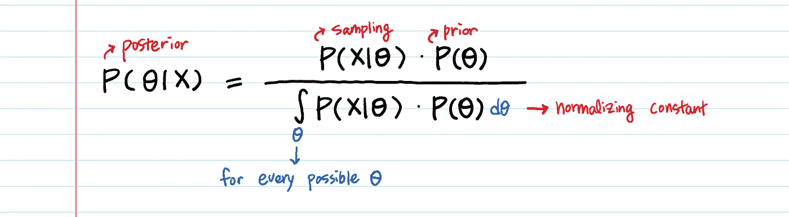
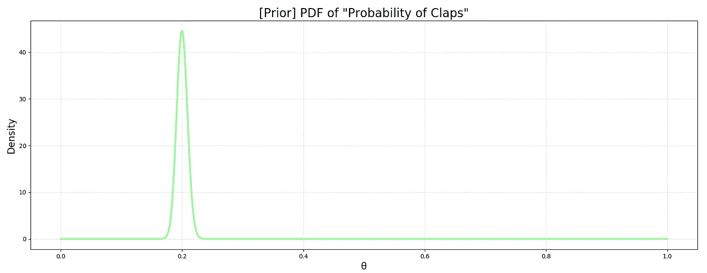
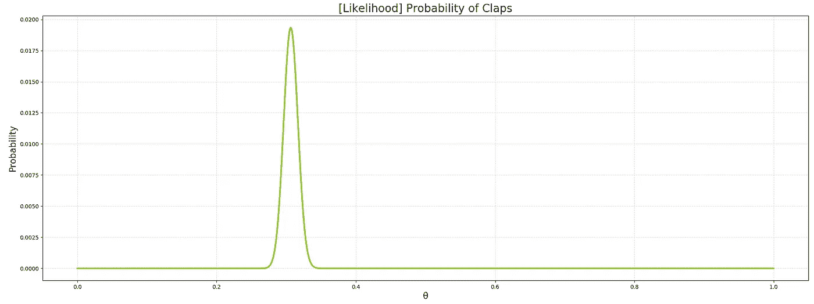
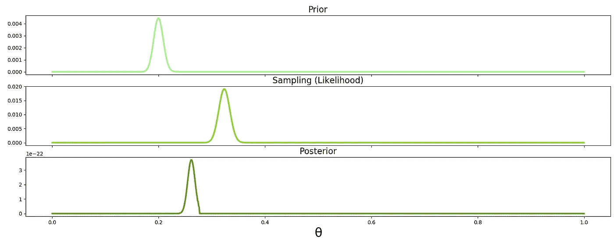

# 贝叶斯推理——直觉和例子

> 原文：<https://towardsdatascience.com/bayesian-inference-intuition-and-example-148fd8fb95d6?source=collection_archive---------0----------------------->

## 使用 Python 代码

# 为什么有人要发明贝叶斯推理？

一句话:随着我们收集更多的数据，更新概率 **。**

贝叶斯推理的核心是将两个不同的分布(似然和先验)组合成一个“更聪明”的分布(后验)。在经典的最大似然估计(MLE)没有考虑先验的意义上，后验是**“更聪明”。**一旦我们计算出后验概率，我们就用它来寻找“最佳”参数，而**“最佳”就是在给定数据的情况下，最大化后验概率****。这个过程叫做[最大后验概率(MAP)](https://en.wikipedia.org/wiki/Maximum_a_posteriori_estimation) 。MAP 中使用的优化和典型机器学习中使用的优化是一样的，比如梯度下降或者牛顿法等。**

**当我研究著名的贝叶斯法则时，通过分析理解这个等式是相当容易的。但是你如何用数据实现它呢？**

****

**统计世界中最著名的方程式之一**

**具体来说，**我们会有大量的数据点 X，**我们如何将**概率 wrt X** 乘以**概率 wrt θ？****

**显然，贝叶斯推理的艺术在于你如何实现它。**

# **示例:**

**每天大约有 2000 名读者访问我的中型博客。有人看完文章鼓掌有人不鼓掌。我想**预测一下，当我将来写一篇新的博文时，会有百分之多少的人参与进来并鼓掌**。**

**这类问题适用面广。尝试将这一点应用到你自己的建模工作中——广告的点击率、在你的网站上实际购买的客户的转化率、同意与你约会的人的百分比、患乳腺癌的女性的生存机会等。**

# **生成数据:**

**让我们生成数据 **X** 。现实生活中，你对 **X 没有任何控制**这是你要观察的。**

```
import numpy as np
np.set_printoptions(threshold=100)# Generating 2,000 readers' reponse. 
# Assuming the claps follow a Bernoulli process - a sequence of binary (success/failure) random variables.
# 1 means clap. 0 means no clap.**# We pick the success rate of 30%.**
**clap_prob = 0.3**# IID (independent and identically distributed) assumption
**clap_data = np.random.binomial(n=1, p=clap_prob, size=2000)**
```

**拍手数据是二进制的。1 表示拍手，0 表示没有拍手。**

**数据 **X** 看起来像:**

```
In [1]: clap_data
Out[1]: array([0, 0, 0, ..., 0, 1, 0])In [2]: len(clap_data)
Out[2]: 2000
```

**贝叶斯推理有三个步骤。**

**第一步。**【先验】选择一个 PDF 来建模**你的参数 **θ** ，又名先验分布 **P(θ)** 。这是**你在** 看到数据 **X** 之前关于参数 ***的最佳猜测。*****

**第二步。**【可能性】为 **P(X|θ)** 选择一个 PDF** 。基本上你是在给定参数 **θ** 的情况下模拟数据 **X** 的样子。**

**第三步。**【后验】计算后验**分布 **P(θ|X)** 取 P(θ|X)最高的 **θ。****

**后验成为新的先验。获得更多数据后，重复第 3 步。**

# **第一步。先验 P(θ)**

**第一步是**选择 PDF** 对参数 **θ** 建模。**

> ****参数θ代表什么？****

**鼓掌声👏概率。**

> **那么，**我们应该用什么样的概率分布来建模一个概率呢？****

**要表示一个概率，需要满足几个条件。首先，域的范围应该是从 0 到 1。第二，应该是连续分布。**

**那么我能想到的有两个众所周知的概率分布:**

**贝塔和狄利克雷。**

**狄利克雷用于多变量，贝塔用于单变量。我们只有一件事可以预测，那就是一个概率，所以我们用[贝塔分布](/beta-distribution-intuition-examples-and-derivation-cf00f4db57af)。**

**(一个有趣的旁注:很容易在(0，1)上创建任意分布。取任何一个在 0 到 1 之间不爆炸的函数，保持正的。然后，简单的从 0 到 1 积分，用那个结果除函数。)**

**要使用 Beta 分布，我们需要确定两个参数 **α & β** 。你可以把 **α** 想成有多少人鼓掌(**成功数**)**β**想成有多少人不鼓掌(**失败数**)。这些参数——α**α&β**的大小——将决定分布的形状。**

**假设您有昨天的数据，并观察到 2000 名访客中有 400 人鼓掌。**

**根据 beta 分布你会怎么写呢？**

```
import scipy.stats as stats
import matplotlib.pyplot as plt**a = 400
b = 2000 - a**# domain θ
theta_range = np.linspace(0, 1, 1000)# prior distribution P(θ)
prior = **stats.beta.pdf(x = theta_range, a=a, b=b)**
```

**让我们画出所有 **θ** 值的先验分布。**

```
# Plotting the prior distribution
plt.rcParams['figure.figsize'] = [20, 7]
fig, ax = plt.subplots()
**plt.plot(theta_range, prior,** linewidth=3, color='palegreen')# Add a title
plt.title('[Prior] PDF of "Probability of Claps"', fontsize=20)# Add X and y Label
plt.xlabel('θ', fontsize=16)
plt.ylabel('Density', fontsize=16)# Add a grid
plt.grid(alpha=.4, linestyle='--')# Show the plot
plt.show()
```

****

**不熟悉 Y 轴上的术语“密度”？→ [阅读“PDF 不是概率”](/pdf-is-not-a-probability-5a4b8a5d9531)**

**正如预期的那样，它的峰值达到了 20% (400 次鼓掌/ 2000 个读者)。两千个数据点似乎产生了一个强有力的先验。如果我们使用**更少的数据点**，比如说 100 个阅读器，曲线将会不那么尖锐。用**α**= 20&**β**= 80 试试。**

**对于那些想知道概率密度怎么会大于 1 的人。👉[概率密度不是概率。](/pdf-is-not-a-probability-5a4b8a5d9531)**

# **第二步。可能性 P(X|θ)**

****选择**一个概率模型为 **P(X|θ)** ，给定特定参数 **θ** 看到数据的概率 **X** 。可能性也称为**抽样分布**。对我来说，“抽样分布”这个术语比“可能性”更直观。**

**要选择使用哪种概率分布来模拟抽样分布，我们首先需要问:**

> **我们的数据 **X** 是什么样子的？**

****X** 是二进制数组`[0,1,0,1,...,0,0,0,1]`。**

**我们还有**访客总数(n)** 和我们想要**鼓掌的概率(p)。****

> **好的，**n&p**……**他们对你尖叫什么？****

******n&p**的二项分布。****

```
**# The sampling dist P(X|θ) with a prior θlikelihood = **stats.binom.pmf(k = np.sum(clap_data), n = len(clap_data), p = a/(a+b))****
```

****我们之前的假设 **θ** 可能性大吗？****

```
**In [63]: likelihoodOut[63]: 4.902953768848812e-30**
```

****没有。****

****我们来看一下 **P(X|θ)** 对于所有可能的 **θ** 的曲线图。****

```
**# Likelihood P(X|θ) **for all θ's**
likelihood = stats.binom.pmf(k = np.sum(clap_data), n = len(clap_data), **p = theta_range**)# Create the plot
fig, ax = plt.subplots()
**plt.plot(theta_range, likelihood,** linewidth=3, color='yellowgreen')# Add a title
plt.title('[Likelihood] Probability of Claps' , fontsize=20)# Add X and y Label
plt.xlabel(’θ’, fontsize=16)
plt.ylabel(’Probability’, fontsize=16)# Add a grid
plt.grid(alpha=.4, linestyle='--')# Show the plot
plt.show()**
```

********

******给定数据的可能性 P(X |θ)******

# ****第三步。后。P(θ|X)****

****最后，让我们来回答我们在开始时提出的问题:****

> ****具体来说，**我们会有大量的数据点 X，**我们如何将**概率 wrt X** 乘以**概率 wrt θ？******

****即使有数千个数据点，我们也可以通过将数据插入您选择的模型(在本例中，二项式分布)中，将它们转换为单个标量——可能性 **P(X|θ)** — **。)******

****然后，我们对一个具体的 **θ** 计算**P(θ)**&**P(X |θ)**，并将它们相乘。如果你对每一个可能的 **θ** 都这样做，你可以在不同的 **θ** 的**中挑选最高的 **P(θ) * P(X|θ)** 。******

**你最初对参数的猜测是 **P(θ)。**现在你正在**将简单的 P(θ)升级为更具信息性的东西——P(θ| X)——随着更多数据的可用。**
**P(θ|X)** 仍然是 **θ** 的概率，就像 **P(θ)** 是一样。不过， **P(θ|X)** 是 **P(θ)** 更聪明的版本。**

****代码胜过千言万语:****

```
# (cont.)theta_range_e = theta_range + 0.001 prior = **stats.beta.cdf(x = theta_range_e, a=a, b=b) - stats.beta.cdf(x = theta_range, a=a, b=b)** # prior = stats.beta.pdf(x = theta_range, a=a, b=b)likelihood = **stats.binom.pmf(k = np.sum(clap_data), n = len(clap_data), p = theta_range)** posterior = **likelihood * prior** # element-wise multiplication
normalized_posterior = posterior / np.sum(posterior)
```

```
In [74]: np.argmax(prior)
Out[74]: 199In [75]: np.argmax(likelihood)
Out[75]: 306In [76]: np.argmax(posterior)
Out[76]: 253
```

```
# Plotting all three together
fig, axes = plt.subplots(3, 1, sharex=True, figsize=(20,7))
plt.xlabel('θ', fontsize=24)**axes[0].plot(theta_range, prior,** label="**Prior**", linewidth=3, color='palegreen')
axes[0].set_title("Prior", fontsize=16)**axes[1].plot(theta_range, likelihood**, label="**Likelihood**", linewidth=3, color='yellowgreen')
axes[1].set_title("Sampling (Likelihood)", fontsize=16)**axes[2].plot(theta_range, posterior,** label='**Posterior**', linewidth=3, color='olivedrab')
axes[2].set_title("Posterior", fontsize=16)
plt.show()
```

****

**当你看后验图(第三张)时，**注意这是可能性向先验转移的地方。** *先前*的鼓掌概率为 20%。数据的鼓掌概率被给定为 30%。现在，后验概率的峰值在 0.25%左右。**

**此外，请注意，在先验/可能性中，钟形曲线的宽度在后验中缩小了。因为我们通过采样整合了更多的信息，所以可能的参数范围现在变窄了。**

**你收集的数据越多，后验概率图看起来就越像概率图，越不像先验概率图。换句话说，当你得到更多的数据时，原来的先验分布就不那么重要了。**

**最后，我们**选择θ，其给出通过数值优化计算的最高后验**，例如[梯度下降](/difference-between-batch-gradient-descent-and-stochastic-gradient-descent-1187f1291aa1)或牛顿法。这整个迭代过程被称为**最大后验估计(MAP)** 。**

**脚注:我们通过减去两个`stats.beta.**cdf**`而不是使用`stats.beta.**pdf**`来计算先验，因为可能性`stats.binom.**pmf**` 是一个概率，而`stats.beta.**pdf**`返回一个**密度**。即使我们用密度来计算后验概率，也不会改变优化结果。然而，如果你想要单位匹配，**将密度转换成概率**是必要的。(还不清楚？[阅读“PDF 不是概率，而 PMF 是概率”。](/pdf-is-not-a-probability-5a4b8a5d9531))**

**需要注意一些事情:**

1.  **MAP 不仅可以通过数值优化来计算，还可以通过**(仅适用于某些分布)、修改的期望最大化算法或蒙特卡罗方法来计算。****
2.  ****使用封闭形式计算后验概率非常方便，因为你不必进行昂贵的计算。(看贝叶斯公式分母中每一个可能的 **θ** 的积分。非常贵。)
    在我们上面的例子中，贝塔分布是二项似然的共轭先验。这意味着，在建模阶段，我们已经知道后验也将是贝塔分布。那么在进行更多的实验后，我们只需将成功和失败的次数分别加到现有的参数 **α** 和 **β** 上，就可以计算出后验。
    我们什么时候可以将这种轻松的封闭形式用于后部？
    当你的先验有一个封闭形式(当然)并且是一个**共轭先验**——当先验乘以似然性再除以归一化常数，仍然是同一个分布。****
3.  ****归一化(对分母中每个可能的 **θ** 的积分)对于寻找最大后验概率是否必要**？******

********

****没有。**不用归一化**还是能找到最大值。但是，如果您想比较不同模型的后验概率，或者计算点估计，您需要将其归一化。****

****4.MAP 估计可以被看作是通过先验引入更多信息的正则化 ML。****

****5.你熟悉最大似然估计(MLE)，但不太熟悉最大后验概率(MAP)吗？
**MLE 只是具有统一先验的映射的一个特例**。****

****6.我写了*先验是你最好的猜测关于参数* ***在**** 看到数据之前*，*然而在实际操作中，一旦我们计算了后验，后验就变成了新的先验，直到新的一批数据进来。这样，我们可以迭代地更新我们的先验和后验。马尔可夫链蒙特卡罗抽样方法就是基于这种思想。*****