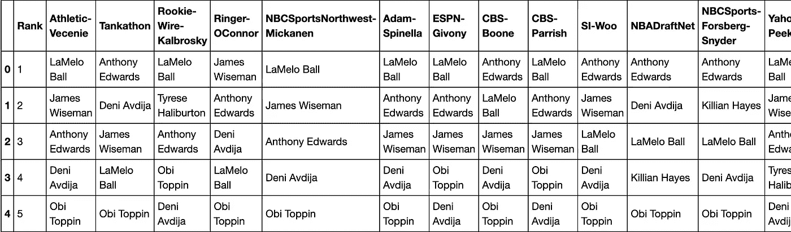
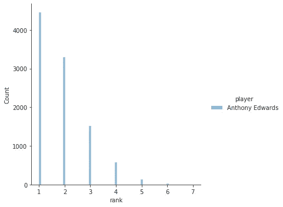
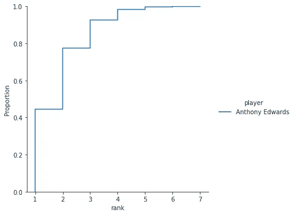
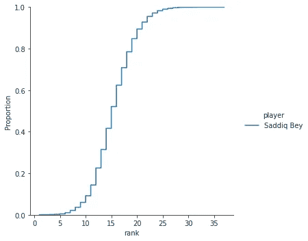
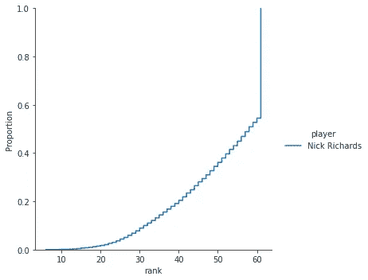
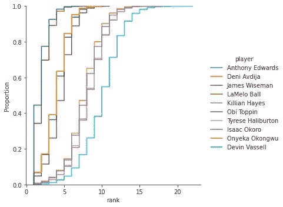

# 模拟 NBA 选秀顺序的贝叶斯推理

> 原文：<https://towardsdatascience.com/bayesian-inference-of-mock-nba-draft-order-f4fa4a26be17?source=collection_archive---------52----------------------->

## 如何使用优步概率编程库 Pyro 对 NBA 选秀顺序进行建模

我们许多密切关注 NBA 选秀的人都渴望知道选秀的准确顺序，例如每个球员将被带到哪里(“哪里”在这里有双重含义，球队和选秀位置)。为此，我们通常会从十几份甚至更多的“重要”模拟草稿中吸取信息。分析师和媒体试图以不同的方式将这些信息整合成我喜欢称之为“元模拟”的东西。一般来说，这只涉及非常简单的操作，如平均排名或查看最小和最大吃水位置。Chris Feller 前几天分享了一个非常酷的生存分析方法。我还没有深入研究它，但是和我在这里做的事情相比会很有趣。

我想做的是为模拟草稿创建一个生成元模型，这与使用生存分析略有不同，但可以产生类似的见解，我将在后面展示。理论上，这使得人们能够从等级排序中推断出一些“价值”的度量(我没有发现模拟选秀给玩家分配数字评级)，然后从后验分布中生成随机模拟选秀顺序。换句话说，就像 Nate Silver 运行模拟来预测谁将赢得选举一样，我们可以为模拟草案创建一个模拟，并在其中做各种各样的事情。让我告诉你怎么做！

我们首先需要的是对等级数据有意义的概率分布。向 [Plackett-Luce 分布](https://cran.rstudio.com/web/packages/PlackettLuce/vignettes/Overview.html)问好。基本思想是，如果你有一些集合 *S* 的项目，每个项目都有一些“价值” *w_i* 你可以在一些向量中的这些项目的任意排列的排名上生成一个概率分布。我不会向您展示这些方程(参见参考资料)，但我可以向您展示一个非常简单的模拟来快速理解这个想法。首先我们需要导入一些包并定义 PL 发行版，我发现有人已经在 github [这里](https://github.com/agadetsky/pytorch-pl-variance-reduction)上实现了。这里的工作都是使用优步开源的 [Pyro 概率编程语言](http://pyro.ai/)完成的，它是基于[脸书的 PyTorch](https://pytorch.org/) 深度学习库构建的。

```
**import** **random**

**import** **pandas** **as** **pd**
**import** **numpy** **as** **np**

**import** **torch**
**from** **pyro.infer.autoguide** **import** AutoDiagonalNormal 
**from** **pyro.infer** **import** SVI, Trace_ELBO, Predictive
**from** **pyro.distributions.distribution** **import** Distribution
**from** **torch.distributions** **import** constraints
**from** **pyro.distributions.torch_distribution** **import** TorchDistributionMixin, TorchDistribution
**import** **pyro.distributions** **as** **dist**
**import** **pyro**
**import** **seaborn** **as** **sns***# some utilities defined in https://github.com/agadetsky/pytorch-pl-variance-reduction/blob/master/utils.py*

**def** logcumsumexp(x, dim):
    *# slow implementation, but ok for now*
    **if** (dim != -1) **or** (dim != x.ndimension() - 1):
        x = x.transpose(dim, -1)

    out = []
    **for** i **in** range(1, x.size(-1) + 1):
        out.append(torch.logsumexp(x[..., :i], dim=-1, keepdim=**True**))
    out = torch.cat(out, dim=-1)

    **if** (dim != -1) **or** (dim != x.ndimension() - 1):
        out = out.transpose(-1, dim)
    **return** out

**def** reverse_logcumsumexp(x, dim):
    **return** torch.flip(logcumsumexp(torch.flip(x, dims=(dim, )), dim), dims=(dim, ))

**def** smart_perm(x, permutation):
    **assert** x.size() == permutation.size()
    **if** x.ndimension() == 1:
        ret = x[permutation]
    **elif** x.ndimension() == 2:
        d1, d2 = x.size()
        ret = x[
            torch.arange(d1).unsqueeze(1).repeat((1, d2)).flatten(),
            permutation.flatten()
        ].view(d1, d2)
    **elif** x.ndimension() == 3:
        d1, d2, d3 = x.size()
        ret = x[
            torch.arange(d1).unsqueeze(1).repeat((1, d2 * d3)).flatten(),
            torch.arange(d2).unsqueeze(1).repeat((1, d3)).flatten().unsqueeze(0).repeat((1, d1)).flatten(),
            permutation.flatten()
        ].view(d1, d2, d3)
    **else**:
        **ValueError**("Only 3 dimensions maximum")
    **return** ret**class** **PlackettLuce**(Distribution):
    *"""*
 *Plackett-Luce distribution*
 *"""*
    arg_constraints = {"logits": constraints.real}

    **def** __init__(self, logits):
        *# last dimension is for scores of plackett luce*
        super(PlackettLuce, self).__init__()
        self.logits = logits
        self.size = self.logits.size()

    **def** sample(self, sample_shape=torch.Size()):
        *# sample permutations using Gumbel-max trick to avoid cycles*
        **with** torch.no_grad():
            logits = self.logits.unsqueeze(0).expand(sample_shape, *self.size)
            u = torch.distributions.utils.clamp_probs(torch.rand_like(logits))
            z = self.logits - torch.log(-torch.log(u))
            samples = torch.sort(z, descending=**True**, dim=-1)[1]
        **return** samples

    **def** log_prob(self, samples):
        *# samples shape is: num_samples x self.size*
        *# samples is permutations not permutation matrices*
        **if** samples.ndimension() == self.logits.ndimension():  *# then we already expanded logits*
            logits = smart_perm(self.logits, samples)
        **elif** samples.ndimension() > self.logits.ndimension():  *# then we need to expand it here*
            logits = self.logits.unsqueeze(0).expand(*samples.size())
            logits = smart_perm(logits, samples)
        **else**:
            **raise** **ValueError**("Something wrong with dimensions")
        logp = (logits - reverse_logcumsumexp(logits, dim=-1)).sum(-1)
        **return** logp
```

好，让我们做一个小模拟。很简单。想象一下，我们有 5 名赛车手。我们将使用指数分布生成一些“价值”向量。我们看到，到目前为止，驾驶员 3 的评分最高，驾驶员 0 的评分最低。给定这些参数，然后我们使用 PL 分布生成“种族”的随机样本。我们这样做 10 次。

```
n_drivers = 5
torch.manual_seed(39)
theta = dist.Exponential(0.1).sample((n_drivers,))
ranks = list(zip(range(n_drivers),theta.numpy()))
[print(f'driver **{**i**}**: **{**j**:**0.3**}**') **for** i, j **in** sorted(ranks,key=**lambda** x: -x[1])]
pl = PlackettLuce(theta)
data = pl.sample(10)
print(data.numpy())# output
driver 3: 31.7
driver 4: 23.0
driver 2: 2.02
driver 1: 1.02
driver 0: 0.294
[[3 4 1 2 0]
 [3 4 1 2 0]
 [3 4 2 0 1]
 [3 4 2 1 0]
 [3 4 2 1 0]
 [3 4 1 0 2]
 [3 4 2 1 0]
 [3 4 1 2 0]
 [3 4 2 1 0]
 [3 4 0 2 1]]
```

你可以看到，在我们所有的 10 场模拟比赛中，3 号和 4 号车手分别获得了 1 号和 2 号。

现在，让我们做同样的模拟，但增加指数率参数，使驱动器更“均匀”。

```
n_drivers = 5
torch.manual_seed(39)
theta = dist.Exponential(1.0).sample((n_drivers,))
ranks = list(zip(range(n_drivers),theta.numpy()))
[print(f'driver **{**i**}**: **{**j**:**0.3**}**') **for** i, j **in** sorted(ranks,key=**lambda** x: -x[1])]
pl = PlackettLuce(theta)
data = pl.sample(10)
print(data.numpy())#output
driver 3: 3.17
driver 4: 2.3
driver 2: 0.202
driver 1: 0.102
driver 0: 0.0294
[[1 4 3 2 0]
 [3 1 4 2 0]
 [3 4 2 0 1]
 [4 3 2 0 1]
 [4 3 2 1 0]
 [3 4 0 1 2]
 [3 4 2 0 1]
 [3 4 1 2 0]
 [3 4 2 0 1]
 [4 0 3 2 1]]
```

你可以看到现在车手 4 赢得了一些比赛，甚至车手 1 也站在了领奖台上。太棒了。希望这开始对你有意义。我们基本上准备好了。我们只需要读入一些数据，创建模型，做一些推断。我们开始吧！

我从 17 个公开的模拟草稿中收集了数据。然而，并非所有的草案都模拟了两轮投票。这是可以的，因为即使在一个回合中仍然有有用的信息。我将很快解释我是如何处理这个问题的，但是让我们先看看数据。

```
df = pd.read_csv('data/mock-drafts.csv')
df.head()
```



作者图片

```
cols = df.columns[1:]
players_set = set()
**for** col **in** cols:
    **for** player **in** df[col].values:
        players_set.add(player)
players = {player:idx **for** idx,player **in** enumerate(players_set) **if** type(player) **is** str}
player_lut = {idx:player **for** player,idx **in** players.items() **if** type(player) **is** str}
print(player_lut)# output
{1: 'Kira Lewis', 2: 'Udoka Azubuike', 3: 'Tyrell Terry', 4: 'Saben Lee', 5: 'Aleksej Pokusevski', 6: 'Cassius Winston', 7: 'Austin Wiley', 8: 'Devon Dotson', 9: 'Naji Marshall', 10: 'Nick Richards', 11: 'Yam Madar', 12: 'Zeke Nnaji', 13: 'Kaleb Wesson', 14: 'Mason Jones', 15: 'Patrick Williams', 16: 'James Wiseman', 17: 'Tyrese Haliburton', 18: 'Theo Maledon', 19: 'LaMelo Ball', 20: 'Tyrique Jones', 21: 'Ty-Shon Alexander', 22: 'Vernon Carey', 23: 'Reggie Perry', 24: 'Xavier Tillman', 25: 'Filip Petrusev', 26: 'Leandro Bolmaro', 27: 'Josh Green', 28: 'Abdoulaye Ndoye', 29: 'Killian Hayes', 30: 'Tyler Bey', 31: 'Isaiah Stewart', 32: 'Lamine Diane', 33: 'Desmond Bane', 34: 'Lamar Stevens', 35: 'Aaron Nesmith', 36: 'Tyrese Maxey', 37: 'Anthony Edwards', 38: 'Yoeli Childs', 39: 'Omer Yurtseven', 40: 'Borisa Simanic', 41: 'Justinian Jessup', 42: 'Malachi Flynn', 43: 'Jahmius Ramsey', 44: 'Obi Toppin', 45: 'Markus Howard', 46: 'Tre Jones', 47: 'Robert Woodard', 48: 'Nate Hinton', 49: 'Isaac Okoro', 50: 'Cole Anthony', 51: 'Jaden McDaniels', 52: 'Jordan Nwora', 53: 'Deni Avdija', 54: 'Jalen Harris', 55: 'Rokas Jokubaitis', 56: 'Paul Reed', 57: 'Jay Scrubb', 58: 'Ashton Hagans', 59: 'Jalen Smith', 60: 'Kristian Doolittle', 61: 'Henri Drell', 62: 'CJ Elleby', 63: 'Isaiah Joe', 64: 'Paul Eboua', 65: 'Killian Tillie', 66: 'Kenyon Martin', 67: 'RJ Hampton', 68: 'Immanuel Quickley', 69: 'Sam Merrill', 70: 'Onyeka Okongwu', 71: 'Grant Riller', 72: 'Payton Pritchard', 73: 'Skylar Mays', 74: 'Karim Mane', 75: 'Giorgos Kalaitzakis', 76: 'Mamadi Diakite', 77: 'Nico Mannion', 78: 'Saddiq Bey', 79: 'Marko Simonovic', 80: 'Paul Ebouta', 81: 'Precious Achiuwa', 82: 'Cassius Stanley', 83: 'Daniel Oturu', 84: 'Elijah Hughes', 85: 'Josh Hall', 86: 'Devin Vassell'}
```

正如你所看到的，在这些模拟选秀中共有 86 名选手。现在我们将把模拟放入 Pyro 可以理解的数据格式中，一个包含 17 行的 Torch 张量。每一排将有所有 86 名球员在一些排列。现在我可以解释我是如何填充每个模拟的，这样无论一个模拟有 30 个还是 60 个玩家，每个都将被填充以包含所有的 86 个玩家。我假设一些非常简单的事情:如果一个模拟没有一个玩家，那么每个其他玩家可以被随机洗牌以填充整个模拟到位置 86。这是我能做的最简单的方法。更高级的方法是从这样的随机化开始，然后用基于模型推断评级的随机顺序来细化“反事实”填充。人们可以像这样不断迭代，直到达到某种平衡(基本上直到不再有改进)。

```
**import** **random**
n_players = len(player_lut)
list_data = []
**for** col **in** cols:
    mock = df[col]
    ranks = []
    players_cp = players.copy()
    **for** i **in** range(1,n_players+1):
        **try**:
            player = mock[i-1]
            players_cp.pop(player)
            ranks.append(players[player])
        **except** **KeyError**: 
            random_player = random.choice(list(players_cp.keys()))
            **if** players_cp.pop(random_player):
                ranks.append(players[random_player])
    list_data.append(ranks)
data = torch.tensor(list_data)-1
print(data)# output
tensor([[18, 15, 36,  ..., 44, 73,  6],
        [36, 52, 15,  ...,  8, 53, 78],
        [18, 16, 36,  ..., 75, 61, 63],
        ...,
        [18, 15, 36,  ..., 31,  3,  6],
        [36, 18, 69,  ..., 72, 51, 63],
        [36, 15, 18,  ..., 37, 44, 19]])
```

让我们看看其中的一行:

```
[player_lut[i+1] **for** i **in** data.numpy()[0]][0:10]# output
['LaMelo Ball',
 'James Wiseman',
 'Anthony Edwards',
 'Deni Avdija',
 'Obi Toppin',
 'Tyrese Haliburton',
 'Isaac Okoro',
 'Devin Vassell',
 'Onyeka Okongwu',
 'Killian Hayes']
```

好了，现在是激动人心的部分。让我们定义模型:

```
n_players = 86

**def** model(data):
    sigma = pyro.sample("sigma", dist.Uniform(0,1))
    theta = pyro.sample("theta", dist.Cauchy(torch.zeros(n_players,),sigma*torch.ones(n_players,)))
    **with** pyro.plate("data", data.shape[-2]):
        pyro.sample("obs", PlackettLuce(theta), obs=data)
```

真的就是这样。我使用柯西分布，因为如果你考虑 NBA 人才的分布，它似乎是“厚尾”的。换句话说，我们希望我们的模型能够处理有“超级明星”或一致同意的最佳人选的情况。如果我们让我们的分布过于平坦，这将更像一场赛马，任何一匹马都有机会第一个到达终点(或多或少)。现在我们进行推理步骤，根据 Pyro 的说法建立一个向导和优化器来进行随机变分推理(在未来，我计划研究更精确的 MCMC 采样方法，但是现在应该可以了)。

```
guide = AutoDiagonalNormal(model)
adam = pyro.optim.Adam({"lr": 0.03})
svi = SVI(model, guide, adam, loss=Trace_ELBO())
pyro.clear_param_store()
**for** j **in** range(5000):
    *# calculate the loss and take a gradient step*
    loss = svi.step(data)
    **if** j % 100 == 0:
        print("[iteration **%04d**] loss: **%.4f**" % (j + 1, loss / data.shape[-2]))
```

这是我们元模拟的结果！

```
1\. Anthony Edwards (12.2)
2\. LaMelo Ball (12.0)
3\. Deni Avdija (10.3)
4\. James Wiseman (10.3)
5\. Obi Toppin (9.9)
6\. Onyeka Okongwu (8.0)
7\. Killian Hayes (7.9)
8\. Tyrese Haliburton (7.6)
9\. Isaac Okoro (7.6)
10\. Devin Vassell (6.7)
11\. Patrick Williams (6.0)
12\. Aaron Nesmith (5.2)
13\. Saddiq Bey (4.7)
14\. Kira Lewis (4.6)
15\. Precious Achiuwa (4.5)
16\. RJ Hampton (4.1)
17\. Jalen Smith (4.0)
18\. Cole Anthony (3.9)
19\. Tyrese Maxey (3.7)
20\. Josh Green (3.0)
21\. Aleksej Pokusevski (2.6)
22\. Leandro Bolmaro (2.4)
23\. Isaiah Stewart (2.3)
24\. Jaden McDaniels (2.2)
25\. Theo Maledon (2.0)
26\. Jahmius Ramsey (1.7)
27\. Tyrell Terry (1.6)
28\. Desmond Bane (1.3)
29\. Nico Mannion (1.2)
30\. Zeke Nnaji (1.1)
31\. Malachi Flynn (1.0)
32\. Tre Jones (0.9)
33\. Devon Dotson (0.8)
34\. Paul Reed (0.5)
35\. Vernon Carey (0.5)
36\. Isaiah Joe (0.5)
37\. Elijah Hughes (0.5)
38\. Cassius Stanley (0.5)
39\. Daniel Oturu (0.4)
40\. Killian Tillie (0.4)
41\. Cassius Winston (0.4)
42\. Grant Riller (0.3)
43\. Udoka Azubuike (0.3)
44\. Tyler Bey (0.3)
45\. Reggie Perry (0.2)
46\. Xavier Tillman (0.2)
47\. Payton Pritchard (0.1)
48\. Jay Scrubb (0.1)
49\. Abdoulaye Ndoye (0.1)
50\. Immanuel Quickley (-0.0)
51\. Ty-Shon Alexander (-0.0)
52\. Ashton Hagans (-0.0)
53\. Jordan Nwora (-0.1)
54\. Robert Woodard (-0.1)
55\. Nick Richards (-0.1)
56\. Yam Madar (-0.1)
57\. Skylar Mays (-0.2)
58\. Nate Hinton (-0.2)
59\. Paul Ebouta (-0.2)
60\. Filip Petrusev (-0.3)
61\. Justinian Jessup (-0.3)
62\. Lamar Stevens (-0.3)
63\. Marko Simonovic (-0.3)
64\. Sam Merrill (-0.3)
65\. Josh Hall (-0.4)
66\. Karim Mane (-0.4)
67\. Kaleb Wesson (-0.4)
68\. Kristian Doolittle (-0.5)
69\. Tyrique Jones (-0.5)
70\. Borisa Simanic (-0.5)
71\. Markus Howard (-0.5)
72\. Kenyon Martin (-0.5)
73\. CJ Elleby (-0.6)
74\. Rokas Jokubaitis (-0.6)
75\. Lamine Diane (-0.6)
76\. Yoeli Childs (-0.6)
77\. Jalen Harris (-0.6)
78\. Mason Jones (-0.7)
79\. Paul Eboua (-0.7)
80\. Saben Lee (-0.7)
81\. Mamadi Diakite (-0.7)
82\. Omer Yurtseven (-0.8)
83\. Henri Drell (-0.8)
84\. Austin Wiley (-0.8)
85\. Naji Marshall (-0.8)
86\. Giorgos Kalaitzakis (-0.9)
```

好吧，还不错，但这还不是最酷的部分。最酷的部分是现在我们有了每个玩家的概率分布，所以我们可以去模拟成千上万的模拟选秀。我们开始吧！基本上，我们只是对后验分布进行采样(来自 Pyro guide 函数),并生成一个样本模拟汇票订单。然后我们做那 10，000(！)次，并将它们全部放入熊猫数据框中。

```
rank_hist = []
**for** m **in** range(10_000):
    theta = guide.forward()['theta']
    pl = PlackettLuce(theta)
    sample = pl.sample(1).numpy()[0]
    **for** i, j **in** enumerate(sample.squeeze()):
        **if** i<=59:
            rank_hist.append((i+1,player_lut[j+1]))
        **else**:
            rank_hist.append((61,player_lut[j+1]))
rank_df = pd.DataFrame.from_records(rank_hist,columns=['rank','player'])
```

所以现在我们有了每个球员的模拟选秀位置的分布(直方图)。例如，让我们看看安东尼·爱德华兹是在哪里被预言的:

```
sns.set_style("ticks", {"xtick.minor.size": 1, "ytick.major.size": 8})
players = ['Anthony Edwards']
sns.displot(data=rank_df[rank_df.player.isin(players)],x='rank',kind='hist',hue='player')
```



作者图片

理解这种分布的一个更简单的方法是看累积概率。还记得我说过这个模型可以以类似生存分析的方式使用吗？这就是我所说的:

```
sns.set_style("ticks", {"xtick.minor.size": 1, "ytick.major.size": 8})
players = ['Anthony Edwards']
sns.displot(data=rank_df[rank_df.player.isin(players)],x='rank',kind='ecdf',hue='player')
```



作者图片

从这里我们看到爱德华兹有大约 45%的机会被选为第一名，大约 80%的机会进入前两名，以此类推。相当整洁！现在让我们来看看一个预测范围更广的人，Saddiq Bey:

```
sns.set_style("ticks", {"xtick.minor.size": 1, "ytick.major.size": 8})
players = ['Saddiq Bey']
sns.displot(data=rank_df[rank_df.player.isin(players)],x='rank',kind='ecdf',hue='player')
```



作者图片

哦，那不是很酷吗？确实范围很广。让我们来看看一个更加边缘的球员，尼克·理查兹:

```
sns.set_style("ticks", {"xtick.minor.size": 1, "ytick.major.size": 8})
players = ['Nick Richards']
sns.displot(data=rank_df[rank_df.player.isin(players)],x='rank',kind='ecdf',hue='player')
```



作者图片

好的，所以我应该解释一下，在模拟中，如果一个球员没有被选进前 60，我就把他放在 61，这样他基本上就是一个未被选中的自由球员(UDFA)。这些图有点乱，但在我完成之前，这里有一个图表中有前 10 名的人。

```
sns.set_style("ticks", {"xtick.minor.size": 1, "ytick.major.size": 8})
players = ['Anthony Edwards', 'LaMelo Ball', 'Deni Avdija', 'James Wiseman', 'Obi Toppin', 'Onyeka Okongwu',
          'Killian Hayes', 'Tyrese Haliburton', 'Isaac Okoro', 'Devin Vassell']
sns.displot(data=rank_df[rank_df.player.isin(players)],x='rank',kind='ecdf',hue='player')
```



作者图片

嗯，我现在就知道这么多了。随着选秀临近(11 月 18 日)，请(通过我的推特)关注更多与此相关的事情。如果你有任何建议(或修正)让我知道！以下是该项目的 github repo 的链接: