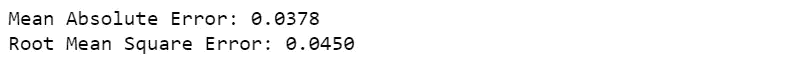

# 预测分析:Python 中的贝叶斯线性回归

> 原文：<https://towardsdatascience.com/bayesian-linear-regression-project-in-python-forecast-water-consumption-under-the-impact-of-cea62c2693e4?source=collection_archive---------18----------------------->


Alex Samuels 在 [Unsplash](https://unsplash.com/) 上的照片

## 数据科学项目的贝叶斯线性回归基础概述

在这篇文章中，我想更多地关注贝叶斯线性回归理论，并用 Python 实现一个数据科学项目的建模。整个项目是关于预测未来三十年气候变化影响下的城市用水量。完整版本的代码可以在 GitHub 的 Jupyter 笔记本上找到，我鼓励你去看看。此外，研究结果发表在[可持续发展的城市和社会](https://www.sciencedirect.com/science/article/pii/S2210670719319638)上。

# 为什么是贝叶斯统计？

统计学有两个主要分支，**描述统计**和**推断统计**。描述性统计提供数据的简明摘要，而推断性统计发现模式并对数据做出推断。但是为什么我要谈论这两个术语呢？😀嗯，在推断统计学中有两个对我们很重要的一般“哲学”;**频率主义**和**贝叶斯主义**。

频率统计和贝叶斯统计通过两种不同的方法来划分统计世界，以定义**概率**。在频率统计中，概率与重复事件的频率有关，而在贝叶斯统计中，概率与我们自身的确定性和不确定性有关。因此，结果是，频率主义者认为模型是固定的，数据围绕它们变化，但贝叶斯主义者谈论观察到的数据是固定的，模型可以围绕它们变化。

所以这个问题的答案是“为什么是贝叶斯统计？”是，有了贝叶斯统计，我们可以用概率来表示任何事件或假设中的不确定性。

# 贝叶斯定理

贝叶斯定理是贝叶斯统计中的关键规则[1]。如果 H 是假设，D 是观测数据，贝叶斯定理如下


贝叶斯定理

其中 *P(H|D)* 表示假设 *D* 发生的条件下，假设的**后验概率**。 *P(H)* 是假设的**先验概率**， *P(D)* 是观测数据的边际(总)概率，实际上是一个归一化常数， *P(D|H)* 是给定假设的数据的概率(可能性)。

# 资料组

加拿大魁北克省的 Brossard 市被选为研究地点。我获得了 2011 年 1 月至 2015 年 10 月期间的**日城市用水量**、 *q* 的时间序列。对于同一时间段，我还得到了气候变量的时间序列:**日最低气温** *θ* ，**日最高气温** *t* ，**总降水量** *p* 。这些气候变量的测量是在皮埃尔·艾略特·特鲁多国际机场(YUL)的[加拿大环境站](https://www.concordia.ca/news/stories/2019/01/07/historical-canadian-climate-data-is-now-only-a-few-clicks-away.html)进行的。

# 贝叶斯线性回归

贝叶斯统计是一种强大的概率建模技术，已被广泛用于统计建模，包括线性回归模型，以预测系统[2，3，4，5]。线性回归模型表示为


线性回归模型

其中 *q* 为因变量(目标变量) *β_0* 为截距； *β_1* 、 *β_2* 、 *β_3* 为权重(称为模型参数)； *θ* 、 *t* 和 *p* 称为预测变量；并且 *ε* 是表示随机噪声或模型方程中不包括的变量的影响的误差项。该等式可以改写为


其中***β***=(*β_ 0*， *β_1* ， *β_2* ，*β_ 3*)；以及***X****=*(*1，q* ， *Q* ，*p*)【2，6】。线性回归是使用概率分布而不是点估计来预测 *q* 的。因此， *q* 不是作为单个值来估计的，而是假设从概率分布中提取的。响应从正态(高斯)分布 *N* 中取样的贝叶斯线性回归模型为


输出 *q* 由以平均值和方差为特征的正态分布产生。正态分布的平均值是回归系数矩阵(*)乘以预测值矩阵( ***X*** )。方差是标准差的平方， *σ* 。*

*贝叶斯线性回归模型提供了预测变量中不确定性的表示，并确定了模型参数的后验分布。不仅响应是由概率分布生成的，而且模型参数也被假定来自分布。模型参数的后验概率来自贝叶斯定理:*

**

*模型参数的后验概率*

*其中*P*(***β****| q，* ***X*** )是给定预测值和自变量的模型参数的后验概率分布； *P(q|* ***β，X*** *)* 是数据的可能性；*P(****β****|****X****)*是参数的先验概率，方程的分母是根据全概率定律可以找到的边际概率。*

# *马尔可夫链蒙特卡罗*

*在实践中，很难计算连续值的边际可能性；计算精确的后验分布是困难的。作为一种解决方案，一种采样方法马尔可夫链蒙特卡罗被用于近似后验概率，而无需计算边际似然[3，5，7]。蒙特卡洛是一种抽取随机样本的通用技术，马尔可夫链意味着抽取的下一个样本仅基于上一个样本值。通过引入更多样本，后验概率的近似值将最终收敛于 *β_1* 、 *β_2* 和 *β_3* 的实际后验概率分布。*

*作为应用马尔可夫链蒙特卡罗的起点，定义覆盖 *β_1* 、 *β_2* 和 *β_3* 所有可能值的参数空间。然后，将每个参数的先验概率定义为正态分布。接下来，计算每个可能参数的可能性。最后，计算参数空间中任何给定点的先验×似然。*

*使用**不掉头算法**【8】实现马尔可夫链蒙特卡罗。当所涉及的变量是连续的并且不需要设置步数时，这种算法是有效的。这是优于哈密尔顿蒙特卡罗的优点，哈密尔顿蒙特卡罗采用由一阶梯度信息通知的一系列步骤，并且对步骤的数量敏感。*

*生成用于被接受的移动的一组参数值(如果建议的移动未被接受，则重复先前的值),并且在多次重复之后，找到分布的经验近似。最终，执行贝叶斯线性回归的结果是基于数据和先验的可能模型参数的概率密度函数。*

# *模型性能测量*

*整个数据集被分成训练集和测试集。训练集包含 75%的数据，用于构建模型；而测试集包含 25%，用于验证预测的准确性。此外，两个拟合优度指标用于评估本研究中开发的模型的性能。这些度量是平均绝对误差和均方根误差。平均绝对误差是预测值和实际值之差的绝对值的平均值，均方根误差是预测值和实际值之差的平均值的平方根。*

**

*均方根误差*

**

*绝对平均误差*

# *Python 代码*

*正如我之前提到的，我在这篇文章中的重点是贝叶斯线性回归模型。因此，我跳过数据预处理这一步。贝叶斯线性回归模型的输入数据集如下*

**

*输入数据集*

*   *UWC:城市用水量*
*   *Max_T:最高温度*
*   *最低温度*
*   *总降水量*

*⚠️在创建模型之前，请确保您已经处理了缺失值，因为贝叶斯线性回归模型不接受带有缺失点的数据。*

# *在 PyMC3 中创建贝叶斯线性回归模型*

*首先，我使用 [sklearn](https://scikit-learn.org/stable/modules/generated/sklearn.model_selection.train_test_split.html) 库将预处理数据集(df)拆分为 75%训练和 25%测试。*

***注:** X_train 和 X_test 包含目标变量 UWC。*

```
*from sklearn.model_selection import train_test_splitX_train, X_test, y_train, y_test = train_test_split(df, df['UWC'],
test_size = 0.25,random_state = 42)*
```

*在这个项目中，我在 PyMC3 中创建了贝叶斯线性回归模型。让马尔可夫链蒙特卡罗算法从后验概率中抽取样本来近似每个模型参数的后验概率。*

*为了创建模型，我将线性回归公式、参数的先验族和数据传递给 [GLM](https://docs.pymc.io/api/glm.html?highlight=glm#pymc3.glm.linear.GLM) 。为了执行马尔可夫链蒙特卡罗抽样，我指定样本数为 2000，链数为 2，调优步数为 500。*

```
*import pymc3 as pm
from pymc3 import traceplot**# Formula for Bayesian Linear Regression** 
formula = ‘UWC ~ ‘ + ‘ + ‘.join([‘%s’ % variable for variable in X_train.columns[1:]])
print(formula)**# Context for the model**
with pm.Model() as normal_model:

    **# The prior for the model parameters will be a normal distribution**
    family = pm.glm.families.Normal()**# Creating the model requires a formula and data (and optionally a family)**
    pm.GLM.from_formula(formula, data = X_train, family = family)**# Perform Markov Chain Monte Carlo sampling**
    normal_trace = pm.sample(draws=2000, chains = 2, tune = 500)*
```

**

*所以，UWC 是最高温度、最低温度和总降水量的函数。*

## *将后验分布绘制成直方图*

```
*pm.plot_posterior(normal_trace)*
```

**

*(a)截距β_0 的后验直方图；(b)对于 *θ* 的回归系数*β_ 1*；(c)回归系数 *β_2* 为*t*；(d)对于 *p* 的回归系数*β_ 3*；标准偏差 *σ* 。*

*结果显示为 *β_0* 、 *β_1* 、 *β_2* 、 *β* 、 **_** 、 *3、*和 *σ* 的后验直方图。直方图显示 95%的最高后验密度(HPD)，这是参数的[可信区间](https://en.wikipedia.org/wiki/Credible_interval)。贝叶斯统计中的可信区间相当于置信区间。比如 0.034<σ0.037 的概率是 95%。*

# *计算梅和 RMSE*

*为了计算 MAE 和 RMSE，我取 UWC 概率分布的中值，并将其作为对 *evaluate_prediction* 函数的预测。*

```
***# Define a function to calculate MAE and RMSE**
def evaluate_prediction(prediction, true):
    mae = np.mean(abs(predictions - true))
    rmse = np.sqrt(np.mean((predictions - true) ** 2))

    return mae, rmsemedian_pred = X_train['UWC'].median()
median_preds = [median_pred for _ in range(len(X_test))]
true = X_test['UWC']**# Display mae and rmse**
mae, rmse = evaluate_prediction(median_preds, true)
print('Mean Absolute Error: {:.4f}'.format(mae))
print('Root Mean Square Error: {:.4f}'.format(rmse))*
```

**

*对模型性能的评估表明，预测模型具有良好的精度。*

# *结论*

*这篇文章是一个数据科学项目的贝叶斯线性回归的简要概述。我希望它能帮助你更好地理解贝叶斯线性回归的基本原理。😊*

*非常感谢您的反馈。你可以在 LinkedIn 上找到我。*

# *参考*

*[1]赫克曼博士、盖格博士和奇克林博士(1995 年)。学习贝叶斯网络:知识和统计数据的结合。*机器学习*， *20* (3)，197–243。【https://doi.org/10.1023/A:1022623210503 *

*[2]韩，贾伟和裴，简和坎伯，M. (2011)。数据挖掘:概念和技术。检索自[http://myweb . saban ciuniv . edu/rdehkharghani/files/2016/02/The-mor gan-Kaufmann-Series-in-Data-Management-Systems-Jia Wei-Han-Micheline-Kamber-Jian-Pei-Data-Mining。-概念和技术-第三版-摩根-考夫曼-2011.pdf](http://myweb.sabanciuniv.edu/rdehkharghani/files/2016/02/The-Morgan-Kaufmann-Series-in-Data-Management-Systems-Jiawei-Han-Micheline-Kamber-Jian-Pei-Data-Mining.-Concepts-and-Techniques-3rd-Edition-Morgan-Kaufmann-2011.pdf)*

*[3] Mudgal，a .，Hallmark，s .，Carriquiry，a .，和 Gkritza，K. (2014 年)。环形交叉路口的驾驶行为:分层贝叶斯回归分析。*交通研究 D 部分:交通与环境*， *26* ，20–26。[https://doi.org/10.1016/j.trd.2013.10.003](https://doi.org/10.1016/j.trd.2013.10.003)*

*[4]a . e .拉夫特里、d .马迪根和 J. A .赫廷(1997 年)。线性回归模型的贝叶斯模型平均。*美国统计协会杂志*， *92* (437)，179–191。检索自[https://www . tandfonline . com/doi/ABS/10.1080/01621459 . 1997 . 10473615](https://www.tandfonline.com/doi/abs/10.1080/01621459.1997.10473615)*

*[5]袁晓春，孙晓霞，赵，魏，米，张，王，魏延明(2017)。2030 年中国区域能源需求预测:贝叶斯方法。*资源、保护和回收*，*127*(5 月)，85–95。[https://doi.org/10.1016/j.resconrec.2017.08.016](https://doi.org/10.1016/j.resconrec.2017.08.016)*

*[6]t .塔勒布和 m .卡杜尔(2017 年)。无线传感器网络中提高能量效率的分层凝聚分簇方案。*交通与电信*， *18* (2)，128–138。[https://doi.org/10.1515/ttj-2017-0012](https://doi.org/10.1515/ttj-2017-0012)*

*[7] Godsill，S. J. (2001 年)。模型不确定性的马尔可夫链蒙特卡罗方法之间的关系。*计算与图形统计杂志*， *10* (2)，230–248。[https://doi.org/10.1198/10618600152627924](https://doi.org/10.1198/10618600152627924)*

*[8]医学博士霍夫曼和盖尔曼(2011 年)。*不掉头采样器:在哈密顿蒙特卡罗中自适应地设置路径长度*。(2008), 1–30.从 http://arxiv.org/abs/1111.4246[取回](http://arxiv.org/abs/1111.4246)*