# 使用 PyMC3 的贝叶斯逻辑回归

> 原文：<https://towardsdatascience.com/bayesian-logistic-regression-with-pymc3-8e17c576f31a?source=collection_archive---------11----------------------->

这是一系列文章中的另一篇(参见[此处](/introduction-to-pymc3-a-python-package-for-probabilistic-programming-5299278b428)和[此处](/a-b-testing-with-probabilistic-programming-and-pymc3-part-i-7ae52d45bc41)的其他相关文章),一般来说是关于概率编程的，特别是关于 PyMC3 的。在我们之前的文章中，我们解释了 PyMC3 如何帮助统计推断。在本文中，我们将使用 PyMC3 解决一个端到端的分类问题。更准确地说，我们将使用 PyMC3 通过以下公共数据集进行贝叶斯逻辑回归:

[https://archive . ics . UCI . edu/ml/datasets/Occupancy+Detection+](https://archive.ics.uci.edu/ml/datasets/Occupancy+Detection+)

该数据集包含几个变量，如光线、温度、湿度和二氧化碳水平。目标是从这些变量中检测房间的占用情况。

首先，我们需要加载几个相关的包。

```
**import** **arviz** **as** **az**
**import** **matplotlib.pyplot** **as** **plt**
**import** **numpy** **as** **np**
**import** **pandas** **as** **pd**
**import** **pymc3** **as** **pm**
**import** **seaborn**
**import** **theano.tensor** **as** **tt**
**import** **warnings**
**from** **IPython.core.pylabtools** **import** figsize
**import** **seaborn** **as** **sns**
**from** **sklearn.metrics** **import** (roc_curve, roc_auc_score, confusion_matrix, accuracy_score, f1_score, 
                             precision_recall_curve) 
**from** **sklearn.metrics** **import** confusion_matrix
```

接下来，我们加载数据集。

```
df=pd.read_csv('datatest.txt')
df.sample(5)
```

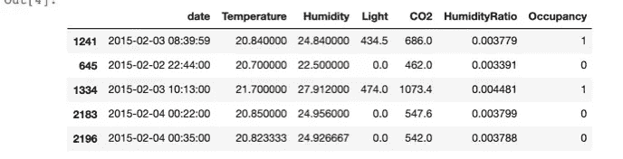

为了方便起见，我们将日期变量转换为日期时间对象。

```
df['date']=pd.to_datetime(df['date'])
```

# 第 1 部分:探索性数据分析

首先，让我们看一下数据集的概况。

```
df.describe()
```

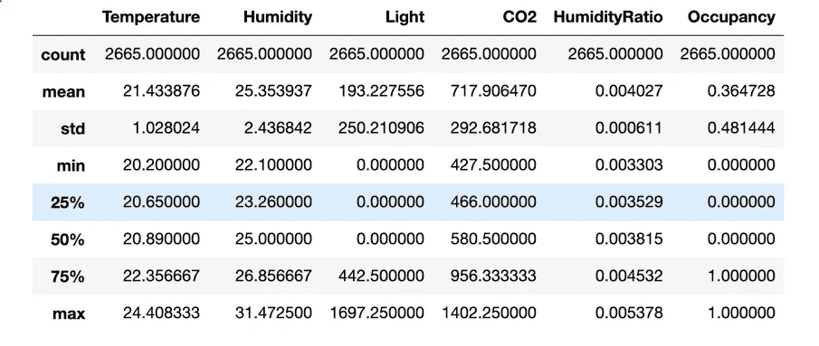

数据集概述

我们看到这个数据集中有 2655 个样本。此外，没有丢失值。让我们也看看这个数据集的时间框架。

```
df['date'].describe()count                    2665
unique                   2665
top       2015-02-03 07:25:59
freq                        1
first     2015-02-02 14:19:00
last      2015-02-04 10:43:00
Name: date, dtype: object
```

所以我们的数据只在三天内就收集好了。接下来，我们将探讨我们的变量及其关系。首先，让我们画出温度变量。

```
figsize(12.5, 4)
plt.hist(df['Temperature'], bins=40, density=**True**, label='Temperature')
plt.xlabel('Temperature')
plt.title('Distribution of temperature')
plt.show()
```

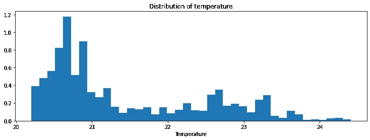

该图显示温度具有重尾分布。湿度变量呢？

```
figsize(12.5, 4)
plt.hist(df['Humidity'], bins=50, density=**True**, label='Humidity')
plt.xlabel('Humidity')
plt.title('Distribution of Humidity')
plt.show()
```

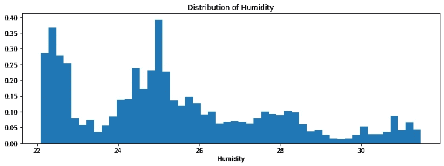

有趣的是，在 22.5 和 25 附近有两个峰值。我们还对不同日子里的光照变化感兴趣。

```
figsize(12.5, 4)
sns.boxplot(x=df['date'].dt.day,y=df['Light'], orient='v')
plt.xlabel('Day')
plt.title('Boxplot for Light during different days')
plt.show()
```

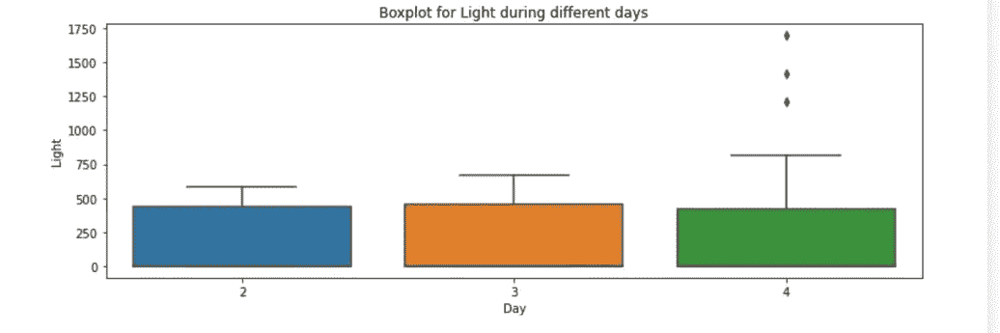

我们看到光的分布在这三天中几乎是相同的。接下来，让我们看看二氧化碳水平。

```
figsize(12.5, 4)
sns.boxplot(x=df['date'].dt.day,y=df['CO2'], orient='v')
plt.xlabel('Day')
plt.title('Boxplot for CO2 level during different days')
plt.show()
```

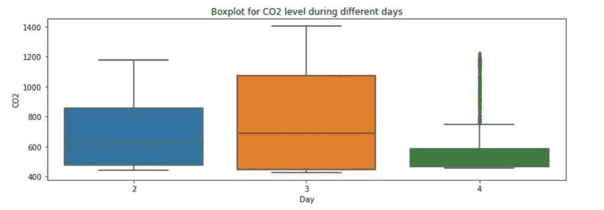

这些分布明显不同。2015 年 2 月 4 日有很多异常值。最后，我们将深入研究湿度比变量。

```
figsize(12.5, 4)
sns.boxplot(x=df['date'].dt.day,y=df['HumidityRatio'], orient='v')
plt.xlabel('Day')
plt.title('Boxplot for Humidity Ratio level during different days')
plt.show()
```

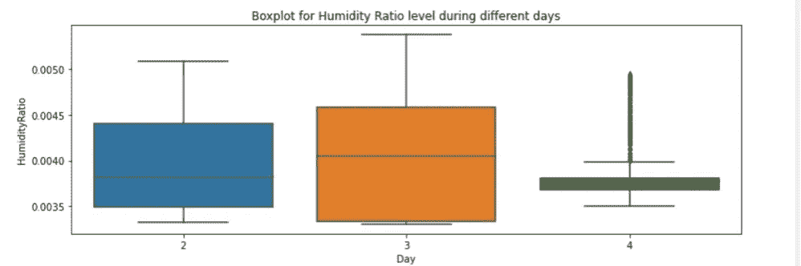

这看起来非常类似于二氧化碳水平的箱线图。也许，二氧化碳水平和湿度之间有很强的相关性。我们可以用这两个变量的散点图来验证。

```
ax=sns.scatterplot(df['CO2'], df['HumidityRatio'], style=df['date'].dt.day)
```

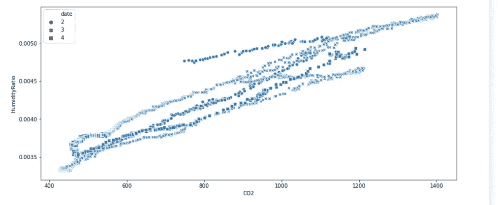

二氧化碳水平和湿度比的散点图

事实上，二氧化碳水平和湿度比之间有很强的线性关系。让我们看一下变量之间的关系。这可以通过 seaborn 的 pair plot 函数来完成。

```
ax=seaborn.pairplot(df)
```

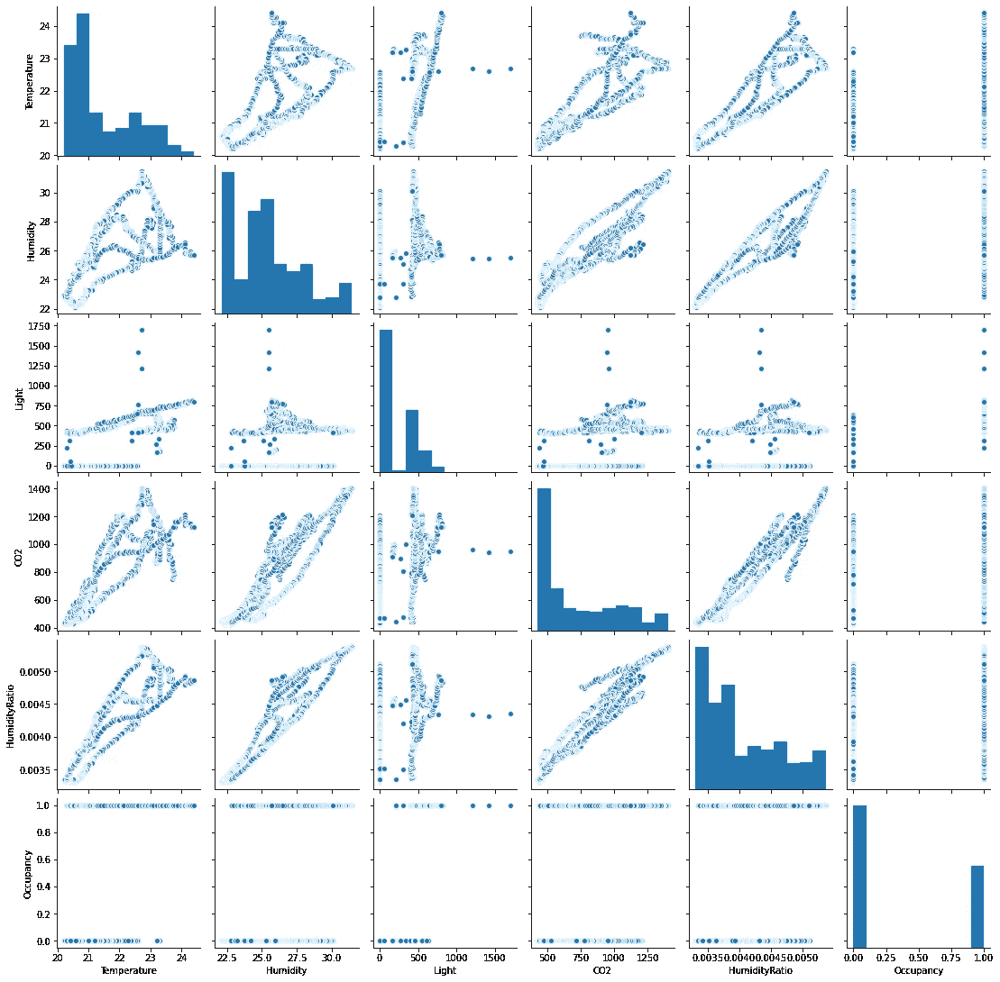

数据集中所有要素的配对图

这直观地显示了在以下对之间存在强线性关系:CO2 和温度、CO2 和湿度、湿度和湿度比、湿度比和 CO2。我们甚至可以通过绘制热图来量化这些关系。

```
corr=df.iloc[:, 1:-1].corr()
*# Generate a mask for the upper triangle*
mask = np.triu(np.ones_like(corr, dtype=np.bool))
*# Set up the matplotlib figure*
f, ax = plt.subplots(figsize=(11, 9))*# Draw the heatmap with the mask and correct aspect ratio*
ax=sns.heatmap(corr, mask=mask,
            square=**True**, linewidths=.5, cbar_kws={"shrink": .5})
```


清楚地表明，两对湿度-湿度比和湿度比-CO2 表现出最强的线性关系。

# 基于 PyMC3 的贝叶斯逻辑模型

我们将建立几个机器学习模型，根据其他变量对入住情况进行分类。

回想一下，我们有一个二元决策问题。换句话说，我们的目标变量假设遵循伯努利随机变量，p 由下式给出:

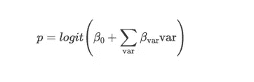

其中，var 是我们在模型中使用的所有变量的集合，logit 是逻辑函数。

为了建立贝叶斯逻辑回归模型，我们首先要对每个参数进行先验分布。这些先验的选择将影响结果(尽管有更多的数据，它们可能会“收敛”到相同的分布。)

一旦我们的先验被指定，PyMC3 将使用[马尔可夫链蒙特卡罗](https://en.wikipedia.org/wiki/Markov_chain_Monte_Carlo)模拟及其推广在数值上近似后验分布。然后，我们可以使用这些后验样本进行推断。

# 先验分布均匀的第一个模型

由于我们没有关于这些参数的先验知识，我们可以假设它们可以是任何东西。换句话说，我们假设所有的β_var 服从一个上下界都很大的均匀分布。为了捕捉一张大网，我们对均匀分布使用大的上下界。

```
 lower=-10**6
higher=10**6
**with** pm.Model() **as** first_model:
    *#priors on parameters*
    beta_0=pm.Uniform('beta_0', lower=lower, upper= higher)
    beta_temp=pm.Uniform('beta_temp', lower, higher)
    beta_humid=pm.Uniform('beta_humid', lower, higher)
    beta_light=pm.Uniform('beta_light', lower, higher)
    beta_co2=pm.Uniform('beta_co2', lower, higher)
    beta_humid_ratio=pm.Uniform('beta_humid_ration', lower, higher)

    *#the probability of belonging to class 1*
    p = pm.Deterministic('p', pm.math.sigmoid(beta_0+beta_temp*df['Temperature']+
                               beta_humid*df['Humidity']+
                               beta_light*df['Light']+
                               beta_co2*df['CO2']+
                               beta_humid_ratio*df['HumidityRatio']))
**with** first_model:
    *#fit the data* 
    observed=pm.Bernoulli("occupancy", p, observed=df['Occupancy'])
    start=pm.find_MAP()
    step=pm.Metropolis()

    *#samples from posterior distribution* 
    trace=pm.sample(25000, step=step, start=start)
    burned_trace=trace[15000:]
```

这可能需要一段时间来运行。一旦完成，我们就可以绘制样本。

```
pm.traceplot(burned_trace)
plt.show()
```

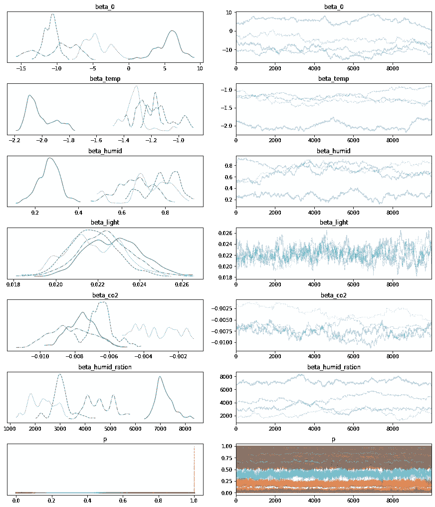

我们得出结论，我们的算法确实收敛。我们可以计算这些后验分布的平均值。

```
coeffs=['beta_0', 'beta_temp', 'beta_humid', 'beta_light', 'beta_co2', 'beta_humid_ration']
d=dict()
**for** item **in** coeffs:
    d[item]=[burned_trace[item].mean()]

result_coeffs=pd.DataFrame.from_dict(d)    
result_coeffs
*#coeff_result=pd.DataFrame(d)* 
*#coeff_result*
```

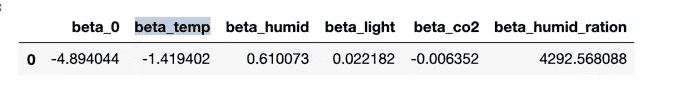

与频率统计相比，贝叶斯统计的一个优势是我们拥有的不仅仅是平均值。特别是，我们可以计算这些参数的 95% [高密度区间](https://www.sciencedirect.com/topics/mathematics/highest-density-interval#:~:text=Second%20Edition)%2C%202015-,4.3.,highest%20density%20interval%2C%20abbreviated%20HDI.&text=Moreover%2C%20the%20probability%20density%20of,any%20x%20outside%20those%20limits.)。

```
pm.stats.hpd(burned_trace['beta_0'])
coeffs=['beta_0', 'beta_temp', 'beta_humid', 'beta_light', 'beta_co2', 'beta_humid_ration']
interval=dict()**for** item **in** coeffs:
    interval[item]=pm.stats.hpd(burned_trace[item]) *#compute 95% high density interval*

result_coeffs=pd.DataFrame.from_dict(interval).rename(index={0: 'lower', 1: 'upper'})
result_coeffs
```

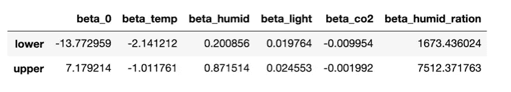

注意，湿度比的系数明显大于其他系数。这并不一定意味着这个变量更重要。如果我们仔细观察数据，我们会发现这个变量取的值非常小。

此外，我们可以探索不同参数之间的关系。例如，让我们来看看β_ CO2 和β_ wet _ ratio 系数。

```
figsize(12.5, 12.5)
seaborn.jointplot(burned_trace['beta_co2'], burned_trace['beta_humid_ration'], kind="hex") *#color="#4CB391")*
plt.xlabel("beta_co2")
plt.ylabel("beta_humid_ratio");
```

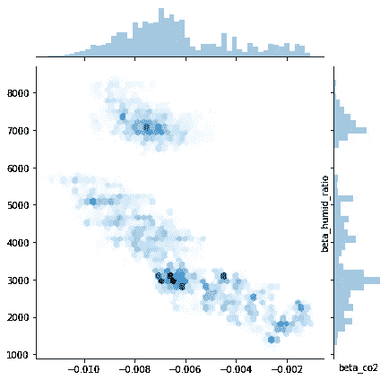

CO2 和湿度比系数的散点图

曲线图显示这两个系数负相关。注意，CO2 水平和湿度比是正相关的。

回想一下，在经典的逻辑回归中，我们通过[最大后验估计](https://en.wikipedia.org/wiki/Maximum_a_posteriori_estimation) (MAP 解)来寻找最佳参数。换句话说，最佳拟合参数由下式给出

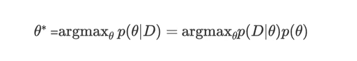

其中，𝑝(𝜃|𝐷)p(θ|D 是给定数据时θ的后验分布，p(D|θ)是似然函数，p(θ)是θ的先验分布。

请注意，由于我们在第一个模型中使用均匀分布，我们可以预期我们的 MAP 解决方案应该与 MLE 解决方案([最大似然估计](https://en.wikipedia.org/wiki/Maximum_likelihood_estimation))一致，后者对应于 frequentist logistic 回归。我们可以使用 Scikit-Learn 库来测试这个语句。首先，我们使用 MAP 计算系数。

```
coeffs=['beta_0', 'beta_temp', 'beta_humid', 'beta_light', 'beta_co2', 'beta_humid_ration']
d=dict()
**for** item **in** coeffs:
    d[item]=[float(start[item])]

map_coeffs=pd.DataFrame.from_dict(d)    
map_coeffs
```

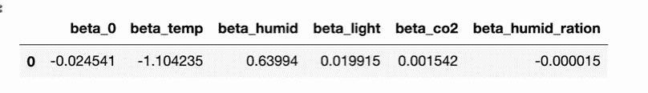

接下来，我们使用经典的逻辑回归计算β系数。

```
**from** **sklearn.linear_model** **import** LogisticRegressionX=df.iloc[:, 1: -1]
y=df['Occupancy']
logit=LogisticRegression()
logit_model=logit.fit(X,y)
pd.DataFrame(logit_model.coef_, columns=X.columns)
```


是啊！两种方法的系数几乎相同。

接下来，我们讨论了我们的模型的预测能力，并与经典的逻辑回归进行了比较。我们用经典方法记录预测。

```
logit_prediction=logit_model.predict(X)
```

为了使用贝叶斯逻辑模型进行预测，我们通过对样本值进行平均来计算𝑦_score。

```
*#compute the average probability of predicting 1\.* 
y_score = np.mean(burned_trace['p'], axis=0)*#histogram of the distribution*
figsize(12.5,4)
plt.hist(y_score, bins=40, density=**True**)
plt.xlabel('Probability')
plt.ylabel('Frequency')
plt.title('Distribution of $y_score$')
plt.show()
```

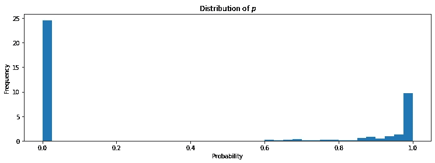

y 分数的分布

有趣的是，p 的大部分集中在 0 和 1 附近。我们也可以使用 y_score 进行预测。

```
first_model_prediction=[1 **if** x >0.5 **else** 0 **for** x **in** y_score]
```

让我们通过计算混淆矩阵来评估我们的模型的性能。

```
first_model_confussion_matrix =confusion_matrix(df['Occupancy'], first_model_prediction)
first_model_confussion_matrixarray([[1639,   54],
       [   3,  969]])
```

这很好。我们甚至还可以通过其他指标来量化性能。

```
**import** **sklearn**
**from** **sklearn.metrics** **import** classification_reportprint(sklearn.metrics.classification_report(y, first_model_prediction))precision    recall  f1-score   support 0       1.00      0.97      0.98      1693
           1       0.95      1.00      0.97       972 accuracy                           0.98      2665
   macro avg       0.97      0.98      0.98      2665
weighted avg       0.98      0.98      0.98      2665
```

我们也可以计算曲线下的面积。

```
pred_scores = dict(y_true=df['Occupancy'],y_score=y_score)
roc_auc_score(**pred_scores)0.99358530283253
```

所以，我们的模型表现得相当好。我们来和经典的 logistic 回归比较一下。

```
print(sklearn.metrics.classification_report(y, logit_prediction))precision    recall  f1-score   support 0       1.00      0.97      0.98      1693
           1       0.95      1.00      0.97       972 accuracy                           0.98      2665
   macro avg       0.97      0.98      0.98      2665
weighted avg       0.98      0.98      0.98      2665
```

他们是一样的！然而，使用贝叶斯模型，我们获得了更多的信息，因此我们对自己的估计更有信心。

# 先验分布为正态分布的不同模型。

现在，让我们使用一组不同的先验知识来训练我们的模型。例如，我们可以假设系数遵循正态分布。

```
**with** pm.Model() **as** second_model: 
    #priors with normal distribution beta_0=pm.Normal('beta_0', mu=0, sd=10**4)
    beta_temp=pm.Normal('beta_temp', mu=0, sd=10**4)
    beta_humid=pm.Normal('beta_humid', mu=0, sd=10**4)
    beta_light=pm.Normal('beta_light', mu=0, sd=10**4)
    beta_co2=pm.Normal('beta_co2', mu=0, sd=10**4)
    beta_humid_ratio=pm.Normal('beta_humid_ration', mu=0, sd=10**4) #probability of belonging to class 1 p = pm.Deterministic('p', pm.math.sigmoid(beta_0+beta_temp*df['Temperature']+
                               beta_humid*df['Humidity']+
                               beta_light*df['Light']+
                               beta_co2*df['CO2']+
                               beta_humid_ratio*df['HumidityRatio']))#fit observed data into the model**with** second_model:
    observed=pm.Bernoulli("occupancy", p, observed=df['Occupancy'])
    start=pm.find_MAP()
    step=pm.Metropolis()
    second_trace=pm.sample(25000, step=step, start=start)
    second_burned_trace=second_trace[15000:]
pm.traceplot(second_burned_trace)
plt.show()
```

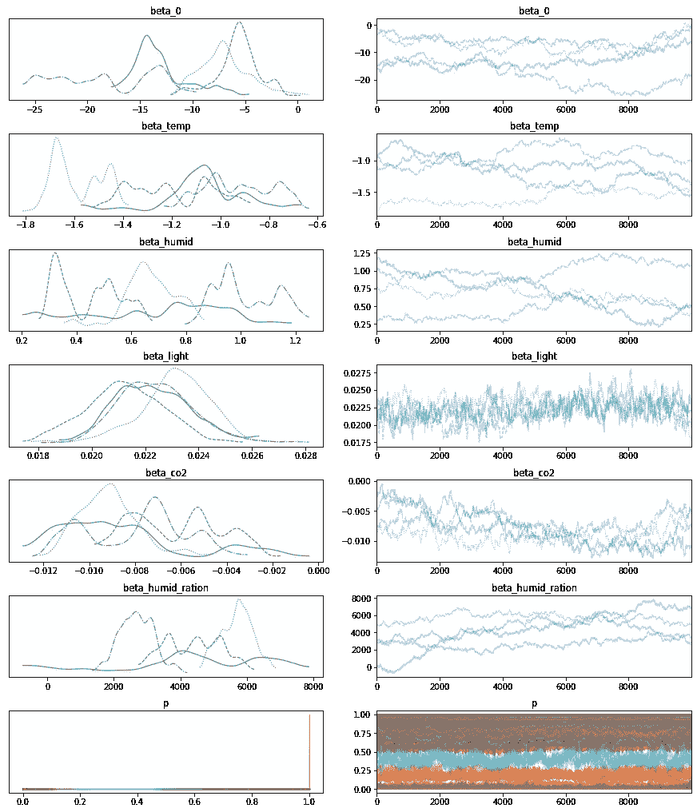

我们再次看到算法确实收敛了。让我们计算 MAP 解的β系数。

```
coeffs=['beta_0', 'beta_temp', 'beta_humid', 'beta_light', 'beta_co2', 'beta_humid_ration']
d=dict()
**for** item **in** coeffs:
    d[item]=[float(start[item])]

second_map_coeffs=pd.DataFrame.from_dict(d)    
second_map_coeffs
```


它们与我们在第一个模型中得到的非常接近。更进一步，因为我们在贝叶斯框架中，我们甚至可以比较两个模型的后验分布。例如，让我们看看截距变量。

```
figsize(12.5,4)
plt.hist(burned_trace['beta_0']-second_burned_trace['beta_0'], bins=40, density=**True**)
plt.title('Distribution of the difference between beta_0')
plt.legend()
plt.show()
```

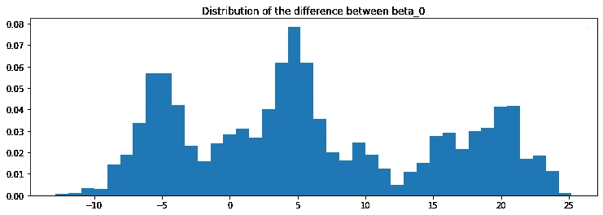

虽然 MAP 解对β_0 给出了相同的估计，但我们看到两个后验概率相当不同。让我们也比较一下这两个模型之间β_temp 的后验分布。

```
figsize(12.5,4)
plt.hist(burned_trace['beta_temp'], label='First model', bins=40, density=**True**)
plt.hist(second_burned_trace['beta_temp'], bins=40, label='Second model', density=**True**)
plt.title('Distribution of of beta_temp')
plt.legend()
plt.show()
```

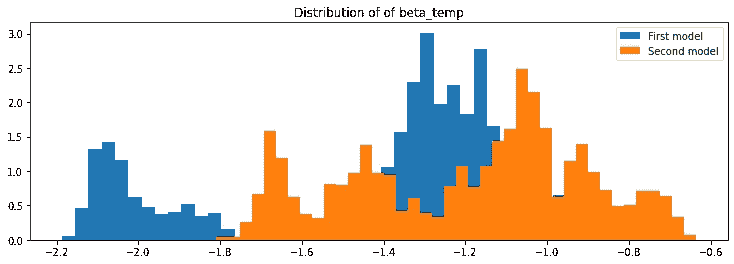

实际上差别很小。接下来，让我们计算第二个模型的预测能力。

```
second_y_score = np.mean(second_burned_trace['p'], axis=0)
second_model_prediction=[1 **if** x >0.5 **else** 0 **for** x **in** second_y_score]
second_model_confussion_matrix =confusion_matrix(df['Occupancy'], second_model_prediction)
second_model_confussion_matrixarray([[1639,   54],
       [   3,  969]])
```

这与我们从第一个模型中得到的结果相同。我们可以检查一下 y_score 和 second_y_score 几乎是一样的。

```
figsize(12.5,4)
plt.hist(y_score-second_y_score, bins=40)
plt.title('Distribution of the difference between y_score and second_y_score')
plt.ylabel('Frequency')
plt.show()
```

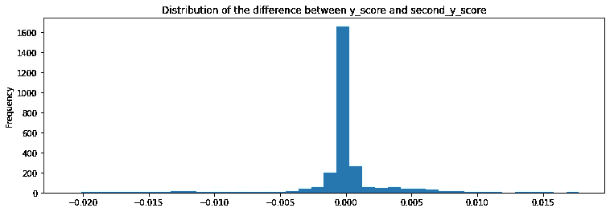

# 内置广义线性模型(GLM)的模型。

在前面的章节中，我们使用实际操作的方法来构建我们的模型。这很容易，因为我们只有几个变量。当变量数量很大的时候，就不会很实用了。幸运的是，PyMC3 有一个内置的广义线性模型，在这个模型中，一切都将自动化。让我们使用这个内置模型来拟合我们的数据。

```
**with** pm.Model() **as** third_model:
    pm.glm.GLM.from_formula('Occupancy ~ Temperature + Humidity + Light + CO2 + HumidityRatio',
                            df,
                            family=pm.glm.families.Binomial())
    third_trace = pm.sample(25000, tune=10000, init='adapt_diag')pm.traceplot(third_trace)
plt.show()
```

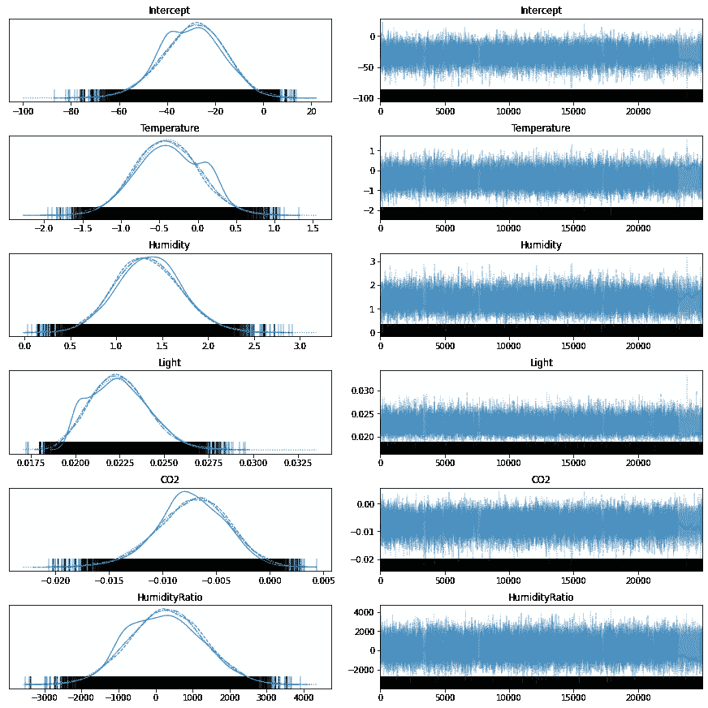

与以前的模型不同，在这种情况下，我们的参数的后验分布是单峰的。

让我们总结一下这些后验分布。

```
pm.summary(third_trace)
```

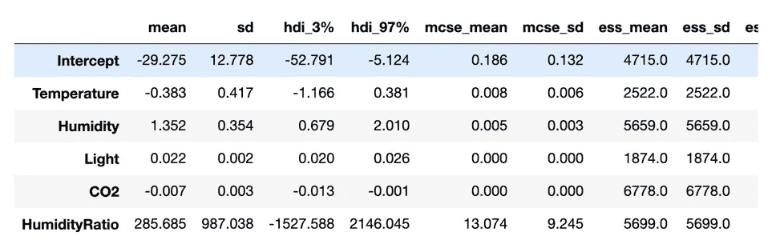

除了查看汇总的统计数据，我们还可以查看地图解决方案。

```
**with** third_model:
    map_solution=pm.find_MAP()
d=dict()
**for** item **in** map_solution.keys():
    d[item]=[float(map_solution[item])]

third_map_coeffs=pd.DataFrame.from_dict(d)    
third_map_coeffs
```

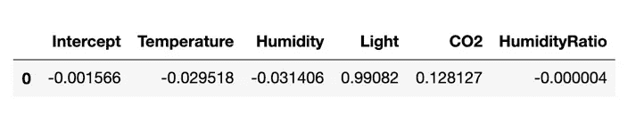

我们看到，第二种和第三种模型的地图解决方案之间存在显著差异。预测呢？

```
**with** third_model:
    ppc = pm.sample_posterior_predictive(third_trace, samples=15000)*#compute y_score* 
**with** third_model:
    third_y_score = np.mean(ppc['y'], axis=0)
*#convert y_score into binary decisions* 
third_model_prediction=[1 **if** x >0.5 **else** 0 **for** x **in** third_y_score]*#compute confussion matrix* 
third_model_confussion_matrix =confusion_matrix(df['Occupancy'], third_model_prediction)
third_model_confussion_matrixarray([[1639,   54],
       [   3,  969]])
```

这个混淆矩阵与前两个模型中的相同。第二个和第三个模型的 y 分数分布如何？

```
figsize(12.5,4)
plt.hist(third_y_score-second_y_score, bins=40)
plt.title('Distribution of the difference between y_score and second_y_score')
plt.ylabel('Frequency')
plt.show(
```

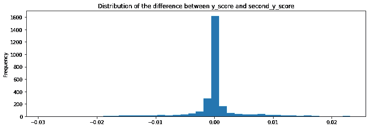

这种分布集中在 0 左右。换句话说，y_scores 在不同模型间的分布几乎相同。系数呢，比如温度系数？

```
figsize(12.5,4)
plt.hist(third_trace['Temperature'][-40000:]-second_burned_trace['beta_temp'], bins=40, density=**True**)
plt.title('Difference between the temperature coefficients for the second and the third model')
plt.show()
```

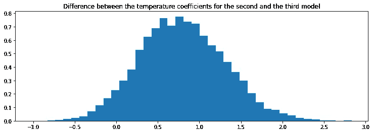

差值近似遵循具有小平均值的正态分布。

让我们也检查一下湿度系数之间的差异。

```
figsize(12.5,4)
plt.boxplot(third_trace['Humidity'][-40000:]-second_burned_trace['beta_humid'])
plt.title('Difference between the humidity coefficients for the second and the third model')
plt.show()
```

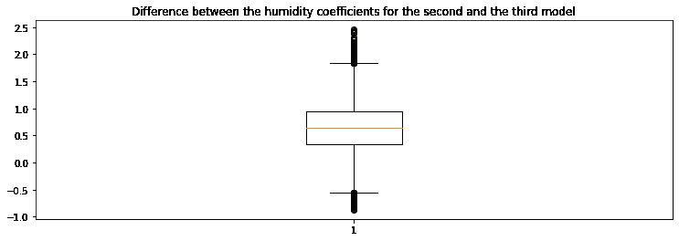

同样，这种差异很小。

# 3.结论

我们看到，即使我们的模型使用不同的先验，预测性能是相似的。这证实了我们的信念，随着我们的数据集变大，它们应该收敛到同一个解决方案。

我们希望我们的项目将帮助 PyMC3 的初学者学习它的语法。我们发现 PyMC3 的代码相当直观，我们希望我们的代码清楚地证明了这一点。

# 4.参考文献。

[1][https://docs.pymc.io/notebooks/GLM-logistic.html](https://docs.pymc.io/notebooks/GLM-logistic.html)官方 PyMC3 文档

[2][https://Goldin locks . github . io/Bayesian-logistic-regression-with-pymc 3/](https://goldinlocks.github.io/Bayesian-logistic-regression-with-pymc3/)