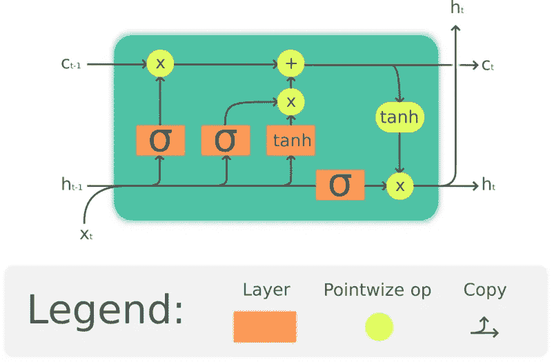
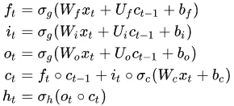
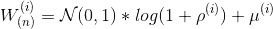
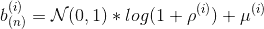
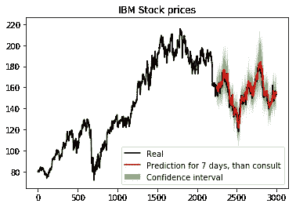
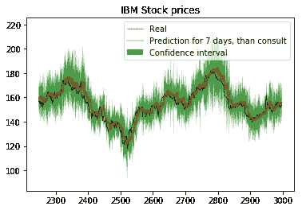

# PyTorch 上的贝叶斯 LSTM—使用 BLiTZ，PyTorch 贝叶斯深度学习库

> 原文：<https://towardsdatascience.com/bayesian-lstm-on-pytorch-with-blitz-a-pytorch-bayesian-deep-learning-library-5e1fec432ad3?source=collection_archive---------22----------------------->

## 是时候给你的时间序列预测画一个置信区间了——现在这很简单。

LSTM 细胞插图。[来源](https://upload.wikimedia.org/wikipedia/commons/thumb/3/3b/The_LSTM_cell.png/800px-The_LSTM_cell.png)访问于 2020 年 4 月 14 日

这是一篇关于如何使用 BLiTZ 的帖子，BLiTZ 是一个 PyTorch 贝叶斯深度学习库，使用其贝叶斯 LSTMs 的实现来创建、训练和执行序列数据上的变分推理。

你可以查看这篇文章的示例部分的笔记本[这里](https://github.com/piEsposito/blitz-bayesian-deep-learning/blob/master/blitz/examples/stocks-blstm.ipynb)和 PyTorch 上 [BLiTZ Bayesian 深度学习的知识库这里](https://github.com/piEsposito/blitz-bayesian-deep-learning)。

为了做到这一点，我们将解释贝叶斯长短期记忆是如何工作的，然后使用 Kaggle 的数据集[通过一个股票置信区间预测的例子。](https://www.kaggle.com/szrlee/stock-time-series-20050101-to-20171231)

如果你是贝叶斯深度学习主题的新手，你可能想在 Medium 上寻找关于它的许多帖子中的一个，或者只是我们 lib repo 中关于贝叶斯 DL 的[文档部分。你可能也想看看](https://github.com/piEsposito/blitz-bayesian-deep-learning#Bayesian-Deep-Learning-in-a-Nutshell)[这篇关于 BLiTZ 用法教程的文章](/blitz-a-bayesian-neural-network-library-for-pytorch-82f9998916c7)。

# 贝叶斯 LSTM 层

正如我们所知，LSTM 架构旨在解决当标准递归神经网络用于处理长序列数据时出现的信息消失问题。

在数学上，我们将 LSTM 架构翻译为:

LSTM 方程。来源:[https://en.wikipedia.org/wiki/Long_short-term_memory](https://en.wikipedia.org/wiki/Long_short-term_memory)由我用乳胶改写。访问时间为 2020 年 4 月 14 日。

我们还知道，贝叶斯神经网络的核心思想是，我们可以对它们进行采样以获得概率分布，然后优化这些分布参数，而不是具有确定性的权重。

利用这一点，有可能衡量预测的可信度和不确定性，这与预测本身一样，都是非常有用的洞察数据。

从数学上来说，我们只需要在上面的方程中增加一些额外的步骤。它们是权重和偏差采样，发生在前馈操作之前。

代表在层/模型的位置 N 上在第 I 时间采样的权重的方程。

代表在层/模型的位置 N 上第 I 次采样的偏差的方程。

当然，我们的可训练参数是参数化每个权重分布的ρ和μ。BLiTZ 有一个内置的 BayesianLSTM 层，可以为您完成所有这些艰苦的工作，因此您只需担心您的网络架构和培训/测试循环。

让我们来看看我们的例子。

# 首先，我们的进口

除了我们常见的进口产品，我们还将从`blitz.modules`引进`BayesianLSTM`，从`blitz.utils`引进`variational_estimator`一名室内装潢师，对他们进行不同的培训和复杂的成本收集。

我们还引入了`collections.deque`用于时间序列数据的预处理。

# 数据预处理

我们现在将创建并预处理数据集，以将其提供给网络。我们将从从 Kaggle 获得的数据集导入亚马逊股票定价，获得它的“收盘价”列，并将其规范化。

我们的数据集将由标准化股票价格的时间戳组成，并将具有形状(batch_size、sequence_length、observation_length)。

让我们导入并预处理数据:

我们还必须创建一个函数来转换时间戳中的股票价格历史。为此，我们将使用一个最大长度等于我们正在使用的时间戳大小的 deque。我们将每个数据点添加到 deque 中，然后将其副本附加到主时间戳列表中:

# 创建我们的网络类

我们的网络类接收到了`variational_estimator`装饰器，它简化了对贝叶斯神经网络损失的采样。它将有一个贝叶斯 LSTM 图层，其中 in_features=1，out_features=10，后跟一个 nn。Linear(10，1)，输出股票的标准化价格。

正如你所看到的，这个网络是一个非常正常的网络，这里唯一不常见的是`BayesianLSTM`层实例和`variational_estimator`装饰，但是它的行为是一个正常的火炬。

完成后，我们可以创建我们的神经网络对象，分割数据集，并继续进行训练循环:

# 创建对象

我们现在可以创建我们的损失对象，神经网络，优化器和数据加载器。请注意，我们没有随机分割数据集，因为我们将使用最后一批时间戳来评估模型。因为我们的数据集就大小而言非常小，所以我们不会为训练集创建数据加载器。

我们将使用正态均方误差损失和学习率=0.001 的 Adam 优化器

# 火车环线

对于我们的训练循环，我们将使用`variational_estimator`添加到我们的神经网络的`sample_elbo`方法。它对 X 个样本的损失进行平均，帮助我们轻松地进行蒙特卡罗估计。

为使该方法有效，网络的`forward`方法的输出必须与将被输入损失对象/标准的标签具有相同的形状。

# 评估模型并收集置信区间

我们将首先用要绘制的真实数据创建一个数据框架:

为了预测置信区间，我们必须创建一个函数来预测相同数据的 X 次，然后收集其平均值和标准差。同时，在参考真实数据之前，我们必须设置我们将尝试预测的窗口大小。

让我们看看预测函数的代码:

和置信区间的收集。请注意，我们可以决定距离均值有多少标准差来设置我们的置信区间:

由于我们使用的样本数量非常少，因此我们用高标准偏差对其进行了补偿。我们的网络将尝试预测 7 天，然后查询数据:

这里我们可以通过查看真实值是低于上界还是高于下界来检查置信区间。设置好参数后，您应该有一个 95%左右的置信区间，如我们所知:

# **查看预测图表**

我们现在只是绘制预测图，直观地看看我们的训练是否顺利。我们将绘制真实数据和测试预测及其置信区间:

基于置信区间的股票价格预测。

为了结束我们的评估，我们将放大预测区域:

带有置信区间的测试数据的网络预测图。

# 结论

我们看到 BLiTZ 贝叶斯 LSTM 实现使得利用贝叶斯深度学习的所有能力在时间序列上实现和迭代变得非常容易。我们还看到贝叶斯 LSTM 很好地集成到 Torch 中，并且易于在任何工作或研究中使用和介绍。

我们还可以非常准确地预测 IBM 股票价格的置信区间，这可能是一个比点估计有用得多的洞察力。

# 参考

 [## piEsposito/blitz-贝叶斯深度学习

### BLiTZ 是一个简单且可扩展的库，用于创建贝叶斯神经网络层(基于 Weight…

github.com](https://github.com/piEsposito/blitz-bayesian-deep-learning)  [## 了解 LSTM 网络

### 2015 年 8 月 27 日发布人类不是每秒钟都从零开始思考。当你读这篇文章时，你…

colah.github.io](https://colah.github.io/posts/2015-08-Understanding-LSTMs/)  [## BLiTZ——py torch 的贝叶斯神经网络库

### 火炬动物园中的贝叶斯层是一个简单且可扩展的库，用于在…

towardsdatascience.com](/blitz-a-bayesian-neural-network-library-for-pytorch-82f9998916c7)  [## 神经网络中的权重不确定性

### 我们介绍了一个新的，有效的，原则性和反向传播兼容的算法学习概率…

arxiv.org](https://arxiv.org/abs/1505.05424)