# 贝叶斯元学习

> 原文：<https://towardsdatascience.com/bayesian-meta-learning-fa4eedcb89fc?source=collection_archive---------23----------------------->

## 这个故事介绍了贝叶斯元学习方法，其中包括贝叶斯黑盒元学习，基于贝叶斯优化的元学习，MAMLs 集成和概率 MAML。这是课程的简短总结[‘斯坦福 CS330:多任务和元学习，2019 |第 5 讲——贝叶斯元学习’](https://www.youtube.com/watch?v=QY8JXpnllb0&list=PLoROMvodv4rMC6zfYmnD7UG3LVvwaITY5&index=5)。

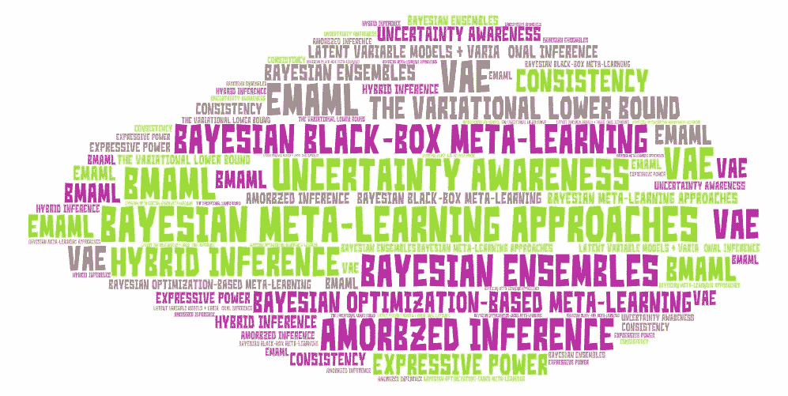

via [艺术字](https://wordart.com/create)

这个故事涵盖了我们为什么需要贝叶斯方法的原因，以及如何实现和评估这些方法。它是课程[‘斯坦福 CS330:多任务和元学习，2019 |第五讲——贝叶斯元学习’](https://www.youtube.com/watch?v=QY8JXpnllb0&list=PLoROMvodv4rMC6zfYmnD7UG3LVvwaITY5&index=5)的总结。

对于元学习算法，3 个算法特性是重要的:表达能力、一致性和不确定性意识。 表现力是 f 代表一系列学习过程的能力，它衡量可扩展性和对一系列领域的适用性。一致性意味着学习的学习过程将解决具有足够数据的任务，这一特性减少了对元训练任务的依赖，从而导致良好的分布外性能。不确定性意识是在学习过程中对模糊性进行推理的能力。它让我们思考如何在强化学习的环境中探索新的环境，以减少我们的不确定性。它还考虑了如果我们处于安全关键环境中，我们想要校准不确定性估计。它也允许我们从元学习的贝叶斯观点来思考，什么样的原则方法可以从那些图形模型中导出？

这个故事涵盖了 1。为什么是贝叶斯？2.贝叶斯元学习方法 3。如何评价巴伊亚人

# 为什么是贝叶斯？

多任务原则和元学习原则是训练和测试必须匹配，任务必须共享“结构”。“结构”是什么意思？这意味着对共享潜在信息θ的统计依赖性。

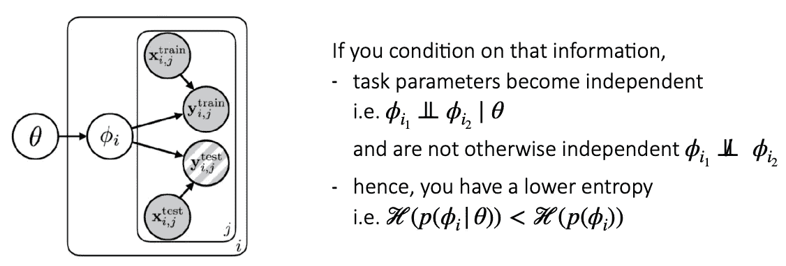

来源:[课程幻灯片](http://cs330.stanford.edu/slides/cs330_bayesian_metalearning.pdf)

图形模型，其中θ是所有任务共享的肉参数。φI 是每个任务 I 的特定于任务的参数。特别是，这个图形模型显示了对θ的一些依赖性。基本上，每个参数ϕi 都有一个从θ开始的箭头。如果你的条件以θ为信息，任务参数(ϕs)就变得独立，也就是ϕi 独立于另一个以θ为条件的ϕi。如果你把θ作为潜在信息的条件，那么它们就不是独立的。这些性质表明给定θ的ϕ上的分布比ϕ.的边缘分布具有更低的熵本质上，θ告诉你关于特定任务参数ϕ.的信息

如果您可以识别θ(例如，通过元学习)，**在哪些情况下，学习ϕ不会比从头开始学习更快？如果ϕs 在知道以θ为条件之前是独立的，这意味着它们的熵将是相同的，那么从零开始学习将与从共享信息θ中学习一样快。如果单个点承载了θ的所有信息，那么共享的信息基本上不会告诉你那么多，因为信息也存在于单个数据点中。以θ为条件的熵会相当高，边际熵也会相当高。**如果给定θ的ϕ熵为零会怎样？**这意味着在ϕ中没有任何附加信息不被θ捕获，那么θ可以解决所有的任务，你不需要做任何事情来学习θ。**

【theta 可能包含什么信息？如果任务族对应于具有不同振幅和不同相位的正弦曲线，那么θ将对应于正弦函数族。在机器翻译的例子中，θ对应于所有语言对的家族，而ϕ中没有出现在θ中的信息将对应于特定语言的特定事物。注意，在这两个例子中，θ比所有可能函数的空间都要窄(这就是为什么原则上我们可以从使用元学习中获益)

如果你有无限多的任务，你应该可以精确地恢复θ，或者基本上高精度地恢复那一族。如果你在没有大量任务的情况下进行元学习会怎样？如果你有一个任务空间，它不一定会覆盖任务的真实分布，但可能会对任务空间进行**元过拟合**，这样实际上不会恢复对应于所有语言对的θ，但它会找到对应于一组语言对的θ，这些语言对看起来像你的训练数据中的东西，而不是捕捉完整分布的东西。**因此，除非测试数据非常接近训练样本，否则你不会有效地适应来自该分布的新事物**。

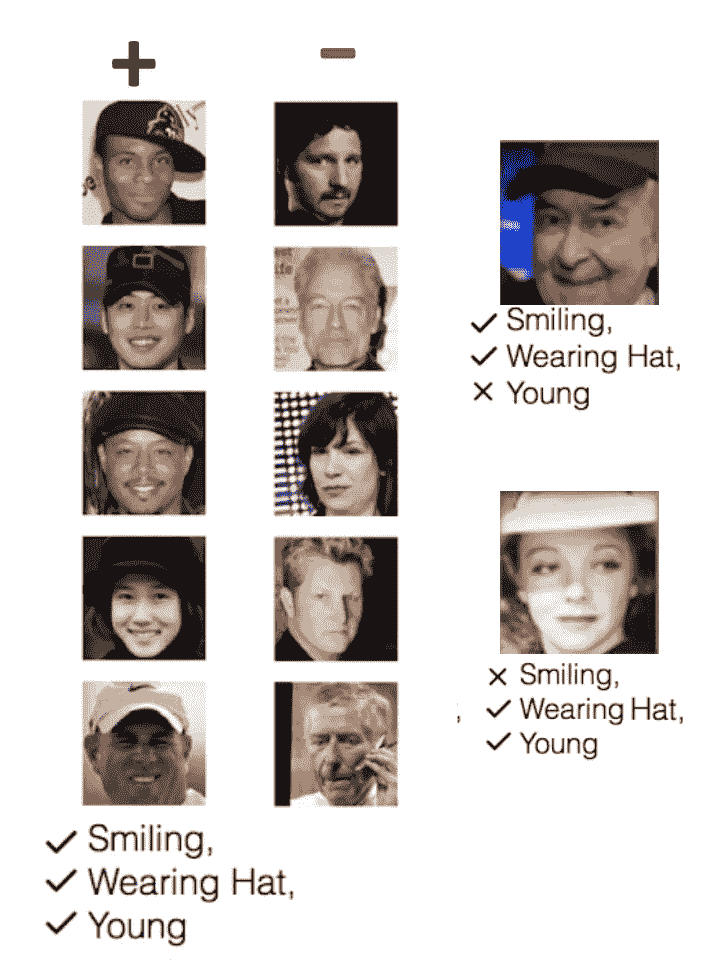

少数几个学习问题可能是模糊的。有“+”和“-”两类。对于“+”类，图片的特征可能是“微笑”、“戴帽子”和“年轻”。但是最右边的测试图像包含一些特征，但不是全部，所以很难区分这些测试图像属于哪一类。来源:[课程幻灯片](http://cs330.stanford.edu/slides/cs330_bayesian_metalearning.pdf)

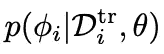

参数方法使用这种分布的确定性估计，而贝叶斯元学习方法试图从这种分布中采样。来源:[课程幻灯片](http://cs330.stanford.edu/slides/cs330_bayesian_metalearning.pdf)

对于**参数方法，**在给定数据集和元参数θ的情况下，我们恢复的是任务特定参数ϕ的确定性估计。所以你会得到这个分布的点估计。这在哪里/为什么会成为问题？在某些情况下，我们需要的不仅仅是点估计。例如，一些少量的学习问题可能并不完全由他们的数据决定，也许在你有先验信息的证据下，基础函数是不明确的。在本例中，模糊性是因为数据集很小。为了解决这个问题，**如果我们可以生成关于底层函数的假设，会怎么样？**如果我们可以从这个分布中取样，我们就可以对我们的不确定性进行推理，这对于安全关键的少量拍摄学习非常重要。它允许我们在元学习中主动学习和探索。这就是贝叶斯元学习方法的用武之地。

# 贝叶斯元学习方法

从计算图的角度来看。来源:[课程幻灯片](http://cs330.stanford.edu/slides/cs330_bayesian_metalearning.pdf)

如果我们关心在我们的预测上生成分布， ***一种方法是让函数 f 输出在标签上分布的参数*** 。例如，如果你的标签 y 是离散的，你让 f 输出对应于离散分类分布概率的东西；您还可以输出高斯分布的均值和方差来表示标签上的高斯分布；或者，如果你有一个更多模态的分布，你可以试着表示高斯混合的均值、方差和混合权重；或者，如果您有一个多维输出标签 y，那么您可以输出一系列条件分布的参数，以允许您表示这些变量的联合分布，这是一个自回归模型。一旦你输出了分布的参数，你就可以用 ***最大似然估计优化*** 来训练这些方法，优化分布的均值和方差，或者基本上优化该分布的所有全概率值。

这种方法的**好处**是它们**简单**并且**可以与多种方法**结合。**缺点**是这种方法**不能推理底层函数**的不确定性，以确定数据点之间的不确定性如何相关。它还倾向于**产生校准不良的不确定性估计。**例如，你不能把模型不确定性和标签噪声分开。它也被限制在 y 上的一类特殊分布。

我们能为ϕ做同样的最大似然训练吗？我们不能以完全相同的方式来做，因为我们没有对应于ϕ的标签，除非我们生成标签。

# 贝叶斯元学习方法

## 贝叶斯深度学习工具箱

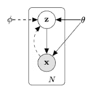

一种可变自动编码器。来源:[课程幻灯片](http://cs330.stanford.edu/slides/cs330_bayesian_metalearning.pdf)

贝叶斯深度学习旨在用神经网络来表示分布。有许多方法可以用神经网络来表示分布。 [***一种流行的方法***](https://arxiv.org/abs/1312.6114) ***就是使用潜变量模型，然后用变分推理对其进行优化。*** 具体来说，我们有一个图形模型，其中有潜在变量 Z 和观察变量 x。例如，左边的图形模型是一个可变自动编码器。你可以制定一个似然目标的下限，并使用它来优化 X 上的分布，其中 X 上的分布可能是非高斯的，因为它有这个潜在变量。

[另一种方法](https://papers.nips.cc/paper/7219-simple-and-scalable-predictive-uncertainty-estimation-using-deep-ensembles.pdf)在某些方面非常流行，也非常简单，那就是 ***使用基于粒子的分布图*** 。特别是，您可以在不同的数据引导上训练不同的模型。这些模型中的每一个都对应于你的一个特定的分布，然后你把这些粒子组合起来，代表那个分布的样本。

[***另一种方法***](https://arxiv.org/abs/1505.05424) ***是表示神经网络参数的权重的显式分布。*** 然后练习这些分布趋向于带有对角协方差矩阵的高斯分布，这样你基本上就有了每个神经网络参数的独立方差。这使您可以表示函数的分布，但需要注意的是，这种两个参数独立的独立假设在实践中总是被违反。

[***规格化流程***](https://arxiv.org/pdf/1410.8516.pdf) ***通过将一些潜在分布转化为你的数据分布，或者从潜在空间转化为你的数据空间，再转化回你的潜在空间，尝试表示数据分布上的函数*** 。

在 e [基于能量的模型和 GAN](https://papers.nips.cc/paper/5423-generative-adversarial-nets.pdf) 、 ***中，估算非标准化密度的方法是对数据使用低能量，对其他所有数据使用较高能量，而其他所有数据都由 GAN 中的生成器近似。***

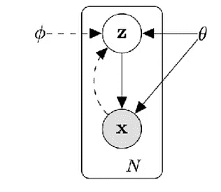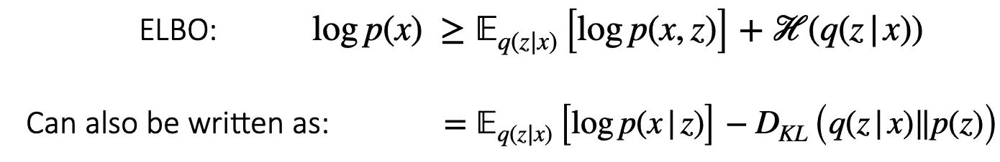

埃尔博。来源:[课程幻灯片](http://cs330.stanford.edu/slides/cs330_bayesian_metalearning.pdf)

这个图形模型包含了观察变量 x，和潜在变量 z .**T3【证据下界】或者 ELBO 希望能够估计出一个关于数据的似然性的下界 T5【以便优化数据的似然性。ELBO 可以由关于 q(z|x)的期望加上在 q(z|x)上正则化或操作的熵项来表示。q 是表示 x 和 z 的概率的变分分布，这个可以改写为两项互相加， ***第一项对应的是解码器的重构损失，基本上是从推理网络 q 采样后根据解码器的数据的似然性，第二项对应的是推理网络和先验之间的 KL 散度。*** ***P 对应于模型，q 对应于为了逼近似然目标*** 而引入的变分分布。对于如何表示 p，有几种设计选择:p(z)和 p(x|z)。 **P *(x|z)可以表示为一个神经网络，*** 例如，在变分自动编码器的情况下，它表示一个神经网络，该网络接收潜在变量并输出图像或您正在建模的任何数据类型。***P(z)通常被表示为具有单位方差的对角高斯。*** *它也可以由神经网络来表示，或者表示为学习的平均值和学习的方差。实际上，变分自动编码器通常不学习它，因为之后的层可以将它转换成学习的均值和方差。 ***q(z|x)也是用神经网络来表示的，推断为推理网络或者你的变分分布。*** 在深度学习的上下文中使用变分推理时，θ表示模型参数，ϕ表示推理网络的参数。***

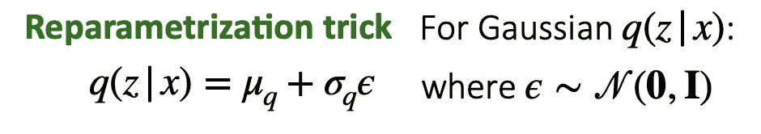

重新参数化的把戏。来源:[课程幻灯片](http://cs330.stanford.edu/slides/cs330_bayesian_metalearning.pdf)

但是优化 ELBO *有个问题。ELBO 包含关于 q 的期望，这意味着我们需要能够反向传播到 q 分布中，但是采样是不可微分的* e。我们可以使用 ***重新参数化技巧*** 。*对于高斯 q(z|x ),它可以用一种可微分的方式来表示，*用从单位高斯采样的噪声来重新参数化。*特别是，如果我们将潜在变量的分布表示为与输出均值和方差的神经网络 q 的输出相对应的高斯分布，那么您可以将 q 的输出(高斯分布)表示为由噪声重新参数化，而不是从均值加上方差乘以噪声的特定分布中采样。幸运的是，这个方程是可微的。如果你的推理网络足够有表现力，它应该能够将你的数据分布转换成潜在变量的高斯分布。*

这通常被称为 ***摊销变分推断*** ，我们有一个推断网络，它预测变分分布，基本上摊销了估计该分布的过程。元学习可以用摊销变分推理吗？

# 贝叶斯元学习方法

## 贝叶斯黑盒元学习

黑盒元学习方法。来源:[课程幻灯片](http://cs330.stanford.edu/slides/cs330_bayesian_metalearning.pdf)

首先，为了简单起见，让我们考虑一下黑盒元学习方法。特别是，我们希望有一个神经网络，它将训练数据集作为输入，并在我们的参数φ上产生分布。然后应用ϕ对神经网络进行参数化，该神经网络将 x 作为输入，将 y 作为输出。目标是在根据我们的训练数据集对特定任务参数进行采样时，能够最大化给定特定任务参数的测试数据点的可能性。

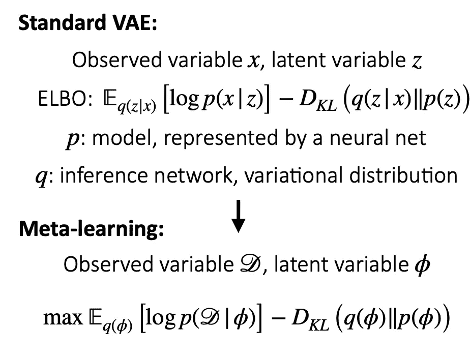

***摊提变分推理成元学习。来源:*** [***课程幻灯片***](http://cs330.stanford.edu/slides/cs330_bayesian_metalearning.pdf)

在标准 VAE 中，观察变量是 x，潜在变量是 z。而在元学习中，观察变量是数据集，潜在变量是ϕ.ELBO 开始学习数学。它在特定任务参数ϕ上有一个变化的分布，在这里我们将从给定的ϕ.中取样并估计数据的可能性 KL 项表明 phi 上的变分分布和先验应该是相似的。

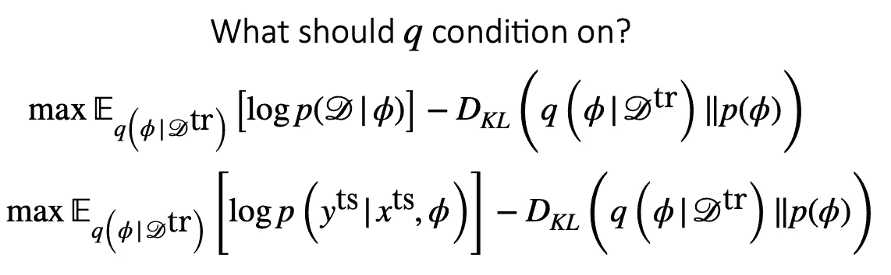

来源:[课程幻灯片](http://cs330.stanford.edu/slides/cs330_bayesian_metalearning.pdf)

对于 **q 条件有两种设计选择。**如果您希望能够将参数作为我们数据集的函数进行采样，那么我们应该对我们的训练数据进行**条件 q(这显示在第一个等式中)。这个训练数据和测试数据点的概率有什么不同？ ***因此，当根据我们的训练数据集*** 对我们的任务特定参数进行采样时，您希望能够最大化给定我们的任务特定参数的测试数据点的可能性(如第二个等式所示)。**

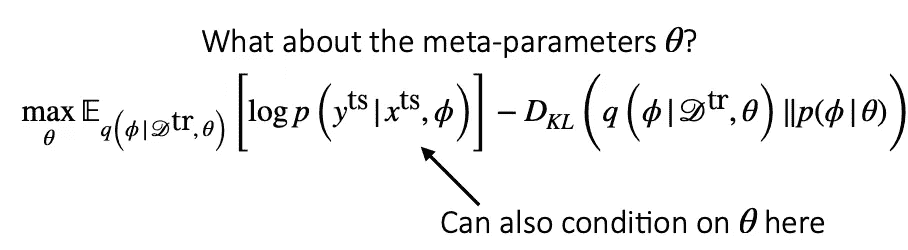

元参数θ。来源:[课程幻灯片](http://cs330.stanford.edu/slides/cs330_bayesian_metalearning.pdf)

元参数θ呢？我们将有一个以θ为条件的特定任务参数ϕ的先验。测试数据点的分布仅是φ的函数。我们也可以θ为条件。

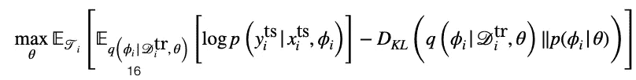

最终目标(为了完整性)。来源:[课程幻灯片](http://cs330.stanford.edu/slides/cs330_bayesian_metalearning.pdf)

最终目标是使所有任务的元参数和期望值最大化。特定于任务的参数从神经网络 q 中采样，然后应用它们来最大化 p 的可能性。右边的一项鼓励 q 接近某个先验分布。

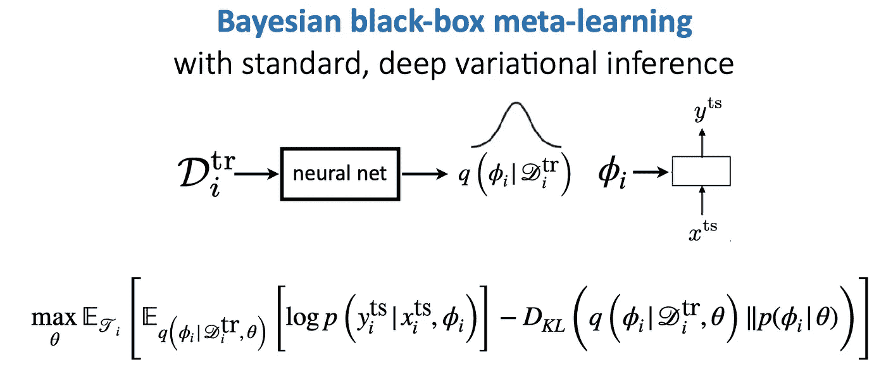

贝叶斯黑盒元学习概述。来源:[课程幻灯片](http://cs330.stanford.edu/slides/cs330_bayesian_metalearning.pdf)

为了总结贝叶斯黑盒元学习，列出了一些好处和缺点。一个好处是**它可以表示 y** 上的非高斯分布，并且它还**生成任务特定参数ϕ上的分布，**而不仅仅是生成标签上的分布(y^{ts}).这使得它能够表示基础函数的不确定性，而不仅仅是基础数据点的不确定性。缺点是在给定θ的情况下，它只能表示ϕp 的高斯分布。这有两个原因。一个是重参数化技巧，它适用于高斯。第二件事是，在目标中出现的 KL 项，对于高斯型目标是可以以封闭形式评估的，但是对于其他非高斯型目标是不能以封闭形式评估的。

# 贝叶斯元学习方法

## 基于贝叶斯优化的元学习

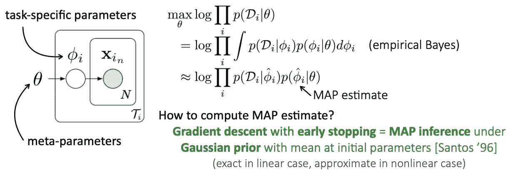

将基于梯度的元学习重铸为分层贝叶斯。来源:[课程幻灯片](http://cs330.stanford.edu/slides/cs330_bayesian_metalearning.pdf)

[我们可以将基于梯度的元学习重铸为分层贝叶斯。](https://arxiv.org/abs/1801.08930)这很好，因为它将 MAML 的贝叶斯解释作为一种学习元参数，这样在测试时，您可以在元参数所代表的高斯先验下进行地图推断。它使用特定于任务的参数ϕ的地图估计作为θ的函数，这意味着它表示该分布的点估计，并且它只给出该分布的一组参数，例如，您无法从该分布中进行采样或更容易地表示任务参数的完整分布。

# 贝叶斯元学习方法

## 摊销贝叶斯元学习

***Q 是任意函数*** ，它可以包含一个梯度算子。这是*，所以你可以有一个推理网络，基本上是在你的推理网络*内执行梯度下降。因为 q 不必是神经网络，它可以是输出ϕ.分布的任何东西 [***(摊销贝叶斯元学习)***](https://openreview.net/pdf?id=rkgpy3C5tX) ***在文中，我们将运行梯度下降 w.r.t .一组参数的均值和该组参数的方差 w.r.t .一些训练数据，然后其他一切都是一样的。*** 与 MAML 相比，这不仅仅是对参数进行梯度下降，*这是对参数的均值和方差进行梯度下降，在这个过程的最后，你会得到参数的均值和方差，而不仅仅是均值。***好处**是你在测试时运行**梯度下降，**所以我们得到一个基于优化的元学习方法，基本上是把梯度下降填充到参考网络中。缺点是 p(ϕi|θ)被建模为高斯。

我们可以建立非高斯后验模型吗？

# 贝叶斯元学习方法

## 合奏

我们可以通过维护单独的模型实例来模拟非高斯后验。有几篇关于组装哺乳动物的论文。

[MAMLs(aka EMAML)](https://papers.nips.cc/paper/7963-bayesian-model-agnostic-meta-learning.pdf)的集成训练 M 个独立的 MAML 模型，如果集成成员太相似，就不能很好地工作。我们可以将这种想法应用到集成黑盒和非参数方法中。

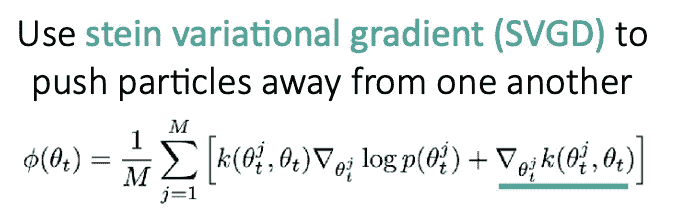

来源:[课程幻灯片](http://cs330.stanford.edu/slides/cs330_bayesian_metalearning.pdf)

[BMAML](https://arxiv.org/pdf/1806.03836.pdf) 是一个更加多样化的哺乳动物群体，基本上，它将不同的群体成员相互推开，鼓励他们代表不同的模型。 ***实现这一点的方法是，当你运行梯度下降时，你有典型的似然项，但你也有一个鼓励不同系综成员彼此不同的项。你可以用不同的核函数来表示模型之间的相似性。***

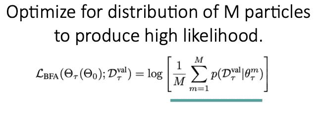

BMAML 优化。来源:[课程幻灯片](http://cs330.stanford.edu/slides/cs330_bayesian_metalearning.pdf)

他们不仅仅是将粒子相互推开，还进行了优化，使集合给你一个产生高可能性的粒子分布。因此，他们没有完全分别训练这些不同的模型，而是把它们组合在一起，优化了一个术语，共同优化了它们。所以你在优化这 M 个粒子的平均可能性。

这些集成模型的好处是它们简单，往往工作良好，并且它们可以模拟非高斯后验。缺点是您需要维护 M 个模型实例，或者只在最后一层进行基于梯度的推理。我们可以在所有参数上模拟非高斯后验模型而不必维护单独的模型实例吗？

# 贝叶斯元学习方法

## [概率 MAML](https://arxiv.org/abs/1806.02817)

我们可以用像哈密尔顿蒙特卡罗这样的程序对参数向量进行采样吗？具体来说，哈密顿蒙特卡罗所做的是添加噪声，然后重复运行梯度下降，以便能够从一些分布中采样。直觉是学习一个先验，一个随意的踢腿可以让我们进入不同的模式。

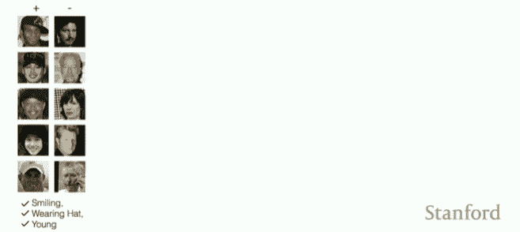

损失景观。来源:[课程幻灯片](http://cs330.stanford.edu/slides/cs330_bayesian_metalearning.pdf)

在这种损失格局中，有不同的解决模式。一个对应于分类“微笑”和“戴帽子”的分类器，一个对应于分类“微笑”和“年轻”的分类器。我们希望参数向量在中间，这样如果我们给参数向量添加一些噪声，然后运行梯度下降，我们得到这个解的两种不同模式。我们得到不同的函数，代表正确答案的不同模式。

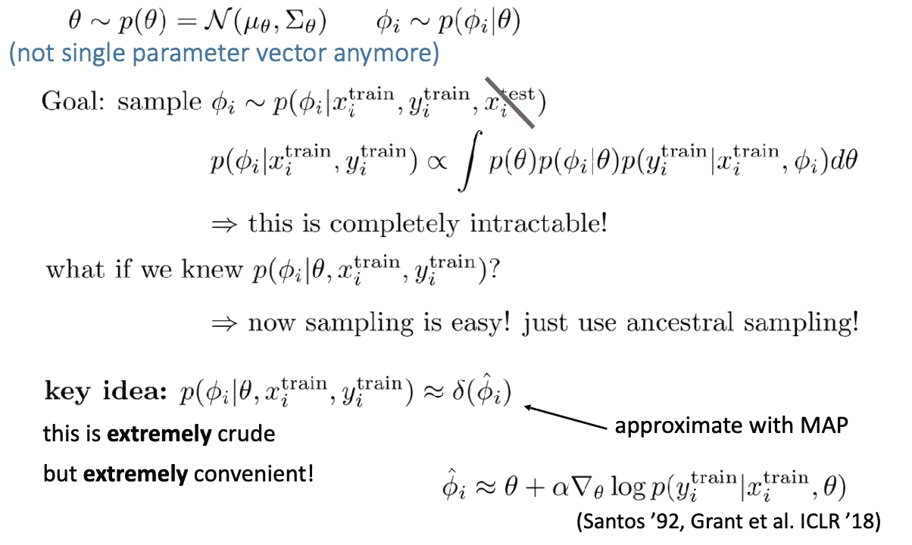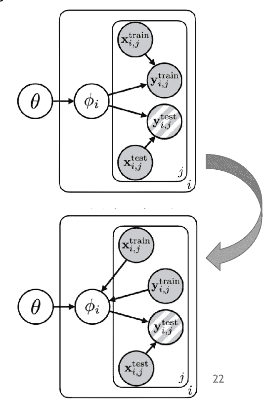

概率 MAML 中测试时的推断。来源:[课程幻灯片](http://cs330.stanford.edu/slides/cs330_bayesian_metalearning.pdf)

在这种情况下，θ将是一个分布，而不是一个单一的参数向量。我们的目标是在测试时给定所有观察到的变量，即`x train`、`y train`和`x test`，对不同的特定于任务的参数进行采样。我们可以跨越`x test`，因为`y test`没有给定，其他的保持条件独立，所以你可以从ϕ给定的函数`x train`和`y train`中采样。这种分布的精确解是完全难以处理的，因为它需要积分。如果我们知道如何在给定θ`x train`和`y train`的情况下对 phi 进行采样，那么采样就会变得容易得多。通过地图推断，我们可以用ϕ点估计来粗略地近似这个分布。实际上，我们仍然可以从ϕ采样，首先从θ采样，然后我们运行几个梯度下降步骤。这是在测试时我们想做推理时发生的。训练可以用摊余变分推理来完成，详情可以查阅[论文](https://arxiv.org/abs/1806.02817)。

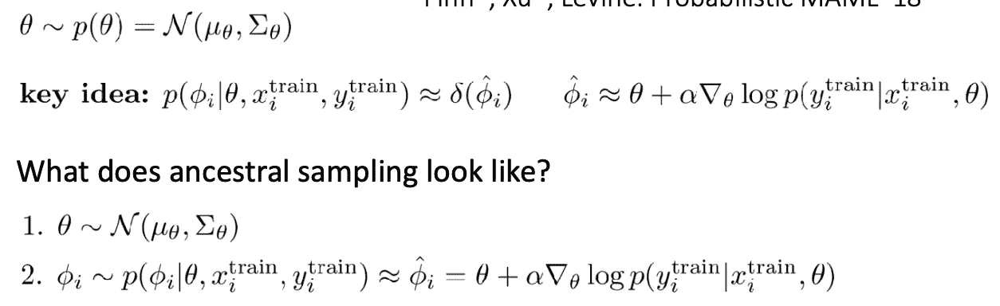

概率 MAML 中的祖先抽样。来源:[课程幻灯片](http://cs330.stanford.edu/slides/cs330_bayesian_metalearning.pdf)

祖先取样是什么样子的？有 2 个步骤: ***首先我们从θ的 P 中采样，这个 P 有均值和方差；然后我们运行梯度下降，从样本θ开始，运行梯度下降到θ。它允许我们表现这些类型的多模态分布。***

这种方法的**好处**是**它具有非高斯后验，在测试时简单，并且只有一个模型实例**(与 MAML 的系综相反)。缺点是它有更复杂的训练程序。

# 贝叶斯元学习方法

## 方法概述

涵盖了三种方法。第一个是训练函数 f 来输出在`y test`上的分布。好处是它很简单，可以结合多种方法。但是它不能推理基础函数上的不确定性，并且也可以表达`y test`上的有限类分布。第二种方法是黑盒方法，其中使用潜在变量模型和摊销变分推断。好处是它可以代表`y test`上的非高斯分布，但它只能代表高斯分布 p(ϕi |θ)，当ϕi 是一个潜在向量时是可以的。对于基于优化的方法，我们提到了 3 种类型:摊提推理；集成和混合推理。摊销推断很简单，但它将 p(ϕi |θ)建模为高斯分布。集成方法简单，往往工作良好，具有非高斯分布，但它包含 M 个模型实例。混合推理具有非高斯后验，测试时简单，只有一个模型实例，但训练过程比较复杂。

# 如何评价巴伊亚人

## 如何评价一个贝叶斯元学习者？

使用标准基准怎么样，比如 Minilmagenet 精度？好处是它是标准化的，所以我们可以更容易地比较论文。Minilmagene 也有实像。但是像准确性这样的度量标准不能评估不确定性。任务可能不会表现出模糊性，并且不确定性在该数据集上可能没有用。什么是更好的问题和度量？这取决于你关心的问题。

检查这些算法性能的一种方法是看不同的玩具例子。例如，设想您从中取样的基础函数。

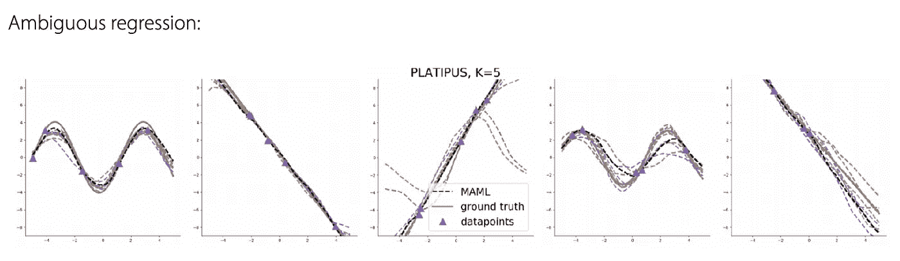

来源:[课程幻灯片](http://cs330.stanford.edu/slides/cs330_bayesian_metalearning.pdf)

这个例子对应于基本的元学习函数是正弦函数和线性函数，其中标签中有噪声，使得任务不明确。它所推理的函数类型，在某些情况下，是模糊的，即使它是正弦函数或者线性函数。你可以从抽样分布中看到这种多模态输出。这表明函数实际上可以表示多模态的东西。

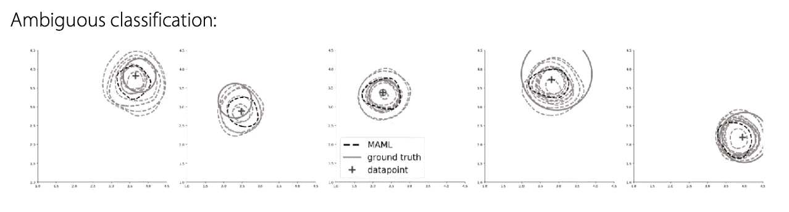

来源:[课程幻灯片](http://cs330.stanford.edu/slides/cs330_bayesian_metalearning.pdf)

第二个例子是一个分类的例子，你只给了一个数据点，所有的任务都对应于循环决策边界。你试图区分积极点和消极点。`D train`仅包含一个正数据点，而`D test` 包含正负数据点。因此，基本上你可以看到虚线所示的决策边界的可视化，其中神经网络代表这些不同的决策边界，这些边界代表了它接受训练的函数类的结构。

[我们也可以使用可能性或准确性的组合以及分布的覆盖范围来衡量性能](https://arxiv.org/abs/1806.02817)。[或者我们可以绘制预测器的置信度与预测器的精确度的关系图](https://openreview.net/pdf?id=rkgpy3C5tX)。[还有主动学习评价](https://arxiv.org/abs/1806.02817)。

# 参考

1.  [斯坦福 CS330:多任务和元学习，2019 |第 5 讲——贝叶斯元学习](https://www.youtube.com/watch?v=QY8JXpnllb0&list=PLoROMvodv4rMC6zfYmnD7UG3LVvwaITY5&index=5)
2.  [课程幻灯片](http://cs330.stanford.edu/slides/cs330_bayesian_metalearning.pdf)
3.  [具有潜在嵌入优化的元学习](https://arxiv.org/abs/1807.05960)
4.  [元数据集:用于从少量示例中学习的数据集的数据集](https://arxiv.org/abs/1903.03096)
5.  [主动一次性学习—斯坦福计算机科学](https://cs.stanford.edu/~woodward/papers/active_one_shot_learning_2016.pdf)
6.  [主动学习的学习算法](https://arxiv.org/abs/1708.00088)
7.  [自动编码变分贝叶斯](https://arxiv.org/abs/1312.6114)
8.  [使用深度集成进行简单和可扩展的预测不确定性估计](https://arxiv.org/abs/1612.01474)
9.  [概率模型不可知元学习](https://arxiv.org/abs/1806.02817)
10.  [概率模型不可知元学习——NIPS 会议录](https://papers.nips.cc/paper/8161-probabilistic-model-agnostic-meta-learning.pdf)