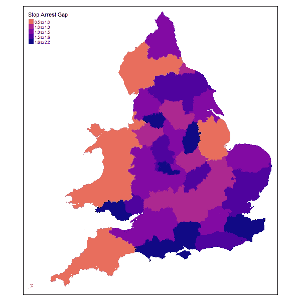
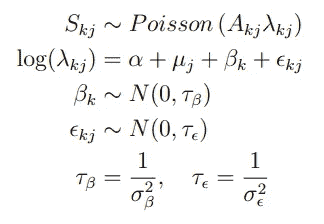
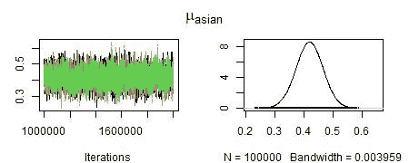

# 英国停车搜索的贝叶斯模型

> 原文：<https://towardsdatascience.com/bayesian-modelling-of-uk-stop-and-search-3f9947272fce?source=collection_archive---------28----------------------->

## 用贝叶斯推理拟合泊松广义线性混合模型研究停止和搜索的过度使用

国际国王教会在 [Unsplash](https://unsplash.com/s/photos/police?utm_source=unsplash&utm_medium=referral&utm_content=creditCopyText) 上拍摄的照片

在英国和国际上，关于过度使用拦截和搜查的讨论越来越多。看看英格兰和威尔士警察部队拦截和搜查次数与逮捕次数的比例，我们可以调查不同种族群体之间是否存在差异。具体来说，泊松广义线性混合模型被实施以允许种族群体固定效应和警察力量随机效应。该模型符合使用 Gibbs 抽样的贝叶斯推断，并且我们发现**在样本中对于我们的种族群体效应的实质性差异**。这证明了警察部队在地理层面过度使用拦截和搜查。这个项目的 bug 模型的实现可以在 [GitHub](https://github.com/natashabutt/PoissonGLMM) 上找到。

# 背景

现有文献旨在调查过度使用拦截和搜查。Bowling 和 Phillips (2007 年)提供了关于英国文献的广泛总结和讨论，认为统计数据显示对黑人个人使用拦截和搜查权力是不成比例的。这里要看的一个常见统计数据是按种族划分的每个居民的停留和搜索次数。这可以从折线图中看出，例如，在 2019 年，每 1000 名黑人居民中黑人个体被拦下和搜查的次数比每 1000 名白人居民中白人个体被拦下和搜查的次数多 9 倍以上。

Bowling 和 Phillips (2007)强调，按常住人口标准化的统计数据经常受到批评，因为没有考虑潜在的不同犯罪参与和“可用性”。在这里，Miller (2000)将“可用”定义为描述一个人在停车和搜查发生的时间和地点使用公共场所。此外，Miller (2000)确实发现了常住人口和可居住人口的差异，与常住人口相比，来自黑人、亚洲人和少数民族背景的个人在可居住人口中的比例过高。因此，在这个项目中，拦截和搜查是按逮捕比例进行调查的。但是，应该注意的是，如果在拦截和搜查过程中存在偏见，在逮捕过程中也可能存在偏见，因为这两个过程通常都需要“合理的理由”。似乎可以合理地假设，如果存在的话，这些偏见将具有相同的方向，因此，按照逮捕的比例来看待拦截和搜查可以作为不相称的最低门槛。

# 数据

拦截和搜查个人层面的数据是公开的，由英国警方提供。对于这个项目，我们已经采取了 2015 年 1 月至 2020 年 2 月(含)英格兰和威尔士警方报告的所有拦截和搜查(约 190 万次)。探索这些数据很有趣，例如，最常见的搜索对象是毒品(56%)，而攻击性武器仅占所有搜索对象的 10%。此外，大约 70%的拦截和搜查导致没有采取进一步行动，只有大约 15%导致逮捕。如上面的堆积条形图所示，除了逮捕之外，还可以采取范围广泛的进一步行动。

每份拦截和搜查报告都包括警察力量和自我定义的种族。因此，拦截和搜查次数是按种族和警察队伍汇总的。由 Office⁴.内政部提供的按族裔群体分列的被捕人数也是公开的这些是在 2015 年 3 月至 2019 年 3 月期间收集的。该地图显示了“拦截搜查差距”，即黑人被拦截和搜查的次数与黑人被逮捕的次数的比例**比**白人被拦截和搜查的次数与白人被逮捕的次数的比例。停止逮捕差距大于 1 反映了黑人相对于白人更频繁地被停止和搜查，与逮捕成比例。警察力量似乎有很大差异，支持在我们的泊松广义线性混合模型中使用随机警察力量效应。

# 泊松广义线性混合模型

泊松广义线性混合模型的实施考虑到了种族群体的固定效应和警察力量的随机效应，可以被看作是盖尔曼和 al.(2007)⁵.的扩展作者用种族群体固定效应和警察辖区随机效应研究了纽约的拦截和搜查。因此，该项目的实施着眼于更大范围的警察部队与辖区的区域单位以及英格兰和威尔士与纽约的地理区域。我们的最终模型如下所示。

该模型采用马尔可夫链蒙特卡罗方法进行贝叶斯推理拟合。具体来说，选择 Gibbs 抽样是因为模型的层次结构，并且使用了 BUGS 软件。假设所有未知参数都有非信息先验。运行三个平行链，并结合轨迹图使用 Gelman-Rubin 统计来评估收敛性。通过 2，000，000 次迭代和 1，000，000 次老化，达到了令人满意的收敛证据。10 的细化用于适应 bug 内存限制。

# 结果

结果表显示了通过取样本平均值估计的后验平均值。此外，可信区间代表 95%的高后验密度区间。任何种族群体截距的可信区间都不会跨越零，因此给定种族群体效应的值大于零的概率为 95%。由于对数关联函数，必须采用后验均值的指数来量化族裔群体对警察部队拦截和搜查次数的影响，以及与逮捕的比例。因此，通过取后验平均值的指数，我们可以看到，亚裔、黑人和混血儿被拦截和搜查的次数分别是白人的 1.52 倍、1.30 倍和 1.20 倍，与被逮捕的人数成比例。最后，下面的轨迹图显示在左侧，支持收敛的证据。此外，在右侧，种族群体效应的密度图看起来平滑且呈单峰。此外，零度以下的密度非常低。

# 结论

由于难以控制潜在变化的犯罪参与和可利用性，衡量过度使用拦截和搜查存在很大困难。该项目通过观察拦截和搜查与逮捕的比例来解释这些情况，作为不相称的最低门槛。将警察部队一级的拦截搜查和逮捕汇总，发现不同族裔群体的拦截搜查率与逮捕率之间存在差异。据估计，亚洲人、黑人和混血儿被拦截和搜查的频率分别是白人的 1.52 倍、1.30 倍和 1.20 倍，与被捕人数成比例。这与 Gelman 等人(2007)在纽约警区的发现一致。有缺陷的 Gibbs 抽样被证明是模拟后验分布的一种灵活有效的方法。此外，随机效应的方差参数的可信区间不跨越零，支持混合效应模型的实现。最后，如果在较低的地理水平上可以获得逮捕数据，那么用较小的区域单位重复这种分析，以调查是否有证据表明警察部队内部的随机效应，将是有用的。

# 参考

[1]鲍林，b .和 c .菲利普斯(2007)。不相称和歧视:审查警察拦截和搜查的证据。*现代法律评论。*

[2]米勒，J. (2000 年)。可用于停靠和搜索的人口分析。*内政部警察研究系列。*

[3]英国警方(2020 年)。停下来搜索数据。【https://data.police.uk/data/】T4。

[4]家庭办公室(2019)。警察权力和程序英格兰和威尔士统计。https://www . gov . uk/government/collections/police-powers-and-procedures-England-and-Wales。

[5]赫尔曼、法甘和基斯(2007 年)。在种族偏见的背景下对纽约市警察局拦截搜身警察的分析。*美国统计协会杂志。*