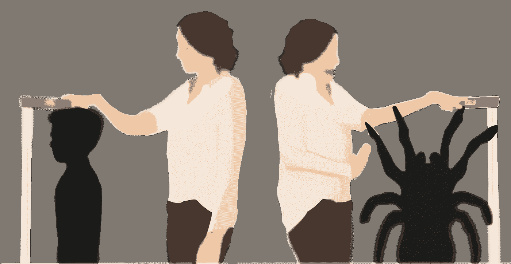
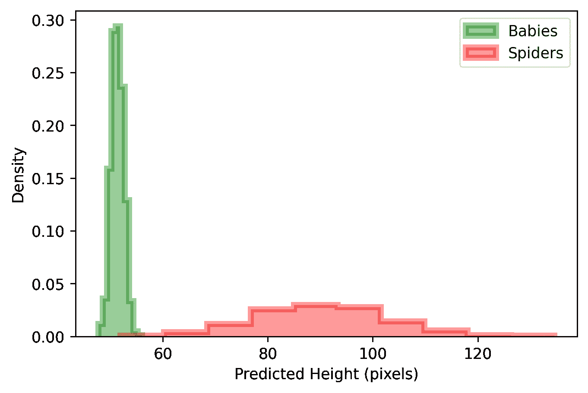

# 贝叶斯神经网络:3 贝叶斯 CNN

> 原文：<https://towardsdatascience.com/bayesian-neural-networks-3-bayesian-cnn-6ecd842eeff3?source=collection_archive---------16----------------------->

## [贝叶斯神经网络](https://towardsdatascience.com/tagged/adam-bayesian-nn)

## 知道什么时候被骗的超级深度学习



图像由 DoctorLoop 提供

**这是贝叶斯深度学习系列的第三章。上一篇可用** [**此处可用**](/bayesian-neural-networks-2-fully-connected-in-tensorflow-and-pytorch-7bf65fb4) **。**

我们已经知道神经网络是傲慢的。但是标准神经网络的另一个缺点是容易被欺骗。想象一下，一个 CNN 肩负着像人脸识别这样道德上有问题的任务。它从安全摄像头获取信息。但是，当安全摄像头发送一只狗、一个人体模型或一个儿童玩偶的照片时，会发生什么呢？CNN 仍然会输出被类似人脸的东西欺骗的分类。CNN 呼吁贝叶斯治疗，因为我们不希望我们的工作被愚蠢的错误所破坏，因为在错误分类的后果很严重的地方，我们想知道网络有多可靠。一个娃娃，或者任何一个真人，成为通缉犯的可能性有多大？我们需要知道。

## 章节目标

*   了解如何实现贝叶斯卷积模型
*   了解我们如何在从未见过的情况下识别坏的输入数据
*   理解贝叶斯神经网络的参数问题如何影响训练

正如我们在以前的文章中发现的，贝叶斯分析处理的是分布而不是单个值。我们在正态分布中看到了这一点，在正态分布中，我们得到了一个连续的浮点值，并返回了最有可能的平均值。分类的分布变成了离散的(钢琴键而不是小提琴弦)。对于概率，我们将得到一个特定的结果，比如一个类、一个指数(或者一个音符，如果我们挤压音乐类比的话)。这种分布是由我们模型中的逻辑信息决定的。

能够用少得多的数据表现得很好，同时具有更好的概括能力，这使得贝叶斯神经网络更受欢迎。而且这还没有考虑其他优势。然而，贝叶斯实现的一个缺点在本章变得很重要。贝叶斯实现需要更多的参数。考虑到整个分布替换了每个权重值参数，令人惊讶的是只需要两倍的参数。很容易看出相当具体的“两倍”数字来自哪里，因为重量分布大多是正态分布，而这些正态分布各自有两个参数。

在《离经叛道庄园》中，作者自然地创造了一个奇怪的新数据集来突出这个问题。我们发现自己在帮助父母解决一个重要的问题。父母总是对测量他们孩子的身高感兴趣。嗯，他们再也不用担心整天带着尺子到处跑了。我们将创建一个从图片中估计高度的模型。一个由 836 个婴儿和初学走路的孩子的剪影以及他们的身高组成的数据集已经被创建。因此，我们解决的不是分类问题，而是回归问题。我们的目标是返回一个与照片中孩子的身高相对应的浮点值。这是一个比上一章的分类练习稍微难一点的问题，并且由于蜘蛛的偶尔出现而变得更加困难。虽然训练集只包括有效的人类轮廓，但训练后我们会加入蜘蛛只是为了好玩。这就是有趣的地方，因为我们想避免返回昆虫的身高测量值，但是我们不允许有任何训练中的昆虫的照片。


用于训练的儿童原始剪影示例(左右两幅图像),位于不可用于训练的多毛蜘蛛剪影的两侧。这些剪影都被随机缩放至原始尺寸的 1/2–2 倍。

当然，蜘蛛通常比孩子小。因此，为了防止简单的基于大小差异的歧视，蜘蛛被升级以占据与儿童相当的空间。此外，为了让这项任务变得相当困难，孩子们被随机地重新调整了比例，所以他们的轮廓在原来的 1/2 到 2 倍之间。当然，当我们对孩子的身高感兴趣时，重新调整没有多大意义！但是这个精心设计的愚蠢问题完美地展示了贝叶斯深度学习的力量。您将看到这些模型如何很好地概括真实世界的情况，只有很少的训练示例，并且没有任何他们可能收到的损坏数据的示例！


让我们陷入张量流概率的问题。完整的代码和数据可以在 Jupyter 笔记本上在线获得:[https://github.com/DoctorLoop/BayesianDeepLearning](https://github.com/DoctorLoop/BayesianDeepLearning)。首先，我们将定义架构。

贝叶斯卷积架构([https://gist . github . com/doctor loop/293 AE 5c C3 BDA a2 CCC 333d 9 b 216 eacc 301](https://gist.github.com/DoctorLoop/293ae5cc3bda2ccc333d9b216eacc301))

在第一行中，我们清除任何可能已经在内存中的会话，清空任何参数存储和变量，这样就不会干扰新的运行。接下来，我们定义一个 lambda 函数，帮助我们通过上一章讨论的 Kullback-Leibler (KL)散度更新损失。然后，我们将这个λ传递给每个卷积层，以便可以参考近似分布和我们的先验分布之间的差异来更新损耗。严格来说，这并不是绝对必要的，因为该层的默认参数*几乎*相同。然而，不同之处在于，默认参数仅获得 KL 散度，我们更进一步，将其除以示例总数(836)。默认实现将 epoch 的总 KL 应用于每个示例。但是我们更喜欢的是将总的历元 KL 的一部分应用到每个例子中，而不是每次都应用总的 KL。虽然两者都将训练，我们看到通过缩放损失更好的结果。自己实验看看。

实际模型的定义与任何其他 keras 序列一样。当然，我们使用的是卷积 2DFlipout 层(我们将在后面讨论)，而不是通常的 Conv2D。你可能会感到惊讶，我们只使用两个卷积层，而使用数百个卷积层已经足够了。我们使用两个只是因为结果令人印象深刻，对于这个问题，我们真的不需要更多。我们还在神经元层之间加入了两个最大池层，两者都有相当大的步幅/池大小。如果你有一个问题，需要特别敏感的像素完美的测量，你可能要尝试删除这些。当然，这样做的代价是硬件需求的增加，所以建议对两者进行比较。

最后一层是单个密集(贝叶斯)神经元，因为我们只对一个输出感兴趣。这个输出将是我们的测量。就这么简单。

最后用均方误差损失(MSE)编译模型。这是欺骗性的，因为虽然我们只指定了 MSE，但我们也在每一层上添加了 KL。然而，我们自己定义了吉隆坡，因为我们是独立的 Bayesianists 谁想要给 Keras 一个当之无愧的休息。当我们在培训期间打印损失时，我们将看到 KL 参与的证据。它明显不同于(大于)单独的 MSE。两者的区别就是我们的 KL。

## 培养

让我们开始训练，看看这次损失:

贝叶斯卷积模型的训练说明([https://gist . github . com/doctor loop/4b 10 c 410 a 709 e 0 DFD 71 ace 8 b 004255 BC](https://gist.github.com/DoctorLoop/4b10c410a709e0dfd71ace8b004255bc)

```
[Out]:
....
Epoch 250/250
151/151 [==============================] - 1s 4ms/step - loss: 12.5878 - mse: 5.1539 - val_loss: 16.3906 - val_mse: 8.9721
```

这里没有什么需要注意的。损耗比较高而批量比较低！

为了首先解决损失问题，我们会反复发现，与传统模型相比，贝叶斯模型的损失值是一个更差的模型性能指标。第一个原因是因为我们合并了至少两个损失。当然，我们感兴趣的是损失的变化，而不是明确的值，但即使这样，变化也不总是清晰的，因为我们经常在训练期间逐步改变两个损失的相对影响。我们将在后面的章节中讨论这些考虑因素。现在只需要记住，看到一个分类模型损失几千(！)同时拥有完善的验证指标。

虽然有些人可能会嘲笑我微不足道的批量，并认为资源是稀缺的——他们错得不能再错了。使用贝叶斯模型，批量大小对训练的影响比我们预期的要大得多。这是我们经常认为我们理解的神经网络理论的一些领域的一个例子，但这将要求我们重新审视我们的信念。我们通常认为批量大小对训练速度至关重要。一些人也欣赏更大批量带来的减少的差异。然而**使用贝叶斯模型，批量大小直接影响培训绩效**。通过重复运行批量为 5 和 50 的相同模型来观察一下。您会注意到，当批量大小为 50 时，epochs 当然会快得多，但我们从未获得像批量大小为 5 时那样好的损失或性能指标。这不是一个小差异，而是巨大的差异！这很重要，因为很快就会清楚，批量大小是贝叶斯深度学习成功的一个非常有影响力的超参数。

> 很快就会清楚，批量大小是贝叶斯深度学习成功的一个非常有影响力的超参数

虽然起初我们有另一个超参数要优化，这似乎令人沮丧，但我们会发现自己能够通过一个非常简单的架构变化来提升性能，这比我们过去依赖的架构更简单(在本文底部的附录中，我们将讨论像 Flipout 这样推动这些变化的层)。

## 推理

最后我们得出结论。我们对从贝叶斯主模型中做出多重预测感兴趣。每个输出都略有不同，因为每个预测都将由一个新的模型做出，该模型填充了从我们训练的贝叶斯主模型的权重分布中采样的权重。

两个列表理解，每个为两个不同的输入图像生成 1000 个预测。[https://gist . github . com/doctor loop/09552736976 a7e 0 a 32 E3 f 27d 28 a4 ee1 c](https://gist.github.com/DoctorLoop/09552736976a7e0a32e3f27d28a4ee1c)

在上面的代码中，我们使用列表理解方式进行循环预测。如果我们只提供一个输入数组(1000 x 126 x 126 x 1)并一次做出所有的预测，不是更快吗？事实上这会快得多。但与此同时，它会违背目的，因为它是一个单独的模型。predict 调用从我们的贝叶斯训练的分布中采样新的权重。因此，每个预测调用负责创建一个独特的新模型，该模型受我们在培训中创建的分布的约束。如果我们输入 1000 张图片，只进行一次预测调用，所有的预测都将是相同的，因为我们将使用单个权重样本，从而模拟一个标准模型。我们更感兴趣的是利用贝叶斯训练创建的无限模型包的能力。我们称之为模型集合，我们利用多个不同模型的集合来获得相同数据的许多不同观点。许多观点的一致是最重要的，它告诉我们输入数据的质量。

根据有效输入(baby_predictions)和无效输入(spider_predictions)绘制预测。[https://gist . github . com/doctor loop/41 Abe 385934 fb0f 7728 ba 048564 e26d 4](https://gist.github.com/DoctorLoop/41abe385934fb0f7728ba048564e26d4)



针对单个有效输入(绿色)的 1000 个高度预测和单个无效输入(红色)的 1000 个高度预测的密度图。当模型被给予具有蜘蛛的无效输入时，预测的分布显示了预测之间的不一致，表明高度不确定性。对有效婴儿轮廓的测量预测的相似性显示了指示有把握的预测的预测一致性。

在上面的代码和图中，我们制作了一张婴儿图片(绿色)和一张蜘蛛图片(红色)的 1000 个高度预测的密度图。我们可以看到，对婴儿身高的预测非常紧密地聚集在 51 像素左右(其平均值和期望值)。而大约 30%的预测正好是这个测量值(恰好是真实值),并且几乎所有的预测都在事实的一个像素之内！另一方面，虽然对蜘蛛的预测也集中在一个值(90 像素)上，但只有不到 4%的预测是在期望值上，并且预测在从 51 像素一直到 134 像素的范围内分散得更广。显然蜘蛛上的预言彼此不一致。因此，我们可以凭直觉认为，我们的贝叶斯模型对于无效对象的预测是**不确定的**，而我们的贝叶斯模型对于来自训练的对象的相关预测是**有信心的。这正是我们想要的。**

在下一篇文章中，我们将探索如何使简单的贝叶斯模型比复杂的标准模型更好。我们还将了解如何利用其他类型的不确定性来指导培训，以及如何优化和比较模型以找到最佳方案。

## 附录:张量流-概率卷积层

如果你最近阅读了文档或任何论文，你可能已经找到了解决贝叶斯深度学习的不同方法。TensorFlow Probability 为卷积层实现了两种方法(更多方法可用于密集层)。第一个是重新参数化层:

TFP . layers . convolution 2d 重新参数化。重新参数化允许我们通过分布的最可能值来计算梯度。因此，我们操纵描述分布的参数，而不是神经网络中的权重值。处理分布参数意味着实际的分布可以被忽略，并被有效地抽象掉。描述分布的参数可以被认为是分布对象的替身，就像纸币代表黄金等实物资产一样。在这两种情况下，替身都是首选，因为这样更方便。在训练中，我们方便地避免了通过随机变量尝试反向传播的尴尬(尴尬是因为它不起作用)。

重新参数化速度很快，但遗憾的是，实际上需要将一批实例的所有权重设置为相同的值。如果重量被单独记录而不是共享，内存需求将会激增。共享权重是有效的，但是增加了方差，使得训练需要更多的历元。

flipout 层:TFP . layers . convolution 2d flipout 采用不同的方法。虽然类似，但它受益于一个特殊的损耗梯度估计器。这种 flipout 估计器在小批量中摇动权重，使它们更加相互独立。反过来，与重新参数化方法相比，抖动减少了方差，并且需要更少的训练时期。但是有一个问题。虽然 flipout 需要更少的历元，但它实际上需要两倍的计算！幸运的是，这些计算可以并行化，但我们仍然会发现一个模型每个时期需要 25–50%的时间(取决于硬件)，即使训练总共需要更少的时期。

在没有重新参数化分布的情况下，我们打破了大样本给出更好估计的假设。虽然我们中的许多人并没有从这些方面考虑训练，但我们一直依赖于这个假设。因此，通过重新参数化，我们描述了最可能值的变化，而不是样本中最可能的变化，我们无法预测样本中最可能的变化，因为变量不是随机的，如果我们可以预测的话。