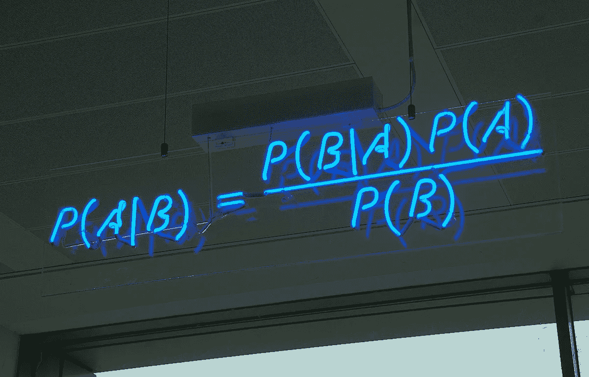
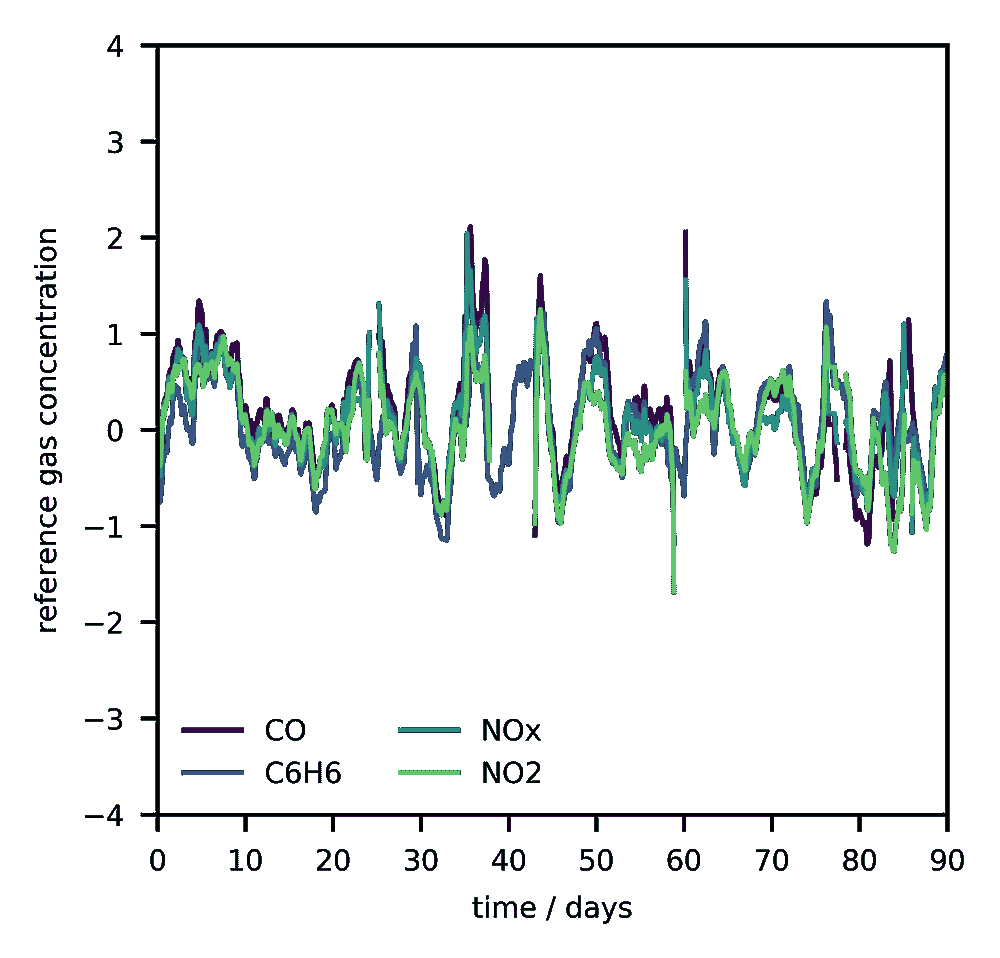
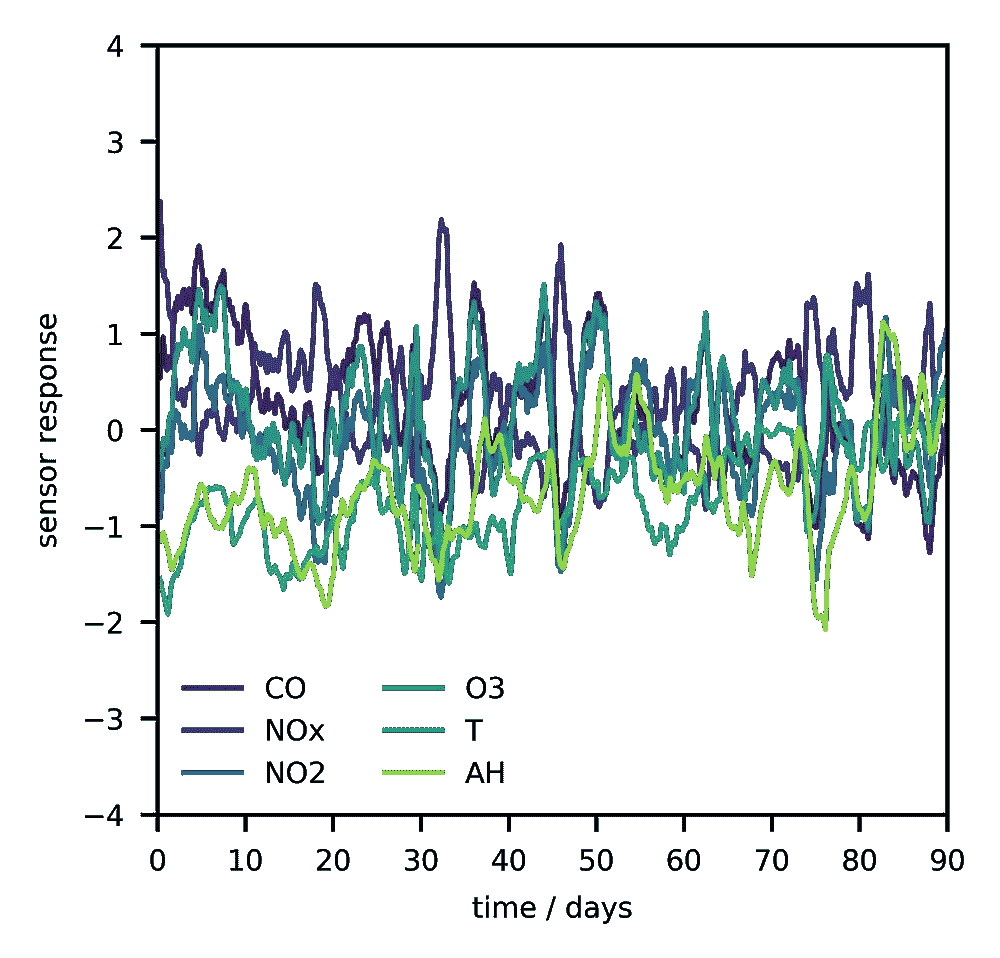
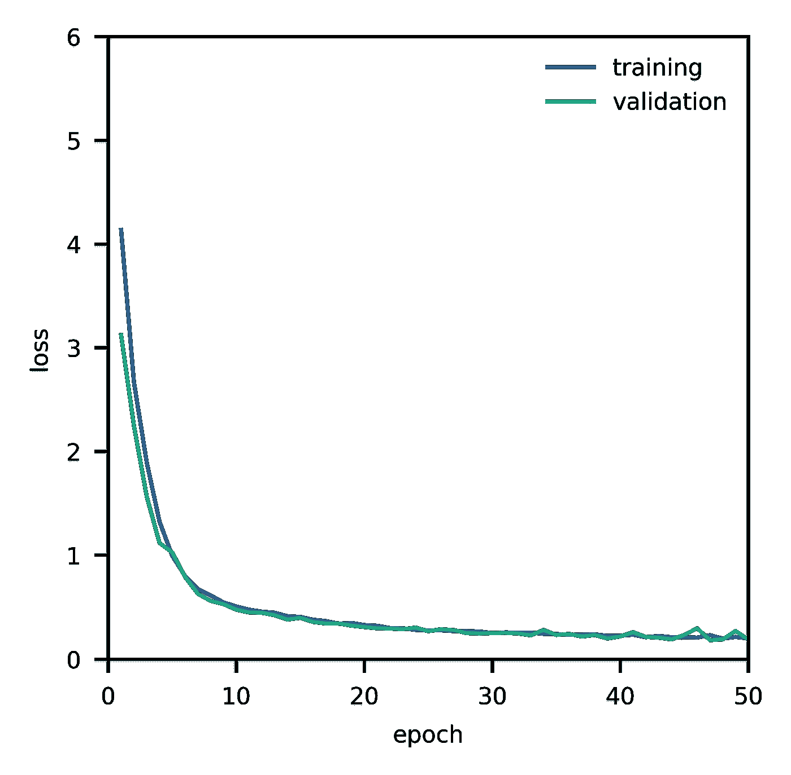
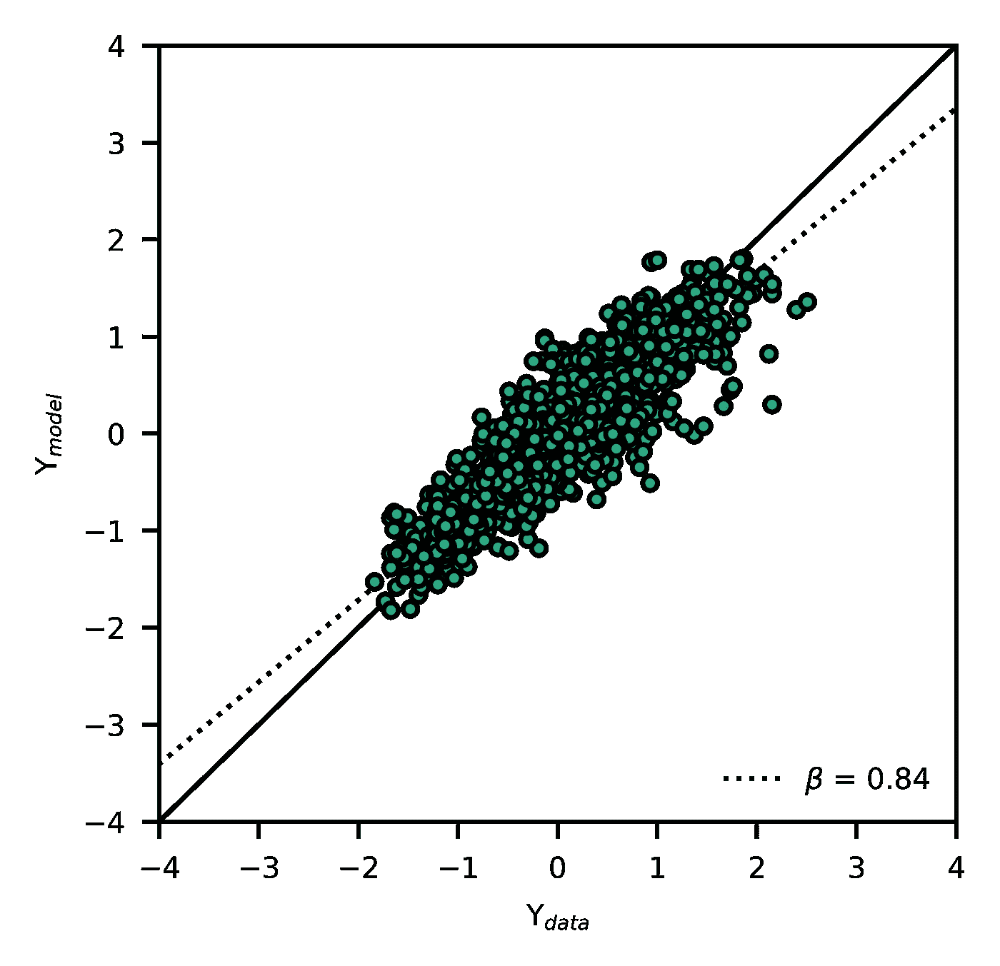
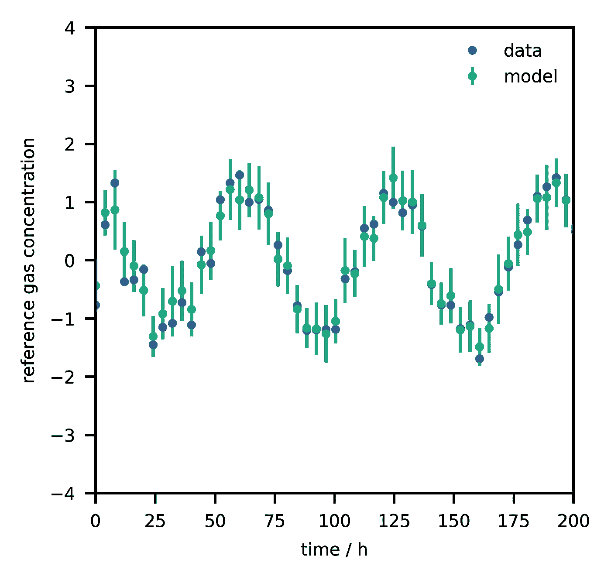

# 具有张量流概率的贝叶斯神经网络

> 原文：<https://towardsdatascience.com/bayesian-neural-networks-with-tensorflow-probability-fbce27d6ef6?source=collection_archive---------2----------------------->

## 概率模型不确定性预测的逐步指南。



图片 via [维基百科](https://en.wikipedia.org/wiki/Bayes%27_theorem)。

# 介绍

[**机器学习**](https://en.wikipedia.org/wiki/Machine_learning) 模型通常从数据开发为 [**确定性**](https://en.wikipedia.org/wiki/Deterministic_system) 机器，其使用通过 [**最大似然**](https://en.wikipedia.org/wiki/Maximum_likelihood_estimation) 方法计算的参数权重的**点估计**来映射输入到输出。然而，在后台有很多统计上的侥幸。例如，数据集本身是来自叠加了加性噪声的未知分布的任意大小的点的有限随机集合，并且对于这种特定的点集合，不同的模型(即不同的参数组合)可能是合理的。因此，对于正在进行的参数和预测，存在一些 [**不确定性**](https://en.wikipedia.org/wiki/Uncertainty_quantification) 。 [**贝叶斯统计**](https://en.wikipedia.org/wiki/Bayesian_statistics) 提供了一个框架来处理所谓的[](https://asmedigitalcollection.asme.org/IDETC-CIE/proceedings-abstract/IDETC-CIE2013/55997/V008T13A019/256671)****不确定性，随着 [**张量流概率**](https://www.tensorflow.org/probability/) 、 [**概率建模**](https://en.wikipedia.org/wiki/Statistical_model) 的发布，这已经变得容易多了，我将在这篇文章中演示。要知道不会提供任何理论背景；关于这个话题的理论，我真的可以推荐 Gelman 等人的书《贝叶斯数据分析》,这本书是免费的 PDF 文件。****

****[](http://www.stat.columbia.edu/~gelman/book/) [## “贝叶斯数据分析”这本书的主页

### 这是本书的 pdf 格式，可以下载用于非商业目的。

www.stat.columbia.edu](http://www.stat.columbia.edu/~gelman/book/) 

# 贝叶斯神经网络

[**贝叶斯神经网络**](https://arxiv.org/abs/1801.07710) 的特征在于其在权重(参数)和/或输出上的分布。取决于是否考虑了听觉的、认知的或两者都考虑的不确定性，贝叶斯神经网络的代码看起来略有不同。为了演示工作原理，来自 De Vito 的[空气质量](http://archive.ics.uci.edu/ml/datasets/Air+Quality)数据集将作为一个例子。它包含来自不同污染物化学传感器的数据(如电压)以及作为一年时间序列的参考数据，这些数据是在一个汽车交通繁忙的意大利城市的主要街道上收集的，目标是构建从传感器响应到参考浓度的映射(图 1)，即构建一个校准函数作为 [**回归**](https://en.wikipedia.org/wiki/Regression_analysis) 任务。



**图 1:** 参考和传感器数据。注意参考数据中的相关性。(图片由作者提供)

# 启动

如果您还没有安装 TensorFlow Probability，您可以使用 pip 来完成，但是在此之前创建一个虚拟环境可能是一个好主意。(由于命令在以后的版本中可能会改变，您可能希望安装我用过的那些。)

```
**# Install libraries.**pip install tensorflow==2.1.0
pip install tensorflow-probability==0.9.0
```

打开你最喜欢的编辑器或者 JupyterLab。导入所有必要的库。

```
**# Load libriaries and functions.**import pandas as pd
import numpy as np
import tensorflow as tf
tfk = tf.keras
tf.keras.backend.set_floatx("float64")
import tensorflow_probability as tfp
tfd = tfp.distributions
from sklearn.preprocessing import StandardScaler
from sklearn.ensemble import IsolationForest**# Define helper functions.**scaler = StandardScaler()
detector = IsolationForest(n_estimators=1000, behaviour="deprecated", contamination="auto", random_state=0)
neg_log_likelihood = lambda x, rv_x: -rv_x.log_prob(x)
```

接下来，获取数据集(链接可以在上面找到)并将其作为熊猫数据框架加载。由于传感器容易因老化而漂移，最好丢弃过去六个月的数据。

```
**# Load data and keep only first six months due to drift.**data = pd.read_excel("data.xlsx")
data = data[data["Date"] <= "2004-09-10"]
```

# 预处理

数据相当杂乱，必须先进行预处理。我们将关注大部分时间测量的输入和输出(一个传感器很早就死了)。删除缺少值的行后，对数据进行缩放。之后，使用 [**隔离林**](https://en.wikipedia.org/wiki/Isolation_forest) 检测并移除异常值。

```
**# Select columns and remove rows with missing values.**columns = ["PT08.S1(CO)", "PT08.S3(NOx)", "PT08.S4(NO2)", "PT08.S5(O3)", "T", "AH", "CO(GT)", "C6H6(GT)", "NOx(GT)", "NO2(GT)"]
data = data[columns].dropna(axis=0)**# Scale data to zero mean and unit variance.**X_t = scaler.fit_transform(data)**# Remove outliers.**is_inlier = detector.fit_predict(X_t)
X_t = X_t[(is_inlier > 0),:]**# Restore frame.**dataset = pd.DataFrame(X_t, columns=columns)**# Select labels for inputs and outputs.**inputs = ["PT08.S1(CO)", "PT08.S3(NOx)", "PT08.S4(NO2)", "PT08.S5(O3)", "T", "AH"]
outputs = ["CO(GT)", "C6H6(GT)", "NOx(GT)", "NO2(GT)"]
```

# 数据处理

TensorFlow 提供了一个 [**数据集类**](https://www.tensorflow.org/api_docs/python/tf/data/Dataset) 来构造训练集和测试集。我们将使用 70%的数据作为训练集。集合被混洗并且重复的批次被构造。

```
**# Define some hyperparameters.**n_epochs = 50
n_samples = dataset.shape[0]
n_batches = 10
batch_size = np.floor(n_samples/n_batches)
buffer_size = n_samples**# Define training and test data sizes.**n_train = int(0.7*dataset.shape[0])**# Define dataset instance.**data = tf.data.Dataset.from_tensor_slices((dataset[inputs].values, dataset[outputs].values))
data = data.shuffle(n_samples, reshuffle_each_iteration=True)**# Define train and test data instances.**data_train = data.take(n_train).batch(batch_size).repeat(n_epochs)
data_test = data.skip(n_train).batch(1)
```

# 模型结构

## 听觉不确定性

为了解决由输出中的噪声引起的听觉不确定性，密集图层与概率图层相结合。更具体地，输出的均值和协方差矩阵被建模为输入和参数权重的函数。第一个隐藏层应包括 10 个节点，第二个隐藏层需要 4 个节点用于均值，加上 10 个节点用于最终层中的四维(有 4 个输出)多元高斯后验概率分布的方差和协方差。这是通过使用[最后一层](https://www.tensorflow.org/probability/api_docs/python/tfp/layers/MultivariateNormalTriL) ( `MultivariateNormalTriL`)的`params_size` [方法](https://www.tensorflow.org/probability/api_docs/python/tfp/layers/MultivariateNormalTriL#params_size)来实现的，这是 [**后验概率分布**](https://en.wikipedia.org/wiki/Posterior_probability) 结构的声明，在这种情况下是多元正态分布，其中仅估计了协方差矩阵的一半(由于对称性)。模型中的参数总数为 224 个——由 [**变分法**](https://en.wikipedia.org/wiki/Variational_Bayesian_methods) 估算。这个神经网络的[确定性版本由一个输入层、十个](https://github.com/gtancev/sensors/blob/master/NN_tf_keras/main_deterministic.ipynb) [**潜变量**](https://en.wikipedia.org/wiki/Latent_variable) (隐藏节点)和一个输出层(114 个参数)组成，其中不包括参数权重的不确定性。

```
**# Define prior for regularization.**prior = tfd.Independent(tfd.Normal(loc=tf.zeros(len(outputs), dtype=tf.float64), scale=1.0), reinterpreted_batch_ndims=1)**# Define model instance.**model = tfk.Sequential([
tfk.layers.InputLayer(input_shape=(len(inputs),), name="input"),
tfk.layers.Dense(10, activation="relu", name="dense_1"),
tfk.layers.Dense(tfp.layers.MultivariateNormalTriL.params_size(
len(outputs)), activation=None, name="distribution_weights"),
tfp.layers.MultivariateNormalTriL(len(outputs), activity_regularizer=tfp.layers.KLDivergenceRegularizer(prior, weight=1/n_batches), name="output")
], name="model")**# Compile model.**model.compile(optimizer="adam", loss=neg_log_likelihood)**# Run training session.**model.fit(data_train, epochs=n_epochs, validation_data=data_test, verbose=False)**# Describe model.**model.summary()
```

`activity_regularizer` [参数](https://www.tensorflow.org/probability/api_docs/python/tfp/layers/KLDivergenceRegularizer)作为输出层的先验(权重必须根据批次数进行调整)。根据您机器的规格，培训可能需要一段时间。该算法需要大约 50 个历元才能收敛(图 2)。



**图 2:** 有训练和验证损失的学习曲线。(图片由作者提供)

## 听觉和认知的不确定性

考虑到听觉和认知的不确定性(参数权重的不确定性)，密集层必须与 [**翻转**](https://arxiv.org/abs/1803.04386) 层(`DenseFlipout`)或 [**变化**](https://www.tensorflow.org/probability/api_docs/python/tfp/layers/DenseVariational) 层(`DenseVariational`)交换。这种模型有更多的参数，因为每个权重都由具有非共享平均值和标准偏差的正态分布来参数化，因此参数权重的数量加倍。对于不同的预测，权重将被重新采样，在这种情况下，贝叶斯神经网络将表现得像一个 [**集合**](https://en.wikipedia.org/wiki/Ensemble_learning) 。

```
tfp.layers.DenseFlipout(10, activation="relu", name="dense_1")
```

权重的默认先验分布是`tfd.Normal(loc=0., scale=1.)`，可以使用`kernel_prior_fn` [参数](https://www.tensorflow.org/probability/api_docs/python/tfp/layers/DenseFlipout)进行调整。

# 预言；预测；预告

因为是概率模型，所以执行 [**蒙特卡罗实验**](https://en.m.wikipedia.org/wiki/Monte_Carlo_method) 来提供预测。特别是，样本 *x* 的每一次预测都会产生不同的输出 *y* ，这就是为什么必须计算许多单独预测的期望值。此外，可以通过这种方式确定方差。

```
**# Predict.**samples = 500
iterations = 10
test_iterator = tf.compat.v1.data.make_one_shot_iterator(data_test)
X_true, Y_true, Y_pred = np.empty(shape=(samples, len(inputs))), np.empty(shape=(samples, len(outputs))), np.empty(shape=(samples, len(outputs), iterations))
for i in range(samples):
    features, labels = test_iterator.get_next()
    X_true[i,:] = features
    Y_true[i,:] = labels.numpy()
    for k in range(iterations):
        Y_pred[i,:,k] = model.predict(features)

**# Calculate mean and standard deviation.**Y_pred_m = np.mean(Y_pred, axis=-1)
Y_pred_s = np.std(Y_pred, axis=-1)
```

图 3 显示了所有输出的测量数据与预测值的对比。 [**决定系数**](https://en.wikipedia.org/wiki/Coefficient_of_determination) 约为 0.86，**斜率**为 0.84——不算太差。



**图 3:** 测量值与预测值的一致性。(图片由作者提供)

预测的不确定性可以通过绘制误差线和期望值来可视化(图 4)。在这种情况下，误差棒是标准偏差的 1.96 倍，即占概率的 95%。



**图 4:** 数据与预测的比较。(图片由作者提供)

理论上，由于额外的不确定性信息，贝叶斯方法优于确定性方法，但由于其高计算成本，并不总是可行的。最近的研究围绕着开发新的方法来克服这些限制。

[](/uncertainty-quantification-of-predictions-with-bayesian-inference-6192e31a9fa9) [## 用贝叶斯推理量化预测的不确定性

### 贝叶斯统计最重要的特征之一。

towardsdatascience.com](/uncertainty-quantification-of-predictions-with-bayesian-inference-6192e31a9fa9)****