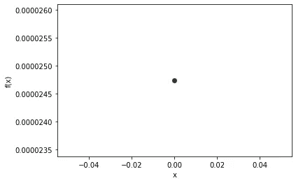
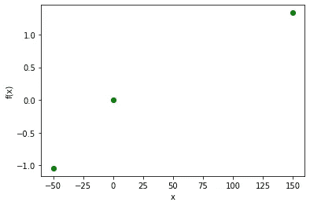
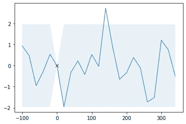
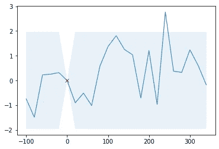
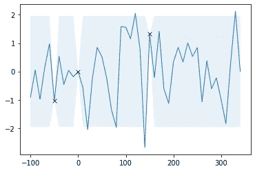
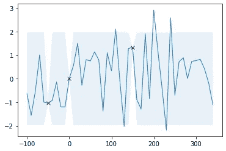
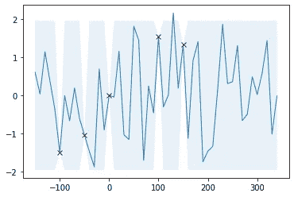
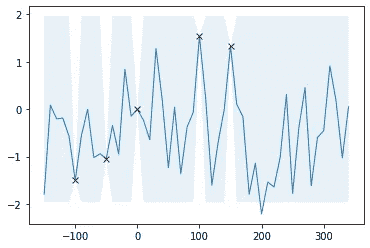
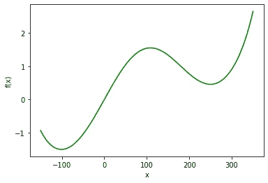

# 贝叶斯优化——第一部分

> 原文：<https://towardsdatascience.com/bayesian-optimization-an-intuitive-explanation-130e97fa4e18?source=collection_archive---------30----------------------->

## 一个直观的，没有数学的介绍

马里乌斯·马萨拉尔在 [Unsplash](/s/photos/machine-learning?utm_source=unsplash&utm_medium=referral&utm_content=creditCopyText) 上的照片

**优化是现代机器学习的核心**。为什么？线性回归，最小化误差平方和。逻辑回归，最小化负面可能性。支持向量机，最小化两个支持向量之间的负距离。

让我们用更简单的术语来理解[优化](https://en.wikipedia.org/wiki/Mathematical_optimization)，而不是用数学定义和等式来解释。“今天是这个月的最后一天，你只剩下 30 美元了。你渴望吃一些美味的食物。你想在比萨(每块 5 美元)、汉堡(每块 3 美元)和可乐(每块 1 美元)中至少选择一种。你不能吃超过 4 个披萨，至少要两个汉堡”。这就对了。现实生活中的优化问题:在某些约束条件下最大化或最小化目标函数

上述问题是[线性](https://en.wikipedia.org/wiki/Linear_programming)还是[非线性优化](https://en.wikipedia.org/wiki/Nonlinear_programming)？线性优化涉及仅由线性项(或一次项)组成的目标函数，如果它有任何二次项或非线性方程，则它是非线性优化。

在本文中，我们将只关注非线性优化范例——解决这些问题比解决线性问题要复杂得多..

我们来玩个游戏吧！有一个函数 f(x)，我就不透露了。这个函数接受实数。任务是这样的:你必须在区间[-150，350]内逼近函数的最小(最低)值。我会告诉你你问的任意 x 值的函数值。但是这里有一个问题，你只有有限的请求，确切地说，只有 5 个。在-150 和 350 之间有无限个实数，所以要小心选择。

假设您的第一个问题是简单明了的 0。

任何理性的人都会选择一个正数和一个负数，所以让我代表你们来做。我将在 x = 150 和 x=-50 时分享 f(x)

那是一组有趣的点，不是吗？你和我想的一样吗？选择-50 附近的下一个点，检查我们的函数是否在那里有最小值？用最优化的术语来说就是叫做 ***剥削*** 。这就像，当你知道与其他值相比，某一点的函数值接近我们想要的值时，你会继续利用那个区域。我不想浪费我最后的两次机会。可能在 0 到 100 之间，我可能有我们想要的值，这个区域我们还没有探索过。在优化术语中，这被称为 ***探索*** ，你已经知道你的函数对于几个值输出什么，所以我们将探索新的区域来找到我们想要的值，而不是利用已知的值。**一个好的优化算法应该在探索和利用之间取得平衡**。

讨论完以上内容，让我们使用最后两种猜测:一种是利用，一种是探索。让我们把 x 作为-100 和 100。

开发得到了回报，我们现在在 x=-100 处有一个最小值(相对于我们所做的 5 次猜测),但是我们仍然不知道它是否是真正的最小值。

这种智能地选择迭代中的下一个点来寻找所需值的现象就是贝叶斯优化优雅地做的事情。

没有太多的数学知识，我将尝试使用图形来解释它如何评估。最后一次，我保证没有数学。

一个有效的优化算法如何计算函数在哪里有最小值？它必须遍历给定范围内的所有值，并评估每个值的函数值——就像网格搜索一样。这是非常繁琐和非常不准确的，尤其是如果它是一个多元函数或一个有许多局部最小值。

现在，我们将看到贝叶斯优化是如何处理人类的思维方式，但在统计意义上。

所以，当我给定第一个输入为 x=0 时，我们得到了对应的 f(x)值。贝叶斯优化使用[高斯过程](https://en.wikipedia.org/wiki/Gaussian_process)来模拟通过该点的不同函数。什么是高斯过程？这超出了本文的范围(可能是下一篇)。但是现在，想象你在空间中有一个点，我要求你画出通过这个点的各种线。

不同的人有不同的想象力

如果你仔细观察，会发现有一个浅蓝色的阴影，它非常亮，你可能看不到，但你仍然会想，为什么在我们知道的输出值下，它不存在？这是我对我画的图的信心，也就是说，我对实际函数的图看起来像这样没有信心，但是如果你看到在已知值处我没有任何方差，这是因为我知道 f(x)在该点的确切值。

现在，当我们得到新的值时，让我们运用我们的想象力和近似图。

当我们得到 f(x)在 x=-50，150 处的值时，就可以近似得到这个图

当我们得到 f(x)在 x=-100，100 处的值时，就可以近似得到这个图

早些时候我告诉你，我已经用我的想象力绘制了上面穿过我们猜测的点的怪异线条，对吗？“我在某种程度上使用高斯过程来模拟曲线。这样，贝叶斯优化在每个新值之后逼近函数图。基于以前的值选择下一个点的智能方法是通过所谓的获取函数，它在探索和利用之间取得了良好的平衡。这只是一个直观的介绍为什么你应该选择贝叶斯优化，我希望你对它的工作原理有所了解。为了深入理解它，我们需要数学，就像我将在后续文章中尝试涉及的许多数学一样。

最后，我给出了我们试图找出最小值的图表，

如需任何澄清/反馈，或者如果您想在数据科学项目上进行合作，请通过 LinkedIn 联系我

在深入贝叶斯之前，我建议你精通传统的优化方法，比如牛顿拉夫森，你可以在这里找到我的文章，[牛顿拉夫森第一部分](https://www.linkedin.com/pulse/newton-raphson-part-1-harsha-vardhan/)，[第二部分](https://www.linkedin.com/pulse/newton-raphson-part-2-harsha-vardhan/)，[第三部分](https://www.linkedin.com/pulse/newton-raphson-part-3-harsha-vardhan/)

参考资料:

[https://arxiv.org/abs/1012.2599](https://arxiv.org/abs/1012.2599)