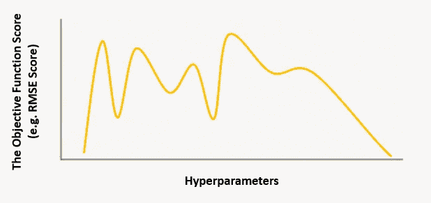
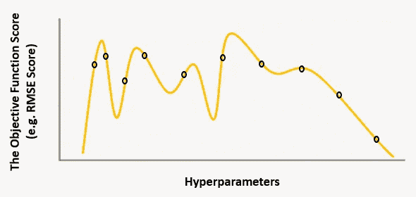
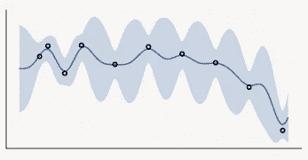
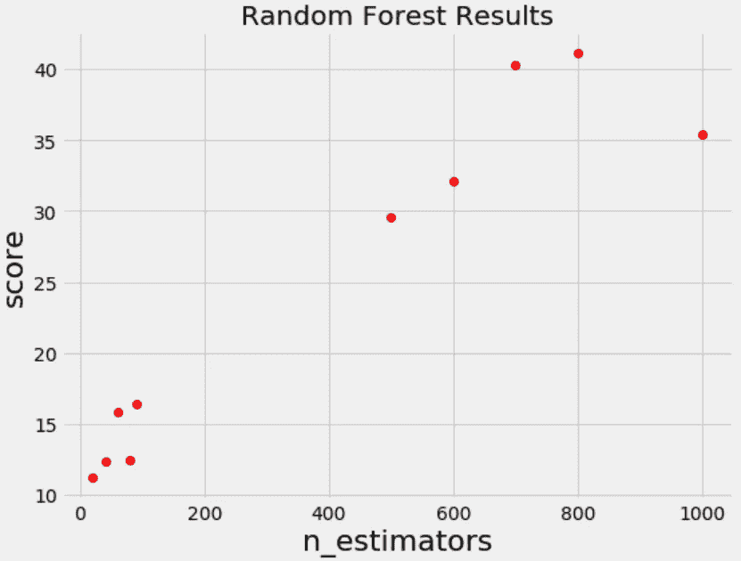

# 用通俗的语言解释贝叶斯优化概念

> 原文：<https://towardsdatascience.com/bayesian-optimization-concept-explained-in-layman-terms-1d2bcdeaf12f?source=collection_archive---------7----------------------->

由 [kazuend](https://unsplash.com/@kazuend?utm_source=unsplash&utm_medium=referral&utm_content=creditCopyText) 在 [Unsplash](https://unsplash.com/s/photos/forest?utm_source=unsplash&utm_medium=referral&utm_content=creditCopyText) 拍摄的照片

## 假人的贝叶斯优化

贝叶斯优化已经广泛用于机器学习领域的超参数调整。尽管涉及到许多术语和数学公式，但背后的概念却非常简单。这篇文章的目标是分享我所学到的贝叶斯优化与教科书术语的直白解释，并希望，它将帮助你在短时间内理解什么是贝叶斯优化。

# 超参数优化综述

为了文章的完整性，让我们从超参数优化方法的基本概述开始，一般有 4 种类型:

手动搜索、随机搜索、网格搜索和贝叶斯优化

贝叶斯优化不同于随机搜索和网格搜索，因为它使用过去的性能来提高搜索速度，而其他两种方法是统一的(或独立于)过去的评估。在这个意义上，贝叶斯优化就像手动搜索。假设您正在手动优化随机森林回归模型的超参数。首先，你将尝试一组参数，然后查看结果，改变其中一个参数，重新运行，并比较结果，这样你就知道你是否朝着正确的方向前进。贝叶斯优化做类似的事情——你过去的超参数的性能影响未来的决策。相比之下，在确定要评估的新超参数时，随机搜索和网格搜索不考虑过去的性能。因此，贝叶斯优化是一种更有效的方法。

# 贝叶斯优化的工作原理

让我们继续使用优化随机森林回归模型的超参数的例子。假设我们想找到一组使 RMSE 最小的超参数。这里，计算 RMSE 的函数被称为**目标函数**。如果我们知道我们的目标函数的概率分布，(简单地说，如果我们知道目标函数的形状)，那么我们可以简单地计算梯度下降并找到全局最小值。然而，由于我们不知道 RMSE 分数的分布(这实际上是我们试图找出的)，我们需要贝叶斯优化来帮助我们破译这个黑盒模型。

那么什么是贝叶斯优化呢？

> 贝叶斯优化建立目标函数的概率模型，并使用它来选择超参数以评估真实的目标函数。

这句话听起来可能很复杂，但实际上传达了一个简单的信息。让我们来分解一下:

> **“贝叶斯优化建立目标函数的概率模型”**

真正的目标函数是固定的函数。假设它看起来像图 1，但正如我提到的，在超参数调谐的开始，我们不知道这一点。

图 1:真正的目标函数

如果有无限的资源，我们将计算目标函数的每一个点，以便我们知道它的实际形状(在我们的例子中，一直调用随机森林回归模型，直到我们得到所有可能的超参数组合的 RMSE 分数)。然而，那是不可能的。假设我们只有来自真实目标函数的 10 个样本，如图 2 中的黑色圆圈所示:

图 2:真实目标函数的 10 个样本

使用这 10 个样本，我们需要建立一个**代理模型**(也称为响应面模型)来逼近真正的目标函数。请看图 3。代理模型用蓝线表示。蓝色阴影代表偏差。

图 3:启动代理模型

**根据定义，代理模型是“目标函数的概率表示”**，本质上是在*(超参数，真实目标函数得分)*对上训练的模型。数学上是 *p(目标函数得分|超参数)*。有不同的方法来构造代理模型，但是我稍后将回到这一点。

> **"并使用它来选择超参数"**

现在我们有目标函数的 10 个样本，我们应该如何决定将哪个参数作为第 11 个样本？我们需要构建一个**采集函数**(也称为选择函数)。下一个选择的超参数是采集函数最大化的地方。在图 4 中，绿色阴影是采集函数，红色直线是采集函数最大化的位置。因此，相应的超参数及其目标函数得分(用红圈表示)被用作更新替代模型的第 11 个样本。

图 4:最大化采集功能以选择下一个点

> **“在真实目标函数中进行评估”**

如上所述，在使用获取函数来确定下一个超参数之后，获得这个新的超参数的真实目标函数分数。由于代理模型已经在*(超参数，真实目标函数得分)*对上训练，添加新的数据点更新代理模型。

…重复上述步骤，直到达到最大时间或最大迭代次数。然后嘣！您现在(希望)有了真实目标函数的精确近似值，并且可以很容易地从过去评估的样本中找到全局最小值。你的贝叶斯优化完成！

# 放在一起

总结一下，我们来看下面图 5 中的伪代码，它来自[这篇论文](https://papers.nips.cc/paper/4443-algorithms-for-hyper-parameter-optimization.pdf):

图 5:基于通用顺序模型优化的伪代码

这里，SMBO 代表**基于序列模型的优化**，这是贝叶斯优化的另一个名字。它是“顺序的”,因为添加超参数是为了逐个更新代理模型；它是“基于模型”的，因为它用一个评估起来更便宜的替代模型来近似真实的目标函数。

伪代码中的其他表示:

*H :(超参数，得分)对的观察历史
T:最大迭代次数
f:真实目标函数(在我们的例子中，RMSE 函数)
M:代理函数，每当添加新样本时更新
S:采集函数
x*:下一个选择的要评估的超参数*

让我们再来一遍这个循环。

*   首先，启动一个代理模型和一个获取函数。
*   第 3 行:然后对于每次迭代，找到采集函数最大化的超参数 *x** 。获取函数是代理模型的一个函数，意思是使用代理模型而不是真正的目标函数构建的(继续读，你就知道是什么意思了)。注意，这里的伪代码显示 *x** 是在采集函数最小化时获得的，而我一直说采集函数应该最大化。最大化或最小化都取决于如何定义采集函数。如果你使用的是最常见的获取函数——预期改善，那么你应该最大化它。
*   第 4 行:获得 *x** 的目标函数分数，看看这一点实际表现如何
*   第 5 行:将*(超参数 x*，真实目标函数得分)*包含在其他样本的历史中
*   第 6 行:使用样本的最新历史来训练代理模型

重复直到达到最大迭代次数。最终返回*(超参数，真实目标函数得分)*的历史。请注意，最后一项记录不一定是最好的成绩。您必须对分数进行排序，以找到最佳超参数。

# 不同类型的代理模型和获取函数

我将只给出常用类型的一般描述，而不是进入代理模型和获取函数的数学细节。如果你有兴趣更多地了解获取函数如何与不同的代理模型一起工作，请查看这篇研究论文。

# 最常见的获取函数:预期改善

让我们从解释什么是获取函数开始，这样我们就可以解释每种类型的代理模型是如何被优化的。

最常见的获取函数是预期改善。该公式如下所示:

*p(y|x):* *代理模特。y 是真实的目标函数分数，x 是超参数*

*y*:目前观察到的最小真实目标函数分数*

*y:新分数*

预期的改进是建立在代理模型之上的，这意味着不同的代理模型将导致优化该获取函数的不同方式。我们将在下面的部分中讨论这一点。

# 最常见的代理模型:高斯过程模型

大多数研究论文使用高斯过程模型作为替代模型，因为它简单且易于优化。高斯过程直接建模 P(y|x)。它使用*(超参数，真实目标函数得分)的历史作为(x，y)* 来构造多元高斯分布。

为了最大化高斯过程模型的预期改进结果，新的分数应该小于当前的最小分数 *(y < y*)* ，以便 *max(y* — y，0)* 可以是一个大的正数。

让我们来看看图 6 中的一个具体例子(我借用了[这篇文章](/a-conceptual-explanation-of-bayesian-model-based-hyperparameter-optimization-for-machine-learning-b8172278050f)):

图 6:分数与超参数的虚拟示例

假设在图 6 中最低分= 12，那么 y* = 12。预期改善函数将关注不确定性高且均值函数接近或低于 y*的区域。使用多元高斯分布产生最高预期改进的 n 个估计量将被用作真实目标函数的下一个输入。

# 替代代理模型:树 Parzen 估计量(TPE)

在一些 python 包(例如 hyperopt 库)中实现的另一个代理模型是 TPE。首先回忆一下下面显示的贝叶斯规则:

高斯过程直接建模 *p(y|x)* ，而 TPE 建模 *p(x|y)* ，这是给定目标函数得分的超参数的概率分布。

让我们继续以图 7 为例。TPE 算法不是选择 y* = 12 作为高斯过程，而是选择 y*作为观察到的 y 值的某个分位数γ，使得 p(y < y*) = γ. In other words, TPE chooses y* to be some number that’s a bit higher than the best-observed score so that it can separate the current observations into two clusters: better than y* and worse than y*. See Fig 7 as an illustration.

Fig 7: The black dash line is the selected y*

Given the separate scores, TPE then constructs separate distributions for the hyperparameters. Thus p(x|y) is written as:

where l(x) is the distribution of the hyperparameters when the score is lower than the threshold y* and g(x) is the distribution when the score is higher than y*.

The Expected Improvement formula for TPE is then changed to:

and after some math transformation, it becomes:

The end formula means that to yield a high Expected Improvement, points with high probability under l(x) and low probability under g(x), should be chosen as the next hyperparameter. This meets our intuition that the next hyperparameter should come from the area under the threshold rather than the area above the threshold. To learn more about the TPE surrogate model, refer to [本文](/a-conceptual-explanation-of-bayesian-model-based-hyperparameter-optimization-for-machine-learning-b8172278050f)或[本文](https://papers.nips.cc/paper/4443-algorithms-for-hyper-parameter-optimization.pdf)。

# 摘要、参考资料和进一步阅读

在本文中，我以一种简单明了的方式解释了贝叶斯优化的概念。对于那些想了解更多信息的人来说，以下是我认为有用的资源列表:

*   [*对机器学习的贝叶斯超参数优化的概念性解释*](/a-conceptual-explanation-of-bayesian-model-based-hyperparameter-optimization-for-machine-learning-b8172278050f) :另一篇着重解释 TPE 方法的中型文章
*   [*超参数优化算法*](https://papers.nips.cc/paper/4443-algorithms-for-hyper-parameter-optimization.pdf) :一篇很棒的研究论文详细解释了期望改善优化在高斯过程和 TPE 中是如何工作的。
*   [*机器学习的贝叶斯方法*](https://www.youtube.com/watch?v=u6MG_UTwiIQ) :一段 10 分钟的 YouTube 短片，介绍了其他类型的采集函数
*   [*扩展、应用和其他杂项的贝叶斯优化*](https://www.youtube.com/watch?v=C5nqEHpdyoE) :一个 1 小时 30 分钟的讲座记录，详细介绍贝叶斯优化的概念，包括不同类型的代理模型和获取函数背后的数学。整个讲座可能太专业了，难以理解，但至少视频的前半部分对理解概念很有帮助。

好吧，就这样！恭喜你一路跟随我来到这里！我希望我的文章能在某种程度上把你从与贝叶斯优化相关的大量术语和数学中解救出来。有关问题和评论，让我们连线 [Linkedin](https://www.linkedin.com/in/wiw5087/) 和 [Twitter](https://twitter.com/WeiW5087) 。