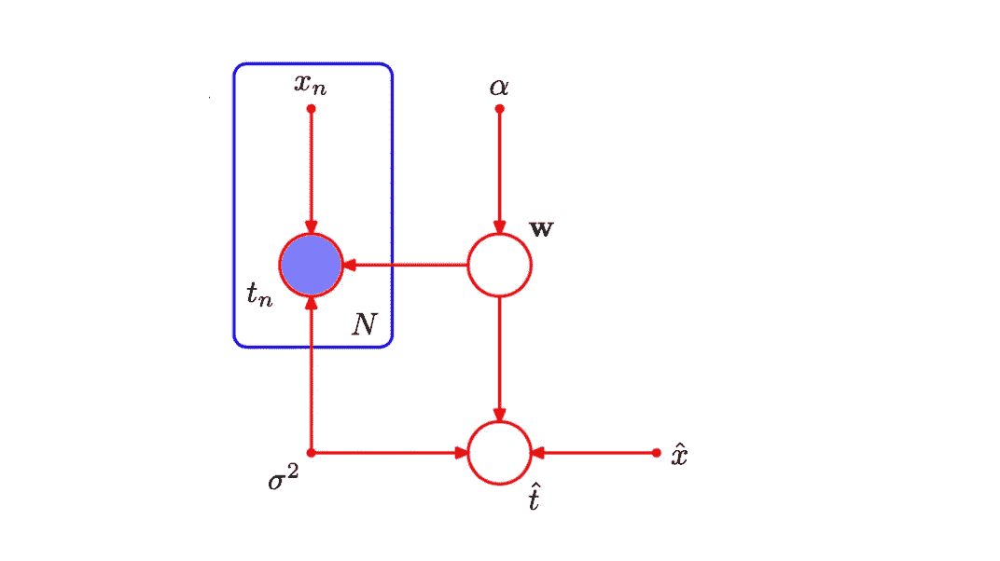
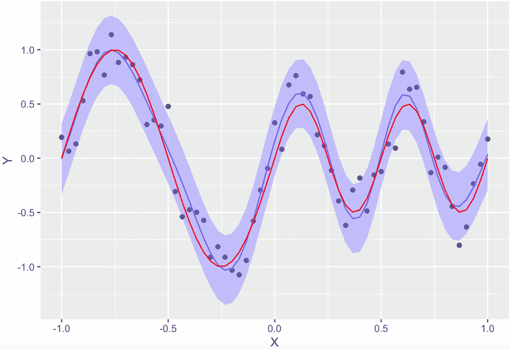

# 贝叶斯回归及其 R 语言实现

> 原文：<https://towardsdatascience.com/bayesian-regression-with-implementation-in-r-fa71396dd59e?source=collection_archive---------16----------------------->

## 从零开始的理论推导，R 实现，以及贝叶斯观点的讨论



显示回归中变量之间依赖关系的概率图形模型(Bishop 2006)

可以从贝叶斯的角度建立和解释线性回归。第一部分从头开始讨论理论和假设，后面的部分包括 R 实现和备注。读者可以随意地将这两个代码块复制到 R 笔记本中，并对其进行研究。

# 从基础开始

回想一下，在线性回归中，给我们目标值 **y** ，数据 **X，**，我们使用模型


其中 y 为 N*1 向量，X 为 N*D 矩阵，w 为 D*1 向量，误差为 N*1 向量。我们有 N 个数据点。维数 D 是用特征来理解的，所以如果我们用一个 x 的列表，一个 x 的列表(和一个 1 的列表对应 w_0)，我们说 D=3。如果你不喜欢矩阵的形式，就把它想成是以下内容的浓缩形式，其中所有东西都是一个标量，而不是向量或矩阵:


在经典的线性回归中，误差项被假设为正态分布，因此可以直接得出 **y** 正态分布，均值 **Xw** ，以及误差项具有的任何方差的方差(用σ表示，或具有σ项的对角矩阵)。正态假设在大多数情况下证明是正确的，这个正态模型也是我们在贝叶斯回归中使用的。

# 参数推断

我们现在面临两个问题:对 w 的推断和对任何新 x 的 y 的预测。使用众所周知的贝叶斯规则和上述假设，我们不仅可以解决这两个问题，还可以给出任何新 x 的 y 的全概率分布。下面是使用我们的符号的贝叶斯规则，它表示给定数据的参数 w 的后验分布:


π和 f 是概率密度函数。由于结果是 w 的函数，我们可以忽略分母，因为分子与左边的常数成正比。我们从假设中知道，似然函数 f(y|w，x)遵循正态分布。另一项是 w 的先验分布，顾名思义，这反映了参数的先验知识。

**先验分布。定义先验是贝叶斯工作流程中一个有趣的部分。为了方便起见，我们设 w ~ N(m_o，S_o)，超参数 m 和 S 现在反映了 w 的先验知识。如果你对 w 知之甚少，或者发现 m 和 S 的任何赋值太主观，“无信息”先验是一种修正。在这种情况下，我们将 m 设置为 0，更重要的是将 S 设置为具有非常大的值的对角矩阵。我们说 w 有很高的方差，所以我们不知道 w 会是什么。**

在定义了所有这些概率函数之后，几行简单的代数运算(实际上相当多行)将给出 N 个数据点观察后的后验概率:


它看起来像一堆符号，但它们都已经被定义了，一旦这个理论结果在代码中实现，你就可以计算这个分布。(N(m，S)表示具有均值 m 和协方差矩阵 S 的正态分布。)

# 预测分布

完全贝叶斯方法不仅意味着获得单个预测(用 y_o，x_o 表示新的一对数据)，还意味着获得这个新点的分布。


我们所做的是从第一行的联合边缘化得到边缘分布的反向操作，并在第二行的积分中使用贝叶斯规则，在那里我们也删除了不必要的相关性。注意，我们知道最后两个概率函数是什么。完全预测分布的结果是:


# R 中的实现

用 R 实现相当方便。在上述理论结果的支持下，我们只需将矩阵乘法输入到代码中，即可获得预测和预测分布的结果。为了举例说明，我们使用了一个玩具问题:X 是从-1 到 1，均匀分布，y 被构造为以下具有正常噪声的正弦曲线的加法(见下图中 y 的图示)。


下面的代码获取这些数据。

```
library(ggplot2)

*# — — — — — Get data — — — — — — — — — — — — — — — — — — — — —+*X <- (-30:30)/30 
N <- length(X) 
D <- 10 
var <- 0.15*0.15 
e <- rnorm(N,0,var^0.5) 
EY <- sin(2*pi*X)*(X<=0) + 0.5*sin(4*pi*X)*(X>0) 
Y <- sin(2*pi*X)*(X<=0) + 0.5*sin(4*pi*X)*(X>0) + e 
data <- data.frame(X,Y) 
g1 <- ggplot(data=data) + geom_point(mapping=aes(x=X,y=Y))
```

下面的代码(在“推断”一节中)实现了上述理论结果。我们还扩展了 X 的特性(在代码中表示为 phi_X，在构造基函数一节中)。就像我们将 x 展开成 x，等等。，我们现在将其扩展为 9 个径向基函数，每个函数如下所示。请注意，尽管这些看起来像正态密度，但它们并不被解释为概率。


径向基函数的一个优点是径向基函数可以拟合各种曲线，包括多项式和正弦曲线。

```
*# — — — — — Construct basis functions — — — — — — — — — — — —+*phi_X <- matrix(0, nrow=N, ncol=D)
phi_X[,1] <- X
mu <- seq(min(X),max(X),length.out=D+1)
mu <- mu[c(-1,-length(mu))]
for(i in 2:D){
 phi_X[,i] <- exp(-(X-mu[i-1])^2/(2*var))
}*# — — — — — Inference — — — — — — — — — — — — — — — — — — — —+**# Commented out is general prior
# m0 <- matrix(0,D,1)
# S0 <- diag(x=1000,D,D) 
# SN <- inv(inv(S0)+t(phi_X)%*%phi_X/var)
# mN <- SN%*%(inv(S0)%*%m0 + t(phi_X)%*%Y/var)
# Y_hat <- t(mN) %*% t(phi_X)**# We use non-informative prior for now*
m0 <- matrix(0,D,1)
SN <- solve(t(phi_X)%*%phi_X/var)
mN <- SN%*%t(phi_X)%*%Y/var
Y_hat <- t(mN) %*% t(phi_X)
var_hat <- array(0, N)
for(i in 1:N){
 var_hat[i] <- var + phi_X[i,]%*%SN%*%phi_X[i,]
}g_bayes <- g1 + 
             geom_line(mapping=aes(x=X,y=Y_hat[1,]),color=’#0000FF’)
g_bayes_full <- g_bayes + geom_ribbon(mapping=aes(x=X,y=Y_hat[1,],
                  ymin=Y_hat[1,]-1.96*var_hat^0.5,
                  ymax=Y_hat[1,]+1.96*var_hat^0.5, alpha=0.1),
                  fill=’#9999FF’)
```

在这些计算中需要注意的一个细节是，我们使用了非信息先验。注释掉的部分正是上面的理论结果，而对于非信息先验，我们使用对角元素接近无穷大的协方差矩阵，因此在此代码中，其倒数直接被视为 0。如果您想使用此代码，请确保您安装了 ggplot2 包用于绘图。

下图旨在展示完整的预测分布，并给出数据拟合程度的感觉。



蓝线是每个点 x 的预测分布的期望值，浅蓝色区域是指两个标准差以内的区域。红线是 y 的真函数，点是从给定函数中随机产生的数据，带有正态噪声。

# 评论

多元线性回归结果与使用具有无限协方差矩阵的不适当先验的贝叶斯回归的情况相同。一般来说，获得一些关于参数的经验知识，并使用信息丰富的先验知识是一种很好的做法。贝叶斯回归可以量化和显示不同的先验知识如何影响预测。在任何情况下，贝叶斯观点可以方便地将 y 预测的范围解释为概率，不同于从经典线性回归计算的置信区间。

从这个角度来看，数据拟合也让你很容易“边走边学”。假设我首先观察了 10000 个数据点，并计算了参数 w 的后验概率。之后，我设法获得了 1000 个数据点，而不是再次运行整个回归，我可以使用之前计算的后验概率作为这 1000 个点的先验。这个顺序过程产生的结果与再次使用全部数据的结果相同。我喜欢这个想法，因为它非常直观，因为学到的观点与以前学到的观点加上新的观察结果成正比，而且学习还在继续。一个笑话说，一个贝叶斯谁梦见一匹马，观察到一头驴，会称之为骡子。但是如果他对它进行更多的观察，最终他会说这确实是一头驴。