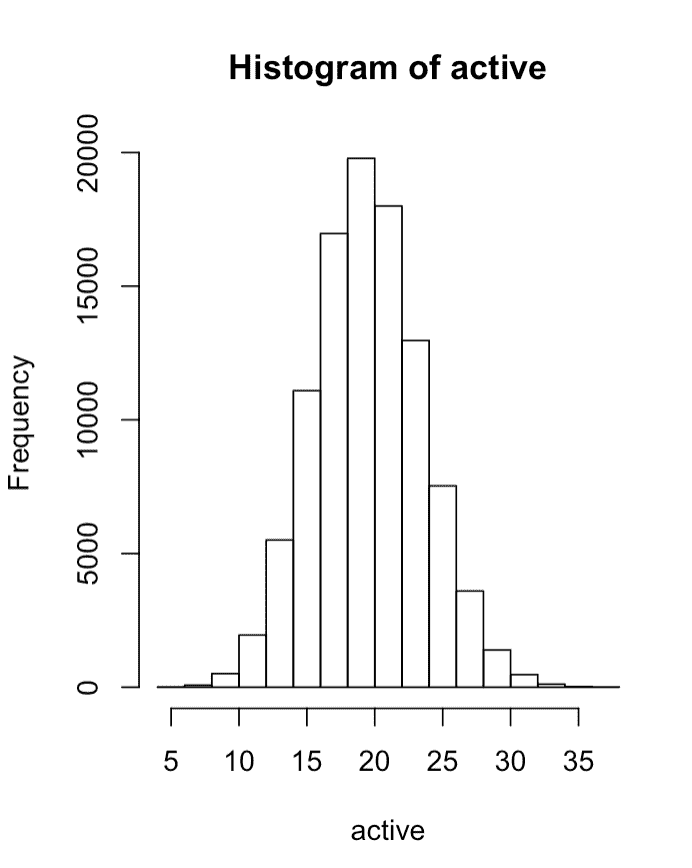
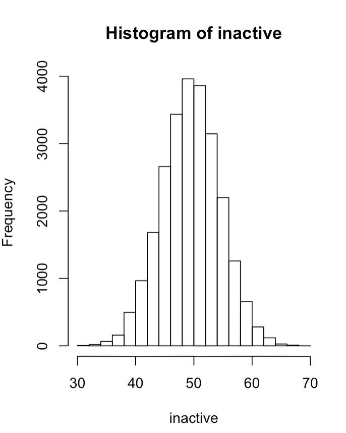
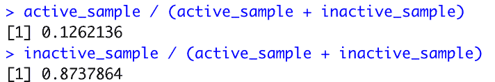
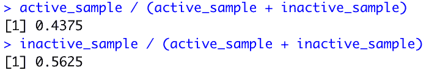

# 贝叶斯统计是每个数据科学家的必备

> 原文：<https://towardsdatascience.com/bayesian-statistics-are-a-must-for-every-data-scientist-d037908b3558?source=collection_archive---------28----------------------->


图片由 [jakob5200](https://pixabay.com/users/jakob5200-10067216/?utm_source=link-attribution&utm_medium=referral&utm_campaign=image&utm_content=5078866) 来自 [Pixabay](https://pixabay.com/?utm_source=link-attribution&utm_medium=referral&utm_campaign=image&utm_content=5078866)

# 数据科学核心的贝叶斯统计

数据科学深深植根于贝叶斯统计&我不会给出托马斯·贝叶斯爵士的历史背景，而是给你一个关于贝叶斯统计、贝叶斯定理以及如何在工作中利用它作为工具的高级视角！贝叶斯统计植根于数据科学的许多方面&机器学习具有这些原则的坚实基础是非常重要的。

# 贝叶斯定理的核心

贝叶斯定理背后的主要思想是，如果有一些与即将发生的事件相关的洞察力或知识。这种洞察力可以用来帮助描述该事件的可能结果。

考虑这一点的一种方法可能是在客户流失的情况下，因为它与客户活动有关。

# 我们的问题是什么？

为了把这个问题公式化成一个我们可以用贝叶斯定理解决的问题，明确我们的问题是什么是有帮助的。

所以你知道一个客户是否有过不愉快，但是根据这些信息，你想确定它属于你的活跃客户群还是不活跃客户群的可能性。因此，我们的问题可以表述为，“假设一个客户在搅动，它活跃的可能性有多大？”

所以现在我们需要弄清楚如何利用我们所知道的信息来找到答案。

让我们开始通过代码来概念化这一点。

# 我们来编码吧！

正如您将在下面看到的，我们将对每个场景执行 100K 次“抽取”,在每个场景中，我们对 100 名客户进行抽样调查以了解客户流失情况。第一个模拟将代表活跃客户的流失概率&第二个将代表不活跃客户；客户流失率分别为 20%和 50%。

```
active <- rbinom(100000, 100, .2) inactive <- rbinom(100000, 100, .5)
```

如果你对这些模拟的流失率取平均值，你会看到它们在`size`之前徘徊在`probability`附近。20 & 50 分别为。

让我们快速看一下每个模拟的结果分布。

```
hist(active)
```



```
hist(inactive)
```



如上所述，你可以知道分布集中在均值上，并且是正态分布的。

现在，让我们来看一下模拟流失率为 35 的场景。

```
active_sample <- sum(active == 35) 
inactive_sample <- sum(inactive == 35)active_sample / (active_sample + inactive_sample) 
inactive_sample / (active_sample + inactive_sample)
```



我们可以看到，在模拟代表活跃用户的情况下，只有 12.6%的抽奖与活跃用户相关，而这些抽奖实际上是非活跃用户的概率为 87.4%。

另外，看一下 35 值的直方图来巩固这个想法。尽管 35 对于这两种发行版来说都是极限，但它确实提供了一些额外的上下文。

# 考虑模拟之间的分布

到目前为止，我们已经在活跃客户和不活跃客户之间创建了一个均匀的模拟，但是假设我们没有一个活跃客户和不活跃客户的均匀分布。我们可以通过创建没有不同绘制计数的模拟来融入这一思想。

在这里，我们做同样的事情，但这次我们在两组之间重新创建了 80/20 的划分，即我们 80%的客户群是活跃的。

```
active <- rbinom(80000, 100, .2) 
inactive <- rbinom(20000, 100, .5)
```

现在，当我们像以前一样经历同样的过程时…

```
active_sample <- sum(active == 35) 
inactive_sample <- sum(inactive == 35)active_sample / (active_sample + inactive_sample) 
inactive_sample / (active_sample + inactive_sample)
```



我们实际上看到它是一个不活跃客户的概率大大下降。当然有充分的理由。我们已经根据以前活跃客户和不活跃客户的分布情况更新了我们的分析。

# 结论

关于贝叶斯统计，我们还可以做得更多，但是我希望这个应用程序能够很好地产生一个强有力的介绍。一定要评论你想要更多细节的地方，或者是否有你喜欢的东西。

查看我在 datasciencelessons.com 的其他帖子、课程和见解，在 twitter @data_lessons 上关注我！