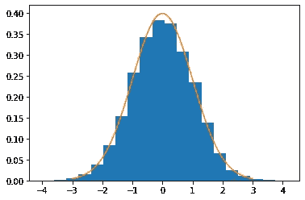

# 贝叶斯统计:Python 中从零开始的大都会-黑斯廷斯

> 原文：<https://towardsdatascience.com/bayesian-statistics-metropolis-hastings-from-scratch-in-python-c3b10cc4382d?source=collection_archive---------4----------------------->

## 用 Python 探索马尔可夫链蒙特卡罗抽样

信用:Pixabay

## 你在*这里*

如果你正在阅读这篇文章，很有可能:(1)你对贝叶斯统计感兴趣，但是(2)你不知道马尔可夫链蒙特卡罗(MCMC)抽样方法是如何工作的，以及(3)你意识到除了最简单的玩具问题，所有问题都需要 MCMC 抽样，所以你有点不确定如何前进。

不用担心，我们将使用一维正态分布来探索这个棘手的概念，只使用 python、用户定义的函数和随机模块(特别是均匀分布。)我们将从酒吧、啤酒和与你的朋友外出的夜晚的角度来讨论所有这些无意义的事情。

## 想象自己在酒吧里

这是星期五晚上，你和你的朋友出去吃汉堡，喝啤酒，看电视转播的棒球比赛。假设你任意选择了第一个酒吧(我们称之为*拉里体育酒吧*，你坐下来，拿起菜单，考虑你的选择。如果食物和饮料价格合理，这是留下来的好理由；但是如果只有站着的地方，你就有理由离开。如果酒吧里摆满了大屏幕电视，而且都在播放正确的游戏，这是我留下来的另一个原因。如果食物或饮料不吸引人，你就有了另一个离开的理由。等等，你明白了。

现在，让我们假设你的一个(或几个)朋友对现在的机构有抱怨——食物是冷的，啤酒价格过高，不管是什么原因。所以他提议这帮人离开*拉里的体育酒吧*而去*托尼的比萨店和啤酒花园*因为那里的食物更好、更新鲜等等。因此，该团伙商议，提出问题(A)拉里的有多有利？(二)托尼的好感度如何？和(C) **托尼相对于拉里的有利程度如何？**

这种相对比较真的是最重要的细节。如果托尼的仅仅比拉里的好一点点(或者差很多),那么很有可能不值得花力气去重新定位。但是如果托尼的无疑是两个中更好的，那么你留下来的机会就很小了。这才是让 Metropolis-Hastings“工作”的真正动力

## 该算法

Metropolis-Hastings 算法可以:

1.  从**随机**样本开始
2.  确定与样本相关的概率密度
3.  提出一个**新的**，任意样本(并确定其概率密度)
4.  比较密度(通过除法)，量化**想要**移动的程度
5.  生成一个随机数，与移动的欲望进行比较，然后**决定:移动还是停留**
6.  重复

> 真正的关键是(正如我们已经讨论过的)量化这个举动有多可取，作为一个行动/不行动的标准，然后(新的东西提醒！)**观察随机事件**，与所述阈值进行比较，并做出决定。

## 随机事件

出于我们的目的，我们的阈值是建议样本的概率密度与当前样本的概率密度之比。如果该阈值接近(或高于)1，则意味着之前的位置非常不理想(接近 0 的数字，非常不可能)，而建议的位置非常理想(尽可能接近 1，接近分布的预期)。现在，我们需要从均匀分布中生成一个范围为[0，1]的数。如果产生的数字小于或等于阈值，我们就移动。否则，我们留下。就是这样！

## 难的东西呢？

这听起来有点好得难以置信，对吧？我们还没有讨论马尔可夫链或蒙特卡洛模拟，但不用担心。这两者本身都是很大的话题，我们只需要对它们有最基本的了解就可以利用 MCMC 的魔力。

马尔可夫链是离散事件的链，其中下一个事件的概率仅取决于当前事件。(例:我刚学完，是去睡觉还是去酒吧？*这些是我在有限的选择中唯一的选择。*)在这个离散选择的系统中，存在一个转移矩阵，它量化了从任何给定状态转移到任何给定状态的概率。蒙特卡洛方法实际上只是一个依赖于随机数使用的模拟/实验的花哨名称。

如前所述，我们将从正态分布中取样——一个连续的，而不是离散的分布。那么怎么会有转移矩阵呢？**惊喜！** —根本没有转换矩阵。(它实际上被称为一个[马尔可夫核](https://en.wikipedia.org/wiki/Markov_kernel)，它只是概率密度的比较，至少对我们的目的来说是这样的。)

## 代码

下面，我们定义三个函数:(1)正态，在给定参数 mu 和 sigma 的情况下，评估任何观测值的概率密度。(2) Random_coin，参考了一个 TDS 作者同行的帖子(下面划线)。以及(3) Gaussian_mcmc，其采样执行上述算法。

正如所承诺的，我们不会从 numpy、scipy 等调用任何高斯或正态函数。在第三个函数中，我们将当前样本初始化为均匀分布的实例(其中下限和上限是平均值的+/- 5 个标准偏差)。)同样，运动的定义也是如此。最后，我们根据随机事件相对于接受度的观察值移动(或停留)，这是在别处详细讨论的概率密度比较。

[Github 要诀](https://gist.github.com/jdmoore7/a5841d5307085bc5fd33ac046109d877)

直方图与实际分布

最后，我们必须始终给予应有的信任: [Rahul Agarwal](https://medium.com/u/e8cce06956c9?source=post_page-----c3b10cc4382d--------------------------------) 的[帖子](/mcmc-intuition-for-everyone-5ae79fff22b1)定义β分布 MH 采样器对我开发上述高斯分布 MH 采样器很有帮助。我鼓励你也阅读他的文章，更详细地探索基本概念，即马尔可夫链和蒙特卡洛模拟。

## 离别笔记

亲爱的读者，我注意到一种模式，即*用户将我的故事添加到他们的列表中，但不鼓掌或订阅*。请——如果你喜欢我的内容，**通过鼓掌、评论和订阅**来认识到它是有用的。这(1)有助于我确定下一步为您创建什么内容的优先级，以及(2)有助于其他媒体用户找到我的内容。**谢谢！**