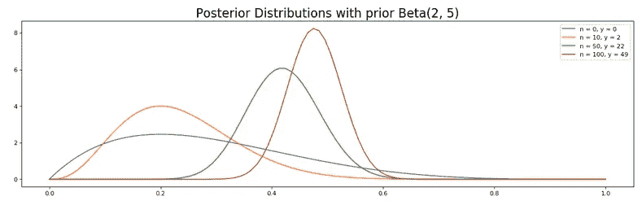
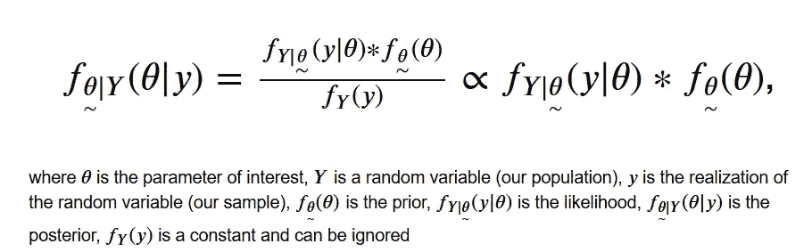
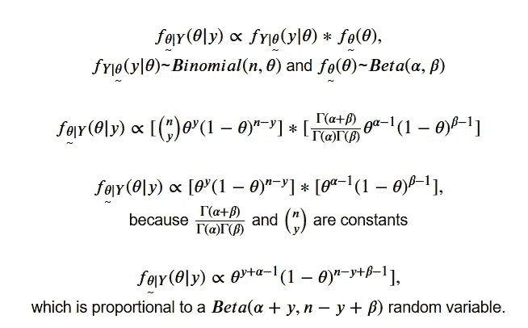
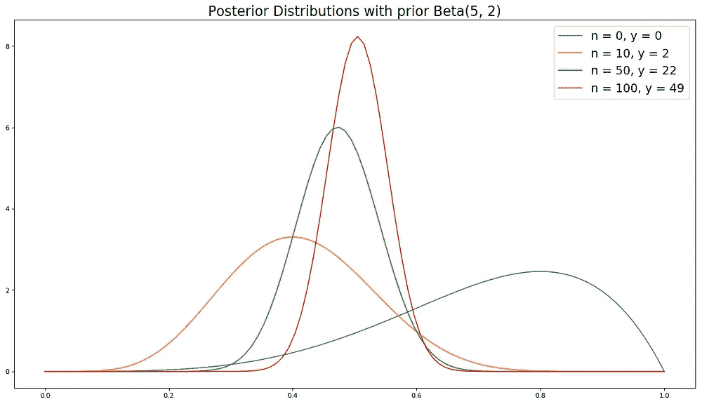
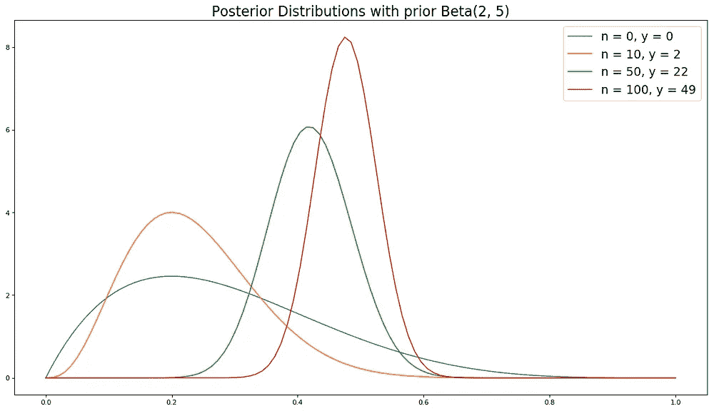
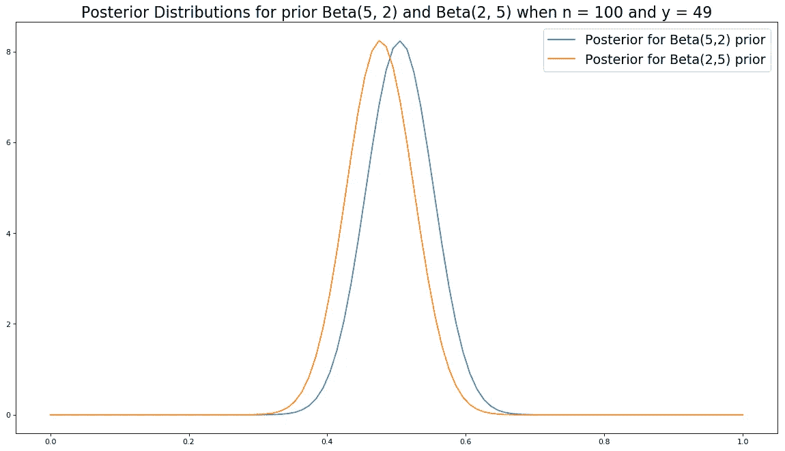

# 面向数据科学家的贝叶斯统计 101

> 原文：<https://towardsdatascience.com/bayesian-stats-101-for-data-scientists-a8c145a84259?source=collection_archive---------9----------------------->



具有 Beta 先验和模拟数据的二项式 p 参数的后验

## 统计学和概率的另一种观点

你可能还记得贝叶斯定理，那是你需要为统计 101 课程记忆的恼人的等式，但它远不止如此。这也是统计和概率的另一种观点的基础，与频繁主义者的观点和学术界最伟大(或最蹩脚)圣战的一半形成对比。

如果你上过统计学入门课，你会对统计学的 Frequentist 框架很熟悉，即使你不知道它的名字。在 Frequentist 框架中，参数(总体均值、方差等。)是固定的，但数据是随机的。对于频率主义者来说，概率是一个事件在重复试验中相对频率的极限。


https://en.wikipedia.org/wiki/Thomas_Bayes 牧师托马斯·贝叶斯

巴伊亚人持不同观点；概率是相信一个事件将会发生的程度，贝叶斯主义者对参数的概率分布对应于他们对可能值的相信程度。谁是对的？和生活中的大多数事情一样，要看情况。

为了演示不同的方法，让我们来看看两个阵营将如何处理一个简单的问题:一枚硬币正面朝上的概率是多少(我们称之为***【P(H)***)。

解决这个问题的一个有效的频率主义方法是将硬币抛足够的次数，并使用[最大似然法](https://en.wikipedia.org/wiki/Maximum_likelihood_estimation)或[矩量法](https://en.wikipedia.org/wiki/Method_of_moments_(statistics))估计器来估计 ***P(H)*** (这里它们都是***/抛硬币数*** )。接下来，频率主义者将构建一个近似的置信区间，并使用它来做出关于 ***P(H)*** 的推断。完全合理的方法。现在让我们用贝叶斯方法来检验同一个问题。

贝叶斯方法从这个等式开始:



先验是我们在检查数据之前对感兴趣参数分布的信念。它可以基于专家的判断，或者你可以使用一个[无信息先验](https://en.wikipedia.org/wiki/Prior_probability#Uninformative_priors)(一个对参数作出弱声明的先验)。在我们掷硬币的例子中，我们可以使用贝塔分布的[概率密度函数](https://en.wikipedia.org/wiki/Probability_density_function)作为 ***P(H)*** 的一般分布，因为它像概率一样被限制在 0 和 1 之间。我们必须设置这个分布的参数，但是现在，我们不指定它们。

可能性是我们的样本。对于掷硬币的例子，数据来自二项分布，因此我们将使用二项[概率质量函数](https://en.wikipedia.org/wiki/Probability_mass_function)(掷硬币的**中的人头数遵循二项分布)。**

**我们现在准备求解 ***P(H)*** 的后验线，它由希腊字母 theta 表示。头数用 ***Y*** (随机变量)和 ***y*** (我们的样本中的实际头数 ***n*** )表示。**

****

**用贝塔先验求解二项似然的后验概率**

**可以看到，我们关于***【P(H)***的后验信念既依赖于数据(即*和 ***n*** )也依赖于我们关于***【P(H)***(***α***和***β***)随着我们包含的数据越来越多，我们的先验信念对后验的影响也越来越弱。有了足够的证据，非常不同的先验会汇聚到同一个后验。你先前信念的强度会影响收敛的速度。***

**为了演示证据如何压倒先验，我使用 python 模拟了 100 次掷硬币，并绘制了 0 次、10 次、50 次和 100 次模拟掷硬币的 2 个非常不同的先验的后验分布。**

**首先我们需要导入一些函数，设置抛硬币次数和 ***P(H)*** ，为我们的每一个先验分布设置参数。**

```
**import numpy as np
import matplotlib.pyplot as plt
from scipy.stats import beta, bernoulli# set number of trials
n = 100
# set the probability of getting a heads
theta = 0.5# prior where our coin is biased towards heads
alpha1 = 5
beta1 = 2# prior where our coin is biased towards tails
alpha2 = 2
beta2 = 5**
```

**接下来，我们模拟我们的硬币翻转，并在翻转 10 次、50 次和 100 次后进行计数。**

```
**# simulates n coinflips with P(Heads) = theta
coin_flips = bernoulli.rvs(p=theta, size=n, random_state=1)# count the Heads in the first 10 flips
n_1 = 10
y_1 = sum(coin_flips[0:n_1])# count the Heads in the first 50 flips
n_2 = 50
y_2 = sum(coin_flips[0:n_2])# count the Heads in the whole sample
y_total = sum(coin_flips)**
```

**现在，我们定义一个函数，使用解析导出的结果生成后验分布。**

```
**def my_posterior(alpha_, beta_, n, y):
    # set the range of theta (0 to 1) with 100 intervals
    x = np.linspace(0, 1, 100)
    # calculate the pdf at each one
    y = beta.pdf(x, (alpha_ + y), (n - y + beta_))
    # returns x and the pdf of the posterior 
    return x, y**
```

**最后，我们准备在 0 次、10 次、50 次和 100 次抛硬币后绘制每个先验的后验概率。**

```
**# plot the posteriors with the beta(alpha1, beta1) priors
for i in [(0, 0), (n_1, y_1), (n_2, y_2),(n, y_total)]:
    label  = f"n = {i[0]}, y = {i[1]}"
    plt.plot(my_posterior(alpha1, beta1, i[0], i[1])[0],
             my_posterior(alpha1, beta1, i[0], i[1])[1], 
             label=label)
plt.legend()
plt.show()# plot the posteriors with the beta(alpha2, beta2) priors
for i in [(0, 0), (n_1, y_1), (n_2, y_2),(n, y_total)]:
    label  = f"n = {i[0]}, y = {i[1]}"
    plt.plot(my_posterior(alpha2, beta2, i[0], i[1])[0],  
             my_posterior(alpha2, beta2, i[0], i[1])[1], 
             label=label)
plt.legend()
plt.show();**
```

********

**模拟硬币投掷的后验分布**

**如你所见，随着更多的数据，非常不同的先验将向相同的后验收敛。**

```
**# plot the posteriors for both priors after 100 coin flips
plt.plot(my_posterior(alpha1, beta1, n, y_total)[0],
         my_posterior(alpha1, beta1, n, y_total)[1])
plt.plot(my_posterior(alpha2, beta2, n, y_total)[0],
         my_posterior(alpha2, beta2, n, y_total)[1])
plt.show();**
```

****

**如前所述，参数对贝叶斯人来说是随机的。因此，不同的语言适用于进行推理。常客有“置信区间”,他们有 X%的把握真实参数在这个区间内。这意味着，如果从固定大小的样本中抽取无限数量的样本，则 X%的置信区间将包含真实参数。它**不**意味着真参数在置信区间内的概率为 X%。它要么在置信区间内，要么不在置信区间内。我们只是不知道。**

**Bayesians 人有“可信区间”，即参数在该区间内出现的概率为 X%。这是一种微妙的语言差异，在解释上有很大的差异。统计学家是数学学科的律师。**

**解析地推导后验分布并不总是容易的，这也是 20 世纪频繁主义者分析主导贝叶斯分析的一个原因。随着计算机计算能力的增加，现在使用数值技术来生成后验分布是可行的(见[马尔可夫链蒙特卡罗](https://en.wikipedia.org/wiki/Markov_chain_Monte_Carlo))。如果你已经做到了这一步，你现在已经有了开始探索这些算法的背景。**

# **贝叶斯推理作为一种生活方式**

**既然你对贝叶斯观点有了基本的了解，我想解释一下为什么我认为贝叶斯推理是一种很好的生活方式。这并不完全是一个新颖的观点，但是大多数人在处理现实的方法上仍然是非贝叶斯的，所以我仍然会给它一个解释。**

**我们都同意 1x1=1，除非你是 [Terrance Howard](https://twitter.com/terrencehoward/status/925754491881877507?lang=en) 。我们不需要给这种说法分配一个信任度，因为它在逻辑上是真实的。但是生活中有很多事情没有逻辑证明。**

**让我们看看将最低工资提高到每小时 15 美元的问题(这是美国争论的一个热门话题)。虽然更多的书呆子认为最低工资应该提高多少应该取决于一个地区的生活成本(这是我以前的观点)，但围绕这个问题的许多流行辩论采取了二元形式“应该提高到每小时 15.00 美元，因为这将帮助很多人”或“不应该提高，因为企业将削减就业”，这假设劳动力需求对包含最低工资职位的部分具有弹性。**

**幸运的是，一些州和城市最近提高了最低工资。在接下来的几个月和几年里，我们将会有研究论文，这些论文将会给我们提供支持或反驳我们信仰的迹象，我们可以作为 Bayesians 人相应地更新我们的信仰。不管证据如何，非 Bayesians 人将留在各自的营地。**

**我相信我们应该这样对待生活中的大多数问题。基于我们个人对世界如何运作的心理模型，我们都可以对现实的各个方面有预先的信念，但我们的信念 ***必须*** 对现实敏感。当我们几乎没有证据支持我们的信念时，我们不应该如此强烈地坚持它们。**

**我留给你们[克伦威尔法则](https://en.wikipedia.org/wiki/Cromwell%27s_rule)。**

> **"我以基督的名义恳求你，想想你可能弄错了。"—奥利弗·克伦威尔**