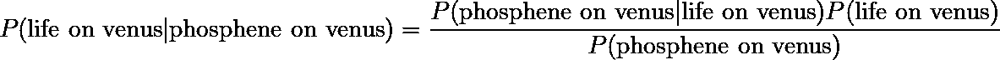

# 贝叶斯思维

> 原文：<https://towardsdatascience.com/bayesian-thinking-2e8851c64f5e?source=collection_archive---------10----------------------->

## 统计学家如何应对金星上的生活

照片由 [**菲利普·唐恩**](https://www.pexels.com/@philippedonn?utm_content=attributionCopyText&utm_medium=referral&utm_source=pexels) 从 [**派克斯**](https://www.pexels.com/photo/milky-way-illustration-1169754/?utm_content=attributionCopyText&utm_medium=referral&utm_source=pexels)

如果你是那种阅读数据科学博客的人(你好！)那你大概已经知道贝叶斯定律了。见鬼，你可能自己也用过。不幸的是，根据我的经验，许多人只知道技术和学术背景下的贝叶斯法则，并不真正理解日常生活中有用的方式。这是一种耻辱，因为贝叶斯法则是一种美丽的、强大的、理性的组织你的信仰的方式。不过，问题是:你已经在日常生活中使用它了，只是你可能不知道而已。在这篇文章中，我将通过一个热门的非技术性的例子向你展示如何有意识地使用贝叶斯定律:金星上生命的(潜在)发现。

# 不好意思，什么？

如果你不知何故错过了新闻，简·s·格里夫斯博士等人最近的一篇论文引发了人们对金星上可能存在生命的兴趣。不幸的是，随着 COVID 旅行禁令的生效，格里夫斯博士无法带她的团队到这个温暖的星球进行实地考察，所以他们改用望远镜。简而言之，研究小组在金星的大气中发现了磷化氢气体的证据。

# 好吧，那这和贝叶斯定律有什么关系？

贝叶斯法则是一种工具，它可以根据新信息更新你现有的信念，而不是彻底抛弃你的旧信念。做好准备，因为我要给你看一个等式:

贝叶斯定律的辉煌

这跟信仰和信息有什么关系？嗯，看起来有点复杂，但实际上很简单。让我们来分解一下:

*   对于初学者来说，“P”读作“的概率”，“|”读作“给定”。所以“P(A|B)”读作“给定 B 的概率”。
*   a 是有疑问的信念；在我们的例子中，A 是“金星上有生命”的陈述。
*   b 是证据；在我们的例子中，“金星上有磷化氢气体”。

因此，等式的左边读作**“[假定金星上有磷化氢，那么]金星上有生命的概率是多少？”当你读到像“在金星上发现磷化氢气体”这样的新闻标题时，这正是你应该问自己的问题**

既然我们可以说出贝叶斯定律，让我们把它分成几个部分:

**P(A|B):** 这被称为*后验*，意思是“给定证据【金星上的磷化氢】，索赔【金星上的生命】的概率是多少”。我们关心的是数量。说到后验，你很难想象我有多失望磷化氢没有在天王星上被发现。

**P(B|A):** 这叫做*似然*，是后验概率的倒数。它的意思是“给定‘金星上有生命’的说法，我们看到证据‘金星上有磷化氢’的概率有多大”。为了计算出这个值，我们*假设金星上有生命*并计算如果我们的假设成立，我们在金星上观察到磷化氢气体的概率。我们知道地球上的生物会产生磷化氢气体，所以这个数值比较高。

**P(A):** 这叫*先验*，意思是“在没有任何新证据的情况下，主张成立的概率有多大”。在我们的例子中，这是在你阅读新闻标题之前，你对金星上有生命的先验信念。考虑到这个星球是一个腐蚀性的地狱，在你到达地表之前，它会将你煮沸、压碎、腐蚀，这个值相当低。

**P(B):** 这个值被称为边际，意思是“我们看到任何索赔给出的证据的概率是多少”。在我们的例子中，这意味着“某物在金星上产生磷化氢气体的概率是多少”。该论文详细描述了其他可能产生磷化氢的方法，包括火山活动、闪电和流星投放，并得出结论，这些方法中的任何一种都不可能产生与观察到的一样多的磷化氢。

# 把所有的放在一起

想到这些，一个统计学家读到标题**金星**上发现磷化氢气体会有什么反应？

1.  "嗯，我想知道根据这一新信息，金星上有生命的可能性有多大？"
2.  "嗯，我对金星人生活的先验信念相当低，可能只有 0.01%…"
3.  “但是假设金星上有生命，根据我们对人类生物学的了解，它产生磷化氢气体的可能性很高。”
4.  “任何东西产生这种气体的边际概率几乎为零……”
5.  考虑到这一切，我想我会把我对金星上有生命的信念从 0.01%更新到 10%。

你听到最后一点了吗？这就是奇迹发生的地方；一旦你应用贝叶斯法则，后验概率就成为你下一次获得新证据的新先验。如果另一名研究人员明天发表一项研究，描述金星上的另一个生物特征，这位统计学家将使用他们新的 10%的先验，而不是他们旧的 0.01%的先验。

# 现实生活中的应用

一旦你熟悉了这项技术，你就可以在任何地方应用它:

1.  “我两周一次的壁球俱乐部的桑德拉今天随机给我买了一套新的壁球；鉴于这个证据，我怀疑她是不是看上我了……【未知后路！]"
2.  “我知道我看起来很体面，但我们真的没有谈过很多，所以她不太可能喜欢我[小优先！]"
3.  “但是如果她真的喜欢我，送我一套壁球会是一个很好的表达方式[可能性很大！]"
4.  “桑德拉是个顽固的家伙……我怀疑她是否经常出人意料地送礼物给人[小边际！]"
5.  “考虑到这一点，她很有可能喜欢我！我将把我的优先级从 10%更新到 60%”

或者另一个

1.  “我的老板今天狠狠训了我一顿，告诉我我的工作表现‘比他那只半瞎的约克夏狗还糟糕’；有了这些证据，我应该有多大信心保住我的工作？【未知后路！]"
2.  “我的工作很棒，但公司最近一直在挣扎，所以昨天我会说我是否能保住工作的可能性是 50%……[中级优先！]"
3.  “但是如果我的老板*打算*解雇我，他很有可能会以这种方式对待我【可能性很大！]"
4.  “提醒你一下，他是个混蛋，我很确定他时不时会数落每个人，所以他有各种各样的理由会这样……[大边缘]”
5.  "我想我会把对工作保障的信心降低一点，从 50%降到 45%。"

显然，我们无法确定日常生活中的确切概率，但你会明白的。这其中的大部分应该是直观的(就像我说的，我打赌你已经在使用它了)，但是正式理解它如何以及为什么工作会使它更加有用。

# 含义

贝叶斯定律改变了你看待世界的方式。信念不再是二元的(真或假),而是形成了一个信心谱，随着新证据的出现而增加或减少。接受“我对自己的信念有 90%的把握”这种模糊说法，因为根据贝叶斯定律，如果你对一个信念有 100%或 0%的先验信心，那么**不可能**改变你的想法。为什么会这样？看这个等式:

如果 P(A)是 0，那么 P(A|B)也是，因为任何乘以 0 的东西都是 0。这意味着再多的证据也不会改变你的想法。想象一个扁平的地球人，他确信地球是扁平的(0%确信它是圆的)。无论你给他们看什么证据，P(A|B)都卡在零。另一边也是如此；如果你对 A 有 100%的把握(即 P(A)=100%)，那么不管你得到什么证据 B，你都已经相信 A 了，不管 B 是什么，所以 P(A|B)也将是 100%，不管新的证据有多糟糕。

但是如果你没有前科会怎么样呢？你从哪里得到一个？一个答案是使用一个“不知情的先验”，你说“啊我不知道，假设是 50/50”(或者如果有三个结果，就是三分之一，等等。).另一种选择是使用简单的统计数据:在上面的解雇示例中，员工可以说“每年有 10%的员工被解雇，所以我可以说我保住工作的概率是 90%”。事先选择可能有点手动波动，有些人称之为不科学，但我通常只是让他们参考[这部漫画](https://xkcd.com/1132/)。(没听懂笑话？贝叶斯统计学家有一个非常强的先验，太阳没有爆炸，因为，嗯，它从来没有过。

所以你有它。不管大学统计课会教什么，贝叶斯定律在乳腺癌诊断之外还有应用。下次壁球课上一定要告诉你所有的朋友。