# 线性回归的贝叶斯思维

> 原文：<https://towardsdatascience.com/bayesian-thinking-estimating-posterior-distribution-for-linear-regression-data-ketchup-2f50a597eb06?source=collection_archive---------38----------------------->

## 贝叶斯与吉布斯采样和 MCMC 模拟


**深度神经模型中的不确定性，** [**链接**](https://www.nature.com/articles/s41598-017-17876-z/figures/5)

## 简介:

这项研究的主要动机之一是，随着越来越复杂的模型的出现，人们越来越关注深度模型的可解释性。更多的是模型的复杂性，很难对输出进行解释，在贝叶斯思维和学习领域正在进行大量的研究。

但是在理解并能够欣赏深度神经模型中的贝叶斯之前，我们应该精通并熟练线性模型中的贝叶斯思维，例如贝叶斯线性回归。但是很少有很好的在线材料能够以一种组合的方式给出清晰的动机和对贝叶斯线性回归的理解。

这是我写这篇博客的主要动机之一，在这里，我将尝试从贝叶斯分析的角度来理解如何进行线性回归。

## **最大似然估计&贝叶斯**

在开始之前，让我们明白，我们非常清楚线性回归模型的最大似然估计。我在之前的[演讲](https://www.youtube.com/watch?v=6rWvmwucgZM&t=1850s)中讨论过这个问题，请参考链接。

简单介绍一下线性回归中最大似然估计的概念。


**线性回归最大似然法—二元图，** [**链接**](https://medium.com/quick-code/maximum-likelihood-estimation-for-regression-65f9c99f815d)

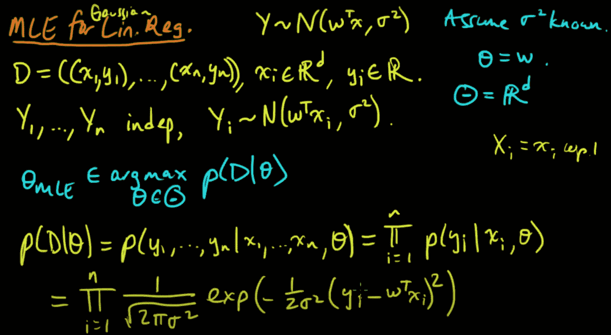

**可能为回归，** [**链接**](https://www.youtube.com/watch?v=ulZW99jsMXY&t=655s)

> 由此要明白的最重要的一点是 ***MLE*** 通过最大化 ***似然 P(D|θ)*** 给你一个参数的点估计。
> 
> 偶， ***映射*** 即[最大后验概率](https://en.wikipedia.org/wiki/Maximum_a_posteriori_estimation)估计最大后验概率 ***P(θ|D)，*** 即也给出点估计。

因此，这些方法不能给你足够的关于系数分布的信息，而在贝叶斯方法中，我们估计参数的后验分布。因此，在这种情况下，输出不是单个值，而是概率密度/质量函数。


**后验概率，贝叶斯定理**

只是为了理解背后的直觉。

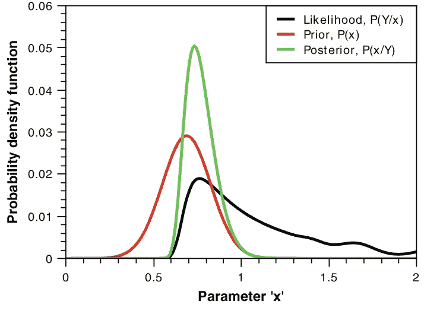

**先验，&后验，**[链接](https://www.researchgate.net/figure/Likelihood-prior-and-posterior-probability-distribution-for-a-parameter-x_fig9_258158633)


**理解后验意义，** [**链接**](https://www.youtube.com/watch?v=yvWlpwnT1nw)

## 马尔可夫链蒙特卡罗模拟

只差一步了！！！

在深入研究贝叶斯回归之前，我们需要了解另一件事，即*马尔可夫链蒙特卡罗模拟*以及为什么需要它？

MCMC 方法用于通过概率空间中的随机采样来近似感兴趣参数的后验分布。但是为什么近似分布而不计算精确分布可能是一个你一定很感兴趣的问题。


**计算后验分布的复杂度，** [**链接**](https://www.youtube.com/watch?v=8FbqSVFzmoY&t=390s)

由于分母的原因，这几乎无法计算，也很难处理，因此我们使用 MCMC 来近似后验分布。

蒙特卡罗方法有助于我们生成符合给定分布的随机变量。例如:- **θ ~ N(平均值，sigma**2)，**将有助于从正态分布生成多个 *θ* ，有许多方法可以做到这一点。

马尔可夫链是一个数字序列，其中每个数字都依赖于序列中的前一个数字。马尔可夫链蒙特卡罗有助于从分布中生成随机变量，其中每一个 *θ* 的值都是从一个平均值等于前一个值的已知分布中提取的。


马尔可夫链蒙特卡罗与高斯建议分布，[链接](https://www.youtube.com/watch?v=OTO1DygELpY&t=198s)

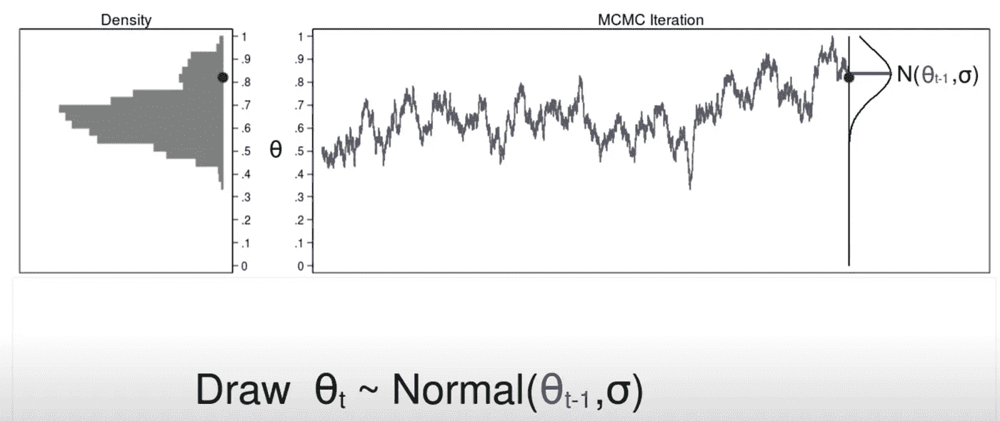

**通过 MCMC 模拟生成密度，** [**链接**](https://www.youtube.com/watch?v=OTO1DygELpY&t=198s)

正如您所理解的，这基本上是一个随机行走，可能会生成许多不必要的和不相关的值。因此，我们需要对值进行接受/拒绝采样，以生成感兴趣的分布。

在这种情况下，Metropolis-Hastings 算法用于通过拒绝和接受采样来改进值。


**接受和拒绝样本的 Metropolis-Hastings 算法**

我们也可以使用**吉布的**采样，其目标是通过获得后验条件分布 ***P(θ1|θ2，y，x)*** 和 ***P(θ2|θ1，y，x)来找到后验分布 P(θ1，θ2|y，x)。*** 所以，我们生成

***θ1 ~P(θ1|θ2，y，x)***替换第二个方程中生成的θ1 的值，生成 ***θ2 ~ P(θ2|θ1，y，x)*** 我们继续这个过程，进行几次迭代，得到后验。


**估计后验 MCMC，** [**链接**](https://www.youtube.com/watch?v=7QX-yVboLhk)

现在，让我们用一个例子来说明这一点。

在下面的例子中，我将首先用吉布斯抽样来说明贝叶斯线性回归方法。这里，我假设了参数的某些分布。

## ***用吉布斯采样实现贝叶斯线性回归*** :

在这一节中，我将展示一个使用吉布斯抽样进行贝叶斯线性回归的例子。这一部分摘自 Kieran R Campbell 关于贝叶斯线性回归的博客 [*。*](https://kieranrcampbell.github.io/blog/2016/05/15/gibbs-sampling-bayesian-linear-regression.html)

因此，首先，让我们了解数据对于我们的情况是如何的。设 D 为以下实验的数据集，D 定义为:

***D = ((x1，y1)，(x2，y2)，(x3，y3) …… (xn，yn))*** 为数据，其中 *x1，x2* …。属于单变量特征空间。

***Y ~ N( b*x + c，1/t)*** ，其中 Y 为正态分布的随机变量，均值 *b*x + c* ，方差 *1/t* ，其中 *t* 代表精度。

在这种情况下，我们将考虑具有两个参数的单变量特征空间( *X* ),即*斜率(c)* 和*截距(b)* 。因此，在本实验中，我们将学习上述参数 *c & b* 和精度 *t.* 的后验分布

让我们写下上述参数的假设先验分布


**参数的先验分布**

因此，让我们首先写下正态分布的密度函数和 log_pdf，以得到一个概括的形式，这将在以后多次使用。

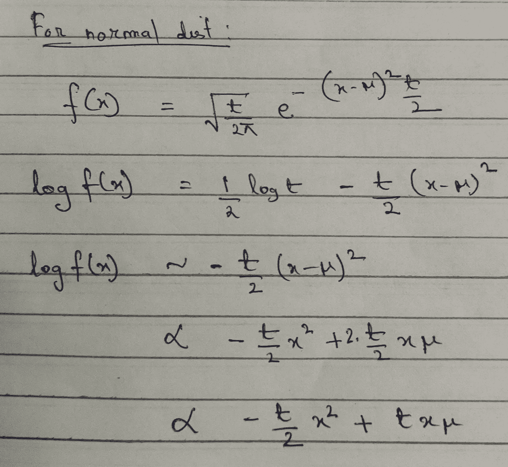

**对数正态分布的 pdf 展开**

现在，我们将很容易写出我们的情况的可能性，它也遵循均值 ***bx+c*** 和精度 ***t*** 的正态分布。

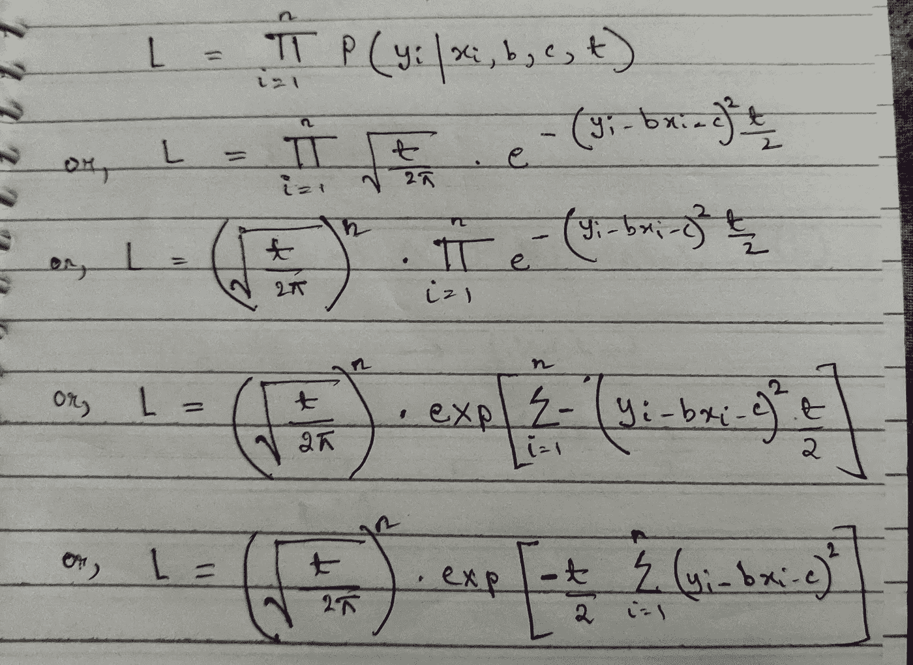

**我们场景中的可能性估计**

取其对数给出下面的表达式


**我们场景的对数可能性**

接下来是一个复杂的小部分，即导出所有三个参数 *b，c，t.* 的条件后验分布

***条件后验分布为截距 _c :***

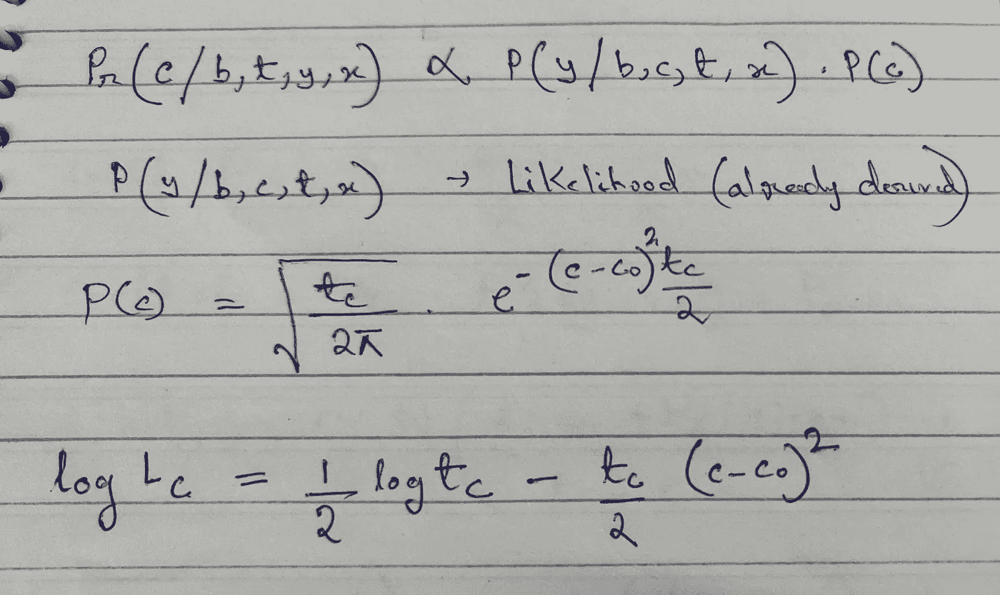

**c _ part 1 的条件后验分布**

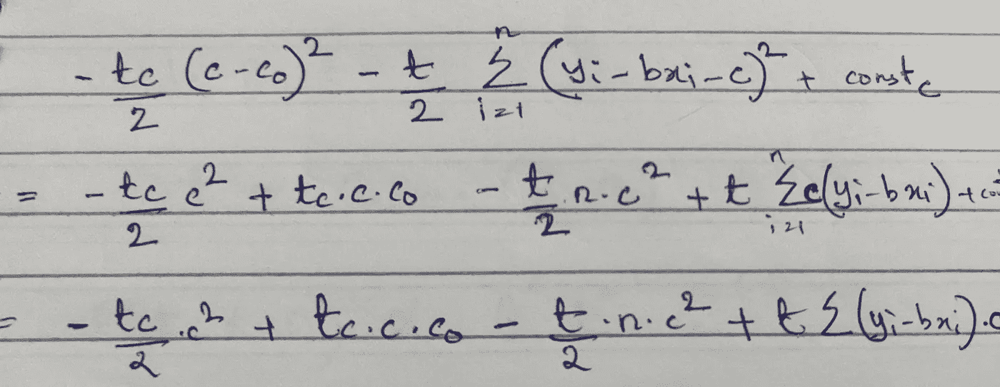

**c _ part 2 的条件后验分布**


**c _ part 3 的条件后验分布**

因此，我们可以看到，这是找出截距 c 的条件后验分布的过程。

上述等式的代码片段

```
**def get_intercept_c**(y, x, b, t, c0, tc):
    n = len(y)
    assert len(x) == n
    precision = c0 + t * n
    mean = tc * c0 + t * np.sum(y - b * x)
    mean = mean/precision
    **return** np.random.normal(mean, 1 / np.sqrt(precision)
```

同样，我们可以找到同样的 ***斜率 b.***

***条件后验分布为斜率 _b :***

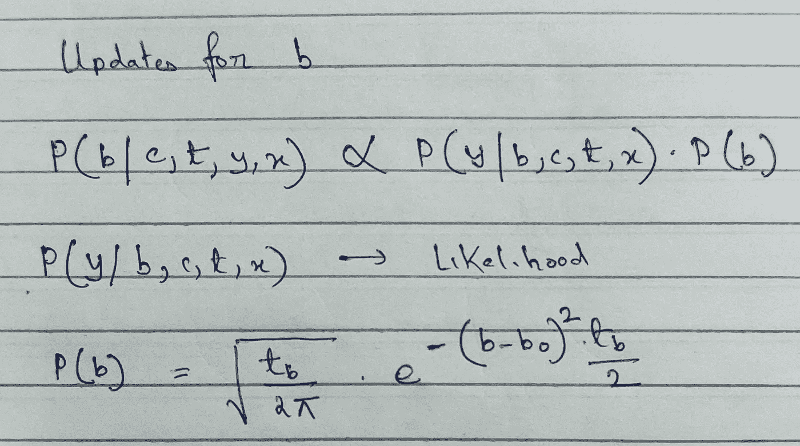

**b _ part 1 的条件后验分布**

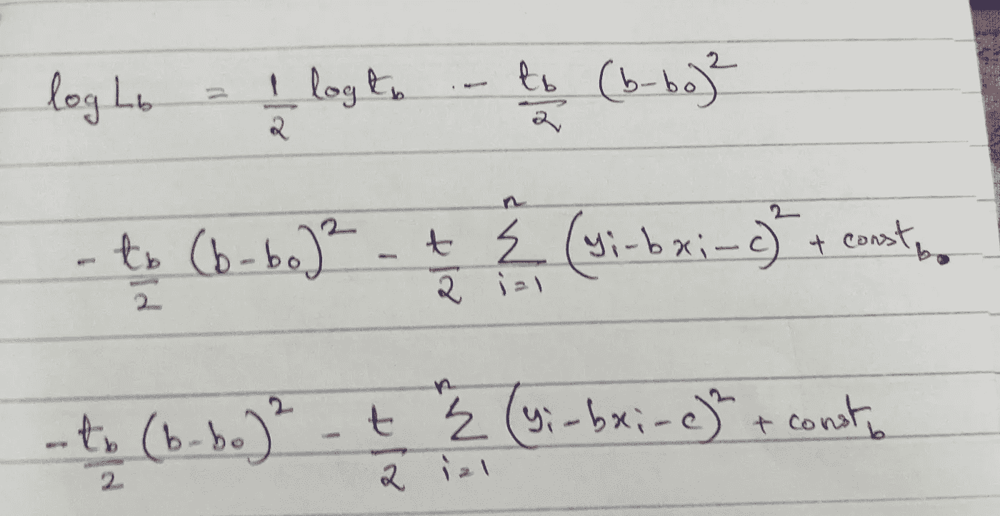

**b _ part 2 的条件后验分布**

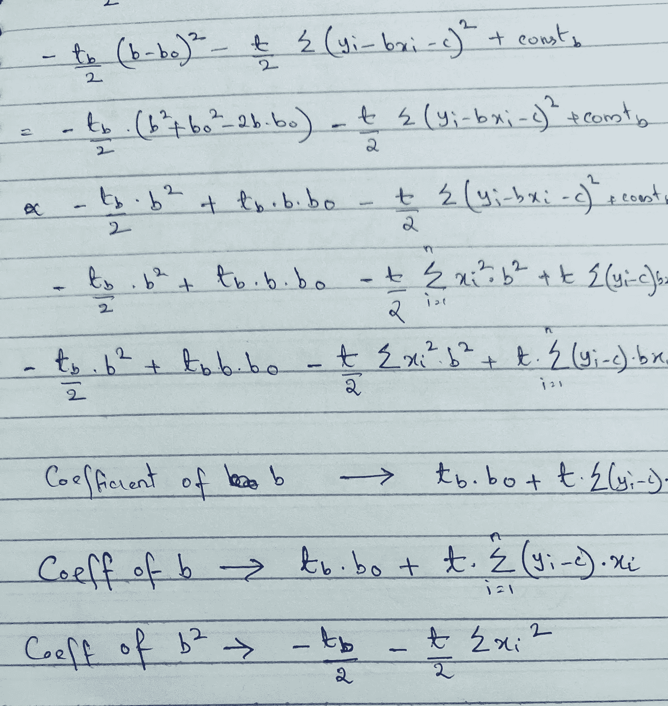

**b _ part 3 的条件后验分布**


**b _ part 4 的条件后验分布**

斜坡更新的代码片段如下

```
**def get_slope_b**(y, x, c, t, b0, tb):
    n = len(y)
    assert len(x) == n
    precision = tb + t * np.sum(x * x)
    mean = tb * b0 + t * np.sum( (y - c) * x)
    mean = mean/precision
    **return** np.random.normal(mean, 1 / np.sqrt(precision))
```

***条件后验分布为精度 _t :***

条件后验分布给出 b，c 将不会像上面两个一样，因为先验遵循伽马分布。

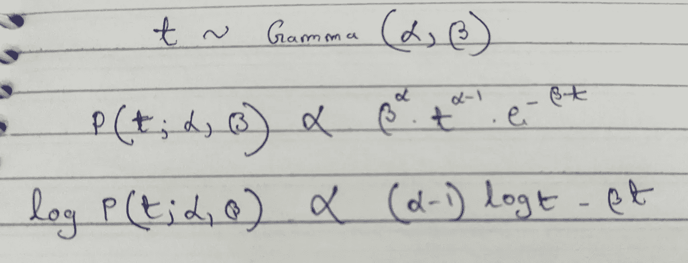

**t _ part 1 的条件后验分布**

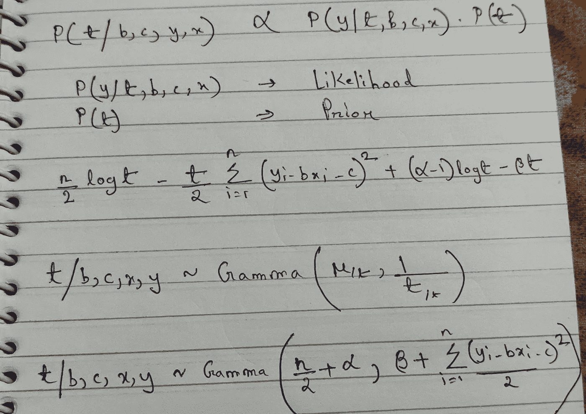

**t _ part 2 的条件后验分布**

```
**def get_precision_t**(y, x, b, c, alpha, beta):
    n = len(y)
    alpha_new = alpha + n / 2
    resid = y - c - b * x
    beta_new = beta + np.sum(resid * resid) / 2
    **return** np.random.gamma(alpha_new, 1 / beta_new)
```

现在，由于我们可以获得参数的封闭分布形式，现在我们可以使用 **MCMC 模拟**从后验分布中生成。

因此，首先，为了运行实验，我生成了一个具有已知斜率和截距系数的样本数据，我们可以通过贝叶斯线性回归对其进行验证。我们假设实验 a=6，b = 2

```
# observed data
n = 1000
_a = 6
_b = 2
x = np.linspace(0, 1, n)
y = _a*x + _b + np.random.randn(n)synth_plot = plt.plot(x, y, "o")
plt.xlabel("x")
plt.ylabel("y")
```


**生成数据运行贝叶斯线性回归**

现在，在基于上面所示的等式和片段更新参数之后，我们运行 MCMC 仿真来获得参数的真实后验分布。

```
**def gibbs**(y, x, iters, init, hypers):
    assert len(y) == len(x)
    c = init["c"]
    b = init["b"]
    t = init["t"]

    trace = np.zeros((iters, 3)) ## trace to store values of b, c, t

    for it in tqdm(range(iters)):
        c = get_intercept_c(y, x, b, t, hypers["c0"], hypers["tc"])
        b = get_slope_b(y, x, c, t, hypers["b0"], hypers["tb"])
        t = get_precision_t(y, x, b, c, hypers["alpha"], hypers["beta"])
        trace[it,:] = np.array((c, b, t))

    trace = pd.DataFrame(trace)
    trace.columns = ['intercept', 'slope', 'precision']

    **return** traceiters = 15000
trace = gibbs(y, x, iters, init, hypers)
```

在运行实验 15000 次迭代后，我们看到了验证我们假设的轨迹图。在 MCMC 仿真中有一个*老化期的概念，我们忽略最初的几次迭代，因为它不会从真实的后验随机样本中复制样本。*

**

***MCMC 仿真的轨迹图***

*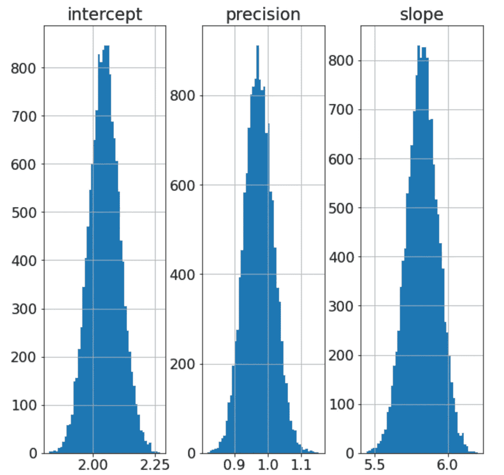*

*【MCMC 模拟参数的采样后验分布*

*如你所见，样本后验分布复制了我们的假设，我们有更多关于系数和参数的信息。*

*但是并不总是可能有条件后验的封闭分布形式，因此我们必须使用上面简要讨论的**Metropolis-Hastings**算法选择接受和拒绝抽样的建议分布。*

***注意**:贝叶斯思维和推理有很多优点，我将在我即将发布的博客和材料中提供关于**变分推理和贝叶斯思维**的后续材料。我将深入研究贝叶斯深度学习及其优势。所以，坚持阅读，分享知识。*

***P** 。这个演讲是 Kaggle Days Meetup 德里-NCR 会议的一部分，请关注这些材料和会议。你也会看到我简要解释这个话题的视频。*

***参考文献**:*

1.  *[https://kieranrcampbell . github . io/blog/2016/05/15/Gibbs-sampling-Bayesian-linear-regression . html](https://kieranrcampbell.github.io/blog/2016/05/15/gibbs-sampling-bayesian-linear-regression.html)*
2.  *[https://www.youtube.com/watch?v=7QX-yVboLhk](https://www.youtube.com/watch?v=7QX-yVboLhk)*
3.  *[https://medium . com/quick-code/maximum-likelihood-estimation-for-regression-65 F9 c 99 f 815d](https://medium.com/quick-code/maximum-likelihood-estimation-for-regression-65f9c99f815d)*
4.  *[https://www.youtube.com/watch?v=ulZW99jsMXY&t = 655s](https://www.youtube.com/watch?v=ulZW99jsMXY&t=655s)*
5.  *[https://www.youtube.com/watch?v=OTO1DygELpY&t = 198s](https://www.youtube.com/watch?v=OTO1DygELpY&t=198s)*

*[](https://www.linkedin.com/in/souradip-chakraborty/) [## Souradip Chakraborty -数据科学家-沃尔玛印度实验室| LinkedIn

### 我是一名有抱负的统计学家和机器学习科学家。我探索机器学习、深度学习和…

www.linkedin.com](https://www.linkedin.com/in/souradip-chakraborty/) [](https://developers.google.com/community/experts/directory/profile/profile-souradip_chakraborty) [## 专家|谷歌开发者

### 机器学习我是 Souradip Chakraborty，目前在印度沃尔玛实验室担任数据科学家(研究)

developers.google.com](https://developers.google.com/community/experts/directory/profile/profile-souradip_chakraborty)*