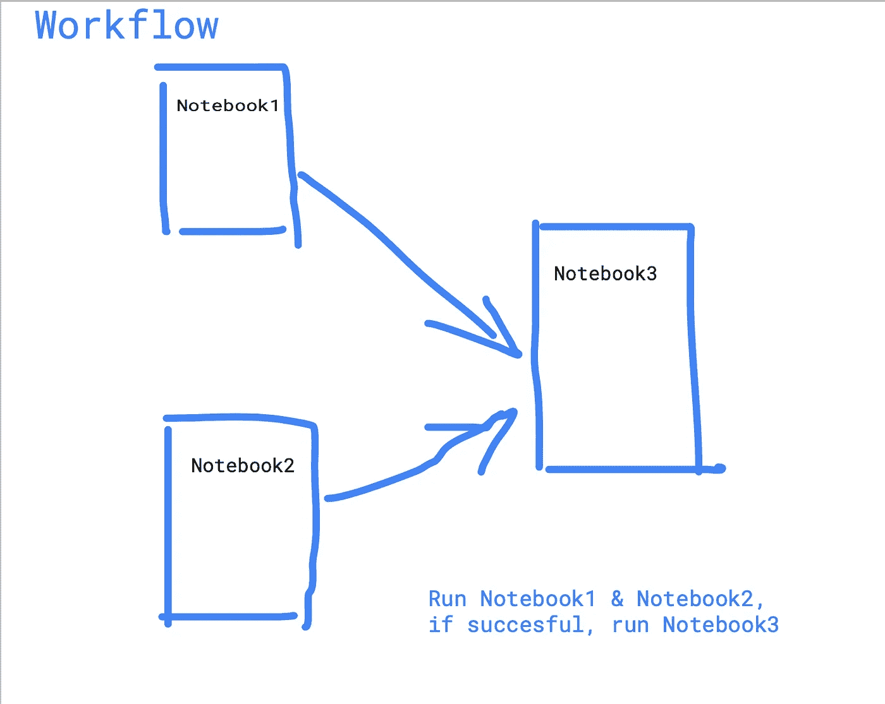

# Bayesnote:重新定义笔记本

> 原文：<https://towardsdatascience.com/bayesnote-redefine-notebook-2ab00277bbc?source=collection_archive---------42----------------------->

## 数据科学家和工程师值得拥有更好的笔记本电脑

数据科学家和数据工程师对平台/基础架构/工具不满意，即使可以轻松访问云提供的所有托管服务(例如 AWS)。他们的问题(抱怨)从最低到最高的技术堆栈都有:“我如何使用 Spark 启动一个与我的笔记本电脑具有相同外部依赖性的集群？”。从数据应用的开发到运行，他们也感到头疼:“如果其中一个出现故障，我如何自动重新运行许多相互依赖的笔记本？”

现代数据科学和工程的挑战源于其多样性，从某种意义上说

1.  可交付物和可交付物的形式多种多样:脚本/代码、数据集、报告、幻灯片、图表、仪表盘、机器学习模型、API、web app 等。
2.  处理和存储数据的工具多种多样:有运行了 20 多年的古代甲骨文数据库；有 Hadoop、Spark 这样的开源工具；通常一个项目会用到多种语言及其开发环境，Python、SQL、R、Scala，甚至 Matlab。
3.  数据团队成员的技能是多样的:一方面是工程技能谱，一些工程师为 Spark Core 做出贡献，可以管理一个 Kubernetes 集群；另一边是业务分析师，他们精通 SQL 和 Excel，具有深厚的领域知识。
4.  工程带宽和数据团队的团队结构是多样化的:有“成熟的”数据团队，由软件工程师、数据平台工程师、数据工程师、机器学习工程师、数据科学家和业务分析师组成；在旧金山，有些初创公司雇不起一名平台工程师。

这种多样性与来自工程和业务团队的外部问题纠缠在一起，如上游数据中断、缺乏运营支持和模糊的业务请求，导致数据科学和工程变得更加复杂、困难和具有挑战性。

在过去的十年里，计算机硬件、软件和服务的进步缓解了这些问题。所有云提供商都提供预装开源工具的高内存实例，消除了购买、维护和配置硬件的负担。Apache Spark 的采用通过提供一个统一的工具来读取数据、处理数据并在内存中构建机器学习模型，从而显著提高了数据团队的生产力。一家位于旧金山的初创公司提供构建和维护 SQL 就绪表的服务。

鉴于这些变化，数据科学和工程的瓶颈不再是 24tb 超高内存实例或已经将处理速度提高了 10 倍的内存处理框架。瓶颈逐渐从硬件和系统级软件转移到为数据科学家和数据工程师构建的工具上:

1.  该操作被忽略。例如，当数据科学家在每天早上 6 点刷新的笔记本中构建报告时，他/她必须至少设置一个在早上 6 点运行的 cron 作业，如果失败则重新运行，并通过电子邮件发送报告。或者她/他可以学习需要工程师操作工作流工具本身的工作流工具，例如主要为数据工程师设计的气流。或者，她/他可以每天一早去办公室，手动运行一切。
2.  在多个开发环境之间来回切换，笔记本电脑和服务器降低了开发速度。数据处理通常需要多种语言，SQL、Python、R 和 Scala 等，并且多种开发环境，包括 IDE、notebook、SQL 控制台和可视化工具被切换用于数据科学和工程的迭代性质。将原型笔记本电脑从笔记本电脑转移到集群进行生产时，会出现意想不到的问题。
3.  现实中的技能差距。理想情况下，正在构建机器学习模型的数据科学家，如果对可伸缩性没有特别高的要求，应该部署并监控自己，以提高迭代周期的速度。然而，在现实中，拥有统计或商业专业知识的数据科学家认为，这种工程技能的学习成本可能太高。难题是，如果没有分配工程带宽，数据科学家笔记本电脑中的模型对业务的影响很小，而额外的工程带宽往往成本高昂，尤其是在旧金山湾区。

Jupyter 笔记本、Zeppelin 笔记本和其他笔记本在数据科学家和数据工程师中非常受欢迎。然而，这些笔记本的构建目标有限:提供交互式计算环境，仅解决现代数据团队的一小部分问题，尤其是笔记本的操作缺失。数据应用程序的开发和操作，包括仪表板和机器学习模型，是缓慢、昂贵和痛苦的。

想象一下，在集成笔记本环境的帮助下，数据科学家可以交付仪表板，而无需往返于 ide、SQL 控制台、仪表板工具、云 web 控制台和终端；数据科学家可以建立管道来刷新由多个相互依赖的笔记本构建的报告，而无需学习另一个 python 框架/库，也无需向工程人员寻求帮助。数据科学家可以开发和部署机器学习模型，并在任何时候迭代该模型，而无需将模型交给工程团队。

除了交互式计算环境之外，我们的目标是构建一个无摩擦的集成笔记本环境(INE ),它扩展了前人的目标:

*   真正的端到端(例如，从启动集群到向企业提供分析)
*   将笔记本电脑的开发和运营结合起来(例如，根据固定的时间表运行笔记本电脑)
*   以交付为导向，从笔记本电脑构建仪表板并部署机器学习模型

为了实现这一目标，我们构建了 Bayesnote，它引入了:

*   在一个笔记本中支持多种语言，跨单元共享内存变量(Python、SQL、R、Scala)
*   作为开发和操作环境的内置 Docker 容器
*   围绕笔记本电脑构建的工作流组件(想想笔记本电脑的气流)
*   一个仪表板组件和一个机器学习组件，可以很好地与笔记本集成。

前后 Bayesnote。由滕鹏创作

Bayesnote 主要从三个方面扩展了其前辈的目标:

1.  仅开发->开发和运营
2.  仅限笔记本->笔记本+工作流工具+仪表盘工具+机器学习工具+环境工具
3.  单一语言->多种语言

Bayesnote 的核心是一个交互式计算环境，类似于它的前辈 Jupyter Notebook，Zeppelin notebook 等。Bayesnote 的统一笔记本层作为后端构建在其他笔记本之上，因此 1。Bayesnote 的其他组件(例如工作流组件)将与这个统一的笔记本层交互，而不是与 Jupyter notebook、Zeppelin notebook 等交互。2.其他数据平台工具，例如 Airflow，也可以与统一笔记本电脑层进行交互，这对于其他笔记本电脑来说很难，如果不是不可能的话。

Bayesnote 的工作流组件是运营与数据科学相遇的地方。该工作流与为工程师构建的其他工作流系统共享“工作流定义为代码”的相同理念，遵循最佳工程实践。然而，它也承认直观的用户界面是为数据科学家构建的工具的最重要的设计考虑之一。工作流系统是围绕笔记本而不是功能构建的，而功能是其他为数据工程设计的工作流系统的调度单元，例如 Airflow，将学习成本降低到几乎为 0。

工作流示例。由滕鹏创作

Bayesnote 提供了一个仪表板和机器学习组件，允许数据科学家从笔记本电脑上构建仪表板和迭代机器学习模型。传统的仪表板工具只提供一个 SQL 控制台，因此数据科学家被迫在其他脚本语言数据处理工具和 SQL 控制台之间来回切换，向磁盘读写数据，以便在工具之间共享数据。这是低效和乏味的，减慢了仪表板构建的迭代周期。在迭代机器学习模型方面，数据科学家也面临着类似的情况。

有了 Bayesnote，数据科学家和数据工程师最多只需要很少的学习成本就可以成为全栈工程师，至少痛苦会减少 10 倍，生产力会提高 10 倍。

0.1-alpha 已经发布。在这里查看[截图](https://github.com/Bayesnote/Bayesnote)。开始回购来支持我们。https://github.com/Bayesnote/Bayesnote