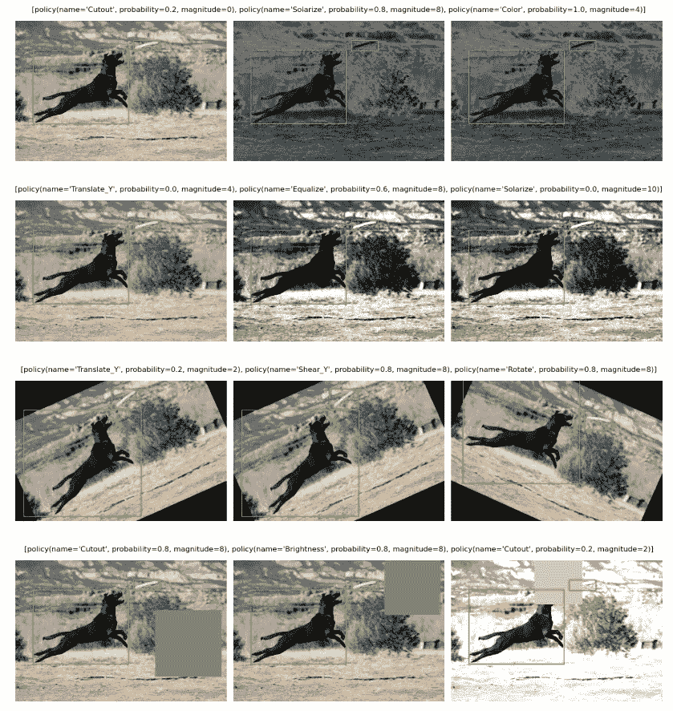
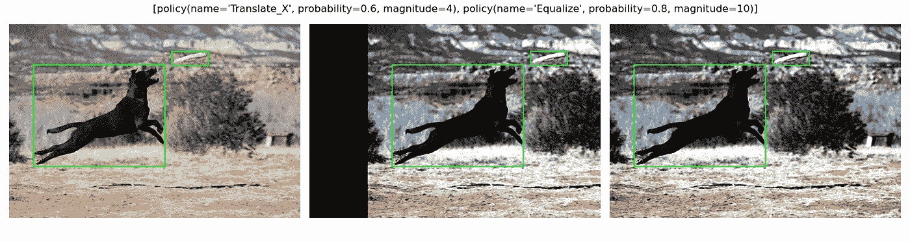
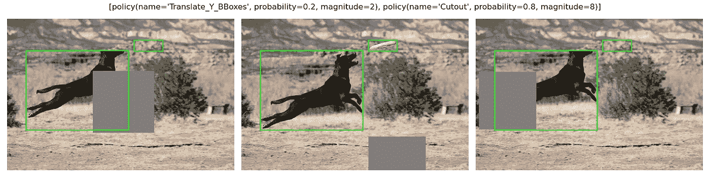
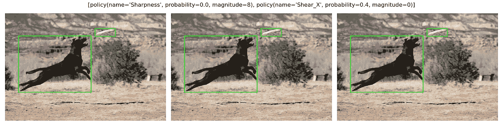
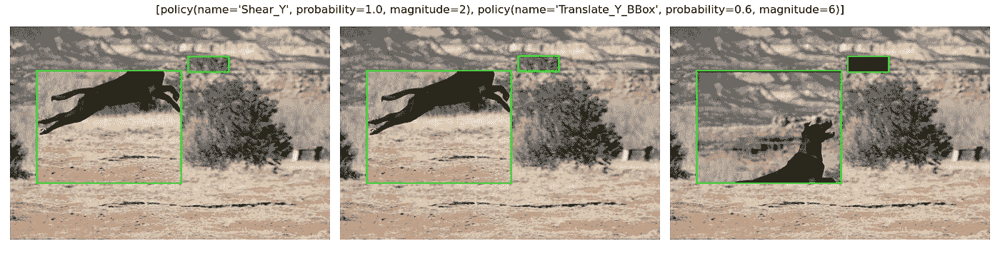
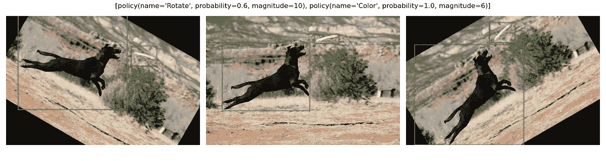
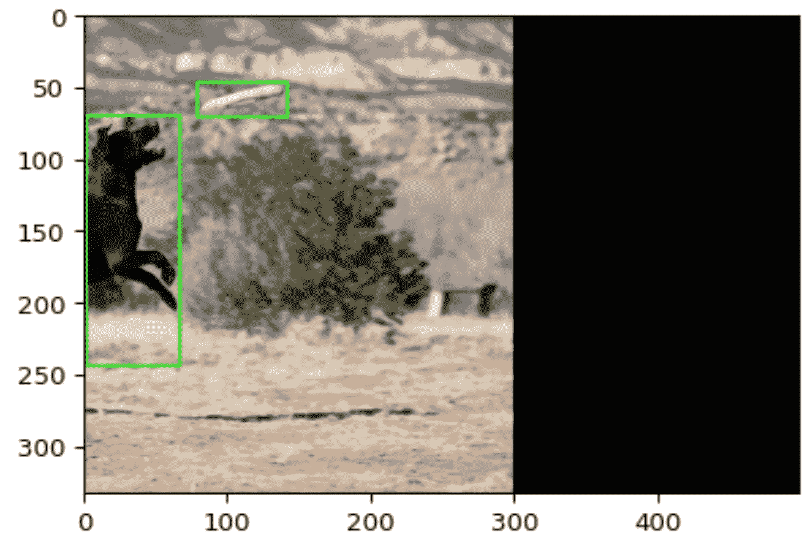
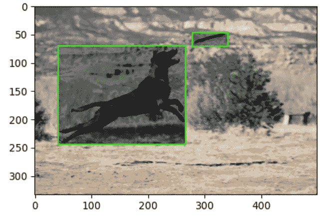

# BBAug:py torch 中的包围盒增强包

> 原文：<https://towardsdatascience.com/bbaug-a-package-for-bounding-box-augmentation-in-pytorch-e9b9fbf1504b?source=collection_archive---------37----------------------->



[股票图片来源](https://www.flickr.com/photos/35468148654@N01/3248455087)

## Google Research，Brain 团队制定的增强政策的实施

**链接:**

*   [论文](https://arxiv.org/pdf/1906.11172.pdf)
*   [张量流策略](https://github.com/tensorflow/tpu/blob/2264f53d95852efbfb82ea27f03ca749e1205968/models/official/detection/utils/autoaugment_utils.py)
*   [BBAug](https://github.com/harpalsahota/bbaug)

O 像许多神经网络模型一样的对象检测模型在对大量数据进行训练时效果最佳。通常情况下，可用数据有限，世界各地的许多研究人员都在寻找增强策略来增加可用数据量。其中一项研究是由谷歌的大脑团队进行的，并发表在一篇名为[学习对象检测的数据增强策略](https://arxiv.org/abs/1906.11172)的论文中。在这篇论文中，作者确定了一组称为策略的扩充，它们对于对象检测问题表现良好。通过搜索提高一般模型性能的扩充来获得策略。

作者将增强策略定义为一组子策略。当模型被训练时，这些子策略中的一个被随机选择并用于增强图像。在每个子策略中，是一个接一个地应用于图像的增强。每个变换也有两个超参数:概率和大小。概率陈述了这种增强将被应用的可能性，而幅度表示增强的程度。下面的代码快照显示了本文中使用的策略:

```
policy = [      
  [('TranslateX_BBox', 0.6, 4), ('Equalize', 0.8, 10)],        
  [('TranslateY_Only_BBoxes', 0.2, 2), ('Cutout', 0.8, 8)],     
  [('Sharpness', 0.0, 8), ('ShearX_BBox', 0.4, 0)],      
  [('ShearY_BBox', 1.0, 2), ('TranslateY_Only_BBoxes', 0.6, 6)], 
  [('Rotate_BBox', 0.6, 10), ('Color', 1.0, 6)],
]
```

该策略中有 5 个子策略，如果我们采用第一个子策略，它包含 *TranslateX_BBox* 和*均衡*增强。 *TranslateX_BBox* 操作将图像在 x 轴上平移 4 倍。在这种情况下，幅值不直接转换成像素，而是根据幅值换算成像素值。该增强还具有 0.6 的概率，这意味着如果选择该增强，则有 60%的机会应用该增强。随着每个增强具有相关的概率，引入了随机性的概念，为训练增加了一定程度的随机性。总的来说，大脑团队总共提出了 4 个策略:v 0、v1、v2 和 v3。本文中显示了 v0 策略，其他三个策略包含更多的子策略，这些子策略具有几种不同的转换。总体而言，这些增强分为三类，作者将其定义为:

> **颜色操作**:扭曲颜色通道，不影响边界框的位置
> 
> **几何操作:**几何扭曲图像，相应地改变边界框的位置和大小。
> 
> **包围盒操作:**仅扭曲包围盒注释中包含的像素内容

# BBAug

那么，这与什么有关呢？BBAug 是一个 python 包，它实现了 Google Brain 团队派生的所有策略。这个包是一个包装器，可以更容易地使用这些策略。实际的增强是由优秀的 [imgaug](https://imgaug.readthedocs.io/en/latest/index.html) 包完成的。

上面显示的策略应用于一个示例图像，如下所示。每行是不同的子策略，每列是所述子策略的不同运行。



[股票图片来源](https://www.flickr.com/photos/35468148654@N01/3248455087)

如您所见，子策略的运行之间存在一定程度的差异，因此增加了训练的随机性。这只是 BBAug 实施的 4 项政策之一。要全面了解所有 4 项政策，请查看软件包的 [GitHub 页面](https://github.com/harpalsahota/bbaug)。该软件包还提供了一些有用的功能，如自定义策略的可能性，以及位于图像外部的边界框(如果它们部分位于图像外部)会被自动删除或裁剪。例如，在下图中，应用了平移增强，将边界框部分推出图像。你可以看到新的边界框已经缩小，以适应这一点。



[股票图片来源](https://www.flickr.com/photos/35468148654@N01/3248455087)

也可以创建仅影响边界框区域的增强。在下图中，曝光增强仅应用于边界框区域:



[股票图片来源](https://www.flickr.com/photos/35468148654@N01/3248455087)

如果你想了解更多信息，这个包还附带了一个[定制增强](https://github.com/harpalsahota/bbaug/blob/master/notebooks/custom_augmentations.ipynb)笔记本。

用随机策略扩充单个映像有多容易？就像这样简单:

您首先需要从 BBAug 包中导入策略模块。在本模块中，有 4 种不同的政策可供您选择。在上面的示例中，选择了策略集 v0，因为这是本文中使用的策略集。该模块还附带了一个容器类，它将保存我们选择的策略，选择一个随机策略，并将随机选择的策略应用到图像。第 7 行用我们选择的增强策略实例化了策略容器。下一段代码选择了一个随机增强。最后，我们对图像进行放大。只需 5 行代码，我们就可以对图像进行增强。这是一个相当简单的例子，如何将其扩展到训练模型？幸运的是，这个包附带了一个笔记本[来演示如何将 BBAug 整合到 PyTorch 培训管道中。](https://github.com/harpalsahota/bbaug/blob/master/notebooks/example_run.ipynb)

## 结论

这个包实现了由 Google Brain 团队导出的增强策略。目前，所有 4 项政策均已实施，该套件附带笔记本电脑，可帮助用户将这些政策整合到他们的 PyTorch 培训渠道中。我强烈推荐查看软件包的 GitHub 页面，以便更好地理解所有政策和例子。

快乐充实！