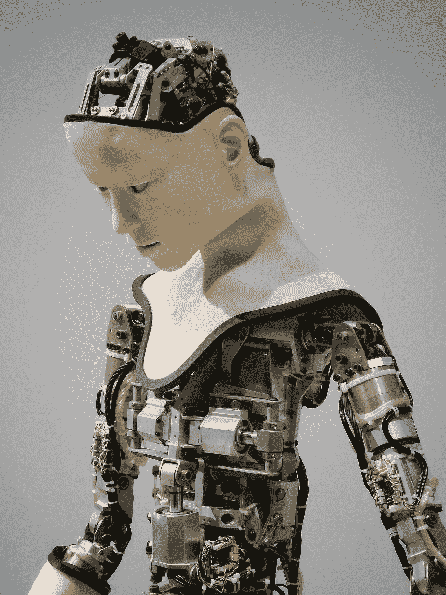

# 做一个好父母。像养育自己的孩子一样养育人工智能。

> 原文：<https://towardsdatascience.com/be-a-good-parent-nurture-ai-like-your-own-child-22e035d971e4?source=collection_archive---------49----------------------->

## 训练 AI 和养孩子没什么区别。那些行为不端的人只是在寻求指导。

在 [Unsplash](https://unsplash.com/s/photos/artificial-intelligence?utm_source=unsplash&utm_medium=referral&utm_content=creditCopyText) 上由 [Franck V.](https://unsplash.com/@franckinjapan?utm_source=unsplash&utm_medium=referral&utm_content=creditCopyText) 拍摄的照片

人工智能(AI)。有人认为它是解决问题的未来，是现有解决方案的优化器。他是发现我们人类做梦也想不到的想法的先驱。但这也是[极具破坏性的](https://www.forbes.com/sites/jasonbloomberg/2018/07/07/think-you-know-how-disruptive-artificial-intelligence-is-think-again/#2fdbe0953c90)——改变了各行业的发展势头，并向我们展示了需要考虑的新因素。我们一直担心人工智能会如何终结我们的物种，成为决定不服从我们指令的全能统治者。

不承认我们应该关注人工智能的某些方面是愚蠢的。然而，到目前为止，这个问题不是关于处理流氓有知觉的人工智能。具有讽刺意味的是，我们应该担心的是，人工智能可能会很好地遵循我们的指令。

# 艾对待事物太过字面化

AI 的思维过程本质上是线性的:遵循从 A 到 B 的逻辑，不择手段完成任务。对他们来说，目标是唯一的目的。谁挡了他们的路，谁就被视为阻碍他们实现目标的障碍。然后，人工智能将其作为想要根除的问题进行处理。

## 艾，无辜的孩子

艾像个孩子。作为一张白纸出生在这个世界上，它什么都不知道，直到有人教它一些东西。它不能区分对错，因为对它来说，只要有助于他们更接近目标，一切都是合乎道德的。由于缺乏道德、价值观和核心指导原则，它不知道如何权衡决策中的不同因素。

# 人类和数据——父母

人工智能受训练环境的影响很大。间接地，我们作为人类所具有的偏见可能会被人工智能意外地学习到。2018 年，亚马逊不得不报废他们的人工智能招聘工具[，因为它歧视女性](https://www.reuters.com/article/us-amazon-com-jobs-automation-insight/amazon-scraps-secret-ai-recruiting-tool-that-showed-bias-against-women-idUSKCN1MK08G)。通过无意中加入过去表现出偏见的简历，人工智能被训练成这样做。人工智能相信它正在做正确的事情，因为那是他被教导的。这类似于糟糕的养育方式——孩子被塑造成相信他的行为是正确的，但事实并非如此。

为了避免这种情况，我们需要某种形式的监管。一个设定人工智能可以做什么的可接受界限的老师。这就是我们应该如何对待人工智能安全。做一次，让人工智能学习，然后让它做自己的事。可以理解，这是一项非常艰巨的任务。如果在价值观方面存在某些灰色地带怎么办？如果有太多的禁忌来定义它呢？

我的观点是，我们可以把我们的法律体系作为基础。我们今天拥有的法律反映了我们所认同的价值观。这允许我们使用定量的方法来定义人工智能可以运行的安全区域。我们在选择数据时也应该更加谨慎和深思熟虑。为了让人工智能做好事，我们需要在它发展的早期阶段教好它。因此，更大的重点应该放在确保人工智能所学的至少在本质上是道德的。

## 反思的需要

[好的育儿方式](https://kidshealth.org/en/parents/nine-steps.html)不是控制孩子。这不是我们想从 AI 身上实现的。人工智能的力量在于它能够超越盒子思考，超越人类的创造力，并提供新颖的解决方案。我们不想告诉它如何思考。我们想让那个孩子独立。

这里的诀窍是知道什么时候握住它的手，什么时候松开。作为父母——企业、研究人员和政府都一样——我们的目标很简单。定义和执行。

定义。去理解什么对整个人类来说是重要的。在人工智能时代，没有比现在更好的时间来反思对我们人类来说很重要的价值观。我们需要讨论如何向前迈进，成为更好的父母，以防止事故发生。

强制执行。以确保每个人都在为可靠、安全的人工智能的发展尽自己的一份力量。我们所有人都需要意识到 AI 安全的必要性。这不仅仅是一个人的工作，而是我们所有人的责任。

在未来的时间里，人工智能将承担越来越多对我们的生活产生重大影响的更重要的任务。我们需要从现在开始，先解决较小的问题作为试验，然后才能说我们有信心迎接更大的挑战。