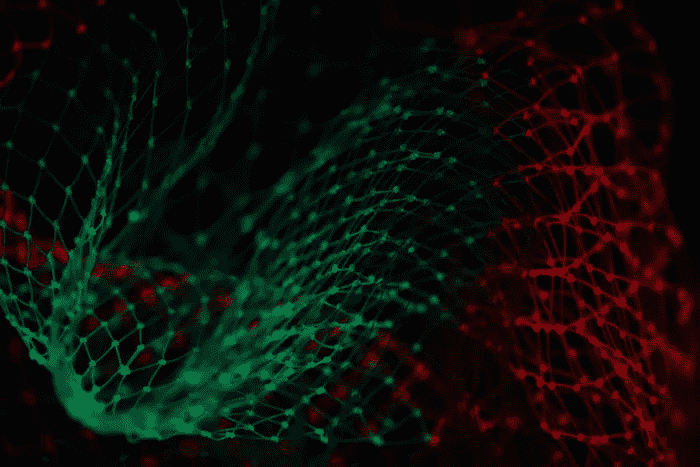

# 让我们谈谈在数据科学中应用批判性思维

> 原文：<https://towardsdatascience.com/be-a-great-scientist-not-just-a-data-scientist-cf8e776496ab?source=collection_archive---------73----------------------->

[https://unsplash.com/photos/n6B49lTx7NM](https://unsplash.com/photos/n6B49lTx7NM)

## 做一个伟大的“科学家”，而不仅仅是一个“数据”科学家

我想讲一个关于伟大科学家乔斯林·贝尔的故事，他发现了中子引发的无线电脉冲。在写论文的时候，她正在用手检查图表记录器的输出。她观察到一些异常现象，她称之为“一点残渣”，不符合类星体产生的模式。有一些有趣的东西通过她的望远镜产生了这些无线电波。最终她排除了所有潜在的来源，并得出结论，它们是由中子星构成的。这一发现被授予 1974 年诺贝尔物理学奖。她的发现是非凡的，但也注意到了以下几点。首先，她用手分析数据。第二，她非常了解自己工具，不会被它愚弄。第三，在她训练有素的眼睛看来，她没有像其他“邋遢鬼”一样，把这种异常现象视为离群值而不予考虑。对她来说，这个异常现象看起来很有趣。第四，她凭直觉推断出一点邋遢的真正原因。

由于媒体和学术界对数据科学的关注，越来越多的毕业生进入该领域或希望将职业生涯转向数据科学的专业人士。毫无疑问，以下问题经常出现:成为一名优秀的数据科学家需要哪些技术技能？一般来说，优秀的数据科学家擅长使用 Python 或 R 构建模型，擅长编写 SQL 查询，并且理解因果关系(推理)。)这些技能将为你提供工具，对你在大多数工作中会遇到的大量数据进行清理、操作和建模。然而，数据科学所需的*特定*技能类型高度依赖于组织规模、行业、团队成熟度以及最终的分析目的。有些工作只需要线性或逻辑回归，而其他工作可能需要复杂的算法和可视化技术。

但是这个答案并没有描述一个好的数据科学家的全貌，它只是提到了作为一个数据科学家的“数据”。它没有解决最关键的部分，也就是“科学家”科学家是展示高度批判性思维的人。批判性思维意味着观察、反思、质疑和决定的能力。就像乔伊泽林·贝尔发现异常时一样。一个科学家问，为什么输出有意义？它符合我的直觉吗？我如何验证输出？结果是否解决了业务问题？科学家有能力通过从多个角度评估问题和解决方案来进行独立和反思性的思考。

我曾经读到过，大约 90%的数据科学项目失败或无法实现。这是对努力和才能的巨大浪费。从我自己管理多个行业的数据科学家的经验来看，我认为失败率如此之高是因为专注于一个“数据”科学家的工具堆栈，而不重视批判性思维。正如我的大一微积分教授曾经告诉我们的:“我可以教猴子做微积分，但我不能教猴子思考。”我相信我们已经忘记了作为科学家。

那么，成为一名优秀的科学家意味着什么？它意味着拥有解决问题的系统方法，意味着对正在解决的问题充满好奇，意味着坚持不懈地理解业务问题，意味着拥有特定的假设，意味着拥有测试假设的可测量的成功指标，意味着对解决方案有直觉，意味着能够在不使用技术术语的情况下施加影响。贝尔博士是“数据科学家”的一个极好的例子。她对自己的工具了如指掌，这也是她没有将异常现象视为异常事件的原因。她用手检查她的输出，以免遗漏任何东西。当她发现一些看起来不对劲的东西时，她跟着直觉走。她有条不紊地排除了所有可能导致脏污的来源。我在面试中问的一个典型问题是，你分配了多少时间来理解业务问题、检查数据、决定应用适当的方法以及分析结果。根据我的计算，大多数数据科学家花在分析和质疑模型输出上的时间不到 10%。优秀的科学家在向经理或商业利益相关者报告结果之前，会花更多的时间来审查、分析和质疑结果。

简而言之，要成为一名优秀的全栈“数据科学家”，你需要了解技术工具(SQL、Python/R、ML 框架/方法论、统计学等。)，而且你需要系统化，对问题的“如何”和“为什么”有好奇心，对业务问题有良好的直觉。掌握这些工具更容易，因为这只是时间问题，但成为一名科学家需要沉浸其中，需要跟随你的直觉，需要对问题和解决方案有一个深思熟虑的理解。下次分配项目时，我们都应该考虑一下乔斯林·贝尔的流程。