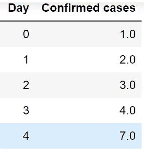
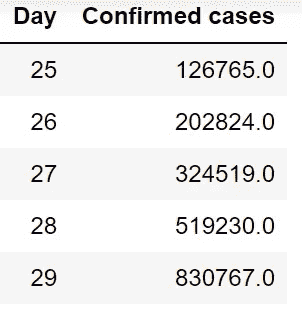
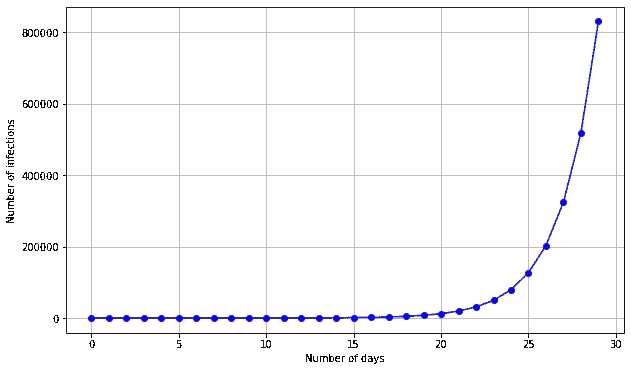
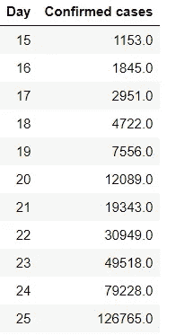
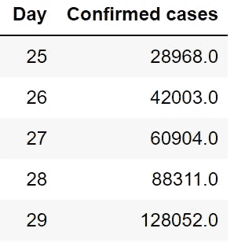
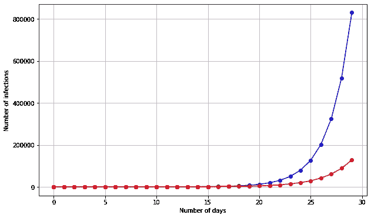
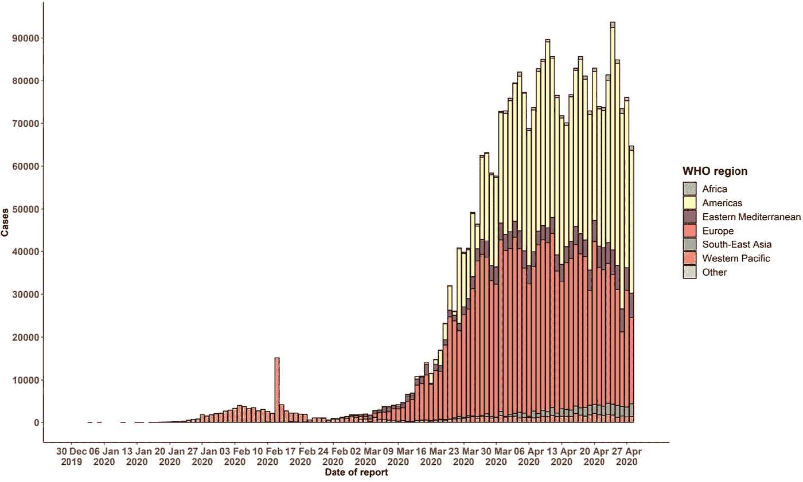

# 做一个英雄:积极预防新冠肺炎

> 原文：<https://towardsdatascience.com/be-a-hero-taking-an-active-role-in-preventing-covid-19-2cdba6419cda?source=collection_archive---------65----------------------->

## 一个简单的模型解释了像洗手和社交距离这样的琐碎措施如何有助于抑制疫情

丹尼尔·利维斯·佩鲁西在 [Unsplash](https://unsplash.com/s/photos/hero-virus?utm_source=unsplash&utm_medium=referral&utm_content=creditCopyText) 上的照片

***编者按:*** [*走向数据科学*](http://towardsdatascience.com/) *是一份以数据科学和机器学习研究为主的中型刊物。我们不是健康专家或流行病学家，本文的观点不应被解释为专业建议。想了解更多关于疫情冠状病毒的信息，可以点击* [*这里*](https://www.who.int/emergencies/diseases/novel-coronavirus-2019/situation-reports) *。*

一些遏制新冠肺炎病毒传播的措施可能看起来微不足道、过度、荒谬至极，但它们背后都有一个基本原理，在抗击这场疫情病毒的斗争中，它们是必不可少的。让我们面对现实吧，我们都希望一切恢复正常，但是用肥皂和水洗手是如何帮助我们实现这一目标的呢？

为了回答这个问题，我们将提出一个简单的模型，它将允许我们探索病毒如何传播，然后，通过调整一些参数，我们将看到这些措施是否在控制病毒传播方面具有重要作用。

想象一下这个叫做瓦昆达的完美国家(看看我在那里做了什么)，那里一切都阳光明媚，因为他们充分利用了人工智能的力量。然而，一种神秘的高传染性疾病在该国出现，最初，只有一个人被感染，我们将称他为 Tchulu(别担心他不是王子)。尽管有奇怪的迹象和症状，Tchulu 没有去医院，并决定坚持到底。晚上，他和他的四个朋友互动，不幸地感染了其中的两个。巧合的是，这些被感染的朋友中的每一个也与另外四个人相互作用，他们每人感染两个。如此循环下去，在短短几周内，如此多的人被感染，这个国家就有麻烦了。

为了获得更清晰的认识，让我们用稍微抽象一些的术语来描述这种情况:

1.  让 **Nₜ** 代表一天开始时的感染人数 **t** 。在我们的例子中， **N₀** =1，因为在疫情(第 0 天)开始时只有一个人被感染，而 **N** ₁=3，因为楚鲁后来感染了两个人。
2.  让 **𝐸** 代表每个感染者一天内交往的平均人数。在我们的例子中 **𝐸** =4
3.  设 **𝑟** 代表感染率，即每个暴露者被感染的概率。在我们的案例中，平均暴露量约为 4 人，其中 2 人感染，因此， **𝑟 = 4/2 = 0.5**
4.  让**δnₜ**代表一天结束时的新病例数。
5.  最后，**δnₜ**=**𝐸×𝑟×nₜ**。在我们的例子中，第 0 天结束时的新病例数( **N₀** )将由 **N₀=4×0.5×1=2** 给出，这是真实的，因为在一天结束时，楚鲁感染了他的两个朋友。

所以我们现在可以用上面的符号来得出一些有趣的方程。

要获得一天结束时的案例总数，我们需要做的就是将当前案例数加上新案例数，即:

## **nₜ**₊₁=nₜ+𝐸×𝑟×nₜ

通过分解出 **Nₜ** ，这可以被**和**简化为:

## **Nₜ₊₁ = Nₜ(1+𝐸×𝑟)**

如果我们用 **N₀** 来表示，我们得到:

## **Nₜ = N₀(1+𝐸×𝑟)ᵗ**

这给了我们一个等式，我们可以用它来预测疫情某一天的感染人数。例如，10 天后，瓦昆达的预期病例数将为:

**𝑁₁₀=1×(1+4×0.5)⁰=(3)⁰= 59049**

20 天内的预期病例数为:

**𝑁₂₀=1×(1+4×0.5)⁰=(3)⁰= 3486784401**

这只是一个荒谬的估计，因为我们高估了感染率，因此我们将使用一个更合理的比率 0.15

数学已经讲得够多了，很无聊吧，让我们回到主题上来。使用上面的等式，我们可以对前 30 天内的疾病进展进行建模。为此，我将求助于 python(如果你不知道如何编程，可以跳过代码片段)

首先，我们将为此定义一个函数

接下来，我们将使用以下参数应用该建模函数:

1.  **E = 4，**因为平均来说，每一个感染者都会与其他四个人发生互动。
2.  **r = 0.15** ，即感染率。
3.  **N₀ = 1，**由于疫情开始时只有一人被感染

现在，我们可以查看数据，了解病例数在前 30 天内是如何变化的

前 5 天内的病例

过去 5 天内的案例

我们可以看到短时间内案件数量的急剧上升。为了更好地理解这一点，让我们用图表来直观地展示数据

相对于天数的案例数

我们有一条指数曲线。最初，受感染的人数相当低，很容易把这种病毒当作一场骗局而不予理会，并一直忽视专家的建议，但突然，从我们的情况来看，从第 20 天开始，人数迅速增加，以至于变得势不可挡，这反映了我们在目前的新冠肺炎疫情中所看到的情况。

请注意，在第 15 天，只有 1153 人被感染，但在短短 10 天内，这个数字上升到超过 126000 人

这让我们回到了最初的问题，这些措施如何有助于遏制疫情？为了回答这个问题，我们将回到我们神秘的国家，在考虑一些相当琐碎的措施之前，先探讨一下严厉措施的影响。

现在想象一下，在第 10 天，瓦昆达政府认识到这是疫情，并采取措施遏制其传播。所以他们首先隔离、隔离和治疗感染者。他们还呼吁封锁，但这是没有必要的，因为聪明的公民很快练习安全的社交距离。这些措施最终减少了暴露于该疾病的平均人数(从平均 4 人减少到 3 人)。现在让我们看看这如何影响未来 20 天内的病例数。

(这里我们只需要将初始模型中的 **E** 参数从 4 减少到 3 **)**

我们现在可以查看数据，看看这些措施是否会导致病例数的任何变化。

严格措施后最近五天内的案例

由于采取了这些措施，感染总人数从最初预测的 830，767 人减少到 128，052 人，相当于约 702，715 人免于感染。我们可以从下图中直观地感受到这一点:

相对于天数的案例数。初始投影显示为蓝色，而新投影显示为红色

这可能是一个过于乐观的估计，因为在现实生活中很难识别和隔离每个受感染的人，但尽管如此，从模型中，我们可以直观地了解平均暴露量的微小变化如何导致感染总数的巨大下降。因此，呼吁呆在家里，避免拥挤的空间，并在你出现一些迹象和症状的情况下去医疗机构，这不是轻率的，而是非常重要的，以阻止疫情。所以请听从召唤。

更实际的情况。我们可以说，并非瓦昆达的每个人都坚持社会距离，政府也无法确定每个感染者。然而，一些聪明的家伙仍然遵循简单的指示，他们实践一些看起来微不足道的措施:他们避免拥挤的地方，洗手，在公共场所戴上口罩和其他个人防护设备等等。尽管暴露在外，他们小小的努力减少了患病的机会，这转化为感染率从 0.15 到 0.145 的微小降低

使用我们的模型让我们检查他们的努力是否有意义。

像往常一样，我们检查新数据，看看病例数是否有变化

采取微不足道的措施后最近五天内的案例

这些努力虽然看起来微不足道，但在 30 天结束时使 176，316 人免于感染。这些数字可能没有上面的数字那么引人注目，但它们仍然表明，在减少疫情的影响方面，每一项努力都大有作为。我们还对指数函数的本质有一个直觉:对参数的微小调整会导致输出的巨大变化。

我们可以从下图中直观地感受到这些努力的影响:

相对于天数的案例数。初始投影显示为蓝色，而新投影显示为绿色

这看起来并不多，但是每一次努力，不管多么少，都可以挽救一条生命。

上面的模型非常简单，它表明一旦感染开始，就无法停止，每个人迟早都会被感染。这是因为它假设感染率保持不变，没有人康复并停止传染。然而，这些假设没有一个是正确的，但这个模型仍然给出了疫情早期阶段的完美画面。

这里的主要教训是，个人和集体的努力，尤其是在早期——当病例很少并且似乎无关紧要时——是非常重要的。面对疫情，那些看似琐碎的指令，如洗手和保持社交距离，是消灭任何传染病的有力武器。令人兴奋的是，这些武器就在你手中，你所要做的就是使用它们；做一个超级英雄，拯救生命。

为了证实这个模型及其教训的准确性，让我们看一些真实世界的数据

各地区新冠肺炎确诊病例流行曲线。图片由[威廉·m·德特默，医学博士](http://www.unboundmedicine.com/about/leadership#articlepos-1)，维亚，[自由医学](https://relief.unboundmedicine.com/relief/view/Coronavirus-Guidelines/2355041/all/Epidemic__Epi__Curves_for_Coronavirus_COVID_19)

你可以看到这些曲线是指数型的，从前面的讨论中，你现在知道每一点小小的努力都可以大大减少病毒的传播。

事实上，流行曲线是逻辑的而不是指数的。考虑下图:

图片由杰夫·克鲁赞博士通过 T2 发送

有一个最初的滞后阶段，感染人数增长缓慢；感染人数快速增长的指数阶段和感染人数逐渐减少的递减阶段，之后曲线变平(渐近线),没有报告新的感染。

曲线的变平是每个人努力的目标，这个过程可以通过我们个人和集体的努力来加速。我们都有自己的角色。

负责任，做英雄，拯救生命，愿原力与你同在。