# 探索性数据分析

> 原文：<https://towardsdatascience.com/be-friends-with-your-data-f03f2ecc8dc3?source=collection_archive---------25----------------------->

## 与您的数据成为朋友

照片由[杜凡](https://unsplash.com/@miinyuii?utm_source=unsplash&utm_medium=referral&utm_content=creditCopyText)在 [Unsplash](https://unsplash.com/s/photos/friends?utm_source=unsplash&utm_medium=referral&utm_content=creditCopyText) 上拍摄

在这篇文章中，我们将使用 [Pandas 库](https://pandas.pydata.org/)浏览许多不同的 ***`Python`*** **函数、方法和属性**，它们在上传数据后对于**探索性数据分析(EDA)** 非常重要。然而，本文的目的是通过运行最少的命令来获取最多的信息。读完这篇文章后，你可以花更少的时间了解数据集，花更多的时间探索和建模。

## ***数据集***

分享一下我对概念的理解，我举一个 [**加州房价数据集**](https://www.kaggle.com/camnugent/california-housing-prices#housing.csv) 的例子。

大多数情况下，我们通过运行以下方法(以黑色书写)来启动 EDA，但是，如果我们仔细观察，我们可以只运行两个方法(以蓝色书写),并在运行所有这些方法后获得所有信息。

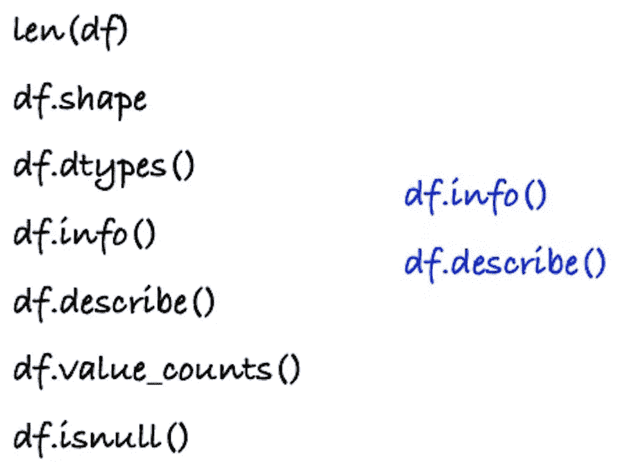

# **df.info()**

这个函数返回关于数据帧的信息，包括每一列的数据类型和整个数据的内存使用情况。

这是输出—

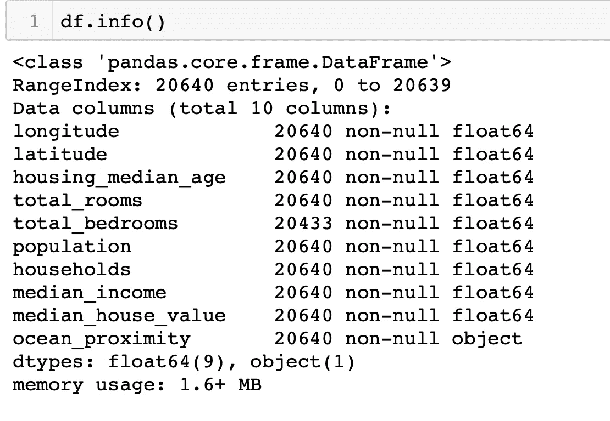

***我们可以从 df.info()中收集到什么信息:***

(I)它将打印出对象的数据类型，这是一个熊猫数据帧。<class></class>

(ii)数据帧中的条目或行数，以及行索引值的范围。
***记住—*** 这里第一个索引是 0，最后一个索引是(n-1)
*RangeIndex: 20640 个条目，0 到 20639*

(iii)关于每个数据列的信息，包括列名、条目数、它们是否具有非空值以及数据类型。

(iv)数据帧中每个数据类型的列数。
*dtypes: float64(9)，object(1)*

(v)最后，它显示了数据帧的内存使用情况。
*内存使用:1.6+ MB*

> **4 合 1** :除了上面提到的信息之外 **df.info()** 提供了我们运行这四个——**len(df)、df.shape、df.isnull、df.dtypes()后可以得到的所有信息。**

# **df.describe()**

该方法提供了数据框的汇总统计数据，如平均值、标准差和分位数值，这对于了解每列的数据分布非常重要。

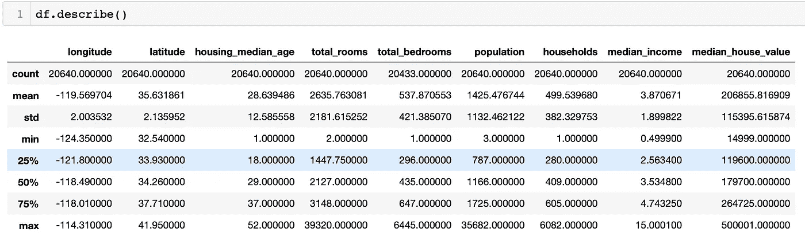

Pandas 提供了一个选项，我们可以使用**转置**功能转置上表。

***df.describe()。T*** 或 ***df.describe()。*转置()**

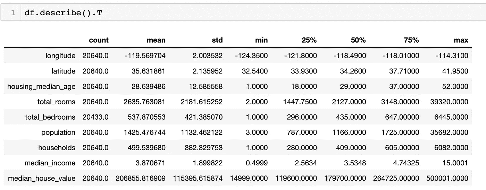

此外，还有某些汇总列，如“唯一值的计数”，可以通过传递选项***include = ' all '***来打印，描述方法如下。

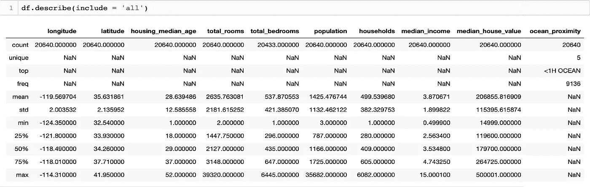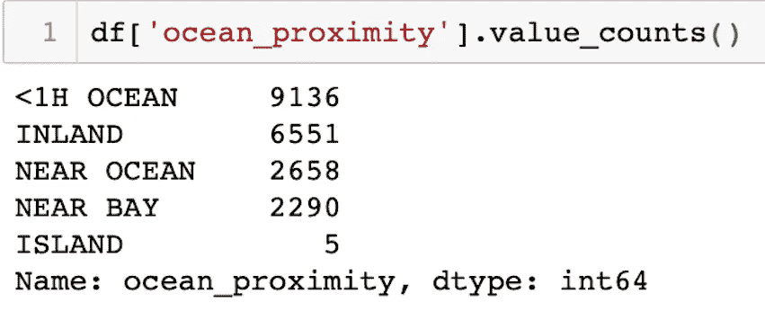

现在我们知道如何使用 **describe()** 方法得到数值变量的简要统计汇总。但是，如果我们有分类数据呢？在这种情况下， **value_counts()** 方法会很有帮助。

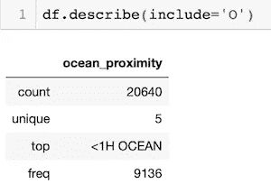

***记住—*** df.describe()只会给出数值变量的汇总[或者如果我们将 ***exclude='O'*** 作为参数传递，即 df.describe(exclude='O')]。而且，如果我们只对分类列感兴趣，可以通过 ***include='O'*** 。

统计数据让我们了解了包含缺失值的属性、特定属性的平均值和最大值，这在我们预处理和构建模型时非常有用。

> **4 合 1** :除了上面提到的信息 **df.describe()** 提供了我们运行这四个- **len(df)、df.shape、df.isnull、df.dtypes()后可以得到的所有信息。**

__________________________________________________________________

*这并不意味着这里讨论的这些方法/函数/属性***(****len(df)，df.shape，df.isnull，df.dtypes()]*** *没有用。人们应该记住，它们有自己的重要性，尤其是当你有兴趣了解你的变量的细节时。例如，如果您有 30 列，并且您想知道比如“abc”列的数据类型，您可以运行 info，但是运行 df[“ABC”]将是明智的。dtpyes()只知道特定变量的数据类型。**

*___________________________________________________________________*

*下面，我介绍了上面讨论的函数/属性的使用。*

## ***df . shape***

*该属性给出了 dataframe 的维度( ***df.shape*** )给出了一个元组( *n_rows，n_columns* )。Shape 还覆盖了数据帧的长度，这意味着运行 ***df.shape*** 还会给出在 EDA 期间可以从 ***len(df)*** 中得到的信息。*

*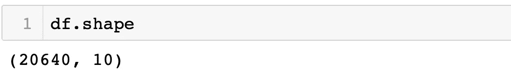*

## ****len(df)****

*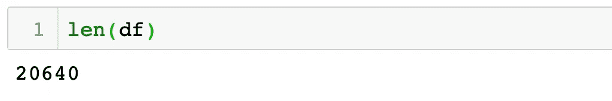*

***df.shape[0]** 或 **len(df.index)** 也给出了总行数。要知道数据框中的列数，我们可以使用 **len(df.columns)或 df.shape[1]。***

## ****df.dtypes****

*所有数据类型都在一个数据帧中，可以使用 **df *.dtypes.*** 打印*

*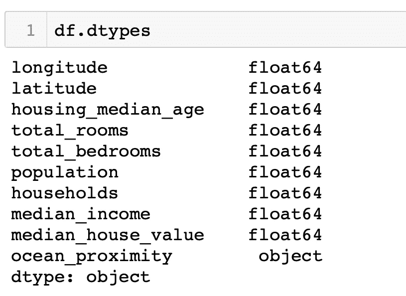*

*EDA 期间其他常用的方法有****df . head()***或 ***df.tail()*** 分别返回前 5 行和后 5 行数据。pandas 中的默认数字是五(5)，但是可以根据需要更改，只需在括号中输入数字即可。例如，df.head(3)将给出数据集的顶部三行，df.tail(10)将给出底部 10 行。**

**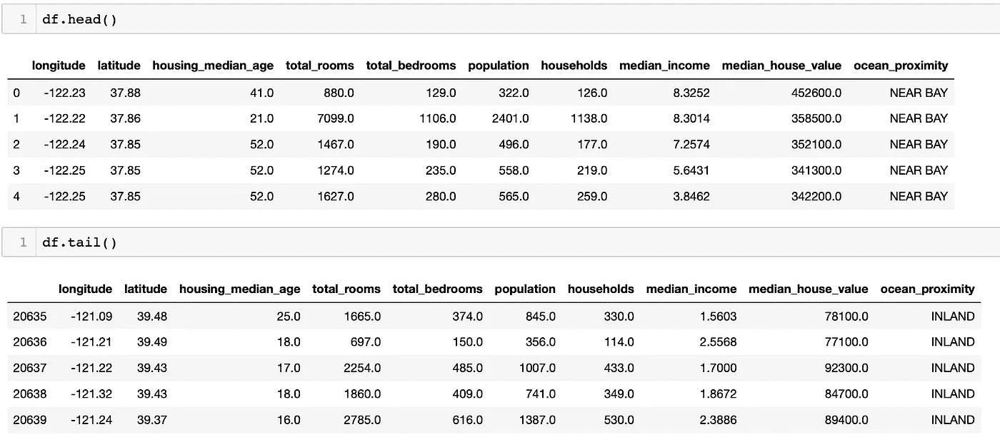**

**我希望，读完这篇文章后，人们能够花**更少的时间**去了解数据集，花**更多的时间**去探索和建模。**

***享受 EDA，感谢阅读😄。***