# 使用 Metaflow 更有效地生成机器学习管道

> 原文：<https://towardsdatascience.com/be-more-efficient-to-produce-machine-learning-pipeline-with-metaflow-db5f943ebbe7?source=collection_archive---------19----------------------->

## 网飞 Metaflow 2.0 的描述和炉石机器学习流水线的设计。

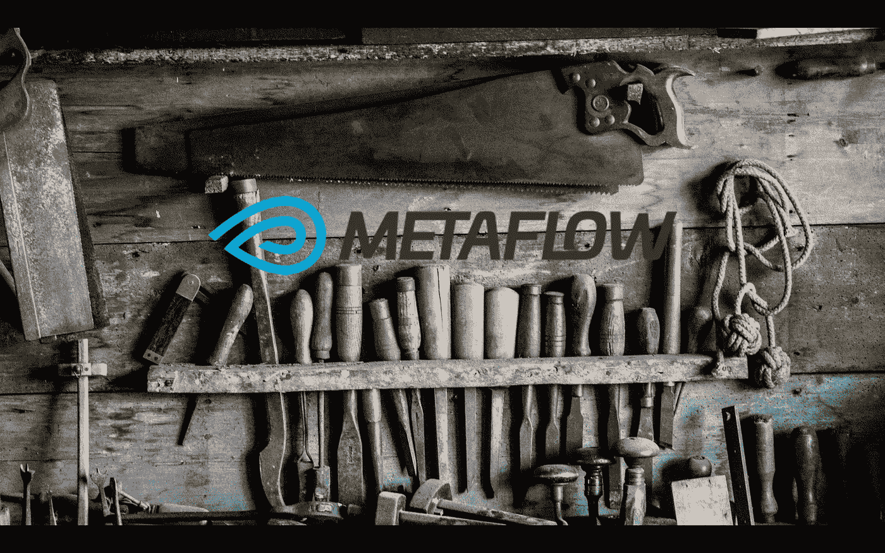

[Unsplash](https://unsplash.com/photos/vS7LVkPyXJU) + metaflow 标志

对于这篇文章，我将描述我对一个新库的实践，该库最近由网飞开源，用于操作和版本化机器学习/数据科学管道，名为[元流](https://metaflow.org/)。

这篇文章的思想是:

*   对产品包有一个概述
*   用两个例子详细说明这个包的特性(比[教程](https://docs.metaflow.org/getting-started/tutorials)更进一步)

# 元流概述

Metaflow 是网飞开发的一个包，他们在几年前(2016 年左右)开始研究它，并在 2019 年开源。Metaflow 的想法是为数据科学家提供一个框架，以快速建立数据科学/机器学习管道，并可以从开发顺利进入生产。

我邀请您观看网飞的 Ville Tuulos 在 AWS reinvent 2019 上的演示。

网飞一揽子计划背后的大问题是

> 数据科学家在日常工作中最难的是什么？"

网飞的工程师们期待听访问大数据集，强大的计算能力和 GPU 的使用，但答案(两年前)是不同的。最大的瓶颈之一是数据访问以及从概念验证到生产的转移。

下图显示了数据科学家的兴趣和 ML/DS 流程中的基础设施需求。

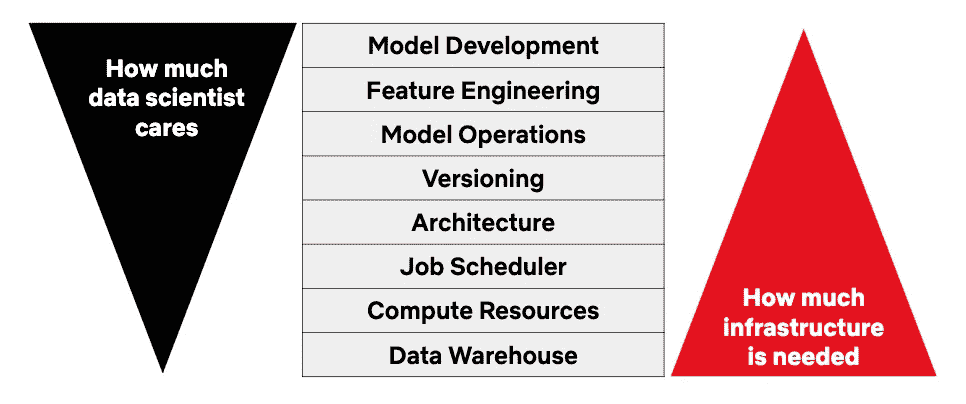

[https://netflixtechblog . com/open-sourcing-metaflow-a-human-centric-framework-for-data-science-fa 72 e 04 a5d 9](https://netflixtechblog.com/open-sourcing-metaflow-a-human-centric-framework-for-data-science-fa72e04a5d9)

在这篇宣布 Metaflow 的文章中，我认为有一句话定义了 Metaflow 背后的 moho:

> 基础设施应该允许他们行使作为数据科学家的自由，但它应该提供足够的护栏和脚手架，所以他们不必太担心软件架构。

这个想法是为数据科学家的工作提供一条安全的道路，而不损害他们的创造力。这个框架需要易于使用，并提供对强大计算能力的访问，而不必接触基础设施。

让我们看看更多的框架设计。

# 元流的设计

Metaflow 是一个只在 Linux 上运行的 Python 库，主要受 [Spotify Luigi](https://github.com/spotify/luigi) 的启发，围绕 DAG 设计。下图显示了元流上的典型流。

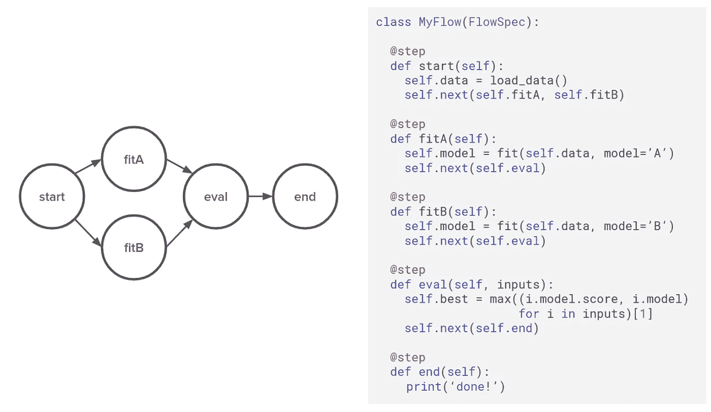

[https://netflixtechblog . com/open-sourcing-metaflow-a-human-centric-framework-for-data-science-fa 72e 04 a5d 9](https://netflixtechblog.com/open-sourcing-metaflow-a-human-centric-framework-for-data-science-fa72e04a5d9)

DAG 的结构围绕着:

*   流:管理管道所有代码的实例。在本例中，它是一个 Python 对象*类 MyFlow(Flowspec)*
*   步骤:流程的一部分，由 decorator *@step* 分隔，它们是 MyFlow 对象中的 python 函数，在本例中是 *def start，fitA，fitB，eval，end* 。
*   过渡:步骤之间的链接，它们可以是不同的类型(线性、分支和 for each)；关于[文档](https://docs.metaflow.org/)有更多细节。

现在我们来谈谈架构。在网飞的下图中，有一个组件的视图。

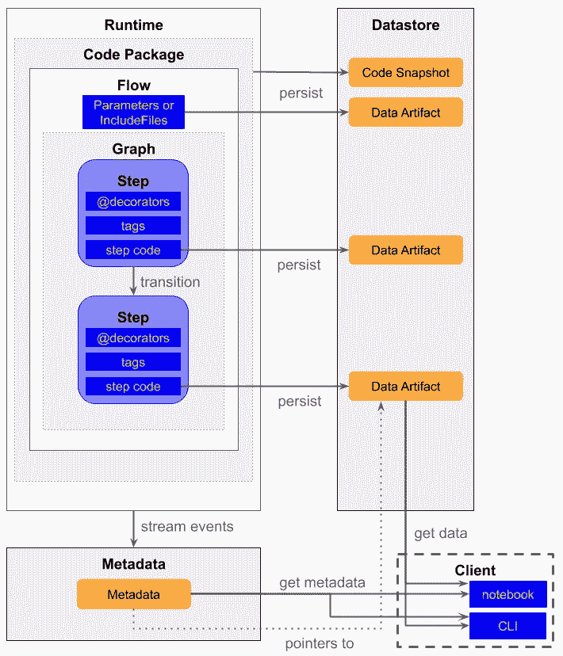

[https://docs.metaflow.org/](https://docs.metaflow.org/)

该流程有 3 个组成部分:

*   数据存储是存储流程中生成的所有数据(数据工件)的地方
*   元数据是存储流程执行信息的地方
*   客户端是访问数据存储中的数据并从元数据中获取流信息的连接组件

对我来说，处理元流核心的核心部分之一是装饰器。这是一个 python 特性，允许在不修改 Python 对象结构的情况下更新其属性，我邀请您阅读 Data camp 关于这个主题的文章。

在 Metaflow 中，有多个装饰器，在[文档](https://docs.metaflow.org/metaflow/dependencies)的这一节中有很好的解释。然而，对我来说，最重要的是我将在下一部分解释的那些。

# 元流实践

我构建了一个简单的流程来说明装饰者和分支的转换。流程的代码在[这个库](https://github.com/jeanmidevacc/metaflow-experimentation)(decorator _ experimental 文件夹)；流量看起来是这样的。

并且有一个流程的可视化说明。

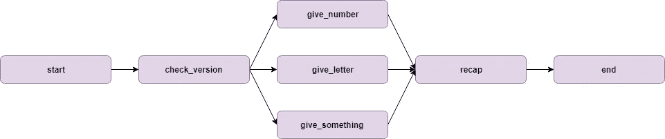

该流程的目标是:

*   在*开始*步骤中测试 Python 和 Pandas 的版本，
*   测试(再次！？)Python 中的版本和熊猫中的*检查 _ 版本*步骤
*   执行一个 3 分支转换，它将给出一个随机数( *give_number* )、字母( *give_letter* )或数字/字母( *give_something* )
*   一个叫做*的连接步骤重述*来打印前面步骤的产品，
*   将要显示的结束步骤(再次！？)Python/Pandas 的版本

对 Python/Pandas 版本的常规检查是为了说明两个特定的装饰器。让我们从脚本的标准执行开始；要执行这个流，您需要在脚本的文件夹中运行以下命令。

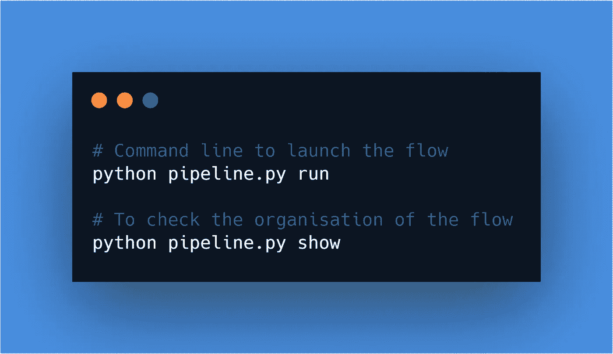

这是脚本生成的日志。

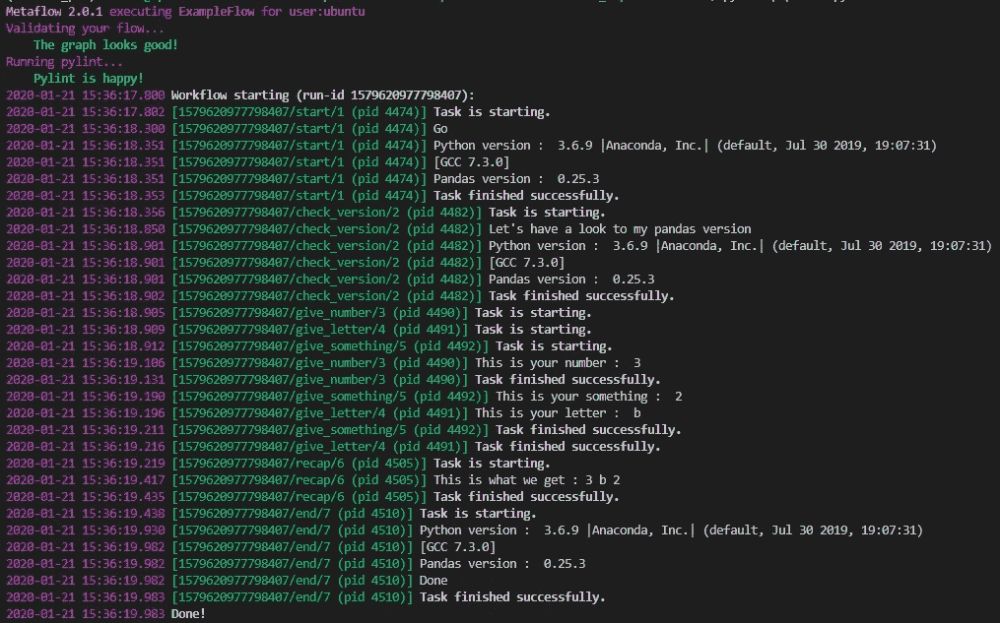

我们在日志上可以看到，Python 的版本是 3.6.9，Pandas 是 0.25.3。我们来测试一下 *@conda_base* decorator。只需要取消一行的注释并执行下面的命令行。

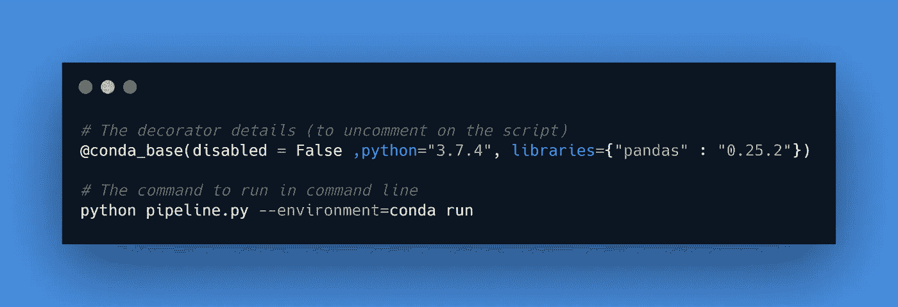

这个装饰者在流上应用了新版本的 Python，在本例中是 3.7.4，带有新版本的 Pandas (0.25.2)。这是管道产生的日志。

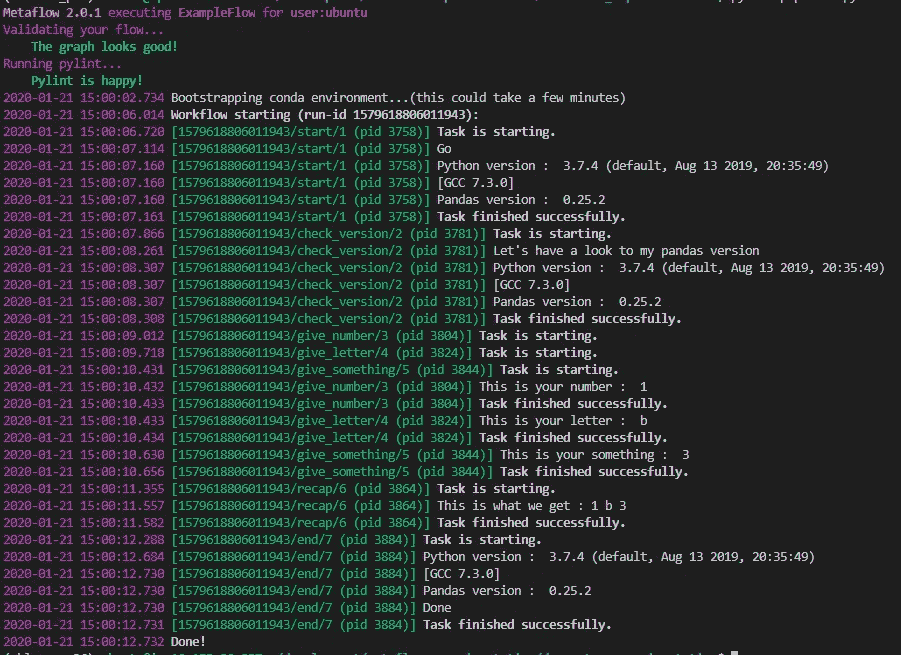

正如我所说的，现在有一个新版本的 Python/Pandas 用于执行所有的流。最后，让我们看看 *@conda* 装饰师。

这一个就像 *@conda_base* ，但是只针对一个步骤，在这种情况下，我正在将 python 版本修改为 3.6.8，只是为了这个特定的步骤(用熊猫的随机版本，我知道它看起来很蠢，但这只是为了测试)。

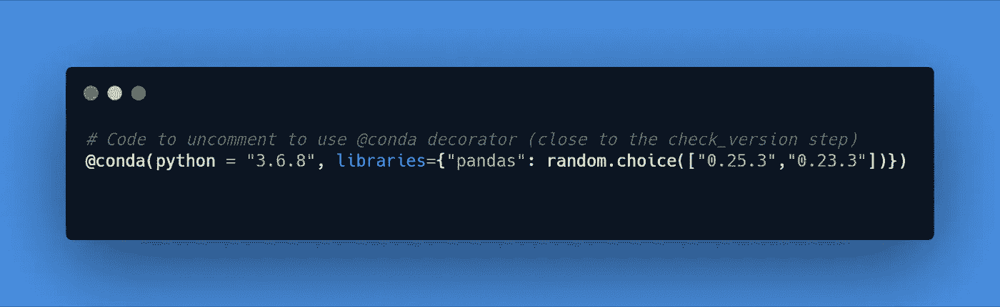

在日志中，我们可以看到有一个新版本的 Python/pandas 只应用于 *check_version* 步骤。

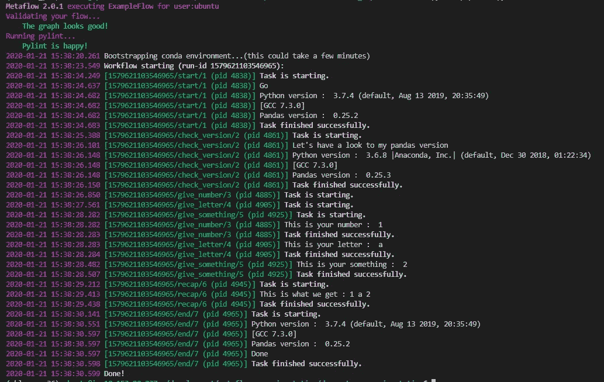

我认为这个测试说明了如何使用 Metaflow 来版本化用于执行流程或步骤的环境。Metaflow 的优势在于为数据科学家提供了灵活性，可以精确地设置执行代码所需的环境，而不必设置 conda 环境或容器。

包中有比这些装饰者更多的东西，比如:

*   用于执行的，如*@重试*、*@超时、@捕捉、@资源*
*   AWS 的那个(@batch)我一会儿再来找他们。

我们来看一个用 Metaflow 设计的数据科学/机器学习流程。

# 用 Metaflow 构建炉石原型预测器

几周前，我建立了一个与暴雪的卡牌游戏[炉石](http://the-odd-dataguy.com/a-gentle-introduction-on-hearthstone/)相关的数据集。如果你对游戏没有清晰的愿景，我邀请你去看一看。

我在上一篇文章中回避的一个方面是原型的概念。这些原型基于选择的英雄和卡片组中的卡片，有多种原型，有些是最流行的。

在前一篇文章中介绍的数据集中，40%的卡片组没有相关的原型，所以我想开始基于所使用的卡片构建一个原型预测器(这是一个虚拟系统，只是为了测试 Metaflow 的流程)。

下图中有一个我设计的测试 Metaflow 的流程的表示(代码在 [this repository](https://github.com/jeanmidevacc/metaflow-experimentation) 中与炉石相关的文件夹中)。

这个流程的想法是，基于我们想要分配给没有原型的原型的顶卡，建立一个原型的随机森林预测器。我认为代码足够清晰，所以我不会输入太多的执行细节，因为这并不令人兴奋。我将花时间用 Metaflow 的客户端分析多次运行的结果。

## 监控流程和执行

在流的不同执行过程中产生的数据存储在本地存储的数据存储中(在工作目录的/metaflow 隐藏文件夹中)。尽管如此，所有的结果都可以在一个[笔记本](https://github.com/jeanmidevacc/metaflow-experimentation/blob/master/hearthstone_deckarchetypeestimator/monitoring.ipynb)中直接访问。我将把不同运行的工件的“处理部分”放在一个要点中。

目标是计算执行时间，收集训练集的第一个样本，以及 HPO 生成的最佳模型的信息(精度和参数)。有处理的截图。

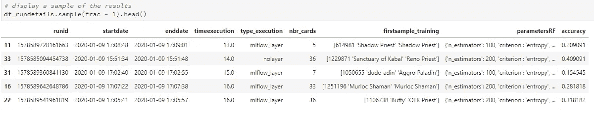

正如我们所看到的，在流程的执行过程中，有许多信息被版本化。我真的很喜欢这种对流水线中产生的所有数据进行版本控制的方法，这种方法在可再现性和调试方面非常出色。

现在让我们看看 Metaflow 的 AWS 部分。

## 那云呢？

Metaflow 在其[文档](https://docs.metaflow.org/metaflow-on-aws/metaflow-on-aws)中为您提供了设置 AWS 环境的所有过程。尽管如此，我还是很懒，他们可以给你一个 [AWS 沙箱](https://metaflow.org/sandbox/)(使用有限的资源来测试云上的功能)，只要在网站上注册就可以了。

几天后，你就可以访问沙箱了(我想再次感谢 Metaflow 的支持，让我可以更长时间地访问他们的沙箱，在我周围做一些演示)。

建立到沙箱的连接很简单，只需要在 Metaflow 的命令行中添加一个令牌。之后，你所有的后台就是:

*   位于 [S3](https://aws.amazon.com/s3/?sc_channel=PS&sc_campaign=acquisition_CA&sc_publisher=google&sc_medium=ACQ-P%7CPS-GO%7CBrand%7CDesktop%7CSU%7CStorage%7CS3%7CCA%7CEN%7CText&sc_content=s3_e&sc_detail=aws%20s3&sc_category=Storage&sc_segment=293634539894&sc_matchtype=e&sc_country=CA&s_kwcid=AL!4422!3!293634539894!e!!g!!aws%20s3&ef_id=CjwKCAiA66_xBRBhEiwAhrMuLbbCejPdVe1ALI7jLgtUYhM2JAYzO3GOoslfsz0rSmc1Srh96tC_rRoCk5oQAvD_BwE:G:s) 的数据存储区
*   元数据存储在类似 [RDS](https://aws.amazon.com/rds/) 的数据库类型中
*   在本地机器或 [AWS 批处理](https://aws.amazon.com/batch/)服务上计算
*   [亚马逊 Sagemaker](https://aws.amazon.com/sagemaker/) 中的笔记本

从本地机器访问 AWS 计算有两个选项:

*   将属性*—batch*与 run 命令一起使用，就像您的所有流都使用 AWS batch 作为计算资源一样
*   如果您只想在 AWS 上执行特定的步骤，并使用本地机器的能力来执行其他任务，那么您可以在步骤声明时使用 AWS 装饰器 *@batch*

我发现这种云管理方法引人注目且易于使用，本地计算向云计算的转换非常简单。为了说明云计算，我刚刚截屏了运行我的元流代码的实例的 CPU 使用情况，以及我执行的运行类型。

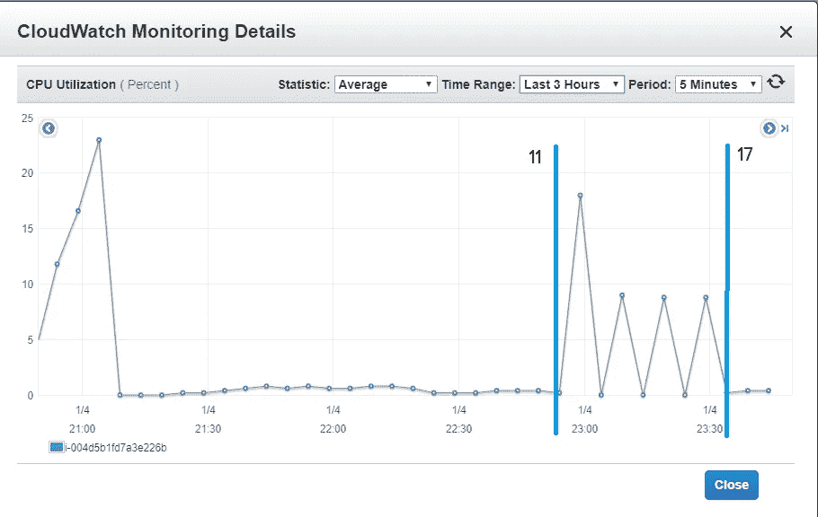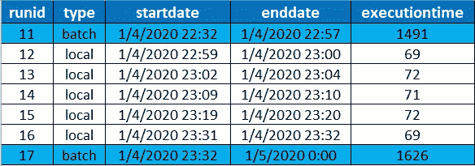

我认为这很好地说明了这样一个事实，即我的本地机器不用于进行计算，而本地运行(在运行 11 和 17 的边界之间。

现在关于 Metaflow 的最后一个问题是它能否与 mlflow 一起工作。

## 不要越过水流！？

不，请这样做，我在[中添加了另一个脚本](https://github.com/jeanmidevacc/metaflow-experimentation/blob/master/hearthstone_deckarchetypeestimator/pipeline_crossflow.py)的 mlflow 图层到我的 HPO 中。我只是在我的 mlflow 日志中添加与我的元流运行相关的信息。有一张 mlflow 的日志截图。

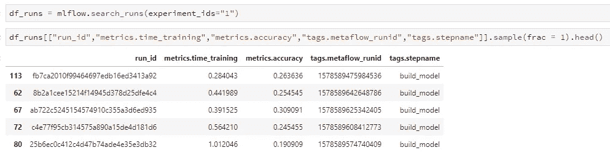

这两种版本控制框架似乎可以很好地协同工作。因此，今天，我们可以使用 Metaflow 监控您的管道，记录您的模型，并在任何云平台支持上使用 mlflow 进行部署。

# 反馈

Metaflow 是一个为数据科学家开发的框架，它提供:

*   机器学习 DS 管道中产生的所有工件的版本控制
*   轻松使用云，轻松并行化作业

这是网飞做的一项伟大的工作，并且是开源的。更多的元素出现在元流中，如:

*   R 包
*   将 AWS 步骤用作调度程序的能力(但它还没有出现，所以我认为这表明它不是一项容易使用的技术)。
*   Sagemaker 的模型部署，他们将涵盖 mlflow 的另一个方面(在 AWS 上)。

我在 Metaflow 上的唯一缺点是:

*   conda decorator 在您的 python 环境中构建了大量的 conda 环境，因此它看起来可能很乱
*   该框架看起来非常适合 AWS，因此不对其他云平台开放(但在 GitHub 上，似乎有人试图让它为 GCP 工作)
*   火花似乎完全不在计划之内

我将跟随 Metaflow 的发展，但老实说，第一次尝试是好的，我邀请你尝试一下，并提出你自己的看法。

***原载于***