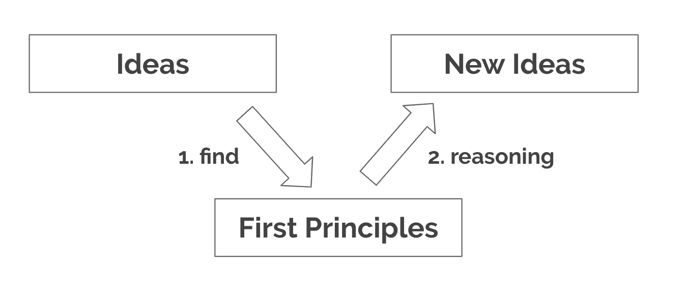
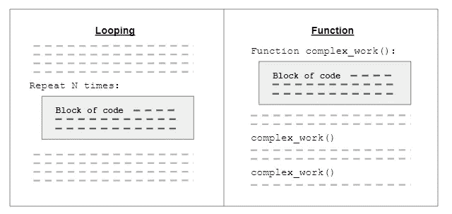
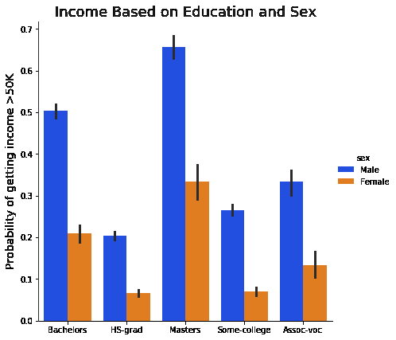
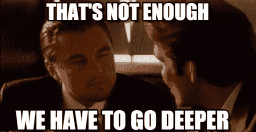

# 持怀疑态度！作为数据分析师最重要的原则

> 原文：<https://towardsdatascience.com/be-skeptical-the-most-important-principle-as-a-data-analyst-903172222c65?source=collection_archive---------24----------------------->

## 至于方法，可能有一百万，但原则很少。持怀疑态度但不要陷入分析麻痹。

图片由[openclipbart-Vectors](https://pixabay.com/users/openclipart-vectors-30363)在 [Pixabay](https://pixabay.com/vectors/unimaginative-uninspired-pencil-152217/) 上生成

怀疑论(*英国:怀疑论*)基于[牛津词典](https://www.lexico.com/en/definition/skepticism):持怀疑态度；对某事真实性的怀疑。

使用第一原则思维，我了解到塑造我成为一个更好的分析师的最重要的原则是“保持怀疑！”原则指导我做分析，分析方法也随之而来。持怀疑态度但不要陷入分析麻痹。

# 概述

> ***1。找到第一原则
> 2。持怀疑态度！
> 3。不要陷入*分析麻痹**

# 1.找到首要原则

> “至于方法，可能有一百万甚至更多，但原则很少。掌握原则的人能够成功地选择自己的方法。尝试方法的人，忽视原则，肯定会有麻烦。”—哈林顿·埃默森

当我们学习任何东西时，找到它背后的原理是很重要的。您可以将原则视为一个通用的规则、定义或值，它可以应用于许多不同的特定场景。第一个原则仅仅是不能从其他原则推导出来的基本原则。通过从我们所学的东西中找到首要原则，我们可以用它来产生新的想法或方法[1]。

让我们举一个第一原理思维的例子。大多数数据分析师和数据科学家都学习过编程，要么使用 Python，要么使用 r。编程的首要原则是什么？如果你停下来猜一猜，会更有趣。

## 第一个原则:寻找

我们什么时候使用循环？通常，当我们实现一个需要连续重复代码块的算法时，我们使用循环，重复一个接一个地连续发生。函数怎么样？当我们发现一块重复的代码时，就会触发我们使用函数。我们可以通过将同一块代码封装在一个函数中来重用它，然后我们可以在任何地方调用这个函数。

如果我们发现使用循环和函数的一般规则，它们有交集:减少重复编写相同的代码块。这就是我们如何通过归纳找到第一个原则。不要重复自己(干)是编程和软件工程中最流行的原则之一[4]。

原则背后也有原因。如果我们的重复次数少于三次，我们仍然可以复制粘贴代码。但是，更重要的是，我们会厌倦复制粘贴。代码也变得很难维护。如果我们发现一个 bug，我们需要修复每个代码副本中的逻辑。我们可能会不小心错过修复其中一个副本。

## 第一原则:推理

在知道“不要重复自己”的原则后，有些人发现如何在其他方面应用该原则。我们可以将此视为推理部分。一些例子是:

1.  库超越了单一的代码库，库可以防止其他程序员重复实现与你功能相同的代码。
2.  **继承**，面向对象编程
    我们不需要重复编写条件语句。之前，我们需要为每个相似的类`if (duck) then quack(); else if (cat) then meow(); else if ...` 编写 if 语句。有了继承能力，我们就说`Duck`和`Cat`继承`Animal`，所有动物都会说话。我们可以实例化任何种类的动物，例如`animal = Duck()`，并调用`animal.talk()`。
3.  **泛型**，面向对象编程(OOP)
    我们不需要仅仅因为一个类需要处理不同的数据类型而重复编写它。没有实现`ListOfString`和`ListOfInteger`，有了泛型，我们只实现`List<T>`。

# 2. ***持怀疑态度！***

先说个例子。下图来自 UCI 资料库的[成人数据集。该数据集有一个特征，表明一个成年人的收入是否超过 5 万美元。我汇总数据，按照教育程度和性别得出收入超过 5 万美元的成年人比例。你从数据中得到了什么信息？你能根据这些信息得出结论吗？慢慢想吧。](https://archive.ics.uci.edu/ml/datasets/Adult)

来自 UCI 的成人数据集，由 Barry Becker 从 1994 年人口普查数据库中提取。

从图表中，我们得到信息，女性往往比男性收入低，尽管两者教育程度相同。男女有工资歧视，不是吗？

如果你因为本科或硕士学历的男性收入更高而利用这些信息进行针对性营销，那就没问题。但是，如果你正在利用这些信息进行大规模的性别平等社会运动，最好三思而行！或者，你可能会愚弄整个世界。我们应该持怀疑态度，质疑数据和分析方法:

1.  数据来自 1994 年，调查是在美国进行的。在 2020 年的中国，用这些数据来进行社会运动还合适吗？
2.  女性倾向于选择不太累的工作还是兼职工作，因为她想照顾她的孩子？
3.  他们是如何对成年人进行采样的？他们也从家庭主妇那里收集数据吗？如果他们从家庭主妇那里收集数据，这可能会导致收入差异。
4.  假设男性和女性拥有相同的学位，他们在公司的表现是否一样好？

怀疑是数据分析首先存在的原因。对于不持怀疑态度的人来说，专家的知识和直觉就足够了，不是吗？但是，具有讽刺意味的是，有时，我们，作为分析师，不够怀疑。我们基于对数据的错误假设给出结论，使用的是不适合数据的复杂分析方法。我们毫无疑问地、满怀信心地将它呈现给利益相关者，每个人都相信它。

不管手头的任务是什么，最重要的是保持怀疑的态度。我们需要质疑围绕数据和分析方法的假设。我们越质疑，就越了解真相。然后，我们将能够决定哪些分析方法最适合我们的数据。

## 质疑数据

> “我们不应该只问‘数据说明了什么？’但是要问，‘谁收集的，他们是怎么做的，那些决定是如何影响结果的？’”—琼斯·罗伊

图片来自[最佳大学评论](https://www.bestcollegereviews.org/cheating/)

上面的信息图是关于高中和大学作弊的。从调查中，他们得到的信息是，51%的学生承认在过去一学年的一次考试中作弊。如果我们要根据有多少学生作弊来做决定，你会直接用这些信息吗？

我们要持怀疑态度，要问“是谁收的？”以及“他们是如何收集的？”因为这两个方面决定了调查结果。想象一下，我们用两种不同的方式做这个调查:

1.  第一次调查(老师，采访)
    学校通过采访的方式指派每个班主任进行调查。在一个私人房间里，老师问“你在过去的学年里有没有在考试中作弊？”以及“你是怎么作弊的？”老师向学生承诺，本次调查是匿名的，他们的回答不会影响他们的分数。
2.  第二次调查(学生，书面调查)学校要求学生会进行调查。每个班级都有一名代表通过纸张分发调查问卷。有一个是/否问题问“你在过去的学年里有没有在考试中作弊？”学生只需要在答案上打勾，然后把答案放进盒子里。

您想使用第一次调查的结果还是第二次调查的结果？我们大多数人会选择第二种调查。如果老师通过面试问那种问题，你觉得学生会说实话吗？至少有些学生会撒谎，不敢说实话。结果将偏向于更少的作弊者。

我们必须记住，我们的数据并不完美。它可能包含由人为错误、偏见或测量工具引起的误差。但是，NYU 数据科学教授 Jones-Rooy 说，“虽然数据可能包含错误，但这并不意味着我们应该扔掉所有数据，没有什么是可知的。这意味着以深思熟虑的方式收集数据，扪心自问我们可能遗漏了什么，并欢迎收集更多的数据。”[3]

## 质疑分析

> “数据并没有*说*什么。*人类*说事情。他们说他们在数据中注意到或寻找的东西”——琼斯-罗伊

分析师必须持怀疑态度，质疑自己的分析方法和结果。我们在阅读别人的分析结果时也需要持怀疑态度。这些是 Kaushik 的一些例子[2]:

1.  这个结论是基于你所掌握的数据吗？
2.  做这个分析的时候做了什么假设？
3.  索赔的理由是什么？
4.  从数据或分析中可以得出任何替代的解释或结论吗？
5.  如果数据以比例给出，原始值是多少？
6.  如果数据以原始值给出，比例是多少？

还有很多其他的。问题是无限的，这取决于分析方法。保持怀疑的态度，问题就会涌入你的脑海。

# 3.不要陷入分析瘫痪

通过持怀疑态度，我们会质疑很多事情。我们不会轻易相信一个假设，我们希望“越来越深入！”。几个星期后，我们意识到我们最终分析了很多东西，但没有得到任何结论。人们称这种分析为麻痹。分析瘫痪是一种过度分析或过度思考的状态，导致分析师无法得出结果[5]。

图片来自“[盗梦空间网络版本的简单指南](/a-simple-guide-to-the-versions-of-the-inception-network-7fc52b863202)

那么，我们是否需要停止怀疑，以防止陷入分析瘫痪？不要！不要那样做。想好之前不要盲目相信任何假设。你会陷入另一个极端的对立面，因本能而灭绝:分析师做出致命决定的情况，因为它只是基于本能[5]。

最后，正如斯图尔特·戈尔德所说，“明智的错误总比什么都不做好。”[2]会有很多我们持怀疑态度的假设。我们会有深入探究每一个问题的冲动。但是，我们应该学会如何优先考虑和关注那些可能使整个分析大错特错的关键假设。

例如，你要决定是否在另一个城市开设新的分行。这是 Kaushik 如何解释为什么他持怀疑态度，但仍然做出了决定[2]:

1.  如果你对数据和分析有 100%的把握，你可以建议在这个城市开几家分店。
2.  如果你对数据和分析有 80%的把握，你可以建议尝试在这个城市开一家分店。
3.  如果你对数据和分析有 60%的把握，你可以要求更多的时间去挖掘或增加预算来收集更可靠的数据。

最后，持怀疑态度但不要陷入分析麻痹。

我从“ [*学到了很多第一原理:真正知识的基石*](https://fs.blog/2018/04/first-principles/) ”。如果你想了解更多关于第一原理思维的知识，我推荐你去读一读。

## 参考

[1]无名氏、[第一原理:真正知识的积木](https://fs.blog/2018/04/first-principles/) (2018)、法南街
【2】A .考希克、[一个伟大的分析师最好的朋友:怀疑论&智慧！](https://www.kaushik.net/avinash/great-analyst-skills-skepticism-wisdom/) (2016)、Avinash Kaushik 的《奥卡姆剃刀》
【3】a . Jones-Rooy、[我是一个对数据持怀疑态度的数据科学家](https://qz.com/1664575/is-data-science-legit/) (2019)、Quartz
【4】k . Henney、[每个程序员都应该知道的 97 件事](https://learning.oreilly.com/library/view/97-things-every/9780596809515/) (2010)、O ' Reilly Safari
【5】维基百科撰稿人、[分析麻痹](https://en.wikipedia.org/w/index.php?title=Analysis_paralysis&oldid=934902600)、维基百科:免费百科