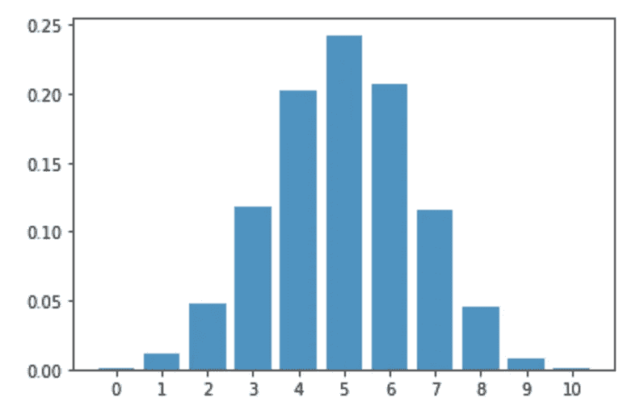
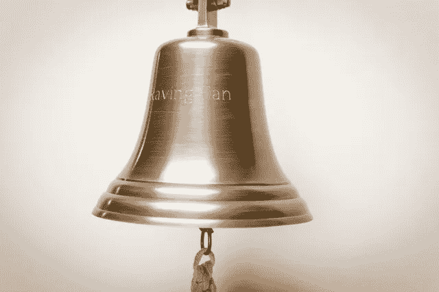
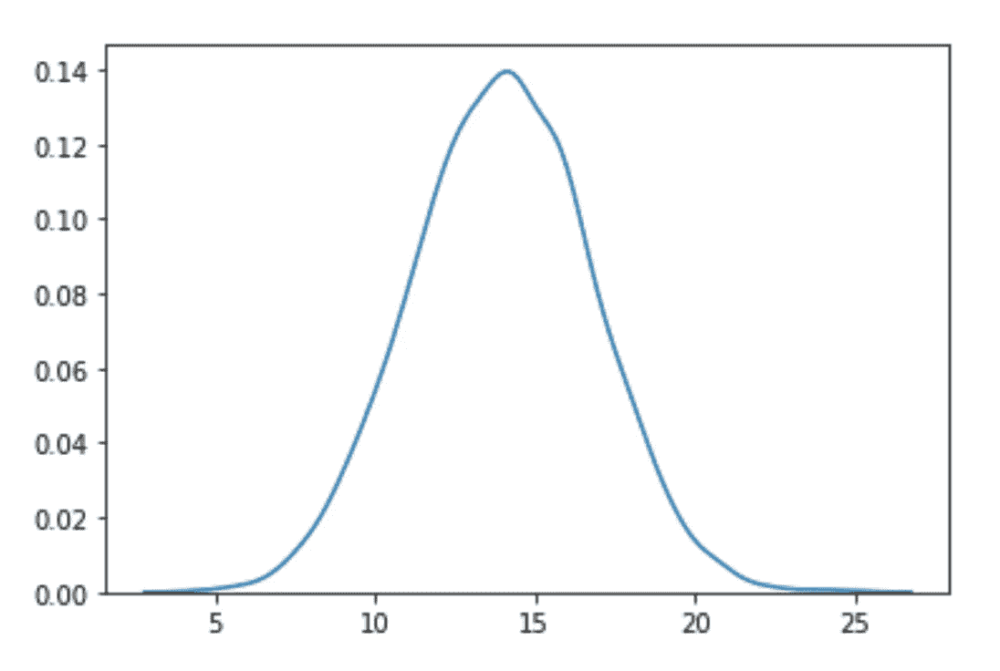
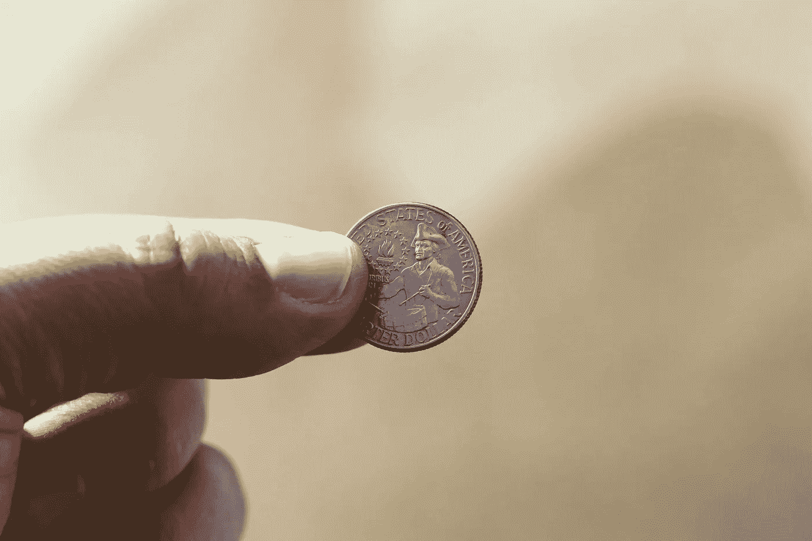
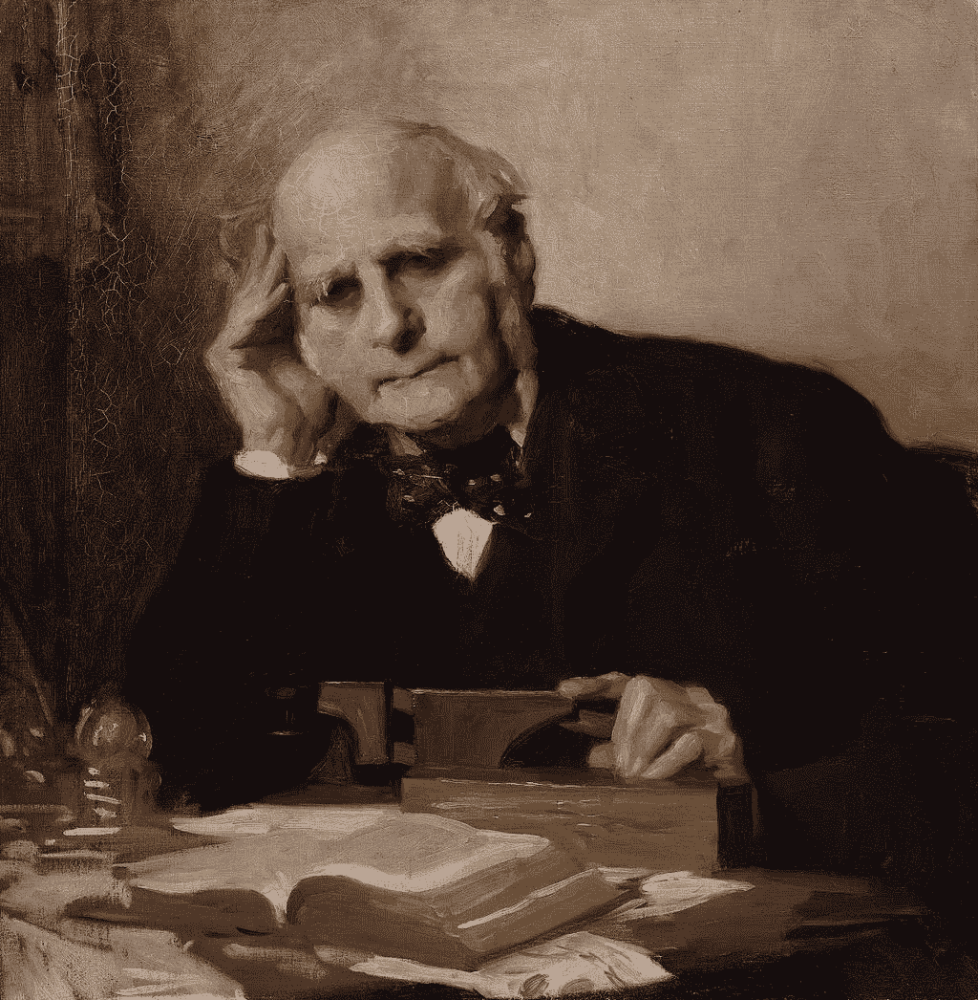
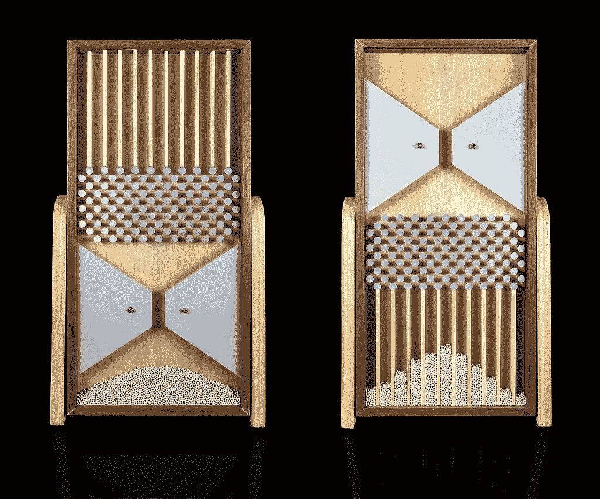

# 豆机和中心极限定理

> 原文：<https://towardsdatascience.com/bean-machine-and-the-central-limit-theorem-8b0b23d6e887?source=collection_archive---------30----------------------->

图片由 [_Alicja_](https://pixabay.com/users/_alicja_-5975425/?utm_source=link-attribution&utm_medium=referral&utm_campaign=image&utm_content=4899501) 来自 [Pixabay](https://pixabay.com/?utm_source=link-attribution&utm_medium=referral&utm_campaign=image&utm_content=4899501)

## 从二项式分布到正态分布

当我在大学学习统计物理的时候，我被统计学以一种聪明的方式简化和解释混沌过程的能力迷住了。

当我开始研究数据科学时，我发现统计物理学和数据统计学有太多的相似之处。这是未来博客的主题。现在让我们深入研究一下统计分布。

# 统计分布:

统计学中的一个基本概念是概率分布。在概率分布中，我们描述了获得随机变量可能取值的可能性。我们可以画出离散变量和连续变量的概率分布。

# 二项式分布:

二项式分布是一种离散的概率分布。它可以简单地认为是重复多次的实验中成功(1)或失败(0)结果的概率。例如，掷硬币只有两种可能的结果:正面或反面

二项式分布，作者使用 Python 制作的图片

# 正态(高斯)分布:

正态分布是一个连续的概率函数，描述了变量的值是如何分布的。因曲线呈钟形，故又称为“钟形曲线”。在正态分布中，分布两端的极值同样不太可能出现。

照片由[迈克](https://www.pexels.com/@mike-204930?utm_content=attributionCopyText&utm_medium=referral&utm_source=pexels)从[派克斯](https://www.pexels.com/photo/brass-bell-633497/?utm_content=attributionCopyText&utm_medium=referral&utm_source=pexels)拍摄

从量子物理到生物统计学，从股票市场回报到质量控制，进入系统的电话，人口的身高、体重、智商，容器中气体分子的速度，学生的考试成绩，都可以观察到正态分布。

正态分布，作者使用 Python 制作的图像

# 中心极限定理；

统计学中的中心极限定理指出，给定足够大的样本量，样本均值的抽样分布接近正态分布——无论总体分布的形状如何

# 德莫维尔-拉普拉斯定理；

德莫维尔-拉普拉斯定理是中心极限定理的特例。它指出，在样本量足够大的情况下，二项分布近似于正态分布。

# 掷硬币:

让我们用一个掷硬币的例子来澄清这一点:当我们掷硬币时，我们有两种可能的选择:正面和反面。抛硬币选择正面的概率是 1/2。(1/2).当我们投掷许多硬币时，事情开始变得复杂，但是所有的概率都回到了期望结果/所有可能结果的概念上

Joshua Hoehne 在 [Unsplash](https://unsplash.com/s/photos/coin?utm_source=unsplash&utm_medium=referral&utm_content=creditCopyText) 上拍摄的照片

我们可以通过**思想**实验或者**虚拟**实验来理解最复杂的概率概念。你可以尝试一些虚拟硬币翻转实验[这里](https://www.geogebra.org/m/LZbwMZtJ)

如何看待**真实的**概率实验将抽象的统计概念和真实世界的例子联系起来？怎样才能做一个真正的概率实验？我们要掷硬币数百万次吗？为了找到真实的概率，我们真的需要多次做同样的实验。(不是几百或几千，是几百万)。

因为计算机不是在 19 世纪发明的，统计学家开发了创造性的设备来更快地进行统计实验。

# 弗朗西斯·高尔顿爵士

弗朗西斯·高尔顿爵士由查理斯·威灵顿·弗斯所著，[公有领域](https://commons.wikimedia.org/wiki/File:Sir_Francis_Galton_by_Charles_Wellington_Furse.jpg)

弗朗西斯·高尔顿爵士是英国统计学家，他创立了相关性、回归均值、数据收集调查和词汇假设等概念。

# 高尔顿董事会:

我想向你介绍弗朗西斯·高尔顿爵士开发的最著名的统计设备之一:高尔顿板，Hextat 概率演示器，豆子机，概率机，或五点形。这些是一个智能设备的名字，**提供给**我们在几秒钟内做几千次硬币翻转等效实验。

这是中心极限定理的一个极好的直观例子。小球通过分支路径随机下落，最终总是呈正态分布。从细节上看，随机性是混乱的，但总是遵循一种普遍的秩序。

高尔顿板由一个垂直板和交错排列的钉子组成。珠子从顶部落下，当设备处于水平状态时，当它们碰到钉子时会向左或向右反弹。

一个[高尔顿盒](https://en.wikipedia.org/wiki/Galton_box)显示正态分布，[马特马特卡 IME-USP](http://matemateca.ime.usp.br/) / [罗德里戈铁雄阿根顿](https://commons.wikimedia.org/wiki/User:Rodrigo.Argenton)

为什么高尔顿板类似于抛硬币？因为在两个实验中，概率是相等的。在高尔顿棋盘上，像掷硬币一样，球通过几排钉子选择向左或向右的路径。

高尔顿板实验

# 结论:

高尔顿板是证明中心极限定理的二项式分布的极好演示；当你添加独立的随机变量时，它们的和趋向于正态分布。特别地，它证明了中心极限定理的一个特例——德莫维尔-拉普拉斯定理。

非常感谢您对 seymatas@gmail.com 的任何建议！