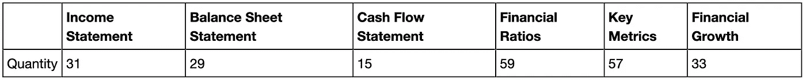
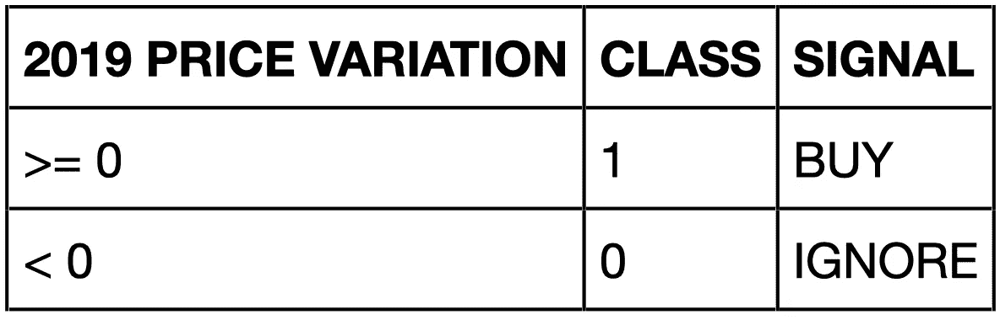
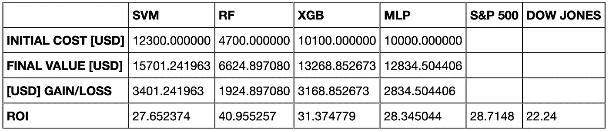

# 用机器学习找到值得买的股票

> 原文：<https://towardsdatascience.com/beat-the-stock-market-with-machine-learning-d9432ea5241e?source=collection_archive---------5----------------------->

## 有没有可能让一个机器学习模型学习表现良好和表现不佳的股票之间的差异，然后利用这些知识来预测哪只股票值得购买？此外，仅仅通过查看 10-K 文件中的财务指标就能做到这一点吗？

# 懒惰策略


马库斯·斯皮斯克在 [Unsplash](https://unsplash.com/s/photos/stock-market?utm_source=unsplash&utm_medium=referral&utm_content=creditCopyText) 上的照片

算法交易领域充斥着新的策略。企业已经在基础设施和 R&D 上投入了数十亿美元(并且还在继续投资),以便在竞争中脱颖而出，战胜市场。尽管如此，众所周知，**买入&持有策略能够胜过许多算法策略，尤其是在长期**。然而，发现股票价值是一门很少有人掌握的艺术，一个算法能被训练成这样吗？

本文包含了为大量股票建立金融数据数据集并使用不同的机器学习模型进行分析所需的所有步骤。*你会在整篇文章中看到，这种操作方式并没有利用历史股票价格数据，而是利用了每个上市公司每年发布的 10-K 文件中的财务指标*。特别是，就本文而言，我们将使用 2018 年的财务数据，以便对 2019 年期间(指从 2019 年 1 月的第一个交易日到 2019 年 12 月的最后一个交易日)的股票表现进行一些虚构的预测。

在开始写代码之前，必须清楚的是**这篇文章并没有给出一个你可以使用的实际交易策略**:

1.  我不是理财顾问，你也绝对不应该从网上获取理财建议。
2.  你不能实现它来预测股票市场，因为你缺乏在训练阶段设置标签所需的未来信息。

*本文想要探索的是，通过训练并向最大似然算法提供财务报表中报告的数字，让它们识别价值增长的股票的可能性。*为了检查这是否属实，测试阶段由 ML 算法做出的预测(可被视为虚构交易)将与标准普尔 500 指数和道琼斯指数进行比较。

最后，我们不会在一年内多次买卖股票:我们将使用一种**懒惰策略，**在年初(这里是 2019 年)买入股票，然后在年底卖出，希望能够盈利。

说到这里，让我们直接进入有趣的部分。

# 第 1 部分:构建数据集

## 1.1 初步进口

如果你熟悉 Python 中的机器学习，你应该已经知道我们将要使用的所有包和库。如果您是这个领域的新手，不要害怕，您可以找到每个包和库的大量信息和教程。所有使用的包都很容易检索，并且可以根据您的 Python 设置用`pip`或`conda`安装(这里使用了`Python 3.7.5`)。

为了从网上抓取数据，需要互联网连接(我们将使用优秀的免费 API[https://financialmodelingprep.com/developer/docs/](https://financialmodelingprep.com/developer/docs/)和众所周知的`pandas_datareader`)。

```
**from** **sys** **import** stdout
**import** **numpy** **as** **np**
**import** **pandas** **as** **pd**
**from** **pandas_datareader** **import** data
**import** **json**

*# Reading data from external sources*
**import** **urllib** **as** **u**
**from** **urllib.request** **import** urlopen

*# Machine learning (preprocessing, models, evaluation)*
**from** **sklearn.model_selection** **import** train_test_split
**from** **sklearn.preprocessing** **import** StandardScaler
**from** **sklearn.model_selection** **import** GridSearchCV
**from** **sklearn.svm** **import** SVC
**from** **sklearn.ensemble** **import** RandomForestClassifier
**from** **sklearn.neural_network** **import** MLPClassifier
**import** **xgboost** **as** **xgb**
**from** **sklearn.metrics** **import** classification_report

*# Graphics*
**from** **tqdm** **import** tqdm
```

为了简化代码，我们还需要一些助手函数:

1.  `get_json_data`:用于抓取 financialmodelingprep API 的链接，拉取财务数据。
2.  `get_price_var`:用于计算 2019 年期间的价格变化，利用`pandas_datareader`和雅虎财经。
3.  `find_in_json`:用来扫描一个复杂的 json 文件，寻找一个键并返回它的值。

```
**def** get_json_data(url):
    *'''*
 *Scrape data (which must be json format) from given url*
 *Input: url to financialmodelingprep API*
 *Output: json file*
 *'''*
    response = urlopen(url)
    dat = response.read().decode('utf-8')
    **return** json.loads(dat)

**def** get_price_var(symbol):
    *'''*
 *Get historical price data for a given symbol leveraging the power of pandas_datareader and Yahoo.*
 *Compute the difference between first and last available time-steps in terms of Adjusted Close price..*
 *Input: ticker symbol*
 *Output: price variation* 
 *'''*
    *# read data*
    prices = data.DataReader(symbol, 'yahoo', '2019-01-01', '2019-12-31')['Adj Close']

    *# get all timestamps for specific lookups*
    today = prices.index[-1]
    start = prices.index[0]

    *# calculate percentage price variation*
    price_var = ((prices[today] - prices[start]) / prices[start]) * 100
    **return** price_var

**def** find_in_json(obj, key):
    *'''*
 *Scan the json file to find the value of the required key.*
 *Input: json file*
 *required key*
 *Output: value corresponding to the required key*
 *'''*
    *# Initialize output as empty*
    arr = []

    **def** extract(obj, arr, key):
        *'''*
 *Recursively search for values of key in json file.*
 *'''*
        **if** isinstance(obj, dict):
            **for** k, v **in** obj.items():
                **if** isinstance(v, (dict, list)):
                    extract(v, arr, key)
                **elif** k == key:
                    arr.append(v)
        **elif** isinstance(obj, list):
            **for** item **in** obj:
                extract(item, arr, key)
        **return** arr

    results = extract(obj, arr, key)
    **return** results
```

## 1.2 股票清单

首先，我们需要获得将用于构建数据集的股票列表。由于有数以千计的股票的信息可以在网上搜集，我决定简单地在金融建模准备 API 上获取所有股票的列表。

这份名单包含了总共超过 7k 只股票，显然涵盖了不止一个行业。事实上，每个公司都属于自己的领域(科技、医疗、能源……)，而这些领域又可能具有某些季节性、宏观经济趋势等特征。到目前为止，我决定专注于技术板块:这意味着从完整的可用股票列表`available_tickers`中，我只保留那些板块等于`Technology`的股票。多亏了`pandas`库的强大功能，这个操作非常简单。

因此，列表`tickers_tech`将包含金融建模准备 API 上属于技术部门的所有可用股票。

```
url = 'https://financialmodelingprep.com/api/v3/company/stock/list'
ticks_json = get_json_data(url)
available_tickers = find_in_json(ticks_json, 'symbol')

tickers_sector = []
**for** tick **in** tqdm(available_tickers):
    url = 'https://financialmodelingprep.com/api/v3/company/profile/' + tick *# get sector from here*
    a = get_json_data(url)
    tickers_sector.append(find_in_json(a, 'sector'))

S = pd.DataFrame(tickers_sector, index=available_tickers, columns=['Sector'])

*# Get list of tickers from TECHNOLOGY sector*
tickers_tech = S[S['Sector'] == 'Technology'].index.values.tolist()
```

## 1.3 了解 2019 年全年的价格变化

2019 年期间`tickers_tech`中列出的每只股票的价格变化将被用作区分值得购买和不值得购买的股票的指标(因为它们降低了它们的价值，出于我们并不真正关心的原因)。因此，我们需要:

*   提取每只股票的所有**每日调整收盘价**，计算差价(这要感谢助手函数`get_price_var`
*   如果没有找到数据，跳过股票
*   限制要扫描的股票数量为 1000(出于时间原因。当我们提取财务数据时，所需的时间与股票数量成正比，因此为了保持合理，我们可以将股票数量限制在一个阈值内。但是，您可以放弃此检查，让计算机在夜间工作)。
*   在数据框架中存储库存和 2019 年相对价格变化`D`

```
pvar_list, tickers_found = [], []
num_tickers_desired = 1000
count = 0
tot = 0
TICKERS = tickers_tech

**for** ticker **in** TICKERS:
    tot += 1 
    **try**:
        pvar = get_price_var(ticker)
        pvar_list.append(pvar)
        tickers_found.append(ticker)
        count += 1
    **except**:
        **pass**

    stdout.write(f'**\r**Scanned **{tot}** tickers. Found **{count}**/{len(TICKERS)} usable tickers (max tickets = **{num_tickers_desired}**).')
    stdout.flush()

    **if** count == num_tickers_desired: *# if there are more than 1000 tickers in sectors, stop*
        **break**

*# Store everything in a dataframe*
D = pd.DataFrame(pvar_list, index=tickers_found, columns=['2019 PRICE VAR [%]'])
```

对于`D`中的股票，我们现在需要找到将成为分类模型输入数据的指标值。我们再次利用了 FinancialModelingPrep API。

首先，我们加载`indicators.tx`文件(可以在存储库中找到)。正如`README`文件所解释的，过多的财务指标正在被剔除。我决定对来自 FinancialModelingPrep API 的所有可用指标执行一次**强力操作**，然后我将担心清理和准备模型的数据集。下表汇总了每个类别可用的财务指标数量。



API 中每个类别可用的财务指标数量([https://financialmodelingprep.com](https://financialmodelingprep.com))。

总共有 224 个指标可用。但由于有一些重复，所以`indicators.txt`中指标的实际数量是 221(不算日期)。你可以在这里找到`indicators.txt`文件:[https://github . com/cnic 92/beat-the-stock-market/tree/master/All % 20 tickers % 20 and % 20 indicators](https://github.com/CNIC92/beat-the-stock-market/tree/master/All%20tickers%20and%20Indicators)

## 1.4 收集财务指标并构建原始数据集

截至目前，我们已经列出了属于技术板块的股票，并且我们还列出了它们 2019 年的价格变化。是时候收集财务指标了，这些指标将在以后用作分类模型的输入特征。

由于财务建模准备 API，将再次执行抓取。这个过程非常耗时，因为需要反复提取大量数据。

此外，记住以下几点很重要:

*   需要在特定的时间范围内提取数据。由于目标是根据 2019 年期间的价格变化对股票进行分类，因此财务指标必须属于 2018 年底。
*   一家公司在同一年提交两份 10-K 文件是有可能的，尽管不常见。在这种情况下，必须只保留最近的条目。
*   对于给定的股票，API 可能根本不返回任何数据。在这种情况下，原料必须废弃。
*   并非所有指示器都会返回值。出于这样或那样的原因，有一定比例的指标缺失是合理的。在这种情况下，`np.nan`将被分配给缺失的条目，我们将在清理阶段处理它们。

最后，我们想要获得的是一个数据帧`DATA`，其中行对应于已经找到数据的股票(`actual_tickers`)，列对应于财务指标(`indicators`)。

```
*# Initialize lists and dataframe (dataframe is a 2D numpy array filled with 0s)*
missing_tickers, missing_index = [], []
d = np.zeros((len(tickers_found), len(indicators)))

**for** t, _ **in** enumerate(tqdm(tickers_found)):
    *# Scrape indicators from financialmodelingprep API*
    url0 = 'https://financialmodelingprep.com/api/v3/financials/income-statement/' + tickers_found[t]
    url1 = 'https://financialmodelingprep.com/api/v3/financials/balance-sheet-statement/' + tickers_found[t]
    url2 = 'https://financialmodelingprep.com/api/v3/financials/cash-flow-statement/' + tickers_found[t]
    url3 = 'https://financialmodelingprep.com/api/v3/financial-ratios/' + tickers_found[t]
    url4 = 'https://financialmodelingprep.com/api/v3/company-key-metrics/' + tickers_found[t]
    url5 = 'https://financialmodelingprep.com/api/v3/financial-statement-growth/' + tickers_found[t]
    a0 = get_json_data(url0)
    a1 = get_json_data(url1)
    a2 = get_json_data(url2)
    a3 = get_json_data(url3)
    a4 = get_json_data(url4)
    a5 = get_json_data(url5)

    *# Combine all json files in a list, so that it can be scanned quickly*
    A = [a0, a1, a2 , a3, a4, a5]
    all_dates = find_in_json(A, 'date')

    check = [s **for** s **in** all_dates **if** '2018' **in** s] *# find all 2018 entries in dates*
    **if** len(check) > 0:
        date_index = all_dates.index(check[0]) *# get most recent 2018 entries, if more are present*

        **for** i, _ **in** enumerate(indicators):
            ind_list = find_in_json(A, indicators[i])
            **try**:
                d[t][i] = ind_list[date_index]
            **except**:
                d[t][i] = np.nan *# in case there is no value inserted for the given indicator*

    **else**:
        missing_tickers.append(tickers_found[t])
        missing_index.append(t)

actual_tickers = [x **for** x **in** tickers_found **if** x **not** **in** missing_tickers]
d = np.delete(d, missing_index, 0)*#raw dataset* DATA = pd.DataFrame(d, index=actual_tickers, columns=indicators)
```

## 1.5 数据集清理和准备

数据集的准备在某种程度上是一门艺术。我将我的行动限制在应用常见的实践，例如:

*   删除具有大量`nan`值的列。
*   删除具有大量`0`值的列。
*   用该列的平均值填充剩余的`nan`值。

例如，在这种特定情况下，每列平均有 84 个 0 值*和 140 的标准偏差。所以我决定从 dataframe 中删除所有那些出现的 *0 值*大于 20 的列(20 大约是数据集总行数的 3.1%)。*

同时，每列平均约有 37 个`nan`条目，标准差约为 86。所以我决定从数据帧中删除所有那些出现次数大于 15 的列(15 大约是数据集总行数的 2.4%)。然后，剩余的`nan`条目已经用该列的平均值填充。

在清洗过程结束时，`DATA`的列数从 221 列减少到 108 列，减少了 50%。虽然由于缺乏数据，一些被丢弃的指标毫无用处，但有用的数据也有可能在这一过程中丢失。但是，必须考虑到我们需要数据集中所有股票的有用数据，所以我认为丢弃那些可能只与数据集一小部分相关的指标(列)是可以接受的。

最后，**需要对每个样本进行分类**。对于每只股票，已经计算了 2019 年 1 月第一个交易日和 2019 年 12 月最后一个交易日之间的交易价格差异(数据集`D`)。如果这个差值为正，那么该股票将属于类别`1`，这是一个**买入**信号。相反，如果价格差异为负，该股票将被归类为`0`，这是一个**忽略**信号(不要买入)。下表提供了一个快速回顾。



为股票指定二元分类的标准。

因此，`1`和`0`值的数组将作为数据帧`DATA`的最后一列被追加。

```
*# Remove columns that have more than 20 0-values*
DATA = DATA.loc[:, DATA.isin([0]).sum() <= 20]

*# Remove columns that have more than 15 nan-values*
DATA = DATA.loc[:, DATA.isna().sum() <= 15]

*# Fill remaining nan-values with column mean value*
DATA = DATA.apply(**lambda** x: x.fillna(x.mean())) 

*# Get price variation data only for tickers to be used*
D2 = D.loc[DATA.index.values, :]

*# Generate classification array*
y = []
**for** i, _ **in** enumerate(D2.index.values):
    **if** D2.values[i] >= 0:
        y.append(1)
    **else**: 
        y.append(0)

*# Add array to dataframe*
DATA['class'] = y
```

本文的第一部分到此结束。我们建立了一个数据集，其中包含 2018 年的相关金融指标和来自 2019 年股票价格走势的二元类。在第 2 节中，我们将重点介绍一些机器学习算法的实现，以便对股票进行预测，并努力战胜市场！

# 第 2 部分:通过机器学习算法进行虚拟预测

## 2.1 准备数据集

在用不同的机器学习算法进行有趣的实验之前，我们必须对数据集进行最后的润色，包括:

1.  在训练和测试数据集中拆分数据集；
2.  标准化数据集，使每个指标的均值为 0，标准差等于 1。

因此，关于将它分成训练和测试，在`DATA`中 80%的可用数据将用于训练算法，而剩余的 20%将用于测试 ML 算法。请注意所使用的参数`stratify`，以便在训练和测试数据集之间保持相同的类比率。从`train_split`和`test_split`中，我们提取输入数据`X_train`、`X_test`和输出目标数据`y_train`、`y_test`。之后会执行健全性检查。

```
*# Divide data in train and testing*
train_split, test_split = train_test_split(df, test_size=0.2, random_state=1, stratify=df['class'])
X_train = train_split.iloc[:, :-1].values
y_train = train_split.iloc[:, -1].values
X_test = test_split.iloc[:, :-1].values
y_test = test_split.iloc[:, -1].values

print()
print(f'Number of training samples: **{X_train.shape[0]}**')
print()
print(f'Number of testing samples: **{X_test.shape[0]}**')
print()
print(f'Number of features: **{X_train.shape[1]}**')
```

结果是:

```
Number of training samples: 510

Number of testing samples: 128

Number of features: 107
```

关于数据的标准化，我们利用从`scikit-learn`获得的`StandardScaler()`。**在标准化训练和测试数据**时使用相同的系数是很重要的:为此，我们首先将定标器应用于`X_train`，然后通过方法`.transform()`将其应用于`X_train`和`X_test`。

```
*# Standardize input data*
scaler = StandardScaler()
scaler.fit(X_train)
X_train = scaler.transform(X_train)
X_test = scaler.transform(X_test)
```

## 2.2 支持向量机

我们将运行的第一个分类算法是支持向量机。执行`GridSeachCV`是为了调整一些超参数(`kernel`、`gamma`、`C`)。所需的交叉验证次数设置为 5。我们希望实现最大的加权精度，以便最小化*假阳性*的数量。

```
*# Parameter grid to be tuned*
tuned_parameters = [{'kernel': ['rbf', 'linear'],
                     'gamma': [1e-3, 1e-4],
                     'C': [0.01, 0.1, 1, 10, 100]}]

clf1 = GridSearchCV(SVC(random_state=1),
                    tuned_parameters,
                    n_jobs=6,
                    scoring='precision_weighted',
                    cv=5)
clf1.fit(X_train, y_train)

print('Best score and parameters found on development set:')
print()
print('**%0.3f** for **%r**' % (clf1.best_score_, clf1.best_params_))
print()
```

成绩还不算太差。我们可以看到，如下图所示，我们的加权精度为 71.3%。如果您仔细阅读，您可能会注意到**评分参数被设置为等于 metric precision_weighted** 。这样做是为了优化算法的精度(不要与精度混淆！)和加权，因为我们没有两类(值得购买的股票和不值得购买的股票)相同数量的样本。关于这个和其他评分参数的更多信息，你可以查看这里的文档[https://scikit learn . org/stable/modules/model _ evaluation . html](https://scikit-learn.org/stable/modules/model_evaluation.html)。

```
Best score and parameters found on development set: 0.713 for {‘C’: 0.01, ‘gamma’: 0.001, ‘kernel’: ‘linear’}
```

## 2.3 随机森林

我们将运行的第二个分类算法是随机森林。执行`GridSeachCV`是为了调整一些超参数(`n_estimators`、`max_features`、`max_depth`、`criterion`)。所需的交叉验证次数设置为 5。我们希望实现最大的加权精度，以便最小化*假阳性*的数量。

```
*# Parameter grid to be tuned*
tuned_parameters = {'n_estimators': [32, 256, 512, 1024],
                    'max_features': ['auto', 'sqrt'],
                    'max_depth': [4, 5, 6, 7, 8],
                    'criterion': ['gini', 'entropy']}clf2 = GridSearchCV(RandomForestClassifier(random_state=1),
                    tuned_parameters,
                    n_jobs=6,
                    scoring='precision_weighted',
                    cv=5)
clf2.fit(X_train, y_train)print('Best score and parameters found on development set:')
print()
print('**%0.3f** for **%r**' % (clf2.best_score_, clf2.best_params_))
print()
```

我们可以看到，如下所示，该算法比支持向量机高出几个百分点，因为我们的加权精度为 72.4%。

```
Best score and parameters found on development set:  0.724 for {'criterion': 'gini', 'max_depth': 5, 'max_features': 'auto', 'n_estimators': 32}
```

## 2.4 极限梯度提升

我们将运行的第三个分类算法是极端梯度提升。执行`GridSeachCV`是为了调整一些超参数(`learning_rate`、`max_depth`、`n_estimators`)。所需的交叉验证次数设置为 5。我们希望实现最大的加权精度，以便最小化*假阳性*的数量。

```
*# Parameter grid to be tuned*
tuned_parameters = {'learning_rate': [0.01, 0.001],
                    'max_depth': [4, 5, 6, 7, 8],
                    'n_estimators': [32, 128, 256]}clf3 = GridSearchCV(xgb.XGBClassifier(random_state=1),
                   tuned_parameters,
                   n_jobs=6,
                   scoring='precision_weighted', 
                   cv=5)
clf3.fit(X_train, y_train)print('Best score and parameters found on development set:')
print()
print('**%0.3f** for **%r**' % (clf3.best_score_, clf3.best_params_))
print()
```

该算法比支持向量机和随机森林分类器低几个百分点，因为我们的加权精度为 69.7%。

```
Best score and parameters found on development set:  0.697 for {'learning_rate': 0.001, 'max_depth': 4, 'n_estimators': 256}
```

## 2.5 多层感知器

我们将运行的第四个分类算法是多层感知器(前馈神经网络)。执行`GridSeachCV`是为了调整一些超参数(`hidden_layer_sizes`、`activation`、`solver`)。所需的交叉验证次数设置为 5。我们希望获得最大的加权精度，以便最小化*假阳性*的数量。

```
*# Parameter grid to be tuned*
tuned_parameters = {'hidden_layer_sizes': [(32,), (64,), (32, 64, 32)],
                    'activation': ['tanh', 'relu'],
                    'solver': ['lbfgs', 'adam']}clf4 = GridSearchCV(MLPClassifier(random_state=1, batch_size=4, early_stopping=**True**), 
                    tuned_parameters,
                    n_jobs=6,
                    scoring='precision_weighted',
                    cv=5)
clf4.fit(X_train, y_train)print('Best score, and parameters, found on development set:')
print()
print('**%0.3f** for **%r**' % (clf4.best_score_, clf4.best_params_))
print()
```

这个算法是最好的，因为它优于所有以前测试过的算法。MLP 的加权精度为 73%。

```
Best score, and parameters, found on development set:  0.730 for {'activation': 'relu', 'hidden_layer_sizes': (32, 64, 32), 'solver': 'adam'}
```

## 2.6 评估模型

既然已经训练了 4 种分类算法，我们必须对它们进行测试，并比较它们之间的性能，以及它们与该领域基准(标准普尔 500、道琼斯)的性能。事实上，我们并不局限于比较它们的测试精度:**我们想了解哪种算法能带来最好的投资回报(ROI)** 。要做到这一点，我们必须首先获得包含在`pvar`中的 2019 年价格变化，这些股票只属于测试数据集(我们还没有使用它！).

```
*# Get 2019 price variations ONLY for the stocks in testing split*
pvar_test = pvar.loc[test_split.index.values, :]
```

现在，我们构建一个新的数据框架`df1`，其中，对于每只测试的股票，我们从每个模型中收集所有的预测类(需要提醒的是，这两个类是`0` =IGNORE，`1` =BUY)。

如果模型预测了类别`1`，我们继续购买价值 100 美元的股票；否则，我们忽略股票。

```
*# Initial investment can be $100 for each stock whose predicted class = 1*
buy_amount = 100*# In new dataframe df1, store all the information regarding each model's predicted class and relative gain/loss in $USD*
df1 = pd.DataFrame(y_test, index=test_split.index.values, columns=['ACTUAL']) *# first column is the true class (BUY/INGORE)*df1['SVM'] = clf1.predict(X_test) *# predict class for testing dataset*
df1['VALUE START SVM [$]'] = df1['SVM'] * buy_amount *# if class = 1 --> buy $100 of that stock*
df1['VAR SVM [$]'] = (pvar_test['2019 PRICE VAR [%]'].values / 100) * df1['VALUE START SVM [$]'] *# compute price variation in $*
df1['VALUE END SVM [$]'] = df1['VALUE START SVM [$]'] + df1['VAR SVM [$]'] *# compute final value*df1['RF'] = clf2.predict(X_test)
df1['VALUE START RF [$]'] = df1['RF'] * buy_amount
df1['VAR RF [$]'] = (pvar_test['2019 PRICE VAR [%]'].values / 100) * df1['VALUE START RF [$]']
df1['VALUE END RF [$]'] = df1['VALUE START RF [$]'] + df1['VAR RF [$]']df1['XGB'] = clf3.predict(X_test)
df1['VALUE START XGB [$]'] = df1['XGB'] * buy_amount
df1['VAR XGB [$]'] = (pvar_test['2019 PRICE VAR [%]'].values / 100) * df1['VALUE START XGB [$]']
df1['VALUE END XGB [$]'] = df1['VALUE START XGB [$]'] + df1['VAR XGB [$]']df1['MLP'] = clf4.predict(X_test)
df1['VALUE START MLP [$]'] = df1['MLP'] * buy_amount
df1['VAR MLP [$]'] = (pvar_test['2019 PRICE VAR [%]'].values / 100) * df1['VALUE START MLP [$]']
df1['VALUE END MLP [$]'] = df1['VALUE START MLP [$]'] + df1['VAR MLP [$]']
```

最后，我们构建了一个紧凑的数据框架`MODELS_COMPARISON`，在其中我们收集了在分类模型和基准(S & P 500，DOW JONES)之间进行比较所需的主要信息。

利用数据框架`df1`，我们可以轻松计算每个模型的收益和损失(`net_gain_`、`percent_gain_`)。

由于我们错过了基准测试的数据，我们很快利用自定义函数`get_price_var`来获得 2019 年标准普尔 500 (^GSPC)和道琼斯(^DJI)的价格变化百分比。

```
*# Create a new, compact, dataframe in order to show gain/loss for each model*
start_value_svm = df1['VALUE START SVM [$]'].sum()
final_value_svm = df1['VALUE END SVM [$]'].sum()
net_gain_svm = final_value_svm - start_value_svm
percent_gain_svm = (net_gain_svm / start_value_svm) * 100start_value_rf = df1['VALUE START RF [$]'].sum()
final_value_rf = df1['VALUE END RF [$]'].sum()
net_gain_rf = final_value_rf - start_value_rf
percent_gain_rf = (net_gain_rf / start_value_rf) * 100start_value_xgb = df1['VALUE START XGB [$]'].sum()
final_value_xgb = df1['VALUE END XGB [$]'].sum()
net_gain_xgb = final_value_xgb - start_value_xgb
percent_gain_xgb = (net_gain_xgb / start_value_xgb) * 100start_value_mlp = df1['VALUE START MLP [$]'].sum()
final_value_mlp = df1['VALUE END MLP [$]'].sum()
net_gain_mlp = final_value_mlp - start_value_mlp
percent_gain_mlp = (net_gain_mlp / start_value_mlp) * 100percent_gain_sp500 = get_price_var('^GSPC') *# get percent gain of S&P500 index*
percent_gain_dj = get_price_var('^DJI') *# get percent gain of DOW JONES index*MODELS_COMPARISON = pd.DataFrame([start_value_svm, final_value_svm, net_gain_svm, percent_gain_svm],
                    index=['INITIAL COST [USD]', 'FINAL VALUE [USD]', '[USD] GAIN/LOSS', 'ROI'], columns=['SVM'])
MODELS_COMPARISON['RF'] = [start_value_rf, final_value_rf, net_gain_rf, percent_gain_rf]
MODELS_COMPARISON['XGB'] = [start_value_xgb, final_value_xgb, net_gain_xgb, percent_gain_xgb]
MODELS_COMPARISON['MLP'] = [start_value_mlp, final_value_mlp, net_gain_mlp, percent_gain_mlp]
MODELS_COMPARISON['S&P 500'] = ['', '', '', percent_gain_sp500]
MODELS_COMPARISON['DOW JONES'] = ['', '', '', percent_gain_dj]
```



MODELS_COMPARISON 数据集总结了结果。

从数据帧`MODELS_COMPARISON`中，可以看出:

*   XGB 和 RF 是产生最高 ROI 的 ML 模型，分别为 31.3%和 40.9%
*   RF 的表现超过标准普尔 500 12 个百分点，超过道琼斯 20 个百分点
*   XGB 比标准普尔 500 高出几个百分点，而比道琼斯高出近 10 个百分点
*   MLP 和 SVM 的投资回报率非常接近，分别为 28.3%和 27.2%
*   MLP 和 SVM 的表现与标准普尔 500 类似，但都优于道琼斯指数
*   SVM 的净收益最高，约为 3290 美元；但是，它的初始投资成本最高，为 12100 美元
*   射频导致最低的净收益，约为 1920 美元；但是，它的初始投资成本也最低，为 4700 美元

因此，这个例子证明，至少作为概念证明，在上市公司发布的 10-K 文件中找到有用的信息是可能的。金融信息可以用来训练机器学习模型，学习识别值得购买的股票。

对于所实现的 ML 模型之间的性能的更传统的比较，可以分析`classification_report`。

```
**from** **sklearn.metrics** **import** classification_report

print()
print(53 * '=')
print(15 * ' ' + 'SUPPORT VECTOR MACHINE')
print(53 * '-')
print(classification_report(y_test, clf1.predict(X_test), target_names=['IGNORE', 'BUY']))
print(53 * '-')
print(53 * '=')
print(20 * ' ' + 'RANDOM FOREST')
print(53 * '-')
print(classification_report(y_test, clf2.predict(X_test), target_names=['IGNORE', 'BUY']))
print(53 * '-')
print(53 * '=')
print(14 * ' ' + 'EXTREME GRADIENT BOOSTING')
print(53 * '-')
print(classification_report(y_test, clf3.predict(X_test), target_names=['IGNORE', 'BUY']))
print(53 * '-')
print(53 * '=')
print(15 * ' ' + 'MULTI-LAYER PERCEPTRON')
print(53 * '-')
print(classification_report(y_test, clf4.predict(X_test), target_names=['IGNORE', 'BUY']))
print(53 * '-')
```

其屈服于:

```
=====================================================
               SUPPORT VECTOR MACHINE
-----------------------------------------------------
              precision    recall  f1-score   support

      IGNORE       0.40      0.05      0.09        38
         BUY       0.71      0.97      0.82        90

    accuracy                           0.70       128
   macro avg       0.55      0.51      0.45       128
weighted avg       0.62      0.70      0.60       128

-----------------------------------------------------
=====================================================
                    RANDOM FOREST
-----------------------------------------------------
              precision    recall  f1-score   support

      IGNORE       0.37      0.79      0.50        38
         BUY       0.83      0.43      0.57        90

    accuracy                           0.54       128
   macro avg       0.60      0.61      0.54       128
weighted avg       0.69      0.54      0.55       128

-----------------------------------------------------
=====================================================
              EXTREME GRADIENT BOOSTING
-----------------------------------------------------
              precision    recall  f1-score   support

      IGNORE       0.48      0.34      0.40        38
         BUY       0.75      0.84      0.80        90

    accuracy                           0.70       128
   macro avg       0.62      0.59      0.60       128
weighted avg       0.67      0.70      0.68       128

-----------------------------------------------------
=====================================================
               MULTI-LAYER PERCEPTRON
-----------------------------------------------------
              precision    recall  f1-score   support

      IGNORE       0.39      0.29      0.33        38
         BUY       0.73      0.81      0.77        90

    accuracy                           0.66       128
   macro avg       0.56      0.55      0.55       128
weighted avg       0.63      0.66      0.64       128

-----------------------------------------------------
```

仔细看，平心而论地问:**如果是加权精度最低的方法，为什么 RF 回报最高的 ROI？**这是因为:

*   RF 对购买类的精确度最高(83%)。事实上，83%的买入预测是*真阳性*，剩下的 17%是*假阳性*
*   最大限度地减少*误报*的数量可以最大限度地减少花在 2019 年将会贬值的股票上的钱
*   RF 在忽略类别中具有最高的召回率(79%)，这意味着它正确地识别了 79%不应该被购买的股票

然而，所有这一切意味着我们错过了许多可以购买的潜在股票，因为 RF 导致了大量的*假阴性*。事实上，很容易看出 RF 在买入类中具有最低的召回值(43%)，这意味着我们只找到了 43%的应被归类为值得买入的股票。

本文的第 2 部分到此结束。希望你会觉得它有用和鼓舞人心。有关财务建模准备 API、代码和历史数据的更多信息，请查看下面的链接。

[](https://financialmodelingprep.com/developer/docs/) [## 免费股票 API 和财务报表 API - FMP API

### 该文档包括财务报表 API、免费股票 API 和历史报价 API。查找全部…

financialmodelingprep.com](https://financialmodelingprep.com/developer/docs/) [](https://github.com/CNIC92/beat-the-stock-market) [## cnic 92/跑赢股市

### 这个项目从我在 2019 年寒假问自己的一个问题开始:有可能了解哪些…

github.com](https://github.com/CNIC92/beat-the-stock-market) [](https://www.kaggle.com/cnic92/200-financial-indicators-of-us-stocks-20142018) [## 美股 200+财务指标(2014-2018)

### 尝试利用 200 多个财务指标预测股票的未来表现

www.kaggle.com](https://www.kaggle.com/cnic92/200-financial-indicators-of-us-stocks-20142018)