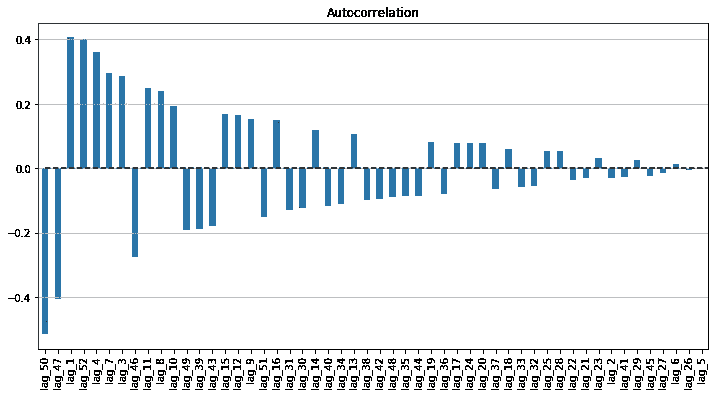

# 简而言之，击败时间序列预测

> 原文：<https://towardsdatascience.com/beat-the-time-series-forecasting-in-a-nutshell-62ba31a3d00b?source=collection_archive---------17----------------------->

## 揭示时间序列的正确预测方法，表示时间序列的特征，并使用零售数据作为示例代码预测其未来值


来源:科学软件

# 1.定义时间序列

时间序列是与时间相对应的一系列数值，这是 a 序列与其他截面数据的最大区别。

零售数据、每日温度、产量、需求、自然储量都是时间序列数据，因为当前值取决于其历史值。

# 2.构成时间序列

时间序列有 4 个组成部分:水平、趋势、季节性和噪声。

*   **水平**:时间序列的平均值
*   **趋势**:序列值从一个周期到另一个周期的移动
*   **季节性**:可以多次观察到的序列的短期周期性行为
*   **噪声**:测量误差产生的随机变化

我们并不总是能够注意到噪音中的前三个元素，因为如果我们不使用一些技术来定位它们，它们通常是不可见的。

为了观察和识别这些成分的存在，我们可以考虑。

*   绘制时间序列图(这是检测序列特征的最佳方式)
*   放大指定较短时间段
*   更改系列的刻度，以便更清楚地观察趋势
*   抑制季节性:将时间序列聚合到一个更大的时间尺度(从每小时到每天，从每月到每年，等等。)

我用一家零售店 3 年的每周销售额作为例子。

```
plt.plot("Date", "Weekly_Sales", data=Wal_sales);
plt.hlines(y=Wal_sales.Weekly_Sales.mean(), xmin=0,
           xmax=len(Wal_sales), linestyles='dashed');
```


根据该数据，很明显有两个峰值，这表示在年末(可能是圣诞节和新年期间)有非常明显的**季节性。可能有其他季节性，但很难从图上观察到。**自相关**可用于确认季节性。**

# 3.自相关

自相关描述了时间序列的值与其邻居之间的**联系。因此，为了计算自相关，我们计算序列与其**滞后版本**的相关性。**

通过将系列值向前移动 n 个周期，从原始数据集产生 Lag-n 版本。例如，lag-1 向前移动 1 个周期，Lag-10 系列向前移动 10 个周期。

通过观察序列及其滞后的相关性，我们可以确认序列的季节性。

计算和绘制自相关的代码


*   从上面的自相关图判断，在 lag-52 和 lag-51 中都有很强的正自相关。这意味着在年底会有一个**周期性的年度模式**。
*   第二个强相关性是 lag-1，它意味着二月的第二周，或情人节期间。
*   自相关揭示了正的和负的自相关，这意味着序列不是在同一个方向移动，而是上下波动。

我从头开始计算，但是自相关可以通过使用 Python 中的 *pandas.plotting* 中的*自相关 _plot* 函数或者 r 中的 *tseries* 包中的 *acf* 函数很容易地绘制出来

# 4.预测时间序列

预测时间序列有几种方法。

*   **基于模型的方法通过多元线性回归**来探索序列与其他特征的相关性。与其他横截面数据一样，基于模型的方法计算时间序列对其他特征的依赖性，但另一方面没有考虑不同时期之间的时间序列值之间的依赖性。
*   **数据驱动方法**，模型从数据本身学习模式，并根据其之前的值估计时间序列的下一个值。数据驱动方法在给定的时间序列环境中是重要的，相邻时段的值往往是相互关联的。这种相关性被表示为**自相关**。
*   **结合基于数据的方法**通过预测序列的未来值以及残差的未来值，然后将两次预测的结果结合在一起。残差预测作为对第一个预测的修正。
*   **系综法**通过对多种方法进行平均来得到结果。

在本文中，我将介绍数据驱动的方法。

# 使用数据驱动方法进行预测:

ARIMA 模型是计算数据驱动预测最常用的选择。你可以在这个[帖子](https://geniusnhu.netlify.com/publication/arima-autoregressive-intergreated-moving-average/)中找到 ARIMA 模型的细节。在这里，我将对数据应用 ARIMA。

试试 Python 中 ***pmdarima*** 中的 *auto_arimafunction* 或者 r 中 *forecast* 包中的 *auto.arima* 函数很有用。

有一点需要注意的是，从上面的自相关来看，在滞后 52 时有一个明显的季节性，所以我们需要将其纳入 ARIMA 模型。

基于 AIC 分数定义最佳 ARIMA 模型的代码

该函数选择最低的 AIC 分数模型，并将其嵌入以供进一步的模型使用。

然后，分割训练测试集，训练模型并进行预测。

用 ARIMA 模型分割训练测试集、训练和预测时间序列数据的代码


*   总的来说，该模型似乎在数据上表现一般，但仍有进一步改进的空间。
*   MAPE(平均绝对百分比误差)分数为 5.7%，不算太高，也不算太低。
*   ARIMA 模型似乎在早期预测值中表现良好，而在后期预测值中表现较差。

> **然而，一个问题出现了，这个模型真的捕捉到了时间序列数据的值吗？**

看一下模型的**残差**(或者预测值与实际值的**差**)是有帮助的。建议检查预测模型的残差，以评估指定模型是否充分捕捉了数据信息。这可以通过探索一个时期的残差与其他时期的残差的相关性来实现。

**好的时间序列预测模型**的残差具有以下性质:

*   残差**不相关**
*   残差具有零或接近零的平均值(这意味着模型在任何方向都是无偏的)
*   残差应具有**正态分布**
*   残差应具有**恒定方差**

如果结果缺少上述任何属性，预测模型可以进一步改进。

让我们计算残差自相关并判断结果。

计算和绘制残差自相关的代码



```
Residual mean: -6308833.905274585
```


让我们根据以下标准来判断残差的自相关性:

*   残差不相关:**否**。残差序列仍然被观察到与其滞后有一定的相关性。
*   残差具有零或接近零的均值(这意味着模型在任何方向上都是无偏的):**均值是-6308274585**。所以不符合这个标准。
*   残差应该是正态分布:**不完全是正态分布**
*   残差应具有恒定方差:**否**与均值一致不等于 0。

因此，预测模型有很大的改进空间，可以通过找到捕捉残差中相关性的方法，将当前留在残差中的值添加到预测中。

# 5.数据划分

时间序列区别于正常横截面数据的最大特征之一是未来值对其历史值的**依赖性**。因此，时间序列的数据划分不能随机进行，而是要将序列分成 2 个周期，前面的周期用于训练集，后面的周期用于验证集。

以下代码将有助于根据时间序列结构分割训练测试集。

分割时序数据的训练集和测试集的代码

销售不仅与自身的过去相关，还可能受到其他因素的影响，如特殊场合(如本数据集中的假日)、工作日和周末等。方法驱动的模型将在下一篇文章中介绍，包括特征提取和特征选择。

*最初发表于*[*【https://geniusnhu.netlify.com】*](https://geniusnhu.netlify.com/2020/02/06/comprehensive-understanding-on-time-series-forecasting/)*。*