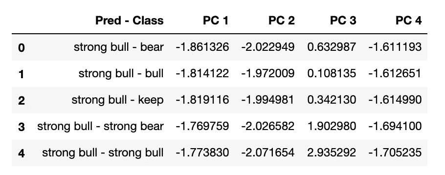

# 战胜股市

> 原文：<https://towardsdatascience.com/beating-stock-market-8b33c5afb633?source=collection_archive---------57----------------------->

## 个人项目

## 或者试图这么做。

埃尔帕尔马(加的斯，弗龙特拉)，西班牙，作者:埃斯特万·桑切斯

***注来自《走向数据科学》的编辑:*** *虽然我们允许独立作者根据我们的* [*规则和指导方针*](/questions-96667b06af5) *发表文章，但我们不认可每个作者的贡献。你不应该在没有寻求专业建议的情况下依赖一个作者的作品。详见我们的* [*读者术语*](/readers-terms-b5d780a700a4) *。*

# 摘要

这是一个个人项目，在这个项目中，我试图使用机器学习工具开发一个交易应用程序。从数据建模以及基于分布和机器学习技术的分类开始，我为新手投资者开发了一个交易策略，以在该应用程序的帮助下产生低风险利润。

# 介绍

市场分析既有趣又复杂，从以下链接[【1】](https://en.wikipedia.org/wiki/Efficient-market_hypothesis)中可以看出。然而，有几项与机器学习一起进行的工作试图阐明这一领域。

在这个作品中，我创建了一个由两个要点组成的应用程序:

1.  可以在不同时间范围内分析股票市场指数的屏幕。这里可以找到一张**烛台图**；一张图来**分析技术指标**[【2】](https://www.investopedia.com/technical-analysis-4689657)；一个折线图显示了日内价格变化的百分比**，以及一个**箱线图**来表示这最后一个图表，以便理解这种分布。**
2.  我开发的交易策略分析( *Strategyone* )可以在这个屏幕上完成。该策略分为两个不同的部分:第一部分包括通过机器学习对股票市场指数运动的**预测，而第二部分包括当前数据向量预测和过去发生的事情**之间的**比较。选择的时间范围从 7 天、14 天、21 天到 28 天不等。**

最后一节将在“如何战胜市场”和“交易策略”中详细解释

数据是通过 Alpha Vantage API[【3】](https://www.alphavantage.co/)获得的，而一份股票市场指数列表是从 Finn hub API[【4】](https://finnhub.io/)获得的。

# 语境

作为一名物理学家，我一直对复杂系统世界着迷:某些公式如何应用于生物系统或金融系统，以及几个电子的组合，并产生有趣的结果。

> 同样，当在系统中研究时，对系统中某个元素的个别研究可能会导致不同的行为。

因此，这个项目产生于对股票市场的好奇，以及软件和智力的挑战，这意味着要理解市场这样一个复杂的系统。

该项目已经经历了三个阶段:这项工作的第一个版本是作为我在[【5】](https://kschool.com/)参加的数据科学硕士学位的最终论文开发的，其目的只是创建分类模型，该模型可以使用机器学习来预测股票在市场上的未来。第二个版本是在主版本的基础上设计的，它试图改进第一个版本。最后，第三个版本是这里讨论的版本，它提供了一个重要的改进，即交易策略的发展。

# 如何战胜市场

为了使用**分类模型**来预测市场走势，我需要对数据进行分类。这些预测类别被称为“强势牛市”，即价格上涨显著的预测；“牛”，有涨价的时候；“保持”，价格不变；“熊”，价格上有所下降，而“强熊”，价格下降显著[【6】](https://www.investopedia.com/insights/digging-deeper-bull-and-bear-markets/)。

> 股市指数类别是如何选择的？

这是通过**股票价格的百分比变化分布**实现的。因为我们的目标是预测未来，所以在寄存器中，百分比变化列需要**关于价格如何相对于我们想要预测的时间范围变化的每日信息**。

> 因此，将待分类的变化百分比与最近 4 个月的分布进行比较，并根据与该分布相关的百分点范围选择上述类别之一。

通过这种方式，我们可以在一个时间范围内对所有数据进行分类，这将永远是关于未来的。

分类完成后，下一步是了解应用更精确的分类算法的最佳方式。经过多次试验和不同的想法后，选定的流程是通过**鲁棒缩放器**技术和**随机森林**作为分类算法来缩放数据。这些是被选中的，因为它们在所有类别中提供了平均更高的精度。

只有遵循这些步骤，我们才能获得一个能够以 40 %的准确率预测“强牛”**的模型。**

# 交易策略

交易策略将基于过去发生的事情，以及假设我们赢了，我们猜对的想法，**省略为了赢，我们还必须猜对预测的类别**。

> 也就是说，如果预测是“牛市”，我们进行多头操作，结果实际上是“强牛”，我们的预测将被认为是准确的。同样，如果我们预测“强势牛市”，结果是“牛市”，或者当预测是“强势熊市”时，我们进行空头头寸移动，结果是“熊市”，反之亦然。

如果没有发生上述情况，手术将被视为失败。

考虑到这一点， ***策略将仅包括多头操作，并且当模型预测到“强势牛市”*** 时，假定它是来自分类模型的具有较高准确度的类别。

> 这个策略是如何运作的？

一旦鲁棒定标器应用于所有寄存器，类别被预测，实际分类，应用**PCA**将维数减少到 4，保持 95 %的数据可变性。因此，我们还有其他 4 个变量以及与寄存器及其实际类别相关联的预测。**当预测与真实类别**相关的事物时，可以知道变量如何，因此我们安排预测和类别，并且我们计算与每个轮廓曲线相关的中值，以了解如何描述每个轮廓曲线。

> 因此，我们将描述预测“强牛”的变量，以及实际结果是“强牛”或任何其他类别。

所有这些都将限于与预测日相关的最近 6 个月的数据，以避免旧的市场状态对策略的影响。获得的结果总结如下:

PCA 后每个预测类别的变量描述。

该表的解释是，在预测“强牛”和类别被猜对之前的最近 6 个月，主成分的变量曾作为中位数。

因此，为了执行操作，我们必须将我们正在进行预测的一天的数据应用于鲁棒定标器和 PCA，

> 如果得到的预测是“强牛”，我们就已经达到了进行操作的第一步。第二步是检查前面曲线的哪个轮廓与预测的数据更相似。这将使用余弦相似度来完成，这将允许我们观察与数据更相似的向量。如果它对应“强牛-强牛”，我们就有了执行更安全操作的钥匙。

**遵循这个交易策略，我们将获得几乎 50 %的准确率**，但是，正如开始提到的，猜对并不意味着也能猜到类别。

> 猜对并不意味着也要猜对类别

在我们的情况下，正确的猜测也将是“强牛”的预测，并获得“牛”作为最终结果。**考虑到这一点，策略准确率达到 58 %。**

# 结论

这项工作的目的是开发一种策略，允许初学者投资者在不遭受全部损失的情况下获得低风险利润。正如我所提到的，该策略确保了在所述条件下 58 %的准确度，但是，就个人而言，它不是一个自动实施的策略，因为假设的误差水平会上升到 40%。

然而，有趣的是，在执行的操作中，遵循仅基于数据的策略，并且对股票市场了解有限且最少，如何获得超过 50 %的准确度。

所有项目代码可在 [GitHub/esan94/bsm03](https://github.com/esan94/bsm03) 上阅读

# 以下步骤

下一步可能的改进措施包括:

*   数据模型的变化。
*   分类算法的改进。
*   这个项目增加了更多关于股票市场的知识。
*   应用余弦相似性对主要成分赋值。

# 资源

*   [1][https://en.wikipedia.org/wiki/Efficient-market_hypothesis](https://en.wikipedia.org/wiki/Efficient-market_hypothesis)
*   [https://www.investopedia.com/technical-analysis-4689657](https://www.investopedia.com/technical-analysis-4689657)
*   [https://www.alphavantage.co/](https://www.alphavantage.co/)
*   [https://finnhub.io/](https://finnhub.io/)
*   [https://kschool.com/](https://kschool.com/)
*   [6][https://www . investopedia . com/insights/digging-deep-bull-and-bear-markets/](https://www.investopedia.com/insights/digging-deeper-bull-and-bear-markets/)

可以在 [LinkedIn](https://www.linkedin.com/in/estebanmsg/) 、 [GitHub](https://github.com/esan94) o [Medium](https://medium.com/@emsg94) 上关注我。

帕洛玛·桑切斯·纳瓦埃斯翻译。