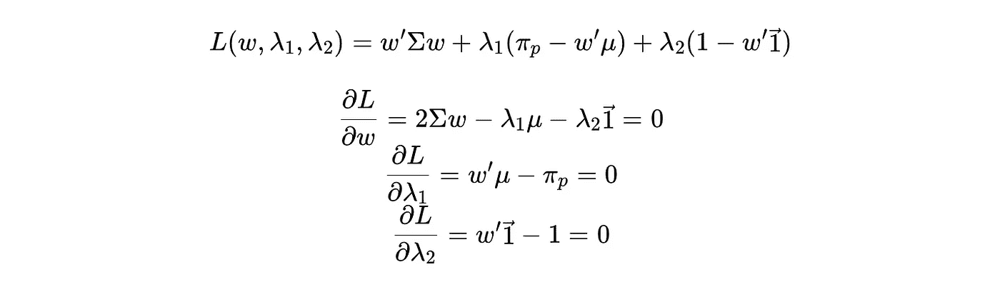
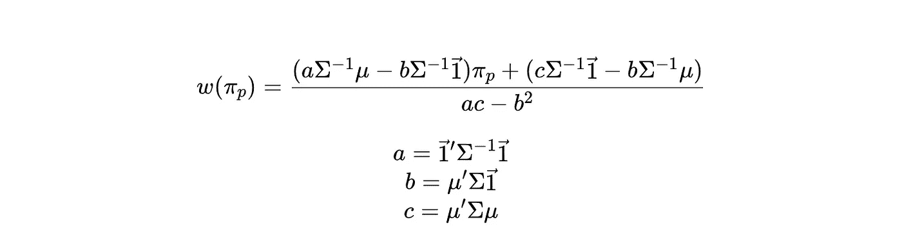
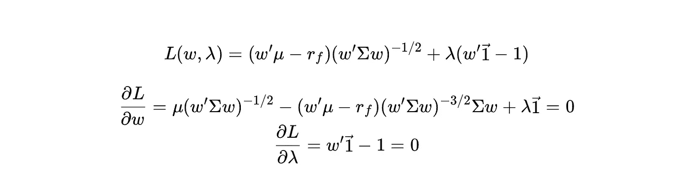
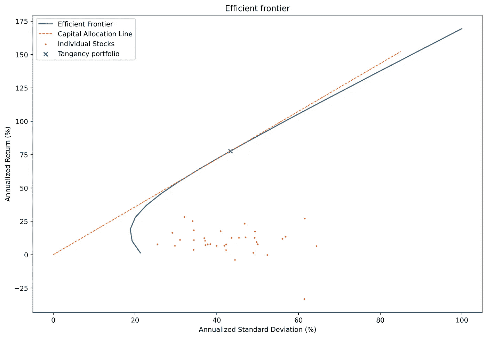
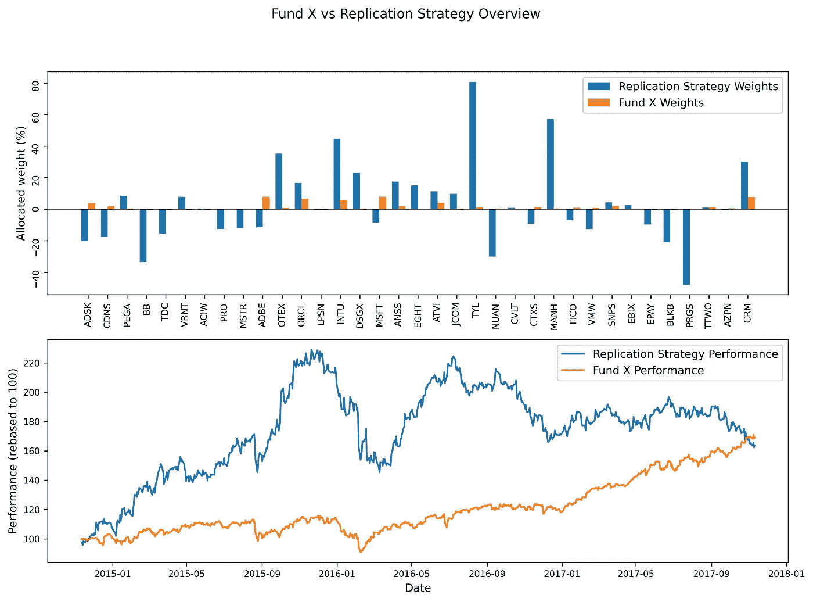
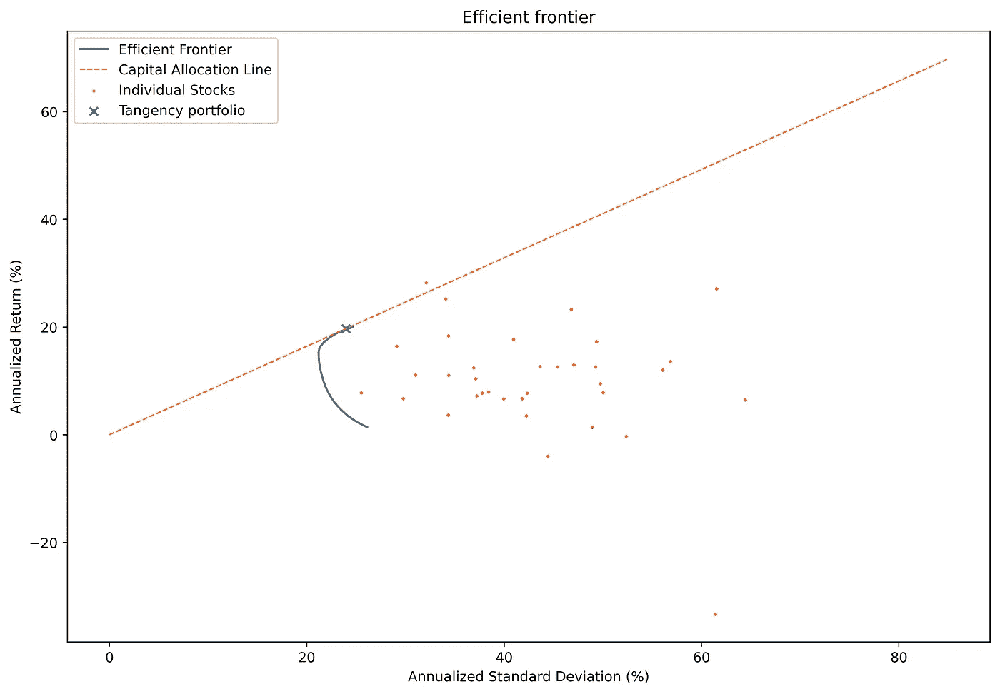
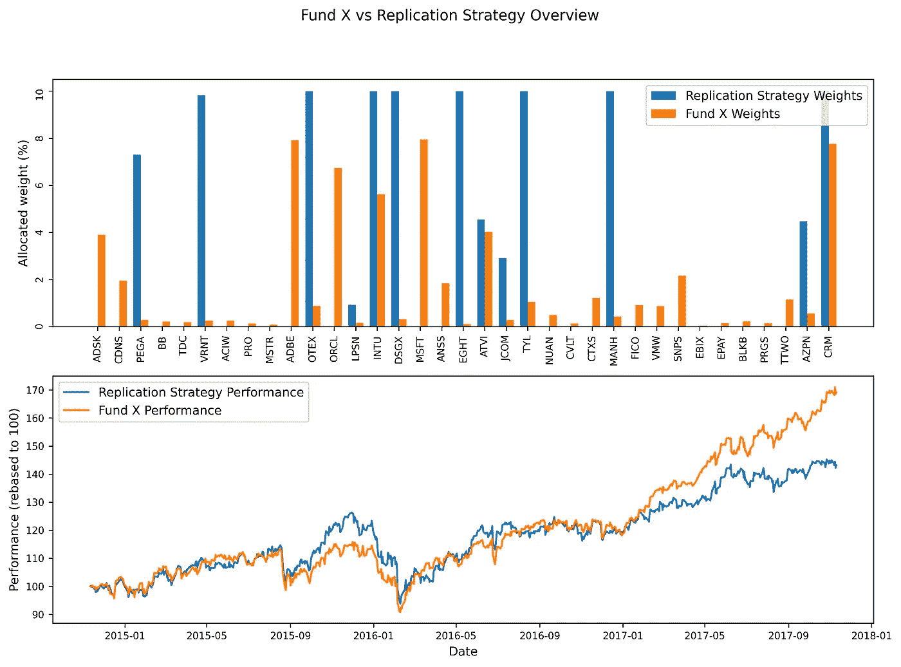
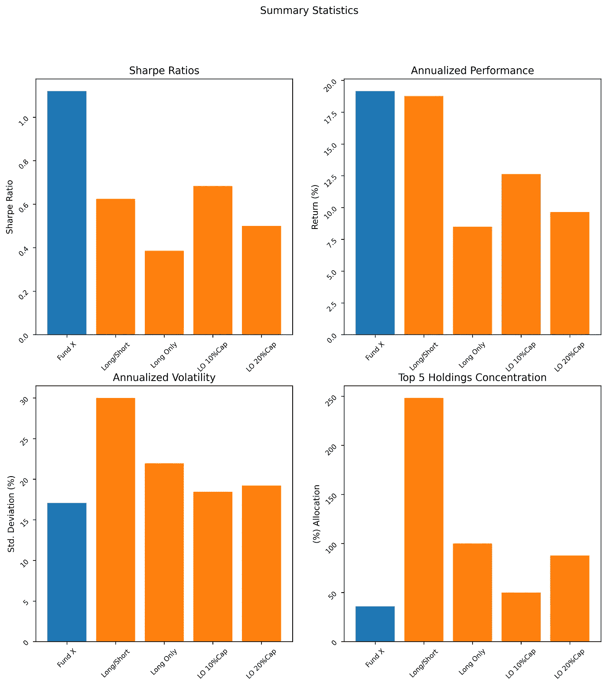

# 击败 ETF:使用 Python(…和一些线性代数)进行投资组合优化

> 原文：<https://towardsdatascience.com/beating-the-etf-portfolio-optimisation-using-python-and-some-linear-algebra-e48d0e0e44f?source=collection_archive---------13----------------------->

*这个故事涵盖:
1)什么是马柯维茨均值/方差优化投资组合
2)如何使用 Python(*[*GitHub*](https://github.com/rshemet/MarkowitzPortfolioOptimization)*提供源代码)来计算一个投资组合
3)如何根据一个已建立的市场交易基金来回溯测试你的策略*

这个实验的目的是看看我们是否可以使用 1952 年的概念来创造一个被动的投资组合，这个投资组合会比今天表现最好的交易所交易基金做得更好。

> **免责声明**:这仅仅是一个数字和计算练习，不应被视为投资建议或任何基础。

## **前言**

为了找到一个有价值的竞争对手，我谷歌了“最佳被动技术 ETF”，跟随[第一个链接](https://www.financial-planning.com/list/vanguard-fidelity-top-ranking-of-passive-funds-with-best-5-year-returns)选择了排名第一的基金——*我不知道我是否可以在媒体上引用它的正式名称——*让我们称它为**基金 X** 。基金 X 专门投资于在北美主要交易所上市的科技和软件行业股票，并(截至 2020 年 6 月 9 日)投资于 104 只个股。我已经从[这里](https://www.kaggle.com/borismarjanovic/price-volume-data-for-all-us-stocks-etfs)下载了所有美国股票的表现，由 Kaggle 社区提供，并过滤了基金的头寸。

从现在开始，我的目标是编写一个算法，遍历这些股票，分析它们的表现，并将它们组合成一个均值/方差最优的投资组合(……然后看看它的表现如何与专业资金经理的表现相比较)。

游戏开始了！

## 一些背景

1952 年，Harry Markowitz 博士写了他关于最优均值-方差投资组合的开创性论文——这项研究随后为他赢得了 1990 年的诺贝尔经济学奖。他的研究为[现代投资组合理论(MPT)](https://www.investopedia.com/terms/m/modernportfoliotheory.asp) 奠定了基础，该理论的核心有一个相当违反直觉的想法。Markowitz 建议，当从两种资产(例如股票)中选择一种在风险调整后的回报方面明显更理想的资产时，投资者可能会更好地将*和*都加入到他的投资组合中，如果它们提供了足够的分散化效应(想想像**这样的风险分散化，不要把所有的鸡蛋放在一个篮子里**)。

两种资产的简单示例可以扩展到更复杂的真实世界场景，涉及数十甚至数百个单个头寸。

## 但是首先……一点数学

这里我们将看到如何找到有效边界和切线投资组合。如果你只是来看结果的，请随意跳过这一部分，否则让我们直接进入:

在选择资产的最优组合时，MPT 指出，我们必须考虑资产的(历史)回报和成对协方差。目标是找到在给定的预期回报水平下，最小化预期投资组合方差的资产组合。数学上，这个目标函数是:

> ***其中:***
> w —资产权重向量
> 𝜇 —资产收益向量
> σ—资产协方差矩阵
> π —投资组合收益的预期水平

我们构造一个拉格朗日函数并求偏导数:

省略重组，这可以在[这里找到](https://edoc.hu-berlin.de/handle/18452/14691)，我们得到一个将投资组合权重表示为投资组合预期回报的函数的函数:

权重向量，代表我们在有效边界的持有量(对于给定的π回报水平)

获得的表达式将为我们提供一个资产的相对权重向量，该向量将最小化任何目标回报水平的方差。计算每个回报水平的方差，并将结果绘制在图上，得到**有效边界** *(我们将在后面绘制)。*

虽然边界本身是一个很好的视觉辅助工具，但我们如何知道选择曲线上的哪个点(风险/回报曲线)？这就是**切线投资组合**的用武之地。切线投资组合旨在最大化预期风险调整后的回报，位于[资本分配线](https://en.wikipedia.org/wiki/Capital_allocation_line)与我们的边界曲线*(同样，我们稍后将计算一个)*相切的点。

切线投资组合是通过最大化投资组合的(预期)[夏普比率](https://www.investopedia.com/terms/s/sharperatio.asp)找到的。再一次，目标函数:

拉格朗日和导数；

再一次，一些[重新安排](http://faculty.washington.edu/ezivot/econ424/portfolioTheoryMatrix.pdf)沿着这条路走下去:

权重向量，代表我们在切线投资组合中的持股

完成推导后，我们可以直接开始实施策略。

> 必须指出的是，迄今为止以这种方式建立起来的实验，对 ETF 来说并不完全是“公平的”。我们的投资组合优化目标函数仅受权重相加必须达到 100%的约束(“**无杠杆约束**”)。为了与只做多的基金公平竞争，我们还必须实施**禁止卖空约束**——即限制所有权重为正值。然而，这将计算问题转化为非线性任务。稍后我们还将使用 Python SciPy 库来完成这项工作。

# 实验本身

让我简单解释一下我是如何设置数据的。

## 准备

从 Kaggle 下载的股票回报有直到 2017 年 11 月的数据——这是我的第一个限制。其次，为了获得某种程度的可靠性，最好只使用那些股票，因为我至少有几年的价格数据。经过一番思考，我决定只使用 X 基金的股票，我有 10 年的历史——7 年的训练和 3 年的测试。这使得最初的 104 只股票的投资组合减少到只有 35 只，但它们占了投资组合总价值的 60%以上，所以我对此很满意。

我们现在假设我们是一个投资者，在 2014 年 11 月坐在一堆现金上，手头有 7 年的股票数据表现，希望通过模仿臭名昭著的 **Fund X** 的策略来投资我们的储蓄:

## 多空优化

实验的第一部分(也是更容易的部分)包括盲目应用我们之前定义的公式。*如果你想继续编码，可以从* [*这里*](https://github.com/rshemet/MarkowitzPortfolioOptimization) *(提供解释)*随意克隆这个库。使用 7 年的股票收益构建的**有效边界**看起来如下:

08 年危机后的科技行业…解释了约 50%的年化波动率

> ***旁注*** *:如果你对金融市场没有太多经验，看到一个预期年回报率超过 75%的切线投资组合是*而不是*很平常的事情。巨大的预期回报和波动性可以解释为这是一个“多头/空头”投资组合，因此“有效边界”越向右上角移动，我们的“多头”和“空头”头寸就越大。此外，我们正在关注科技行业——通常是高贝塔股票——*和*我们的数据来自一个动荡的后危机时期。*

总的来说，MPT 的基本思想是:通过将资产组合成一个投资组合，我们能够“获得”比单独投资每只股票好得多的风险回报。让我们看看我们的“最优解”与基金 X 的构成和表现相比如何:

上图:每只股票的配置||下图:投资增长

正如所料，我们的多空投资组合的表现非常不稳定。从图表上看，在三年的大部分时间里，它的表现可能好于 ETF，但实际上，这要归功于其异常的波动性(我个人会将其归因于“幸运”的时机)。*如果复制* [*代码*](https://github.com/rshemet/MarkowitzPortfolioOptimization) *，可以修改 training_period 参数，看看对性能的真正影响有多大*。此外，这种“盲目”的解决方案导致我们的投资组合权重“**激增**”，在一只股票中达到+80%和-40%。

不太好。

因此，一个更现实的(也是对 ETF 更“公平”的)测试是将我们的头寸限制在仅做多。

## 仅长优化

为了将我们之前定义的目标函数限制为仅“接受”长位置，**我们添加了一个约束**，即权重向量中的每一项必须大于或等于 0。此外，共同基金的投资组合经理通常对单一基金的最大允许分配有限制。我决定将每只股票的权重限制在 10%以内。

使用 Python SciPy 库(和[Broyden–Fletcher–gold farb–Shanno 算法](https://en.wikipedia.org/wiki/Broyden–Fletcher–Goldfarb–Shanno_algorithm)，我们以同样的方式优化我们的函数:

切线投资组合:仅做多，<10% in a single stock

Performance and composition: long-only, <10% in a single stock

*不做过多评论，但……:*

> ***两个观察****:
> ——我们可以看到，我们的股票权重变得不那么“爆炸性”，整体波动率也远低。
> -所有股票都来自同一个行业，这意味着它们具有相似的风险/回报特征和高度的成对相关性。因此，我们的“解决方案”有许多权重绑定到 10%约束。*

## 金融书呆子统计

一些有趣的风险/回报指标:

上半部分:度量值越高，“越好”||下半部分:度量值越低，“越好”

## 摘要

也许正态分布回报的标准差并不是衡量投资组合“风险”的好指标。也许我们应该努力找到所有 104 只股票的数据。也许 X 基金经理坐在一个黑暗的、挂满布帘的房间里，手里拿着一个水晶球。不管怎样，我们的“**快速而肮脏的**”解决方案在竞争中表现不佳。

如果你复制了[源代码](https://github.com/rshemet/MarkowitzPortfolioOptimization)，你可以尝试增加更多的股票，引入不同的风险措施，每年重新平衡投资组合或者*做任何我没有做过的事情。*

金融市场的博弈直到今天仍未解决。许多人尝试，许多人失败。欢迎大家下载资料一试身手:)