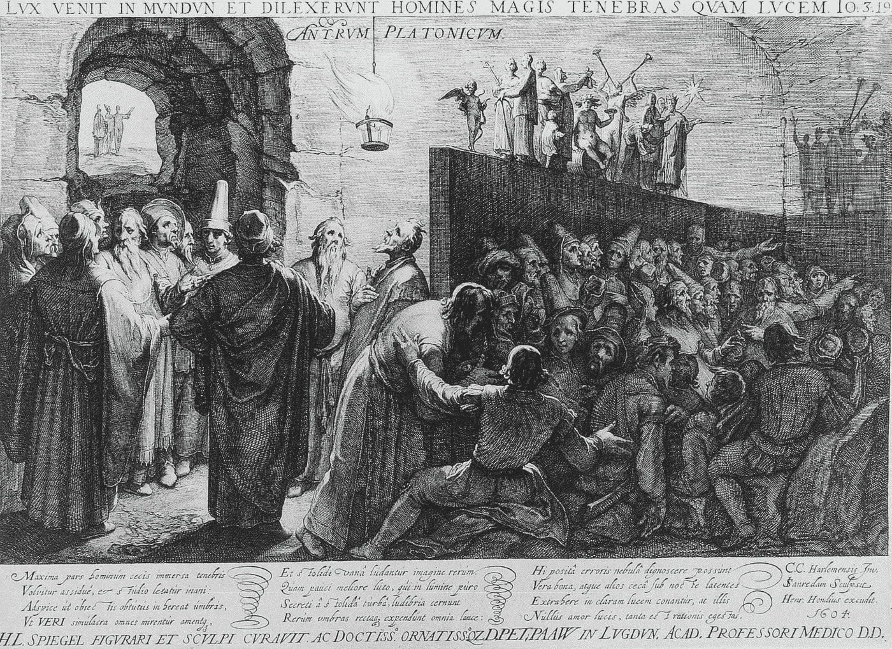
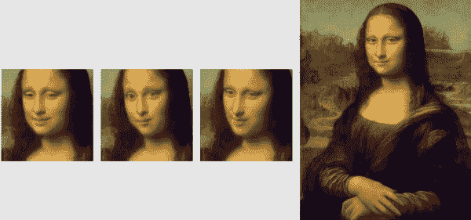
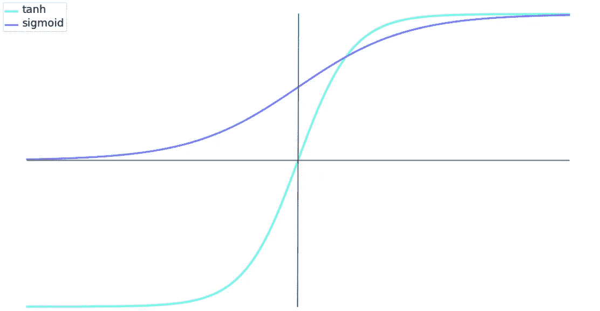
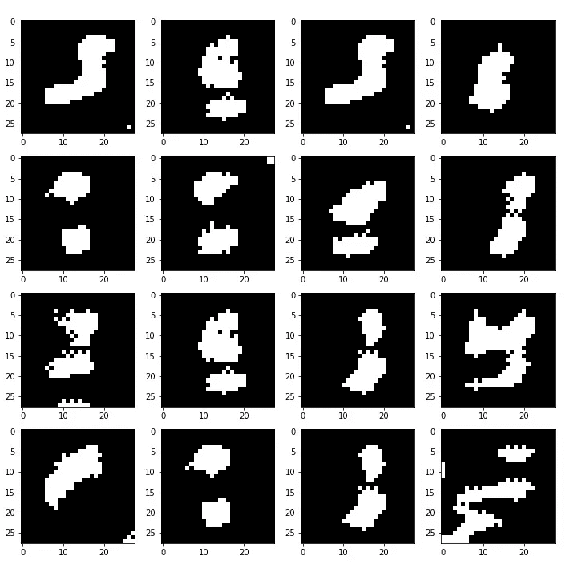
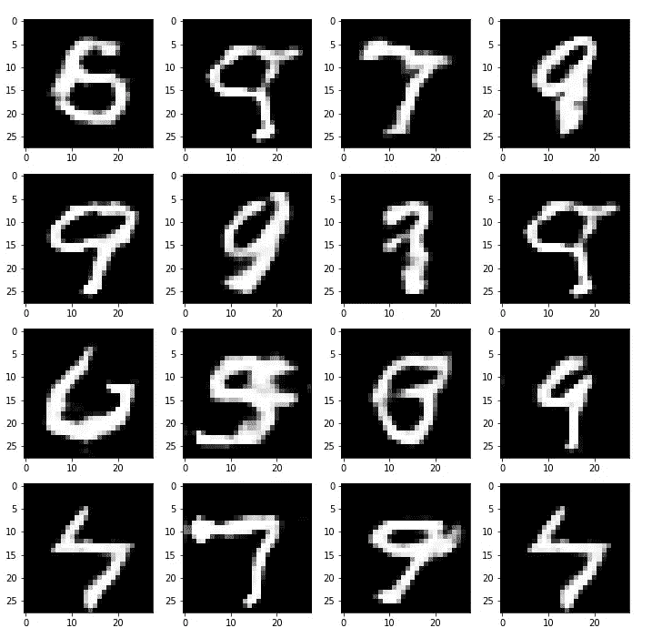
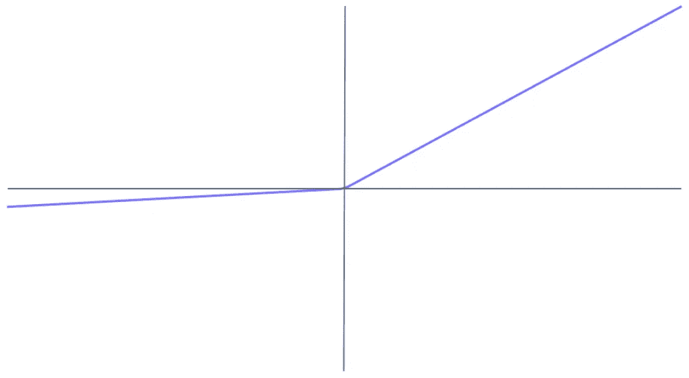

# 打甘游戏

> 原文：<https://towardsdatascience.com/beating-the-gan-game-afbcce0a20be?source=collection_archive---------39----------------------->

## 开发“自切片面包以来最酷的东西”的技巧



[“柏拉图的洞穴](https://en.wikipedia.org/wiki/File:Platon_Cave_Sanraedam_1604.jpg)”作者 Jan Saenredam，之后是 Cornelis Cornelisz。范哈勒姆，1604 年。在公共领域下许可。

生成对抗网络(GANs)是深度学习中最令人着迷的发展之一。Yann LeCun 自己将 GANs 命名为“自切片面包以来最酷的东西”[1]。

这些架构正被应用于大量的问题。在从暗物质研究[2]到室内设计[3]的应用中获得成功。



GAN-build Mona Lisa，来自[“现实神经说话头部模型的少数镜头对抗学习”](https://arxiv.org/pdf/1905.08233.pdf)，2019 年论文

看到如此广泛的令人着迷的应用，研究和开发 GANs 的愿望已经在我的脑海里发痒了很长时间。最近，我屈服了，决定是时候投入进去了。

我很快了解到甘人不容易驯服。正因为如此，我对第一次进入 GANs 的世界时常见的许多误解和错误有了新的体验。

我在本文中总结了我从中学到的错误，这些错误可能是 GAN 实施和融合中成功与失败的区别。

# 坦，不是乙状结肠



tanh v 形(逻辑)激活

在预处理图像数据时，我们应该将其归一化到-1 和 1 之间，而不是 0 和 1 之间[4]。

这也意味着我们在 G 中的最终层激活应该是`tanh`而不是`sigmoid`。

## 255

这里需要注意的另一个重要的事情是后生成，不要忘记将值乘以 127.5，再加上 127.5，以返回到 0–255 的原始范围。

```
image_array = generated_tensor.numpy() * 127.5 + 127.5
```

# 不要过度使用过滤器

最初，当我的 DCGAN(深度卷积 GAN)在亮度变化中挣扎时，我认为生成器的转置卷积层只是缺乏复杂性。

所以，我加了更多的滤镜。事实证明，这与我本该做的事情完全相反。

减少过滤器的数量可以让生成器更好地表示值的范围。

以下是一些过滤大量生成的 MNIST 数:



发电机过滤器尺寸为:256 > 128 > 64 > 1

现在使用最少的**过滤器:**



发电机过滤器尺寸为:32 > 16 > 8 > 1(您也可以降低尺寸)

过多的过滤器会将发生器值推到极限。对于`tanh`来说，这是-1 或+1。导致生成的图像缺乏说服力。

# 稀疏渐变不好

稀疏梯度本质上是弱信号。或者具有非常低的值的信号。

这些低值信号的问题是，随着对它们进行许多数值运算，它们会变得越来越小。

熟悉 RNNs 的人无疑会遇到梯度消失的问题。这是完全一样的。

为了解决这个问题，我们可以将**批量标准化**添加到我们的网络中[5]。

**需要注意的是**，批量标准化应该发生在 s 形激活(tanh，sigmoid/logistic)之后**，非高斯激活(ReLU，LeakyReLU)之前【5】。**



泄漏激活

此外，对发生器和鉴别器*[4]始终使用**leaky relu**——除了最后一层，我们使用 s 形激活函数。

**最初的 DCGAN 在发生器中使用 ReLU 激活，在鉴别器中使用 leaky ReLU[3]*

# 学习率

有时候我们需要在鉴别器和生成器之间找到一个更好的平衡。

最初，我的鉴别器学得太快了。实质上冻结了发电机，使其无法取得任何进展。

我们可以通过降低或提高双方的学习率来平衡这一点，让我们较弱的网络有更多的喘息空间。

# 从 MNIST 开始

我尝试做的第一件事就是创造这些复杂的艺术风格。当它不起作用时，我不知道为什么。图像太复杂了吗？我对它们的预处理正确吗？也许问题出在网络上，网络可能在任何地方。

因为我是从零开始构建的，所以没有其他实现可以比较和基准测试。最后，代码中出现了几个问题，但我只是通过为 MNIST 数据集重新构建代码来识别这些问题。

这允许您看到您的结果和代码与其他结果和代码的不同之处，因此问题更容易诊断。一旦您的网络产生了合理的输出，您也可以将质量与其他实现进行比较。

因此，在开始某个很酷但很复杂的项目之前，先尝试一下 MNIST(或另一个已建立的数据集)。

# 最后一个音符

最后，甘人并不像他们第一次看到的那样狂野。有了合适的资源，构建我们的第一个 GAN 是一个相当简单的过程。

但是每一个错误都会提高我们的知识，并使我们更接近驯服这些众所周知的困难的架构。

我在下面列出了我在研究和实现 GANs 时非常依赖的资源列表(用**粗体**)。我怎么推荐这些都不为过。

感谢阅读！

# 参考

[1] [Quora 与 Yann LeCun 的会议](https://www.quora.com/session/Yann-LeCun/1) (2016)，Quora

[2] M. Mustafa，D. Bard，W. Bhimji，Z. Luki，R. Al-Rfou，J. Kratochvil， [CosmoGAN:使用生成对抗网络创建高保真弱透镜会聚图](https://arxiv.org/pdf/1706.02390.pdf) (2019)，计算天体物理学和宇宙学 6:1

**【3】a .拉德福德，l .梅斯，s .钦塔拉，** [**深度卷积生成对抗网络的无监督表示学习**](https://arxiv.org/pdf/1511.06434.pdf) **(2016)，ICLR 2016**

**【4】s .钦塔拉，** [**如何训练一个甘？**](https://github.com/soumith/ganhacks) **、GitHub**

**【5】j . Brownlee，** [**深度神经网络批量归一化的温和介绍**](https://machinelearningmastery.com/batch-normalization-for-training-of-deep-neural-networks/) **(2019)，machining Learning Mastery**

如果你对其他机器学习项目感兴趣，你可能会喜欢我以前的项目，在那里我在复制斯多葛派哲学中使用递归神经网络进行文本生成:

[](/stoic-philosophy-built-by-algorithms-9cff7b91dcbd) [## 斯多葛派哲学——由算法构建

### 再现历史上最有权势的人之一所写的斯多葛派哲学

towardsdatascience.com](/stoic-philosophy-built-by-algorithms-9cff7b91dcbd)