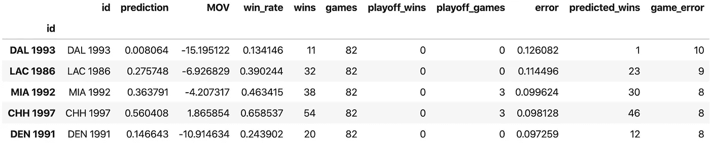

# 战胜困难

> 原文：<https://towardsdatascience.com/beating-the-odds-8d26b1a83f1b?source=collection_archive---------32----------------------->

## 利用数据科学发现 NBA 最伟大的超常球员


马库斯·斯皮斯克在 [Unsplash](https://unsplash.com/photos/BfphcCvhl6E) 上的照片

这是我每周体育主题系列的第一部分。每周我将展示数据科学的应用，并寻求对我们喜欢看的比赛提供深思熟虑的分析和见解。

在这篇文章中，我确定了 NBA 历史上超水平发挥的球队。数字显示的球队应该不是很好，但仍然无视他们的统计优势。事不宜迟，让我们把这事捅出去。

## 使用运动参考 API 获取数据

首先，我们需要一些数据。谢天谢地，[体育参考](https://www.sports-reference.com/)提供了一个免费使用的 [python API](https://sportsreference.readthedocs.io/en/stable/sportsreference.html) ，可以轻松访问超过半个世纪的篮球数据。API 还可以用来访问足球、棒球、曲棍球和英式足球的数据集；对于几乎所有与体育相关的数据项目来说，这都是一个很好的起点。要开始使用 Sports Reference API，您需要像使用 pip 或 conda 的任何其他 python 包一样安装它。

安装了 sports reference API 之后，让我们从获取我们希望包含在分析中的球队的数据开始。我选择了从 1980 年到现在的所有球队。下面的代码使用 Sports Reference Teams 模块构建一个 pandas 数据帧，其中每行代表一个队的一个赛季。它还会将索引设置为一个名为“id”的列，这是团队缩写和年份的简单组合，作为唯一的标识符。这个“id”索引将在以后合并到其他数据帧时派上用场。

```
import pandas as pd
from sportsreference.nba.teams import Teamsyear = str(2020)
all_team_df = Teams(year = year).dataframes
all_team_df['id'] = all_team_df['abbreviation'].apply(lambda x: x + " 2020")
print(2020)for i in range(2019,1979,-1):
    year = str(i)
    temp_df = Teams(year = year).dataframes
    temp_df['id'] = temp_df['abbreviation'].apply(lambda x: x + " " + year)
    all_team_df = pd.concat([all_team_df, temp_df], axis = 0)
    print(i)all_team_df['year'] = all_team_df['id'].apply(lambda x: x.split(' ')[1])
all_team_df.set_index('id', inplace = True)
```

上面代码的结果是下面的 1134 x 47 数据帧。


使用命令`all_team_df.columns`显示我们必须处理的数据帧的所有列。


这里有很多有用的数据，但是我们仍然缺少一些重要的信息。这个数据框架不包含任何关于输赢的内容！由于一个团队成功的最终衡量标准是赢得比赛，我们必须收集这些数据，并将其加入到我们正在构建的数据集。为此，我们将使用运动参考时间表模块。因为我们需要为 1134 个团队中的每一个团队创建并迭代一个 schedule 对象，所以定义一个助手函数来完成这项工作会使代码更加简洁。

```
from sportsreference.nba.schedule import Schedule# helper function to pull wins
def get_wins(tid):
    abb = tid.split(' ')[0]
    year = int(tid.split(' ')[1])
    games = 0
    wins = 0
    playoff_games = 0
    playoff_wins = 0

    # Create schedule object for team and iterate through every game
    for game in Schedule(abb, year = year):
        if game.playoffs == False:
            games += 1
            if game.result == 'Win':
                wins += 1
        elif game.playoffs == True:
            playoff_games += 1
            if game.result == 'Win':
                playoff_wins += 1

    return wins, games, playoff_wins, playoff_games# create dictionary and populate with team records for every year
total_wins_dict = {}for y in range(1998, 1979, -1):

    tids = all_team_df[all_team_df['year'] == str(y)].index

    wins_dict = {'id': [], 'wins': [], 'games': [],
                 'playoff_wins':   [], 'playoff_games': []} for i, tid in enumerate(tids):
        wins, games, playoff_wins, playoff_games = get_wins(tid)
        wins_dict['id'].append(tid)
        wins_dict['wins'].append(wins)
        wins_dict['games'].append(games)
        wins_dict['playoff_wins'].append(playoff_wins)
        wins_dict['playoff_games'].append(playoff_games)

    total_wins_dict[y] = wins_dict
    print(y)# concatenate all team record data into one dataframe
total_wins_df = pd.DataFrame(total_wins_dict[2020])for key in list(total_wins_dict.keys())[1:]:
    temp_df = pd.DataFrame(total_wins_dict[key])
    total_wins_df = pd.concat([total_wins_df, temp_df], axis = 0)total_wins_df.set_index('id', inplace = True)
```

完成团队记录的数据框架后，下一步是将其与我们的其他数据合并，并将结果保存到 csv 文件中，以便于以后访问。

```
all_data = pd.merge(left = all_team_df, right = total_wins_df,
                    how = 'inner', left_index = True,
                    right_index = True)all_data.to_csv('Data/all_team_data_1980-2020.csv')
```

## 线性回归

现在我们可以进入这个分析的有趣部分，使用收集的数据来识别 NBA 最伟大的超水平发挥的球队。这里的想法是建立一个模型来预测一支球队赢得的比赛数量，然后看看哪些球队的表现最好。虽然我们有大量的数据来建立一个模型，但我会保持简单，只使用一个单一的特征，平均胜利幅度(MOV)。显然，一支得分比对手多的球队往往会表现得更好。让我们首先打开一个新笔记本并导入数据集。

```
import pandas as pd
import matplotlib.pyplot as plt
import seaborn as sns
import statsmodels.api as sm
import numpy as np%matplotlib inlinedata = pd.read_csv('Data/all_team_data_1980-2020.csv', index_col = 'id').drop('Unnamed: 0', axis = 1)
```

虽然我们的数据集中没有 MOV 的列，但是可以使用“points”、“opp_points”和“games”列轻松创建。我们还将为常规赛胜率创建一个列，用作我们的目标变量，这有助于考虑在停摆缩短赛季中比赛的球队。最后，我们将把数据分为特性和目标，将数据输入线性回归模型，并生成回归结果的汇总表。

```
data['MOV'] = [(points - opp_points) / games for points, opp_points,
               games in zip(data['points'], data['opp_points'],
               data['games'])]data['win_rate'] = [wins / games for wins, games in
                    zip(data['wins'], data['games'])]# create inputs
X = pd.DataFrame(data['MOV'])
X['intercept'] = [1 for x in range(data.shape[0])]y = data['win_rate']# create and fit linear regression model
model = sm.OLS(y, X)
fit = model.fit()
fit.summary()
```

这里生成的汇总表显示，这个极其简单的模型与我们的数据非常吻合，R 为 0.941。此外，该模型在获胜游戏数方面的平均绝对误差仅为 2.4 场。下面的代码生成了一个预测的和实际的 MOV 获胜的图形，以及一个模型残差的分布图。

```
# create predictions for every team
preds = fit.predict(X)# create a dataframe to hold all results
results = pd.DataFrame({'id': data.index, 'prediction': preds})# merge with input data and actual results
merge_cols = ['MOV', 'win_rate', 'wins', 'games', 'playoff_wins',
              'playoff_games']results = pd.merge(left = results, right = data[merge_cols],
                   how = 'inner', right_index = True,
                   left_index = True)# use predicted win rate to predicted integer number of wins
results['predicted_wins'] = [int(round((prediction) * games, 0)) for
                             prediction, games in
                             zip(results['prediction'],
                             results['games'])]# create error columns
results['error'] = [act - pred for act, pred in
        zip(results['win_rate'], results['prediction'])] results['game_error'] = [wins - pwins for wins, pwins in
                         zip(results['wins'],
                         results['predicted_wins'])]plt.figure(figsize=(15,6))plt.subplot(1,2,1)
sns.scatterplot(x = X['MOV'], y = y)
sns.lineplot(x = X['MOV'], y = preds, color = 'red')
plt.title('Margin of Victory vs Win Rate')plt.subplot(1,2,2)
sns.distplot(results['game_error'], bins = 21)
plt.title('Residual Distribution');
```


使用刚刚创建的结果数据框架，现在可以通过对“错误”列上的数据框架进行排序来轻松挑选出最优秀的学生。这些是根据他们的平均胜率预测赢得最多比赛的球队。这样做会产生以下结果:



具有讽刺意味的是，我们的分析刚刚确定了 1993 年的达拉斯小牛队，可以说是 NBA 历史上最差的球队之一，也是 NBA 历史上最伟大的超水平发挥的球队。这是一支输了 42 场 15 分以上，输了 26 场 20 分以上，输了一场 58 分的球队。除了输球，很难说这支球队在其他方面“超水平发挥”。这到底是怎么回事？为什么我们的模型产生了如此大的拟合，却导致了如此不合理的结果？

事实证明，这是一个很好的例子，说明为什么简单的线性回归永远不应该用来模拟比例。理论上，当比例被限制在 0 和 1 之间时，线性模型可以输出任何实数。如果 1993 年的小牛队公布了一个稍差的 MOV，我们的模型就会预测到一个负胜率！我们创建了一个模型，倾向于挑选非常差的团队作为优等生，非常好的团队作为劣等生。

## 逻辑回归

解决方法是使用逻辑回归而不是线性回归。不幸的是，sklearn 中方便的逻辑回归模块只适合分类数据，而不是实际比例。这意味着我们需要做一些额外的工作来将线性回归转换成逻辑回归。

逻辑回归的核心是对比例、概率或分类的对数优势进行线性回归。因此，第一步是定义函数，将我们的目标变量“win_rate”转换为 log-odds，然后再转换回来。这些函数通常被称为 logit 和 sigmoid 函数，可以在我们的 python 笔记本中轻松定义如下:

```
def logit(p):
    return np.log(p/(1-p))def sigmoid(x):
    return 1 / (1 + np.exp(-x))
```

然后，我们将重复我们用来产生线性回归的过程，只有一些微小的变化。

1.  我们的目标变量“win_rate”使用 logit 函数转换为对数赔率。
2.  使用具有单一特征“MOV”的常规线性回归来拟合目标，这与以前没有什么不同。
3.  使用 sigmoid 函数，我们的线性回归预测(以对数赔率的形式)被转换为更熟悉的“胜率”。

```
# create inputs
X = pd.DataFrame(data['MOV'])
X['intercept'] = [1 for x in range(data.shape[0])]
y = data['win_rate'].apply(logit)# create and fit linear regression model
model = sm.OLS(y, X)
fit = model.fit()
fit.summary()# generate predictions
preds = [sigmoid(x) for x in fit.predict(X)]
```

正如预期的那样，这种逻辑回归模型对我们的数据产生了稍好的拟合，R 为 0.944，平均绝对误差仅为 2.3 场。虽然这只是比我们之前的模型稍微好一点，但是绘制结果显示更适合具有更极端的正或负 MOV 值的团队。这些图可以使用与以前几乎完全相同的代码生成。


## NBA 最伟大的成功者是…

现在，我们实际上可以确定 NBA 最伟大的超水平球队。为了获得更有说服力的结果，让我们过滤输出，只包括至少赢得 4 场季后赛的球队。

```
overachievers = results[results['playoff_wins'] >= 4].sort_values(by = 'error', ascending = False)overachievers.head()
```


现在你知道了，NBA 最伟大的球员是 1987 年的金州勇士队。在乔·巴里·卡罗尔、斯里皮·弗洛伊德和克里斯·穆林的带领下，1986-87 赛季勇士队的 MOV 得分很低，只有 2.3。虽然这通常会导致一个令人失望的赛季，但 1986-87 年的勇士队获得了 42 场胜利，远远超过了他们预测的 34 场胜利，在西部联盟中排名第五。球队在两场控球比赛中取得了 63%的胜率，同时也在 30 场比赛中输掉了 10 分或更多。在季后赛中，勇士队在 5 场比赛中(3-2)击败了 4 号种子犹他爵士队，然后在 5 场比赛中(1-4)输给了被广泛认为是有史以来最好的球队之一的湖人队。

感谢你的阅读，我希望下周你能回来。

[链接到 Github](https://github.com/alexmuhr/Over_Under_Achiever_Analysis.git)