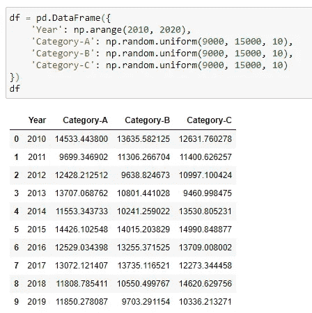
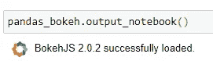
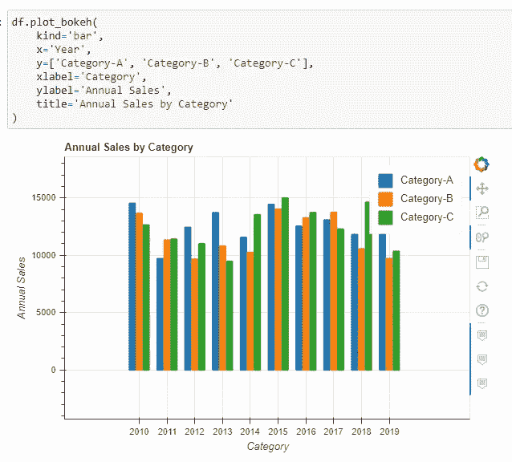
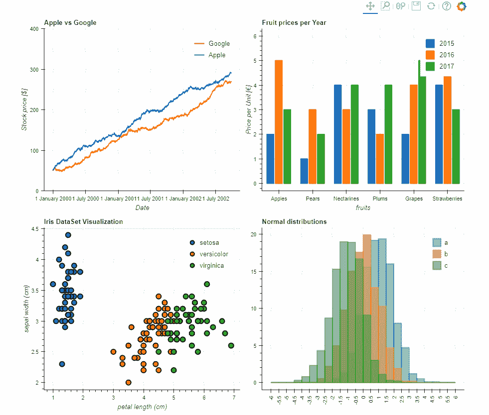
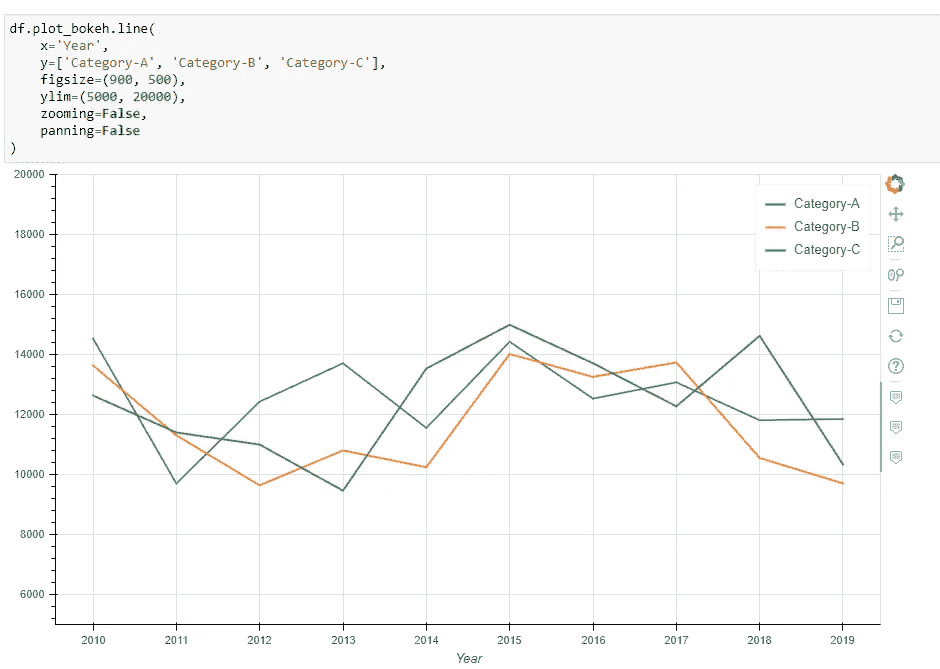
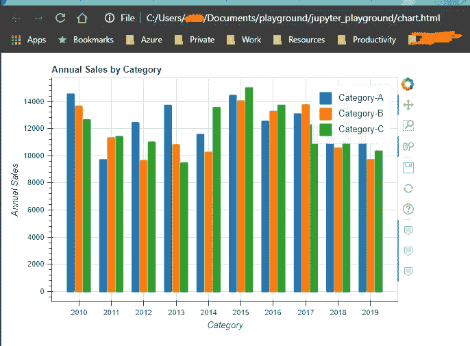

# Python 中漂亮而简单的绘图——熊猫+散景

> 原文：<https://towardsdatascience.com/beautiful-and-easy-plotting-in-python-pandas-bokeh-afa92d792167?source=collection_archive---------9----------------------->


照片由[乔伊·凯伯](https://unsplash.com/@jtkyber1?utm_source=medium&utm_medium=referral)在 [Unsplash](https://unsplash.com?utm_source=medium&utm_medium=referral) 拍摄

## 创建从熊猫数据帧到散景的交互式绘图的一行代码

虽然 Matplotlib 可以满足我们在 Python 中想要绘制一些东西时的所有需求，但使用它创建一个漂亮的图表有时很耗时。嗯，有时我们可能想向老板展示一些东西，这样就可以有一些漂亮的互动情节。

有很多优秀的库可以做到这一点，Bokeh 就是其中之一。然而，学习如何使用这样的库可能也需要一些时间。其实已经有人替我们解决了这个问题。这里有一个叫`Pandas-Bokeh`的库，直接消费熊猫，用散景渲染数据。语法非常简单，我相信您很快就可以开始使用它了！

[](https://github.com/PatrikHlobil/Pandas-Bokeh) [## PatrikHlobil/Pandas-Bokeh

### Pandas-Bokeh 为 Pandas、GeoPandas 和 Pyspark 数据帧提供了一个 Bokeh 绘图后端，类似于已经…

github.com](https://github.com/PatrikHlobil/Pandas-Bokeh) 

# 条形图示例

让我用一个例子来演示这个库。

首先，我们需要使用`pip`安装库。

```
pip install pandas_bokeh
```

安装后，我们需要导入`numpy`、`pandas`，当然还有`pandas_bokeh`库。

```
import numpy as np
import pandas as pd
import pandas_bokeh
```

我想生成一些随机数据用于演示目的。假设我们有一个电子商务网站的数据集。该数据集包含三个类别从 2010 年到 2019 年的销售额。让我们使用 Numpy 生成这个数据集。

```
df = pd.DataFrame({
    'Year': np.arange(2010, 2020),
    'Category-A': np.random.uniform(9000, 15000, 10),
    'Category-B': np.random.uniform(9000, 15000, 10),
    'Category-C': np.random.uniform(9000, 15000, 10)
})
```



现在，我们的熊猫数据库里有了数据。在我们开始使用`pandas_bokeh`绘制数据之前，我们需要设置笔记本的输出，这将适用于 Jupyter/iPython 笔记本。稍后我会解释为什么我们需要这样做，因为`pandas_bokeh`支持其他输出位置。

```
pandas_bokeh.output_notebook()
```



好的。我们现在可以绘制数据帧。

```
df.plot_bokeh(
    kind='bar',
    x='Year',
    y=['Category-A', 'Category-B', 'Category-C'],
    xlabel='Category',
    ylabel='Annual Sales',
    title='Annual Sales by Category'
)
```



是不是比默认的`matplotlib`好看多了？让我们快速看一下参数:

*   您想要绘制哪种类型的图表？目前，`pandas_bokeh`支持以下图表类型:折线图、点图、阶跃图、散点图、条形图、直方图、面积图、饼图和地图。
*   `x`和`y`简单地传入熊猫数据帧的列名
*   `xlabel`和`ylabel`x 轴和 y 轴相对的标签
*   `title`图表的标题

所以，你已经看到了创造这样一个美丽的情节是多么容易。更重要的是，它是互动的。下面是 GitHub 官方回购的 GIF。



图片提供:[https://github . com/PatrikHlobil/Pandas-Bokeh/raw/master/docs/Images/start image . gif](https://github.com/PatrikHlobil/Pandas-Bokeh/raw/master/docs/Images/Startimage.gif)

# 一些高级参数

当然，该库也支持许多高级参数，允许我们在必要时定制情节。

这是另一个使用相同数据集的示例，但使用折线图绘制数据。

```
df.plot_bokeh.line(
    x='Year', 
    y=['Category-A', 'Category-B', 'Category-C'],
    figsize=(900, 500),
    ylim=(5000, 20000),
    zooming=False,
    panning=False
)
```



请注意，这里我使用的`df.plot_bokeh.line(...)`相当于`df.plot_bokeh(kind='line', ...)`。

*   `figsize`定义元组中绘图的大小(宽度，高度)
*   `xlim`和`ylim`分别定义 x 轴和 y 轴的默认范围。这里我只为 y 轴设置。
*   `zooming`启用/禁用缩放手势
*   `panning`启用/禁用平移手势

# 输出到 HTML

你记得我们已经把输出设置到笔记本了吗？

```
pandas_bokeh.output_file('chart.html')
```

除了 Jupyter 笔记本，我们还可以将输出设置为 HTML 文件。因此，图表将被保存并输出到一个可以持久化和分发的 HTML 文件中。



# 摘要


由 [Kelly Sikkema](https://unsplash.com/@kellysikkema?utm_source=medium&utm_medium=referral) 在 [Unsplash](https://unsplash.com?utm_source=medium&utm_medium=referral) 上拍摄的照片

在本文中，我演示了如何使用`pandas_bokeh`库，用极其简单的代码绘制出您的 Pandas 数据帧，但它是一个具有交互特性的漂亮演示。

事实证明，当您有许多特殊的渲染要求时，该库可能无法满足您的所有需求，但当您只想为数据集构建一个典型的图表时，它是一个优秀的库。

[](https://medium.com/@qiuyujx/membership) [## 通过我的推荐链接加入 Medium 克里斯托弗·陶

### 作为一个媒体会员，你的会员费的一部分会给你阅读的作家，你可以完全接触到每一个故事…

medium.com](https://medium.com/@qiuyujx/membership) 

如果你觉得我的文章有帮助，请考虑加入 Medium 会员来支持我和成千上万的其他作者！(点击上面的链接)