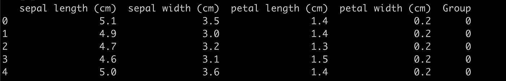

# 带有统计显著性注释的漂亮箱线图

> 原文：<https://towardsdatascience.com/beautiful-boxplots-with-statistical-significance-annotation-e1b314927fc5?source=collection_archive---------10----------------------->

## Python 中带重要性注记的箱线图超短教程


图由作者制作。

# 简介和动机

我总是记得自己阅读了一些很好的科学出版物，在这些出版物中，作者会创建一些带有统计注释的很好的箱线图。在大多数情况下，使用统计检验来确定不同组之间某一具体特征的平均值是否有统计学上的显著差异。

我现在已经成功地创建了一些定制的 python 代码来做这件事:生成集成了统计注释的漂亮的箱线图。在这篇短文中，我将展示如何用 Python 创建如此漂亮的方框图。

# 数据集

我们将使用 Iris 数据集，正如我们在我以前的所有帖子中所做的那样。数据集包含鸢尾属三个品种****(鸢尾属 **setosa** 、鸢尾属 **virginica** 和鸢尾属 **versicolor** )的 **50 个**样本的**四个**特征(萼片和花瓣的长度和宽度)。数据集通常用于数据挖掘、分类和聚类示例以及测试算法。****

****作为参考，这里有三种花的照片:****

********

****图由作者制作。****

****对于这个简短的教程，我们将只使用 3 个类中的 **2** ，即 **setosa** 和 **versicolor** 类。这样做只是为了简单。****

****如果你想在交互式路线图和活跃的学习社区的支持下自学数据科学，看看这个资源:[https://aigents.co/learn](https://aigents.co/learn)****

# ****Python 中的工作示例****

******步骤 1** :让**加载数据**并子选择所需的 **2 个花类**:****

```
**from sklearn.datasets import load_iris
import pandas as pd
import seaborn as sns
import matplotlib.pyplot as plt
import numpy as np# Load the Iris dataset
X = load_iris().data
y = load_iris().target
feature_names = load_iris().feature_names
classes_names = load_iris().target_names# Use only 2 classes for this example
mask = y!=2
X,y  = X[mask,:], y[mask]# Get the remained class names
classes_names[[0,1]]
# array(['setosa', 'versicolor'], dtype='<U10')**
```

******第二步** : **我们现在已经选择了 2 类的所有样品:setosa&versicolor**flower class**。**我们将把数据放入一个`panda`数据框架中，让我们的生活变得更轻松:****

```
**df = pd.DataFrame(X,columns=feature_names)
df['Group'] = [i for i in y]
df_long = pd.melt(df, 'Group', var_name='Feature', value_name='Value') # this is needed for the boxplots later ondf.head()**
```

******第三步:让我们检查数据帧:******

********

****如我们所见，我们有 4 个特征，最后一列表示相应样本的组成员。****

## ****统计测试****

****第四步 : **现在是做统计测试的时候了。**我们将使用一个**双样本 t 检验**(因为我们组是独立的)来**检验** **如果**这四个特征(即萼片长度、萼片宽度、花瓣长度、花瓣宽度)中的任何一个的**平均值在统计上****不同** **在**花****的两个**组**(********

```
#* Statistical tests for differences in the features across groups
from scipy import stats
all_t = list()
all_p = list()
for case in range(len(feature_names)):
    sub_df = df_long[df_long.Feature == feature_names[case]]
    g1 = sub_df[sub_df['Group'] == 0]['Value'].values
    g2 = sub_df[sub_df['Group'] == 1]['Value'].values
    t, p = stats.ttest_ind(g1, g2)
    all_t.append(t)
    all_p.append(p)
```

为了进行我们刚刚使用的统计测试:

```
t, p = stats.ttest_ind(g1, g2)
```

这里，我们将 g1(第 1 组:setosa)的平均值与 g2(第 2 组:versicolor)的平均值进行比较，我们对所有 4 个特征进行比较(使用 for 循环)。

> 但是我们如何知道 g1(第 1 组:setosa)的平均值明显大于或小于 g2(第 2 组:versicolor)的平均值呢？

为此，我们需要查看一下 **t 值。**

```
print(all_t)
[-10.52098626754911, 9.454975848128596, -39.492719391538095, -34.08034154357719]print(feature_names)
['sepal length (cm)', 'sepal width (cm)', 'petal length (cm)', 'petal width (cm)']
```

**释义:**

*   **如果 t 值为*正* ( > 0)，则 g1(第 1 组:setosa)的平均值明显*大于 g2(第 2 组:versicolor)的平均值。***
*   **如果 t 值为*负* ( < 0)，则 g1(第 1 组:setosa)的平均值明显*小于 g2(第 2 组:versicolor)的平均值*。**

**提醒** : *feature_names = ['萼片长(cm)'，'萼片宽(cm)'，'花瓣长(cm)'，'花瓣宽(cm)']。*

*   我们可以**得出**结论:只有 g1(杂色)的*萼片宽度*的平均值在统计学上大于 g2(杂色)的*萼片宽度*的平均值。

**第五步** : **检查 t 检验结果**

```
print(np.count_nonzero(np.array(feature_names)[np.array(all_p) < 0.05]))
# 4
```

**解释:**我们可以看到在 **setosa** 和 **versicolor** 类之间**所有 4 个特征**在统计上有显著差异。

**第六步**:魔术来了。让我们创建一些**漂亮的** **箱线图**并用**估计**统计 **显著性**对它们进行注释。

```
# renaming so that class 0 will appear as setosa and class 1 as versicolor
df_long.loc[df_long.Group==0, 'Group'] = classes_names[0]
df_long.loc[df_long.Group==1, 'Group'] = classes_names[1]# Boxplots
fig, axes = plt.subplots(2,2, figsize=(14,10), dpi=100)
axes = axes.flatten()for idx, feature in enumerate(feature_names):
    ax = sns.boxplot(x=”Feature”, hue=”Group”, y=”Value”, data = df_long[df_long.Feature == feature], linewidth=2, showmeans=True, meanprops={“marker”:”*”,”markerfacecolor”:”white”, “markeredgecolor”:”black”}, ax=axes[idx])
    #* tick params
    axes[idx].set_xticklabels([str(feature)], rotation=0)
    axes[idx].set(xlabel=None)
    axes[idx].set(ylabel=None)
    axes[idx].grid(alpha=0.5)
    axes[idx].legend(loc=”lower right”, prop={‘size’: 11})

    #*set edge color = black
    for b in range(len(ax.artists)):
        ax.artists[b].set_edgecolor(‘black’)
        ax.artists[b].set_alpha(0.8)

    #* statistical tests
    x1, x2 = -0.20, 0.20
    y, h, col = df_long[df_long.Feature == feature][“Value”].max()+1, 2, ‘k’
    axes[idx].plot([x1, x1, x2, x2], [y, y+h, y+h, y], lw=1.5, c=col)
    axes[idx].text((x1+x2)*.5, y+h, “statistically significant”, ha=’center’, va=’bottom’, color=col)fig.suptitle("Significant feature differences between setosa and versicolor classes/groups", size=14, y=0.93)
plt.show()
```


图由作者制作。

# 结论

从统计测试中我们可以看出，我们可以**得出**结论:只有第 1 组(setosa)的*萼片宽度*的平均值在统计上大于第 2 组(versicolor)的*萼片宽度*的平均值。

另一方面，**组*的**萼片*长度、花瓣长度和花瓣宽度*** *的平均值比**杂色**组的**平均值**小****。******

****这些观察结果也可以通过观察箱线图来验证。****

***那都是乡亲们！希望你喜欢这篇文章！***

# ***敬请关注并支持这一努力***

***如果你喜欢这篇文章，并且觉得它有用，那么**关注**我就可以看到我所有的新帖子。***

***有问题吗？把它们作为评论贴出来，我会尽快回复。***

# ***最新帖子***

***[](/time-series-forecasting-predicting-stock-prices-using-facebooks-prophet-model-9ee1657132b5) [## 时间序列预测:用脸书的先知模型预测股票价格

### 使用可从《先知脸书》公开获得的预测模型预测股票价格

towardsdatascience.com](/time-series-forecasting-predicting-stock-prices-using-facebooks-prophet-model-9ee1657132b5) [](/roc-curve-explained-using-a-covid-19-hypothetical-example-binary-multi-class-classification-bab188ea869c) [## 用新冠肺炎假设的例子解释 ROC 曲线:二分类和多分类…

### 在这篇文章中，我清楚地解释了什么是 ROC 曲线以及如何阅读它。我用一个新冠肺炎的例子来说明我的观点，我…

towardsdatascience.com](/roc-curve-explained-using-a-covid-19-hypothetical-example-binary-multi-class-classification-bab188ea869c) [](/support-vector-machines-svm-clearly-explained-a-python-tutorial-for-classification-problems-29c539f3ad8) [## 支持向量机(SVM)解释清楚:分类问题的 python 教程…

### 在这篇文章中，我解释了支持向量机的核心，为什么以及如何使用它们。此外，我还展示了如何绘制支持…

towardsdatascience.com](/support-vector-machines-svm-clearly-explained-a-python-tutorial-for-classification-problems-29c539f3ad8) [](/pca-clearly-explained-how-when-why-to-use-it-and-feature-importance-a-guide-in-python-7c274582c37e) [## PCA 清楚地解释了——如何、何时、为什么使用它以及特性的重要性:Python 指南

### 在这篇文章中，我解释了什么是 PCA，何时以及为什么使用它，以及如何使用 scikit-learn 在 Python 中实现它。还有…

towardsdatascience.com](/pca-clearly-explained-how-when-why-to-use-it-and-feature-importance-a-guide-in-python-7c274582c37e) [](/everything-you-need-to-know-about-min-max-normalization-in-python-b79592732b79) [## 关于 Python 中的最小-最大规范化，您需要知道的一切

### 在这篇文章中，我将解释什么是最小-最大缩放，什么时候使用它，以及如何使用 scikit 在 Python 中实现它

towardsdatascience.com](/everything-you-need-to-know-about-min-max-normalization-in-python-b79592732b79) [](/how-and-why-to-standardize-your-data-996926c2c832) [## Scikit-Learn 的标准定标器如何工作

### 在这篇文章中，我将解释为什么以及如何使用 scikit-learn 应用标准化

towardsdatascience.com](/how-and-why-to-standardize-your-data-996926c2c832) 

# 和我联系

*   **领英**:[https://www.linkedin.com/in/serafeim-loukas/](https://www.linkedin.com/in/serafeim-loukas/)
*   **研究之门**:[https://www.researchgate.net/profile/Serafeim_Loukas](https://www.researchgate.net/profile/Serafeim_Loukas)
*   ****EPFL 简介**:【https://people.epfl.ch/serafeim.loukas】T4**
*   ****堆栈** **溢出**:[https://stackoverflow.com/users/5025009/seralouk](https://stackoverflow.com/users/5025009/seralouk)*****