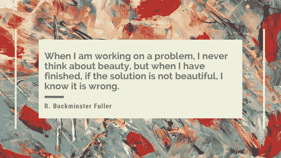

# 美丽的代码

> 原文：<https://towardsdatascience.com/beautiful-code-ad8a0c6b19?source=collection_archive---------16----------------------->

## 像电脑程序一样枯燥的东西能叫艺术吗？绝对的！


美有很多来源。谈到软件开发，美是由*和 ***架构连贯性* e** 赋予的，它们与应用于解决问题的 ***【功能精确性】*** 以及 ***创造力*** 携手并进。同样地， ***编码风格*** 是代码优雅的一个组成部分，并且在改进开发团队的交流时不应该被低估。*

*让我们更详细地探索代码之美的概念，以及到底是什么让编程成为🅐🅡🅣！*

# *在简单中寻找美*

*我最近读了《美丽的代码[](https://www.amazon.co.uk/Beautiful-Code-Leading-Programmers-Practice/dp/0596510047/)*选集,《我从未写过的最美的代码*,作者是乔恩·本特利，它基于一个首要原则，即“少即是多”,即一些明星开发人员一次又一次地进行重构，以精炼他们的代码并消除冗余，因此它尽可能简洁、易懂和简洁。从书中挑选出来的一些表达这种技能的格言如下:***

```
***📌 **A designer knows he has achieved perfection not when there is nothing left to add, but when there is nothing left to take away.**
— Saint-Exupéry📌 **The cheapest, fastest, and most reliable components of a computer system are those that aren’t there.**
— Bell📌 **If I had more time, I would have written you a shorter letter.**
— Pascal📌 **Simplicity does not precede complexity, but follows it.**
— Perlis***
```

***换句话说，这是对简单的呼唤。***

***每一行代码都是必须调试、阅读和理解的代码，以后还需要支持。这是一种固有的成本！所以在保留功能的同时减少代码是一种高尚的努力。如果一个方法有 10 条语句，但是我们把它减到 5 条，问题的可能性减半，因为它出错、过于复杂或有问题的地方减少了。 [*源代码是负债，不是资产*](https://saintgimp.org/2009/03/11/source-code-is-a-liability-not-an-asset) ！下次您使用 LOC(代码行数)作为生产力度量时，请考虑这一点！***

**三个相关的哲学是 YAGNI，干燥和亲吻。 [*你不需要它*](https://en.wikipedia.org/wiki/You_aren%27t_gonna_need_it) 暗示代码需要一个存在的理由，否则它必须被重构或删除。 [*不要重复自己*](https://en.wikipedia.org/wiki/Don%27t_repeat_yourself) 提出每一段代码在系统内必须有一个单一的、明确的目的和表示。最后， [*保持简单愚蠢*](https://en.wikipedia.org/wiki/KISS_principle) ，很有描述性:保持事情简单！**

**讽刺的是，简单是一个复杂的主题！**

> **在软件中，最漂亮的代码、最漂亮的功能和最漂亮的程序有时根本不存在。**

# **质量设计是一个项目的灵魂**

**光是听“bug”这个词就让每个开发人员畏缩不前。人们普遍认为，好的程序员是那些写出无错误代码的人。尽管一个没有错误的程序是必须的，但是没有错误的代码编写不是必须的。我这么说的意思是，一些开发人员甚至在程序编译或执行之前就努力写出无错误的代码，更多地关注功能而不是设计。**

**在开发过程中忽视可维护性，为了功能性而忽视**模式/标准**，是一个灾难的处方(也是一个昂贵的处方)。另一个问题是程序员会在错误的地方和错误的时间花太多的时间担心效率；**过早优化**相当于打开了工程上的潘多拉魔盒。**

> **好的设计就是让其他设计师觉得自己是白痴，因为这个想法不是他们的。**

**每个专业的软件开发人员都会写出有用的代码，但是在有用的代码和经得起时间考验的代码之间还是有一线希望的。一个可靠的设计保证了修复 bug 将是一件轻而易举的事情，因为 bug 将会出现在它们应该出现的地方！换句话说，当架构没有受到损害时，解决 bug 的成本更低，并且不会对技术债务产生太大影响。**

# **所有的艺术都从一张空白的画布开始**

**开发人员将他们的想法转化为有形的东西的能力，就是创造性的定义。屏幕是一块空白的画布，等待着被代码填充并产生一个独特的解决方案——如果工作不是独特的，它将只是简单的“复制和粘贴”!没有两个程序员会写出完全相同的代码，即使他们的最终软件从表面上看是一样的。作为程序员，每个人都有自己声音的表达方式。这本身就很了不起！以我的经验来看，理解另一个开发者的代码，就像进入他们的思维，从他们的角度看世界**。****

****能够编码的兴奋是很难解释的。不仅仅是一行行的代码…我们可以想象我们慢慢构建的系统，当数据在其中流动时，它就变得真实了。这在智力上和情感上都是有益的，因为看到一件事情从构思到完成是一种成就。不管多小多大！****

****作为结束语，在我进入下一节之前，这里有一段摘自《计算机编程的艺术》系列的作者 Donald Knuth (对于非程序员来说，它就像是计算机科学的圣经)的摘录，当他被要求证明在书名中选择单词 *art* 的合理性时:****

> ****计算机编程是一门艺术，因为它将积累的知识应用于世界，因为它需要技巧和独创性，尤其是因为它产生美的物体。****

# ****算法的辉煌是终极的复杂****

****算法是使有效编程成为可能的配方。它们是编程的支柱，因为它们以系统的方式描述了解决问题的所有步骤。虽然逻辑和分析技能是左脑活动，但**解决问题**是使用我们右脑‘精神肌肉’的创造性过程。有效解决问题的秘诀是掌握复杂性，正如我们前面讨论的，复杂性会对我们的程序产生负面影响。****

****我设计、回顾或研究过的所有最好的算法都有一个共同点:它们依靠美好的想法来更有效地处理计算任务，同时避免不必要的细节和复杂性。举几个例子来说，对令人敬畏的代码库做出贡献的最基本的算法**内部工作**是:简化的布尔代数、创造性的组合学技术、数据结构的明智选择、正则表达式的简洁使用、良好的资源利用和对坚实原则的遵从。****

****这里有一个有趣的悖论，这使得算法的创建成为一项复杂的任务:****

> ****创造力没有算法——安迪·哈格里夫斯****

********

# ****编码风格很重要****

****到目前为止，我们研究了好的代码需要简单和良好的设计。我现在将转向编程的美学方面:代码布局。格式良好的代码的视觉外观与其质量密切相关，许多以自己的工作为荣的程序员从改进工作中获得极大的满足感，因为他们意识到程序员是因为他们的风格和纪律而被记住的，而很少是因为代码本身。****

****编写代码不仅是为了让机器执行，也是为了让其他程序员在试图检查、扩展、纠正、重构或调试代码之前阅读和破译。因此，代码的**逻辑结构**的准确和一致的表示是必不可少的。****

****缩进和空白空间的使用是这里的关键。类似地，最好的布局方案在代码**修改**下也能保持良好:修改一行代码不应该需要修改其他几行。也就是说，程序员交流的圣杯是自我记录代码，这意味着:足够的注释，有意义的命名约定，使用小的、容易测试的、纯粹的函数等等。****

> ****好的代码是它自己最好的文档****

****所以，漂亮的代码是清晰的，易于阅读和理解。它有一个平衡。它的结构、形状和建筑揭示了它的意图。每个部分都相对较小，且用途单一。这就像一个**马赛克**:所有的小代码片段完美地组合在一起，但同时当一个元素需要改变时，它们很容易分开！****

# ****资源****

*   ****里奇·希基的必看之作:[简单变得容易](https://www.infoq.com/presentations/Simple-Made-Easy/)。****
*   ****唐纳德·克努特的经典之作:[作为艺术的计算机编程](http://www.paulgraham.com/knuth.html)。****
*   ****来自实用主义程序员:[计算机编程的艺术](http://media.pragprog.com/articles/other-published-articles/ArtInProgramming.pdf)。****

# ****收场白****

****每次我们写代码，都是在走一条通向未知解的非确定性的道路；一个从未被创造过的东西！这是一次自我发现的旅程，也是我们智慧的表达。这就是*到底*什么是艺术！****

****我们不是那种创造视觉愉悦供他人欣赏的艺术家。但是当我们爱一样东西时，我们会把美融入其中！****

****感谢阅读！****

*****我经常在媒体上写关于领导力、技术&的数据——如果你想阅读我未来的帖子，请*[*‘关注’我*](https://medium.com/@semika) *！*****