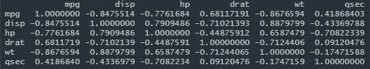
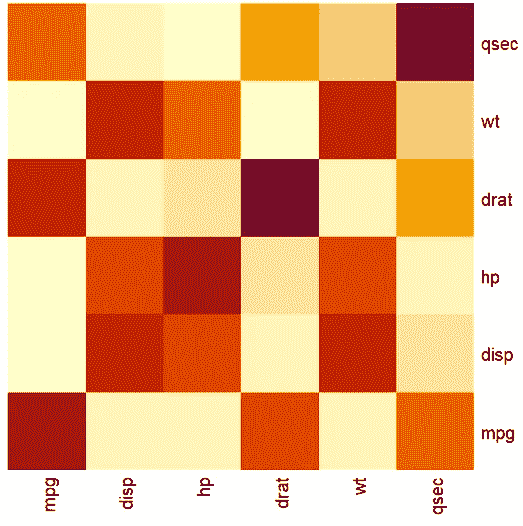
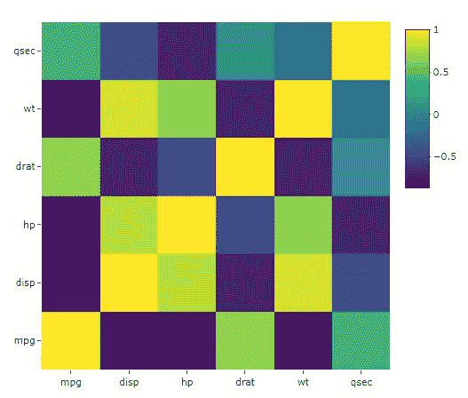
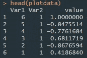
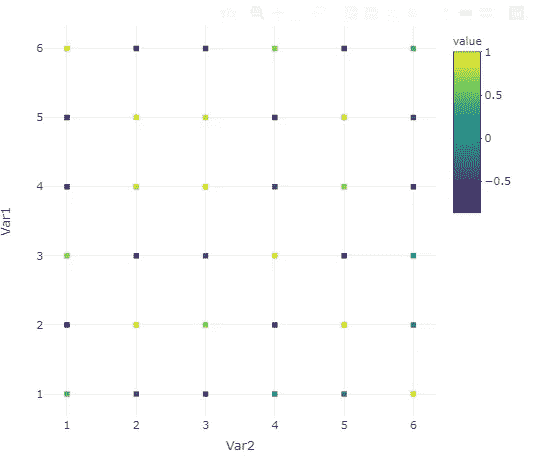
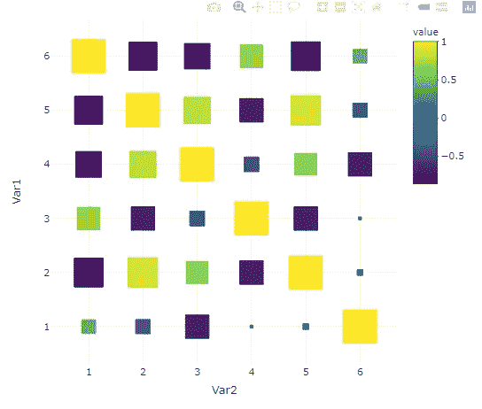
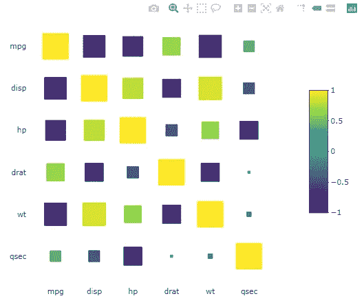
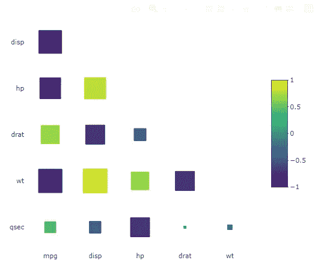

# R 中美丽的相关图——一种新方法

> 原文：<https://towardsdatascience.com/beautiful-correlation-plots-in-r-a-new-approach-d3b93d9c77be?source=collection_archive---------9----------------------->

## 使用 plotly 以直观、互动的方式理解相关矩阵。


克林特·王茂林在 [Unsplash](https://unsplash.com?utm_source=medium&utm_medium=referral) 上拍摄的照片

每个从事数据工作的人都知道，美观和解释性的可视化是关键。毕竟，用图表讲故事比用普通的表格要容易得多。这在您创建报告和仪表板时尤其重要，这些报告和仪表板的目的是让您的用户和客户快速浏览有时非常复杂和庞大的数据集。

一种以解释性方式可视化的数据类型是相关矩阵。在这篇文章中，我们将看看如何使用 R 和 plotly 库把一个相关矩阵转换成一个漂亮的、交互式的和非常描述性的图表。

*更新(2020-10-04):我不得不用静态图像替换一些链接图表，因为它们在手机上显示不正确。*

# 1.介绍

## 数据

在我们的示例中，我们将使用 mtcars 数据集来计算 6 个变量之间的相关性。

```
data <- mtcars[, c(1, 3:7)]
corrdata <- cor(data)
```

这给了我们将要使用的相关矩阵。



mtcars 相关矩阵(图片由作者提供)

现在，虽然所有的信息都在那里，但一次消化所有的信息并不是特别容易。输入图表，特别是热图。

## 基本图表

作为起点，base R 为我们提供了 heatmap()函数，让我们至少可以更好地可视化数据。



base R 热图(图片由作者提供)

虽然这是朝着正确方向迈出的第一步，但是这个图表仍然不是非常具有描述性，最重要的是，它不是交互式的！理想情况下，我们希望将我们的最终产品包含在一个漂亮闪亮的仪表板中，并使我们的用户和客户能够与之交互。

## Plotly 热图

Plotly.js 是一个 JavaScript 图形库，构建在 d3.js 和 stack.gl 之上，允许用户轻松创建交互式图表。它是免费和开源的，幸运的是，我们有一个 R 实现！



plotly 热图(图片由作者提供)

这又是一个进步。我们的相关性矩阵现在显示为一个交互式图表，并且我们有一个颜色条来指示相关性的强度。

然而，当你快速浏览图表时，会有什么发现呢？你能立即识别最强和最弱的相关性吗？大概不会！并且还显示了许多不必要的数据。根据定义，相关矩阵是对称的，因此每个相关矩阵包含两次。此外，变量与其自身的相关性始终为 1，因此我们的图表中没有必要出现这种情况。

## 改进的 plotly 热图

现在看看下面的图表，试着回答同样的问题。


改进的 plotly 热图(图片由作者提供)

好多了！图表是干净的，我们可以立即发现最强和最弱的相关性，所有不必要的数据都被删除，它仍然是交互式的，并准备好作为一个美丽的仪表板的一部分显示！

为了实现这一点，我们使用了散点图，并使方块的大小取决于相关性的绝对值。

你如何自己创建这样一个图表(用一点努力)？我们来看看吧！

# 2.履行

我们需要做的第一件事是转换我们的数据。为了创建适合我们需要的散点图，我们只需要一个网格。对于相关矩阵，x 和 y 值将对应于变量名，但我们真正需要的是等间距的数值来创建网格。我们的转换将相关性矩阵转换成一个包含 3 列的数据框:网格的 x 和 y 坐标以及相关的相关性。

```
#Store our variable names for later use
x_labels <- colnames(corrdata)
y_labels <- rownames(corrdata)#Change the variable names to numeric for the grid
colnames(corrdata) <- 1:ncol(corrdata)
rownames(corrdata) <- nrow(corrdata):1#Melt the data into the desired format
plotdata <- melt(corrdata)
```

您可能想知道为什么行名的数值在上面的代码中是颠倒的。这是为了确保生成的图具有从左上角到右下角的相关图的主对角线(不像上面的 base R 和 base plotly 示例)。

结果，我们得到一个类似这样的数据帧:



转换后的相关矩阵(图片由作者提供)

我们可以用下面的代码绘制它:

```
fig <- plot_ly(data = plotdata, width = 500, height = 500)
fig <- fig %>% add_trace(x = ~Var2, y = ~Var1, type = “scatter”,   mode = “markers”, color = ~value, symbol = I(“square”))
```



相关矩阵的初始散点图(图片由作者提供)

这是一个好的开始，我们已经正确地设置了网格，我们的标记也根据数据的相关性进行了着色。不可否认，我们真的不能正确地看到它们，它们都有相同的大小。我们接下来会解决这个问题。

```
#Adding the size variable & scaling it
plotdata$size <-(abs(plotdata$value))
scaling <- 500 / ncol(corrdata) / 2
plotdata$size <- plotdata$size * scaling
```

首先，我们定义一个大小变量作为相关性的绝对值。为了正确地确定方块的大小，我们需要将它们放大，否则我们只会得到小点，并不能告诉我们太多。之后，我们可以将尺寸添加到标记中。

```
fig <- plot_ly(data = plotdata, width = 500, height = 500)
fig <- fig %>% add_trace(x = ~Var2, y = ~Var1, type = "scatter", mode = "markers", color = ~value, marker = list(size = ~size, opacity = 1), symbol = I("square"))
```



散点图，带有按绝对相关性缩放的缩放标记(图片由作者提供)

再靠近一步！基本功能现在已经存在，我们的正方形与相关性一起正确缩放，并且与着色一起使我们能够一眼识别高/低相关性对。

接下来我们将执行一些清理工作。我们将正确命名我们的变量，删除所有网格线，并删除轴标题。为此，我们将设置自定义轴列表。我们也将中心色条。

```
xAx1 <- list(showgrid = FALSE,
 showline = FALSE,
 zeroline = FALSE,
 tickvals = colnames(corrdata),
 ticktext = x_labels,
 title = FALSE)yAx1 <- list(autoaxis = FALSE,
 showgrid = FALSE,
 showline = FALSE,
 zeroline = FALSE,
 tickvals = rownames(corrdata),
 ticktext = y_labels,
 title = FALSE)fig <- plot_ly(data = plotdata, width = 500, height = 500)
fig <- fig %>% add_trace(x = ~Var2, y = ~Var1, type = “scatter”, mode = “markers”, color = ~value, marker = list(size = ~size, opacity = 1), symbol = I(“square”))fig <- fig %>% layout(xaxis = xAx1, yaxis = yAx1)
fig <- fig %>% colorbar(title = “”, limits = c(-1,1), x = 1.1, y = 0.75)
```



初始清理后的绘图(图片由作者提供)

我们之前已经提到过，由于相关矩阵是对称的，所以在相关矩阵中显示了大量重复和不必要的数据。因此，我们可以在绘图中删除主对角线以上并包括主对角线的所有条目(因为主对角线中的所有条目根据定义都是 1)。最简单的方法是在应用变换之前，将原始相关矩阵中的这些值设置为 NA。因为这将导致图表的第一行和最后一列为空，所以我们也可以删除它们。

```
#do this before the transformation!
corrdata[upper.tri(corrdata, diag = TRUE)] <- NA
corrdata <- corrdata[-1, -ncol(corrdata)]
```

再次绘制我们的图表会产生以下结果:



移除值后的绘图(图片由作者提供)

快到了！最后一步是添加网格线，给我们的图一个漂亮的背景，并修正当鼠标悬停在方格上时显示的信息。

为了添加网格，我们将在绘图中添加第二条轨迹，这样我们就能够有第二组 x 轴和 y 轴。我们将使这条轨迹不可见，这样就不会有任何东西干扰我们的相关平方。由于我们使用单位值来放置初始网格，我们需要将它们移动 0.5 来创建网格线。我们还需要确保我们的轴绘制在相同的范围内，否则一切都会变得混乱。这听起来很复杂，但确实很简单。

因为我们已经走了这么远，下面是产生最终情节的完整代码。


最终相关图(图片由作者提供)

# 3.结论

在对如何创建显示相关性的更漂亮的图表进行了冗长的描述之后，我们终于得到了我们想要的结果。希望这篇文章能让你创造出令人惊奇的、互动的情节，快速洞察相互关系。

请务必让我知道，如果你有任何反馈或建议，以改善我在这篇文章中所描述的！

## 奖金

对于那些感兴趣的人来说，我已经把包括更多特性的完整代码作为一个 R 包提供，叫做[](https://github.com/addiversitas/correally)*。*

*新增功能包括:*

*   *根据地块大小自动调整比例*
*   *颜色选项包括十六进制颜色、蓝色和绿色*
*   *自动格式化背景、字体和网格，以适应不同的闪亮主题*
*   *相关性随时间变化的动画(开发中)*

*此外，一定要看看[我的帖子](/3-easy-tricks-for-beginners-to-improve-your-plotly-charts-in-r-86d65772a701)关于 3 个简单的技巧来改善你的图表，以进一步增强我们在这里所涵盖的内容！*