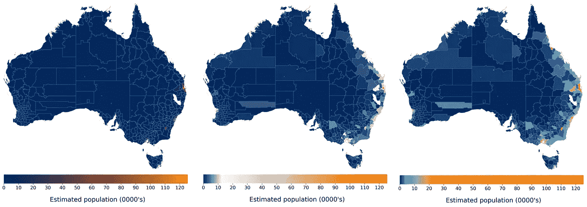
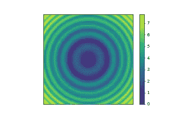
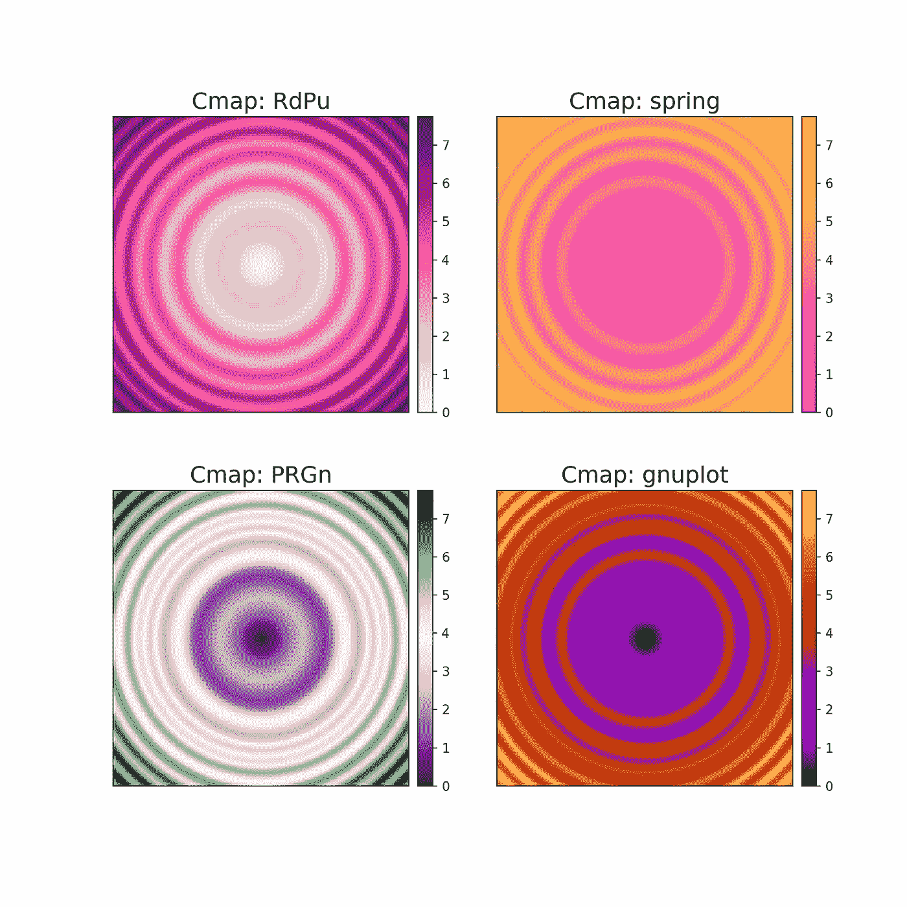
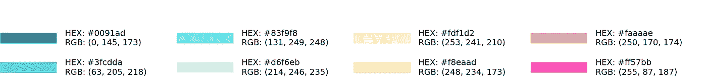
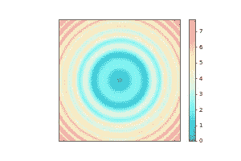
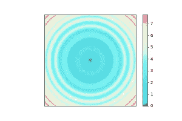
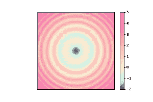

# 用 Matplotlib 定制漂亮的彩色地图

> 原文：<https://towardsdatascience.com/beautiful-custom-colormaps-with-matplotlib-5bab3d1f0e72?source=collection_archive---------11----------------------->

## 使用自定义的色彩映射表升级您的图表游戏，以匹配您的主题。

如果你的 Matplotlib 图表需要一个色彩映射表，而你没有使用一个内置的映射表，你可能会有一段不好的时间。我曾经害怕用 Python 编辑色彩映射表。我查看的每个帮助线程都显示了不同的方法，没有一个完全符合我的情况。这总是令人失望，因为色彩映射表可以极大地改变你用数据可视化发送的信息，甚至可以使你的图表无法使用。

不相信我？看看这个。



每个可视化显示相同的数据(澳大利亚地方政府区域的估计人口)，但具有不同的色彩映射表。数据是连续的和积极的，这是通过仔细检查每个图例显示的。然而，彩色地图讲述了一个不同的故事，有点像金发姑娘的故事:

1.  第一个图表使用顺序色彩映射表，其中亮度值始终单调变化(增加或减少)。如果观想中的细节很重要，那么顺序可能不是你的最佳选择，因为很难比较具有相似值的区域。
2.  第二个图表使用了发散的颜色图。颜色越多，就越容易分辨出相似值之间的差异，但这也向观察者暗示了数据是以正常基线为中心的，比如零。如果我们对平均值的数据进行归一化，那么这个尺度是合适的，但是因为我们只是显示了一系列正值，所以它在这里不适用。
3.  第三张图表恰到好处。这类似于顺序贴图，因为颜色在整个过程中逐渐变化，一端清楚地指示较高的值，另一端指示较低的值。然而，这张地图包括更多的颜色，这使得观众更容易比较小的差异。

这些只是一些你可以使用的色彩映射表的例子，更多细节和选项，请查看 Matplotlib 的指南。

如果你试图让一个颜色图适合一个主题，那么设计和创建这个颜色图会变得更加困难。例如，嵌入在仪表板或网站中的可视化，带有现有的配色方案。为一个完全专业的最终产品付出额外的努力是值得的，本指南将帮助你实现这一目标。

# 使用 Matplotlib 内置的色彩映射表

让我们创建一个测试图像，并关闭轴记号，使它看起来更好一些。



默认 matplotlib 色彩映射表。

现在让我们编辑图像，并测试 4 种不同的内置 Matplotlib 颜色映射。



四个内置 matplotlib 彩色地图。

# 创建您自己的色彩映射表

如果 Matplotlib 默认色彩映射表不符合您的需要，您可以随时创建自己的。在本教程中，我假设你有一些想在色彩映射表中使用的颜色。如果没有，向下滚动到底部的一些资源，以帮助选择你的颜色。

## 在不同的颜色格式之间转换

如果你有一套基于品牌或网站主题的特定颜色，它们很可能是十六进制格式的。首先，让我们定义一些函数，将十六进制转换为 RGB，将 RGB 转换为十进制(每个 RBG 通道的值在 0 到 1 之间)。

下面显示了我的十六进制颜色，以及它们的 RGB 等价物(我用来生成这个图像的代码是[这里是](https://gist.github.com/KerryHalupka/df046b971136152b526ffd4be2872b9d))。



## 创建连续的色彩映射表

让我们创建一个包含以上所有颜色的连续色图。我们将使用名为 LinearSegmentedColormap 的 matplotlib.colors 函数。这个函数接受一个包含红色、绿色和蓝色条目的字典。每个条目应该是一个由 *x* 、 *y0* 、 *y1* 元组组成的列表，形成一个表中的行。所以，如果你想让红色在下半部分从 0 增加到 1，绿色在中间部分增加到 1，蓝色在上半部分增加到 1。然后，您可以使用:

```
cdict = {'red':   [(0.0,  0.0, 0.0),
                   (0.5,  1.0, 1.0),
                   (1.0,  1.0, 1.0)],

         'green': [(0.0,  0.0, 0.0),
                   (0.25, 0.0, 0.0),
                   (0.75, 1.0, 1.0),
                   (1.0,  1.0, 1.0)],

         'blue':  [(0.0,  0.0, 0.0),
                   (0.5,  0.0, 0.0),
                   (1.0,  1.0, 1.0)]}
```

迷茫？我也是。所以我写了一些代码(如下)来包装这个函数，让它更容易管理。下面的代码可以用来在列表中任意数量的十六进制颜色之间进行映射，它使用我们之前定义的函数将十六进制转换为十进制。



通过提供一个从 0 到 1 的浮动列表，我们还可以将颜色映射到颜色条上的特定位置，以便扩展地图某些部分的表示。



## 创建发散的色彩映射表

我们也可以使用这个代码来创建一个发散的颜色图，如果我们的数据要显示在某个中点附近，比如零，这是很有用的。如果数据不是以中点为中心，例如范围从-2 到 5，我们需要将色图的中心移动到数据的中点。下面的代码显示了如何通过使用 TwoSlopeNorm 创建一个范数来实现这一点，然后在 imshow 中使用该范数在映射到颜色之前将数据缩放到[0，1]范围。



# 为色彩图选择正确的颜色

请记住，虽然我不会在这篇文章中详细介绍，但你对颜色的选择不仅仅是美学上的，还有一整个领域致力于理解不同颜色和组合对人类理解的影响。还有一个要考虑的问题是色盲的人会如何看待你的色彩映射表。选择颜色时，你应该考虑这两个因素。

如果你在选择颜色时需要一些灵感，这里有一些我觉得有用的来源。

*   [**酷派**](https://coolors.co/palettes/popular/gradient)
    酷派是一款拥有如此多功能的神奇应用。出于创建连续色阶的目的，我更喜欢他们的颜色渐变生成服务，它有大量漂亮的调色板，可以很好地过渡到连续色阶，并可以调整以满足您的需求。
*   Gregor Aisch 的 Chroma
    Chroma 对优化你的调色板很有用。它可能有一点点问题，但它有助于您获得两种或更多种颜色，并生成中间值的完整范围。它还能告诉您您的电子秤是否色盲安全。
*   [**W3schools 调色板**](https://www.w3schools.com/colors/colors_palettes.asp)这有一些不错的调色板示例。W3 还提供了其他免费的服务来选择基于颜色理论的调色板，在不同的颜色格式(如 Hex，RGB 等)之间转换，以及许多其他有用的工具。
*   [**Hayk An 的色标生成器**](https://hihayk.github.io/scale)
    我在上一个项目中偶然发现了这个色标生成器。这是一个很好的资源，您可以在其中生成随机的、视觉上令人愉悦的色阶，然后调整它们的属性，包括添加更大范围的颜色以及调整饱和度和亮度等。

查看我的 [GitHub](https://github.com/KerryHalupka/custom_colormap) 获取本教程的代码。