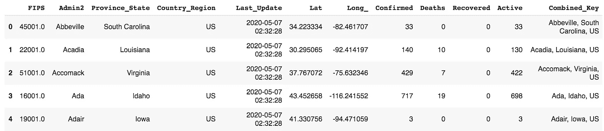
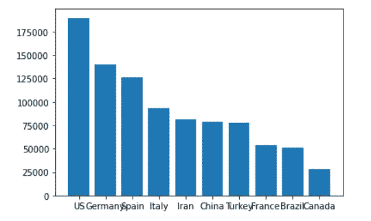
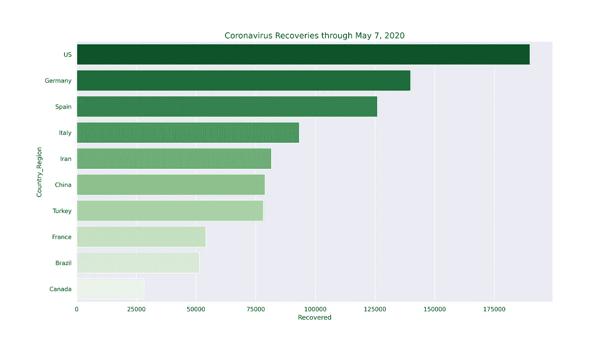

# 美化冠状病毒条形图

> 原文：<https://towardsdatascience.com/beautify-coronavirus-bar-charts-ac636d314d98?source=collection_archive---------51----------------------->

## 超越 Matplotlib 基础的 5 个步骤

当你刚接触 *matplotlib* 的时候， *plt.show()* 的结果并不是特别令人印象深刻。当然，它对传达信息很有用，但它不是那种可以放在文件夹里或向朋友炫耀的图表。

五个关键调整可以将基本图形转换为漂亮的图形。美丽在这里并不意味着无关紧要。当谈到图形数据时，漂亮包括正确的背景、方向、大小、颜色和标签，以提供一个有吸引力的、清晰的和信息丰富的图形。

在本文中，我们加载冠状病毒数据，准备用于绘图的数据，使用 *matplotlib* 绘制基本条形图，并使用 5 个键调整将绘图转换为漂亮的图形。本文假设读者对*熊猫有基本的了解。*

## 加载冠状病毒数据

首先，我们需要一些数据。以下代码将约翰·霍普斯金冠状病毒 Github 数据集分配给变量 *url* 。该文件是一个 CSV 文件，并且在靠近末尾处提供了日期。该日期可由用户更新以获得最新的冠状病毒信息。数据集每天更新。

接下来，导入*熊猫*，然后使用 *pd.read_csv* 和 *df.head()* 读取并显示数据帧。

从最后一栏可以看出，数据是按城市和国家提供的。该数据集包括所有国家。要仅绘制来自国家/地区的数据，我们可以通过列*‘国家/地区’*进行*分组。我们选择*‘sum’*聚合来获得除纬度和经度之外的所有数字列的精确计数。*

最后，我们只选择提供关于冠状病毒的数字信息的列，即*、*、*、【死亡】、*、*、【恢复】、*和*、【活动】、*。

现在开始制图。

## 准备用于打印的数据

用 *matplotlib* 很容易生成一个图。在条形图的情况下，您只需要 x 值，即您想要比较的类别，以及 y 值，即比较的列。我们将比较每个国家的恢复病例数。

创建一个包含数百个类别的条形图是不可行的。在冠状病毒数据的情况下，类别是国家，由列为我们的*组之后的索引。我们将只选择前 10 个国家。*

首先，使用 *sort_values* 方法，通过选取 10 个最高回收数量的国家来分割数据框架。结果可以存储在新的数据帧中，如下:*df _ Recovered = df . sort _ values(by =‘Recovered’，ascending=False)[:10]* 。

接下来，使用索引上的 *to_series* 方法将索引转换为序列。这种转换的原因是在绘图时使用列是标准的，实际上是*熊猫系列*。这些指数，通常是你在 T4 分组之后想要的类别，必须被转换。以下代码将索引国家转换为序列:*x _ vals = df _ recovered . index . to _ series()*。

我们还设置了*y _ vals = df _ recovered[' Recovered ']*来选择“Recovered”列作为我们的 y 值。

以下是分割数据帧并设置 x 和 y 值的步骤。

## 使用 Matplotlib 的基本条形图

条形图是许多 *matplotlib* 图中的一种。导入 *matplotlib，*之后，您决定想要绘制的绘图类型，在我们的例子中是条形图，然后您插入 x 和 y 值，后面跟着 *plt.show()* ，如下所示。

这是我电脑上的图表。它捕捉到了关键信息，但是国家名称连在一起，太小了，不美观。

现在，让我们使用相同的信息和 5 个关键的调整来创建一个美丽的条形图。

## 调整一:进口海博

seaborn 是 matplotlib 的一个很好的补充。我一直使用 *seaborn* ，因为我更喜欢带有网格线的灰色背景，我发现 *seaborn* 中的许多图形选项，如线性回归，更容易使用，更美观，并提供更多信息。

下面的代码将 *seaborn* 和 *matplotlib* 一起导入，并将背景设置为漂亮的深色网格。

## 调整 2:水平前进

我们已经有了数据集， *df_recovered* 。上面给出的 x 值和 y 值的信息可能保持不变，只有一个例外:将它们转换为水平条形图。

水平条形图更容易阅读，因为 x 轴上的间距不再杂乱。当订购垂直堆叠时，水平条形图也提供了很好的美感。

以下是切换 x 和 y 的代码。注意，在条形图函数中设置参数 *orient='h'* 也可能有效。

## 调整 3:改变体形大小

这是一个大的。我不确定为什么默认的 *matplotlib* 图这么小。增加尺寸总是一个好主意。你可以看到更多的细节，图形不那么拥挤，它们占据了更多的屏幕空间。

您可以使用 *plt* 上的*fig*的方法，然后在括号内设置 *figsize* 的尺寸。注意尺寸是(水平，垂直)。这里有一个大尺寸的作品。根据自己的喜好调整数字。

## 调整 4:使用调色板

漂亮的颜色真的让图表很突出。当使用一种颜色时，考虑将透明度包含在 *alpha* 参数中。对于条形图，调色板是理想的。调色板甚至可以颠倒，这样最深的颜色就在最上面，这取决于你想讲的故事。

值得尝试用你的颜色讲一个故事。由于从冠状病毒中恢复是一件好事，绿色可以用作积极的颜色，恢复最多的国家显示在顶部，作为最暗的绿色阴影。将最深的颜色放在最上面通常需要将'*_ r【T3]'字符串连接到调色板的末尾来颠倒顺序。*

找到所有调色板选项的一个有趣的方法是在代码中插入一个调色板错误！正确的选项会显示在 Colab 笔记本中。或者，标准调色板可以在[的 Python 图库](https://python-graph-gallery.com/101-make-a-color-palette-with-seaborn/)中找到。我更喜欢错误的方法，因为我可以留在我的笔记本上，它告诉我一切。

调色板可在 *sns.barplot* 内设置，连同 x 值和 y 值如下。

## 调整 5:使用有尺寸的标签

不言而喻，应该为图使用标签并确定其大小。所有的图表都应该有标题，标题的大小可以增加，直到你喜欢为止。

在 *seaborn* 的情况下，x 轴和 y 轴默认使用 index 和 columns 提供的标签，这里就不加了。

下面是给你的图加标题和调整标题大小的代码。

## 把所有的放在一起

剩下的就是保存剧情，展示出来。保存您的绘图总是值得的，因为在您的计算机上的输出会比在 Jupyter 或 Colab 笔记本上，甚至在使用第三方软件的 Medium 等网站上看起来好得多。一个简单的策略是将 dpi(每英寸点数)设置为一个较大的数字，比如 300。

这里是所有的代码一起创建和显示一个美丽的冠状病毒水平条形图。

如你所见，通过 5 个关键调整，新图表值得与朋友分享或放入你的作品集。这个图表很简单，但是信息丰富而且很漂亮。它在我的电脑上更清晰，在你的电脑上也会如此。

现在你已经学会了 5 个关键的调整，使你的条形图美观，享受这个数据集和其他创建和显示新的信息列的乐趣。

编码快乐！

*科里·韦德(Corey Wade)是伯克利编码学院* [*的主任*](http://berkeleycodingacademy.com) *，* [*Python 工作坊*](https://www.amazon.com/Python-Workshop-Interactive-Approach-Learning-ebook/dp/B0816C5R6Y) *的作者，伯克利独立研究数学系主任。2020 年夏天，他正在为青少年在线举办一个机器学习& AI 夏令营。更多信息参见*[*berkeleycodingacademy.com*](http://berkeleycodingacademy.com)*。*