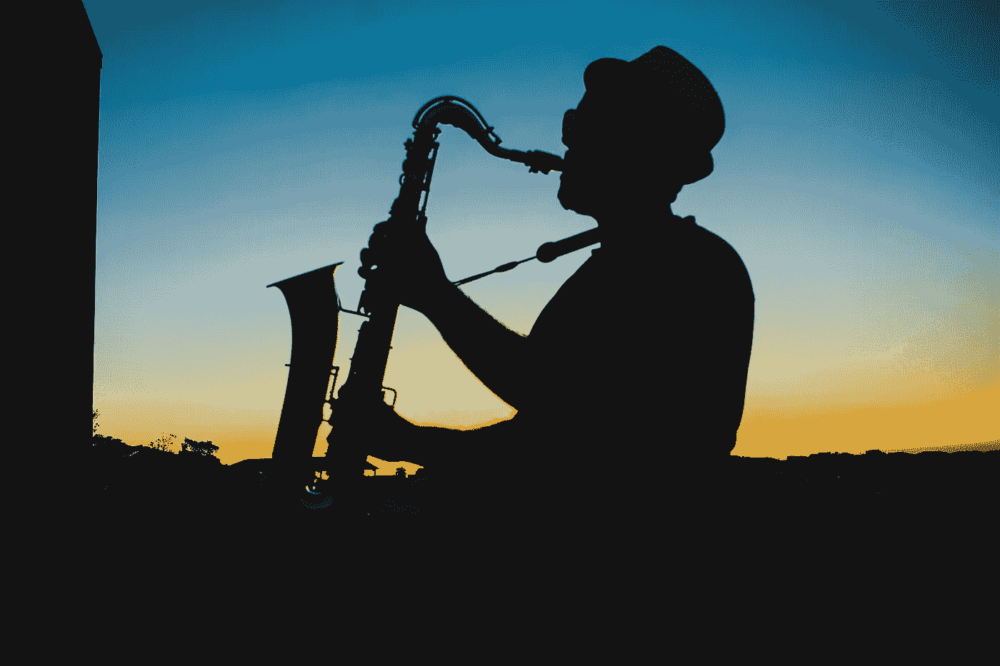
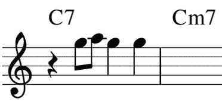
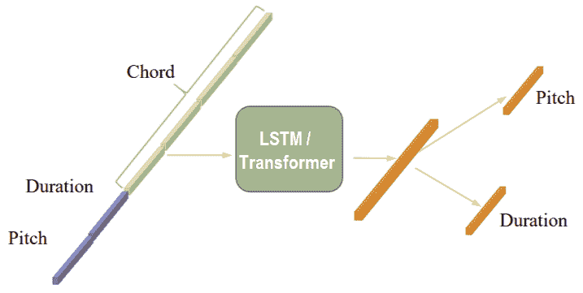
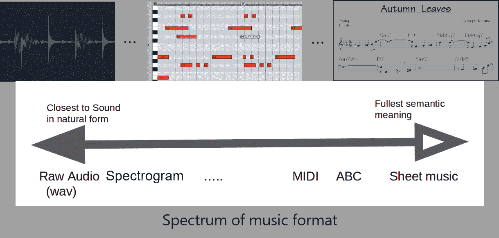
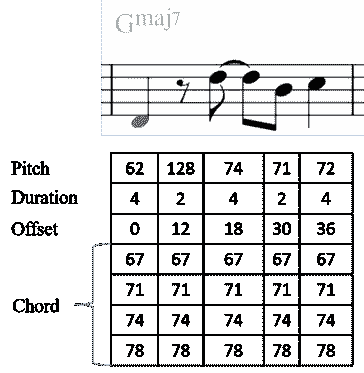
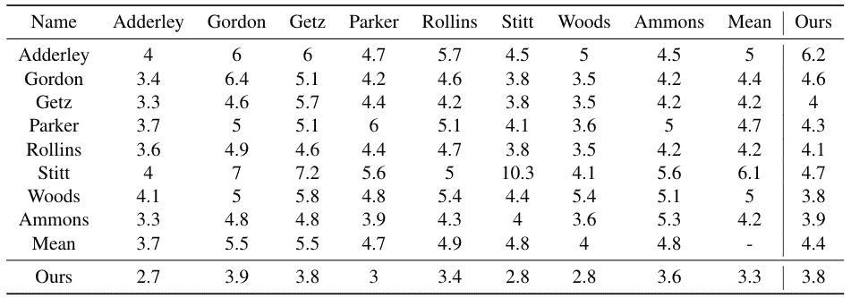
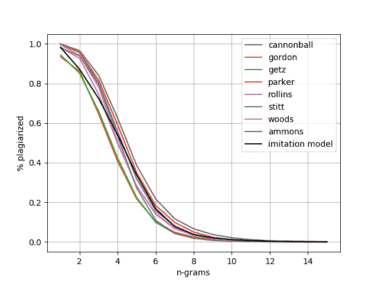
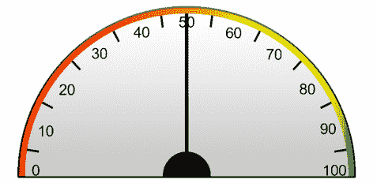
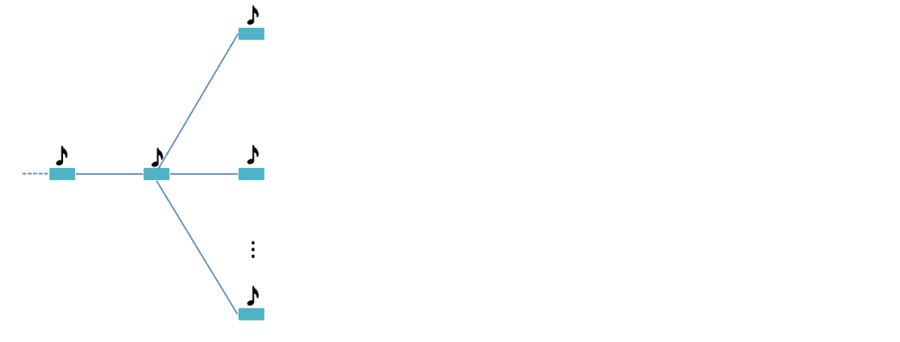

# BebopNet:爵士乐即兴创作的神经模型

> 原文：<https://towardsdatascience.com/bebopnet-neural-models-for-jazz-improvisations-4a4d723d0b60?source=collection_archive---------20----------------------->

## 使用人工智能生成(个性化)Bebop 即兴创作

Shunit Haviv Hakimi、Nadav Bhonker 和 Ran El-Yaniv

**更新(2020 年 10 月):** 我们关于 BebopNet 的论文刚刚发表在 [ISMIR 2020](https://www.ismir2020.net/) ！
在 ISMIR 2020 中查看我们的**论文、海报和视频**:[https://program.ismir2020.net/poster_6-08.html](https://program.ismir2020.net/poster_6-08.html)
我们还上传了我们的**代码、一个经过训练的模型、**一些**样本、**和补充材料:
[https://shunithaviv.github.io/bebopnet/](https://shunithaviv.github.io/bebopnet/)

图片来源:[https://www.pexels.com/@victorfreitas](https://www.pexels.com/@victorfreitas)

创作音乐和爵士乐即兴创作绝对不像看起来那么容易。事实上，即使对最好的音乐家来说，这也是一项艰巨的任务。我们甚至能准确地定义和理解爵士乐即兴演奏吗？不幸的是，在很大程度上，这仍然是一个难以捉摸的幻想。

每个人都同意的是，爵士乐即兴创作是一种符合固定的重复和声进行的旋律独奏的自发发明。当独奏与和声、与其他演奏者、与独奏本身对话时，一场伟大的爵士乐表演就诞生了。当然，个人发明本身不是随机的，它应该遵循一些非常难以精确确定的复杂规则。在我们看来，爵士乐独奏一代的这种固有的难以捉摸性，回避了机器学习技术的挑战，机器学习技术原则上可以从示例中学习。

# 作曲的计算机程序

自从电脑出现以来，人们就一直试图用电脑来创作音乐。考虑到各种类型的音乐中出现的模式和数学关系，这也许并不奇怪(例如，考虑一下[巴赫的螃蟹佳能](https://www.youtube.com/watch?v=qKJPZFm_-Bg)，它神奇地将同一旋律向前和向后结合)。大多数计算机音乐生成的最初尝试是基于规则的，这意味着他们试图显式地编码语法音乐规则([希勒，1957](http://www.historyofinformation.com/detail.php?id=1307) )。随着机器学习的进步和更强大的计算机的出现，马尔可夫模型被用来生成音乐。马尔可夫模型本质上回答这样的问题:“给定音符 C、E 和 G 的序列，下一个音符的概率分布是什么？”

模型是如何产生这些概率的？最简单的形式是，马尔可夫模型“扫描”一个由许多音乐作品组成的语料库，并计算它在序列“C，E，G”之后找到的所有音符。然后，它通过出现的总次数来标准化这个计数量的向量，以获得概率分布(所有数字都是非负的，并且总和为 1)。这就是所谓的马尔可夫链的最大似然估计。基于马尔可夫链的模型，更一般地说，基于[可变阶马尔可夫建模](https://www.aaai.org/Papers/JAIR/Vol22/JAIR-2212.pdf)(可以考虑更长的上下文)，可以产生令人惊讶的令人印象深刻的结果(例如，参见[这个](https://www.youtube.com/watch?v=WvFr9rt2Ggw)和[这个](https://www.francoispachet.fr/continuator/))。
然而，使用有界阶马尔可夫模型存在一个问题，即:当增加用于预测的上下文的长度时，很快就会达到这样一个点，即在训练集中不会出现这样大小的训练序列。换句话说，对于大订单建模，模型遭受统计稀疏性，因此它不能考虑长期依赖性。

然而，这些年来，算法越来越好，计算机越来越强，总体上遵循摩尔定律和库兹韦尔定律(你知道库兹韦尔是第一个建造作曲的 T2 计算机的人吗？).这些发展为深度神经网络(机器学习的一个新旧子领域)走向舞台中央铺平了道路，推动了许多不同领域的科学和技术，包括音乐创作、图像识别、自动翻译、语音到文本、文本到语音等。

今天，利用马尔可夫模型和深度神经网络，模型和大型音乐语料库正被用来制作越来越令人愉快的音乐。一些令人印象深刻的结果由[洋红色](https://magenta.tensorflow.org/coconet)和[开放式](https://openai.com/blog/musenet/)展示。

# 在这里，我们向您展示了我们使用机器学习所取得的成就。

我们开始尝试创作令人愉悦的爵士乐即兴作品，将独奏的产生视为一个模仿学习的问题。我们有意决定简化事情，将重点放在由单声道乐器(而不是复音乐器，如钢琴)在一个狭窄的爵士乐流派中创作的独奏上。我们选择的乐器是萨克斯管，流派是 Bebop。因此，我们想**训练一个神经网络**通过学习**模仿著名萨克斯管 Bebop 演奏者的即兴演奏**来即兴演奏爵士乐独奏。我们设计了 BebopNet 来学习预测下一个要演奏的音符，给定一些过去的音符和过去的和声级数以及即将到来的和声(下一个音符应该在其上演奏)。一旦经过训练，模型应该能够在任何期望的和弦进行上创建独奏，而不一定是出现在训练集中的那些。为了判断我们的成功，请听一段由 BebopNet 为查理·帕克的“***Mooche”创作的独奏。***

为“ **Moose The Mooche** ”即兴创作。即兴表演在 00:34 开始。

BebopNet 还可以应用于创建其他(非爵士)音乐类型(如当代流行歌曲)的和弦进行独奏。例如，听一段由*为 ***汁*生成的独奏。***

*利佐为“**果汁**”即兴创作。*

# *模仿学习:注意到注意*

*对于即兴创作音乐的神经网络来说，除了理解音乐理论之外，它还需要能够捕捉主题和音乐思想。这意味着神经网络必须能够捕捉音乐数据集的长期特征。此外，任何人类爵士乐演奏者都知道，神经网络必须知道每个时刻的和声环境，即节奏部分演奏的和弦。*

*由于音乐和语言有许多相同的特性，我们最初将 BebopNet 基于一个可以生成语言句子的语言建模神经网络。我们训练了 BebopNet，一个**长短期记忆** ( [LSTM](https://colah.github.io/posts/2015-08-Understanding-LSTMs/) )模型，根据之前的音符预测下一个要演奏的音符。*

*使用递归神经网络的优势在于其捕捉重复和长期模式的能力。随着基于**注意力**的
模型在语言建模中变得流行，我们用 [**transformer-xl**](https://ai.googleblog.com/2019/01/transformer-xl-unleashing-potential-of.html) 代替了我们的神经网络。*

*正如在马尔可夫模型中所做的，我们通过反复要求网络预测一系列音符和和声之后的下一个音符来训练我们的网络。我们使用的方法与 Andrej Karapathy 的[著名博文](http://karpathy.github.io/2015/05/21/rnn-effectiveness/)中描述的方法非常相似。*

**

*下一个音符预测(GIF)*

*然而，与自然语言处理的神经网络不同，神经网络的输出是下一个单词的一个概率向量，我们的输出是两个概率向量:一个是下一个音符的**音高**和**持续时间**。*

*训练后，在使用模型生成独奏时，我们在每一步都有两个选择:要么贪婪地选择最可能的音符，要么将输出视为分布向量并对下一个音符进行采样。后者保证了我们的可变性，并允许我们产生不同的即兴创作。*

**

*下一个字符预测的简化网络结构。每个音符由音高和持续时间表示。输入还包括上下文和弦。*

## *资料组*

*我们的数据集由从[saxsolos.com](https://saxsolos.com/)购买的 XML 文件形式的爵士独奏转录组成，包括以下爵士即兴演奏:
-查理·帕克(1920–1955)
-炮弹·阿德利(1928–1975)
-桑尼·斯蒂特(1924–1982)
-菲尔·伍兹(1931–2015)
-索尼·罗林斯(1930-)
-史坦·盖兹(1985)*

## *笔记表示法*

*为神经网络选择正确的输入表示方法对于其功能性至关重要，并且会极大地影响性能。从原始音频波形、MIDI 格式到活页乐谱，音乐表现方法种类繁多，因此选择一种最适合的方法极具挑战性。*

**

*BebopNet 基于符号音符表示，非常类似于音乐家用于交流音乐的标准音乐符号系统。使用这种表征可能有助于学习节拍和旋律中的模式和重复。每个对象代表一个音符及其音高、持续时间、小节内的偏移以及和声上下文。和声环境包括当前和弦的四个音符。我们使用上面的音高表示方法，并连接所有四个音高来表示一个和弦。*

**

*音乐符号中的度量及其转换为神经网络输入的示例*

## *创造了一个模型，我们的即兴创作在艺术上还不错吗？*

*任何爵士乐即兴创作以及任何艺术的一个主要成功标准是创造力。如何评估爵士乐独奏的创意水平？嗯，定义创造力一直是人类长期争论的难题之一。我们不想深入讨论这个问题，所以我们决定解决创造力的一个非常适度但可量化的方面，并通过他们的“**抄袭水平**”来评估爵士乐独奏的原创性。*

*利用这种独创性的概念，我们可以观察到几个有趣的事实。例如:在 Bebop 巨人中，桑尼·斯蒂特是模仿者的“国王”(双关语)。他从史坦·盖兹和桑尼·罗林斯那里抄袭了许多短语。另一个有趣的事实:令人惊讶的是，使用几个抄袭指标，我们训练的模型看起来像任何专业爵士乐手一样原创。*

## *剽窃*

*我们定义的度量是最大公共子序列中音符的数量。作为一个基线，我们在我们的数据集中寻找这个特征:爵士乐巨人在多大程度上“复制”了彼此的音乐句子？*

*注意，我们将这种比较定义为对音高移位不变:两个相同的序列将包含相同的音高间隔和相同的持续时间。*

**

*表中的每个元素是艺术家 A 的独奏(行名)中在艺术家 B 的任何独奏(列名)中找到的平均最大子序列。*

*将我们的爵士乐即兴学习模型生成的爵士乐独奏池与数据集进行比较，结果是平均最大的公共子序列 **4.4 音符**，这意味着我们在这个特征上与任何爵士乐巨头没有太大区别。*

*但是让我们看看更短的序列。为了做到这一点，我们计算一个艺术家和数据集的其余部分之间长度为 *n* 的共同序列的百分比。一定长度的序列 *n* 在语言建模中被称为 n 元语法。*

**

*长度 *n* 的常用短语的百分比——克长。我们的爵士款是黑色的(仿款)。*

*正如所料，长度为 1 的大多数序列也可以在数据集中的某个地方找到，而 *n* 越大，出现的百分比就越小。对于任何 *n* ，模仿学习模型不超过最大出现百分比。*

*我们计算了曲线下的面积实现了对抄袭的归一化测量:
-炮弹 0.704
-戈登 0.746
-格茨 0.745
-帕克 0.693
-罗林斯 0.718
-斯蒂特 0.680
-伍兹 0.714
-阿蒙斯 0.718
- **我们的模型 0.713【t24***

# *让我们把它私人化*

*所以，现在我们有了 BebopNet，但是**它能创造出个性化的爵士乐独奏吗？**我们所说的“个性化”是指 solo 经过优化，能够让特定用户感到满意！为此，我们试图训练一个个人偏好模型，捕捉特定用户的口味。这个个人模型应该优化从模仿模型生成的独奏，以匹配特定用户的音乐品味。在本节中，我们将演示我们是如何做到这一点的。查看 solo over the jazz standard "***【芝士蛋糕】*** *，*为本帖作者之一优化。*

*为“**芝士蛋糕**”的个性化即兴创作。即兴表演从 01:02 开始。*

*个性化内容无处不在。亚马逊、网飞和 Spotify 等科技巨头将现有内容定制为客户的个性化体验。例如，Spotify 内容的个性化是基于完整歌曲的一般“低分辨率”特征。在我们的例子中，我们试图在非常高的每个音符“分辨率”上实现个性化，这意味着我们为给定的独奏创建的个性化分数不是一个数字，而是一个完整的序列。*

*我们的个性化过程以这样一种方式操纵生成模型，它产生匹配个人偏好的优化代。我们的个人偏好模型可以被训练以匹配任何特定用户的口味。用于训练该模型的数据集直接从用户输入组装。*

*个性化流程有三个步骤:*

*1.**组装**:组装一个音乐序列和相应用户评分的小数据集。*

*2.**训练**:训练一个用户评分模型，预测用户对每个音乐序列的评分。*

*3.**生成**:使用用户评分模型结合波束搜索，生成尽可能符合用户偏好的即兴创作。*

## *步骤 1:组装用户偏好数据集*

*为了构建数据集，我们收集了不同背景下的爵士乐即兴演奏:*

*   *来自我们一般数据集的爵士乐即兴演奏*
*   *爵士乐即兴创作产生于我们一般数据集中的和弦进行*
*   *爵士乐即兴创作产生于和弦进行之上，这在我们的一般数据集中是不存在的*

*在听爵士乐即兴演奏时，每个用户用一个节拍标记他们的偏好。该仪表基于 [CRDI](https://www.researchgate.net/publication/35574544_Differentiated_modes_on_choral_performance_evaluation_using_traditional_procedures_and_a_continuous_response_digital_interface_device_microform) (连续响应数字接口)装置的理念。*

**

*受 CRDI 启发的仪表(图片来自 https://github.com/Andrew-Shay/python-gauge*

*我们的(虚拟)计量器被限制为五个不同的级别，标签被标准化为-1 和 1 之间。
最终的数据集被分割成音乐序列，其中每个序列在序列的末尾都标有用户的乐谱。*

## *步骤 2:训练用户评分模型*

*对于用户评分模型，我们使用类似于上述音符到音符预测模式的模型，但是用户评分模型被训练来预测给定序列中每个音符的用户分数。用户评分模型还包括一个额外的[注意力](https://jalammar.github.io/visualizing-neural-machine-translation-mechanics-of-seq2seq-models-with-attention/)层，输出是一个介于-1 和 1 之间的浮点值。*

## *步骤 3:生成用户优化的即兴创作*

*有了经过训练的用户评分模型，我们在音符到音符预测模型上使用 [**波束搜索**](https://hackernoon.com/beam-search-a-search-strategy-5d92fb7817f) 。波束搜索使用用户评分模型的评分标准。*

*波束搜索通常用于生成式语言模型，并被 Google Translate 等系统大量使用。这些模型通常包括单词到单词的预测模型。*

*使用波束搜索，我们可以增加搜索范围，以最大化某个期望的目标。这意味着，在每一步，搜索将考虑下一个笔记的各种选项，并做出更好的选择，使目标最大化。对于我们的个性化生成，波束搜索优化了用户在生成的即兴方法上的得分。*

*使用**贪婪**方法，搜索在每一步选择最可能的音符，目的是增加生成序列的分数。*

**

*波束搜索——贪婪方法*

*然而，有可能在某个步骤选择一个不太可能的音符将导致更多可能的后续音符和整个生成句子的更高分数。增加每一步生成序列的长度允许我们**深化搜索**。*

**

*波束搜索—更长的序列*

# *即兴创作示例*

*我们现在呈现由我们最终的深度学习模型生成的爵士乐标准的即兴创作。每一次即兴创作都以特定的“头”为条件——特定爵士乐标准的旋律和和弦。我们发现了一个有趣的方法，通过在一个新的头上测试来确保我们的模型学会随机应变。也就是说，我们在一个模型在训练过程中从未见过的和弦进行上测试了它。我们甚至在非爵士乐的例子中也这样做了。*

*以下所有样本都是使用我们的系统生成的。生成的音符用 MIDI SoundFont 播放，并与使用乐队在一个盒子里(BIAB)创建的背景音乐混合。*

*大多数样本包括头部的旋律，然后是生成的即兴创作。*

*创作了超越爵士乐标准的爵士乐即兴作品*

*在流行歌曲上即兴创作爵士乐*

*根据耶胡迪特·拉维兹创作的以色列歌曲《拉卡塔和迪雅·贝亚德查》即兴创作了爵士乐*

# *最后的想法*

*一个理想的音乐创作应该满足几个条件。例如，一个人可能期望爵士乐独奏是和谐的、有创造性的、令人愉快的、有趣的和有意义的。然而，当考虑计算机化分析和 jazz 生成时，问题是这些属性中的大多数没有数学定义。
因此，基于这些概念的明确表述，创造一个能产生高质量音乐的计算机程序超出了我们的能力。*

*在许多情况下，如果有足够大的训练序列，用于顺序预测的 ML 技术可以绕过这些障碍。我们确实有很多音乐实例可以学习，通过使用先进的预测技术，我们可以乐观地希望我们的模型将学会忠实地模仿优秀的爵士乐独奏。然而，话虽如此，我们还有一个内在的问题:**我们如何评估性能？***

*虽然用户研究可能有助于评估一些对音乐质量的平均感知，但评估旨在取悦特定人以满足主观偏好的个性化内容是具有挑战性的。*

*在我们找到有效的评估方法之前，很难在这一领域取得持续的进展，尤其是在创作主观音乐内容方面。在这篇博文中，我们描述了我们为实现这一目标而迈出的一小步。我们提出了一种方法来**客观**评价**主观**内容。一路上，我们不得不克服极度嘈杂和不一致的人类反馈。我们的技术依赖于由每个用户提供的足够大的标记样本，这对于用户来说是相当大的努力。*

*我们预计，引出主观用户反馈的问题将在未来以完全不同的方式得到解决，例如，通过不引人注目地监控用户满意度，例如，使用照相机、EEG，或者甚至直接的脑-机连接。*

*这种评价只是超越爵士乐和其他音乐流派的一个障碍。为了制作计算机生成的人类水平的爵士乐独奏，我们将不得不解决几个与**创造力**相关的大问题。例如，我们能够客观地判断一个计算机程序是否有创造性吗？*

*创造性表现的一些主要属性是创新和“开箱即用”的模式的产生；即超出观察分布的异常模式的外推。然而，目前的最大似然法主要能够处理插值任务，而不是外推。有可能了解异常值的模式吗？*

*在计算机程序能够像熟练的人类艺术家一样表演之前，有许多问题、障碍和巨大的差距需要弥合。但与此同时，小步骤可以带来有用的音乐生成能力，人工智能可以成为创作过程的一部分。与任何数字乐器一样，音乐家可以使用人工智能探索新的想法、主题和声音，创造出前所未有的令人兴奋的新音乐。*

> *这篇博文总结了以色列理工学院计算机科学系 Ran El-Yaniv 的深度学习实验室进行的研究。*
> 
> *联系人:
> 舒尼特·哈维夫·哈基米—shunithaviv@gmail.com
> 纳达夫·蓬克—nadavbh@gmail.com
> 冉·埃尔-亚尼夫—拉尼@cs.technion.ac.il*