# 通过深度学习成为更好的自行车手

> 原文：<https://towardsdatascience.com/become-a-better-cyclist-321a209d78d8?source=collection_archive---------37----------------------->

## 使用 YOLOv5 识别伦敦骑自行车者的危险因素

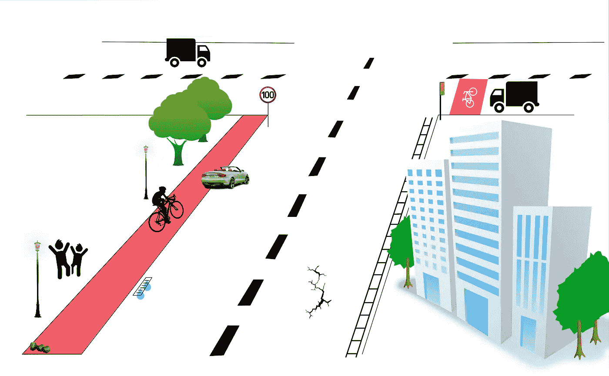

循环包含许多社会利益。它影响着一个社区的安全、经济、环境、公平和健康。道路上骑自行车的人数很大程度上受到他们对安全的看法的影响。要确定道路安全，最基本的是要有一个共同的衡量标准，以便确定和比较风险因素。使用谷歌街景(GSV)图像是分析城市环境的一种经济有效的方法。由于提取准确结果需要大量图像，因此使用了自动检测对象和结构的模型。

该项目的目的是使用对象检测和图像分割模型从伦敦的 GSV 图像中提取骑自行车者的道路风险因素。这涉及汇编道路安全指标和风险因素；在使用 YOLOv5 和 PSPNet101 这两个最先进的工具分别探测物体和分割图像之前，分析 GSV 数据集，并进一步分析其结果；确定 YOLOv5，PSPNet101 的局限性，并提出使骑自行车者的安全评估更准确的方法。

在图像数据集中的 50 万幅图像中，识别了大约 200 万个物体，标记了 2000 亿个像素。平均而言，每个下层超级输出区域(LSOA)有 108 个图像。使用 YOLOv5，在 LSOA 水平上直接识别出以下风险因素的分布:高车辆速度、电车/火车轨道、卡车流通、停放的汽车和行人。发现汽车 x 公共汽车、汽车 x 骑自行车者和汽车 x 人(最强)之间存在统计上显著的负相关。以及人 x 公交和人 x 自行车的正相关(最强)。重型车辆数量呈长尾分布。使用 PSPNet101，建筑物(27%)、天空(22%)和道路(22%)像素是最常见的。因此，在这些区域中的任何一个中的物体都可以被同等地检测到。所有的结果和实现都可以在项目的[库](https://github.com/warcraft12321/RoadSafety)中获得。

未来的发展包括提高 GSV 图像的可用性和分辨率。用包含更多类别的更大数据集训练 YOLOv5 和 PSPNet101。定义安全度量以同时考虑检测到的对象和分割的结构。

# 介绍

骑自行车对社会有很多好处。它影响我们的安全、经济、环境、公平和健康[1]。虽然在有些国家，大部分的日常通勤是通过自行车来完成的，但在另一些国家，人们很少使用自行车。

在实际的新冠肺炎疫情环境中，政府正在推广骑自行车作为驾驶甚至拥挤的公共交通工具的替代方式。众所周知，污染较重的地区不仅会给当地居民带来额外的感染风险，而且在公共交通工具上也很难保证社会距离。出于这些原因，英国政府正在用一个 20 亿英镑的一揽子计划来推动这种可持续的交通方式。

道路上骑自行车的人的数量很大程度上受到他们对安全的看法的影响[4]。要确定道路安全，最基本的是要有一个明确的通用指标，以便确定和比较风险因素。

谷歌街景(GSV)图像是公开可用的，此外，它覆盖了大多数发达国家(图 1) [5]。因此，这是一种分析城市环境的经济有效的方法。

由于提取准确结果需要大量的图像，数据集和在其上训练的模型用于自动检测存在的对象和其他结构。为此，使用对象检测(OD) [6]和图像分割(IS) [7]工具。

该项目的目标是根据具体的安全指标，如事故、伤害和死亡率，编制一份与伦敦骑自行车者最相关的风险因素清单。使用 GSV 影像数据集，通过 OD 和 IS 模型提取大伦敦地区已识别的风险因素。在较低层的超级输出区(LSOA)层面，研究不同的安全系数如何在伦敦分布。以识别大多数检测到的对象之间的相关性。在单独分析来自所有 LSOAs 的图像后，检测两种算法最常见的错误分类，并提出减轻错误分类的方法。最后，根据本项目的经验，为 OD 和 IS 模型如何检测额外的道路安全风险因素提供新的指南。

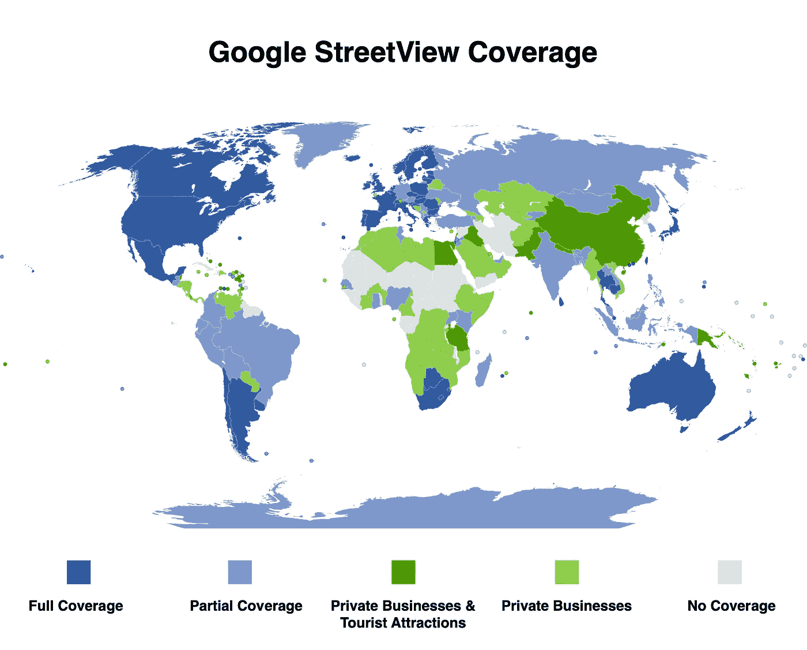

**图 1** GSV 世界报道。改编自[5]。

在下一节中，将介绍对于理解该项目的目标和结果至关重要的概念。

# 背景

首先介绍骑行的好处。然后，探讨道路安全指标，然后确定伦敦骑自行车者的风险因素，并定义如何使用 OD 和 IS 方法捕捉这些因素。详细介绍了 YOLOv5 (OD)和 PSPNet101 (IS)模型及其各自用于训练它们的数据集。

## 骑自行车的好处

本节概述了与骑自行车相关的最重要的社会效益。它们可以分为五个主要领域:安全、经济、环境、公平和健康[1]。

在美国，年轻人死亡的主要原因是交通事故。占 15 至 24 岁年龄组死亡总人数的 41%(CDC)。在欧盟，过去 10 年中，骑自行车者的死亡率保持不变，而汽车司机和乘客的死亡率下降了 24%。行人中下降了 19% [8]。英国是仅有的 3 个行人死亡率上升的欧盟国家之一，每年上升 1.3%。欧盟平均每年下降 2.6%。在英国，骑自行车者的死亡人数下降了 1.3%，年平均下降率排名第 13 位。鉴于 99%的行人被机动车撞死，1%的行人被自行车撞死，显然有必要提高骑自行车者的安全，并增加他们在街上的数量。同时，这也促进了数量上的安全:如果骑自行车的人越多，他们就越安全。驾驶员通过更频繁地与骑自行车的人接触而形成的意识是根本原因。

推广步行和骑自行车作为替代交通方式，对个人、公司和社区都有很多经济效益。根据 2015 年城市交通记分卡，2014 年美国的拥堵成本为 1600 亿美元。估计每人每年需要 960 美元。这些值考虑了时间和燃料费用。据计算，2018 年在美国拥有一辆汽车的成本是 8849 美元，而自行车是 308 美元，步行被认为是免费的。2018 年基准报告补充说，自行车旅游在全球多个地区具有积极的经济影响。受保护的自行车道意味着商业报告显示了骑自行车对商业的积极影响。研究发现，平均而言，骑车上班的人比开车上班的人花更多的时间，去公司的次数也更多。此外，在 2011 年的一项研究中，政治经济研究所(Political Economy Research Institute)发现，在自行车专用项目上投资 100 万英镑，平均创造了 11.41 个就业岗位，而在公路专用项目上投资相同金额，平均创造了 7.75 个就业岗位。

减少对不可再生资源的依赖是自行车运动的积极方面之一。据美国环境保护署估计，交通运输部门排放的温室气体最多，占 28%(在美国)。其中，乘用车和轻型卡车占整个运输行业的 60%。此外，众所周知，道路和停车场等结构会显著增加城市洪水、暴雨径流和城市热岛效应的可能性(由于城市中缺少阴影和裸露的土地，它们通常比周围环境的温度更高，这是空气湿度低的结果)。推广自行车将减少对原有基础设施的需求，并减轻一些负面影响。

在一个国家推广骑自行车可以促进公平。由于拥有汽车的高成本，当一个城市优先考虑这些车辆的道路基础设施时，它会给负担不起的低收入家庭带来更高的风险。这在低收入社区尤为重要，据一份缩小差距简报估计，低收入社区只有 50%的道路有人行道，而高收入社区有 90%的人行道。这导致行人和骑自行车的人面临更大的威胁。《新的多数:骑自行车实现平等》报告称，26%的有色人种愿意骑自行车，但出于安全考虑而不骑，相比之下，白人受访者中这一比例为 19%。

体育活动，如骑自行车和散步，对身心健康有许多好处[9]。疾病控制和预防中心报告说，如果公民更加积极，十分之一的过早死亡、八分之一的乳腺癌、八分之一的结肠直肠癌、十二分之一的糖尿病患者和十五分之一的心脏病是可以预防的。它还可以降低冠心病、中风和许多呼吸系统慢性疾病的风险，这些疾病与空气质量密切相关[9]。2018 年空气状况报告指出，超过 1.339 亿美国人生活在臭氧和/或颗粒污染水平不健康的县。这是一个受社区内交通模式影响很大的因素。因此，车辆是美国环境保护署的主要贡献者之一。由于所有这些好处，在人群中提倡较少久坐的生活方式的重要性变得显而易见。

通过促进骑自行车者的安全，整个社会受益。骑自行车的人和行人会更安全。司机将减少他们的通勤时间，并将其转化为社会收益，如降低污染水平和经济损失。

## 道路安全指标

道路安全指标对于决策至关重要。根据欧洲道路安全宪章，它们使我们能够评估道路的当前状况，观察干预后对事故率的影响，监控其随时间的进展，并预测进一步的发展。

要发挥作用，道路安全指标应符合几个标准:

1.与道路安全的某些方面有关，如道路事故的原因或后果；

2.以可靠的方式衡量；

3.随着时间的推移可以监测；

4.允许道路安全工程师或公共卫生专家设定目标；

5.有助于建立不同安全性能的比较和基准。

所有指标共有六个方面:地理范围、时间跨度、数字格式、表示/可视化、可靠性、准确性、代表性和道路安全的具体“水平”。第一个包括测量发生的地方:组织、城市、地区、国家、欧洲或全球。第二个与分析的时间框架有关:日、周、月、季度、年、十年或更长时间。测量单位由第三个特征表示。它们可以是一个比例、一个百分比或一些其他明确定义的比率。表示描述了数据呈现的方式，例如，以地图、图形或表格的形式。可靠性、准确性和代表性与测量系统的设计和实施相关联。最后，该指标的“级别”因是否考虑以下因素之一而有所不同:碰撞的影响、碰撞后反应、碰撞结果、碰撞原因和预测因素、道路安全政策和措施或安全文化和安全系统。

碰撞结果，包括死亡率、重伤/轻伤率和事故率等指标，是选择下一节介绍的风险因素时考虑的因素。

引入了道路安全指标，以便对最相关的骑自行车者的风险因素进行明确排序

## 危险因素

为了列出和排列伦敦骑自行车者最相关的风险因素，考虑了事故、伤害和死亡率。在伦敦，骑自行车者的死亡率相对较低(图 2)，因此，优先考虑另外两种更具歧视性的骑自行车者。在设计图 3 图表时，事故率和受伤率用于对所有风险因素进行排序。注意，一旦没有找到所有风险因素的通用安全指标，这些排名也有很强的定性和基于经验的成分。

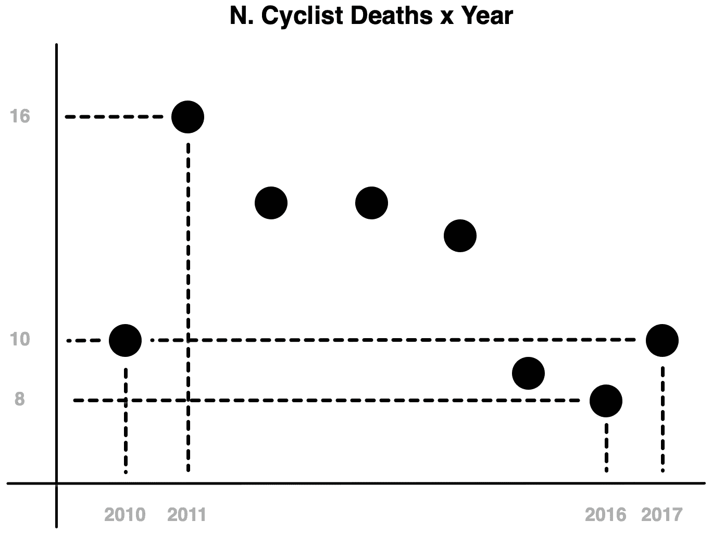

**图 2**2010 年至 2017 年大伦敦地区骑自行车者死亡人数。数据来自[10]。

影响骑自行车者安全的前三个最相关的因素是自行车道的存在、道路速度限制和道路车道宽度。接下来，提供支持图 3 中定义的排名的统计数据。请注意，只有少量涉及骑自行车者的事故被报道[11]，因此，以下段落中的统计数据可能无法完全反映真实情况。

**自行车道和停放的汽车**

自行车道可以分开，也可以位于道路上。

当一辆汽车试图超过一名骑自行车的人时，或者在摔倒的情况下，被撞上时，物理上分离的车道减少了撞车的可能性。骑车人受伤的一个主要原因是糟糕的路面质量导致的摔倒[12] [13] [14]。由于周围没有汽车停放，这些车道将骑车人受伤的风险降低了一半。[15]出于所有这些原因，没有考虑与高速公路限制、狭窄的自行车道宽度、路面质量和停放的汽车相关的风险。

与无车道相比，在道路自行车道的情况下，车辆速度往往较低，且与骑车人之间的相互作用较少[16]。

这使得第一种情况最安全，其次是公路和无自行车道。

自行车道的存在被认为是最具决定性的因素，因为它可以预防许多以前发现的风险。它被认为是风险因素排名中的第一位。

**车速**

研究发现，在大约 10%的事故和 30%的致命事故中，速度是主要因素之一。车祸中车辆的速度是决定受伤严重程度的唯一最重要的因素。[17]

考虑速度时有两个明显的因素。众所周知，不仅更高的速度会导致事故率、伤亡率的增加，而且速度差异也很大。高速变化的道路更不可预测，一旦它们有利于相遇的次数和超车操作次数的增加。因此，降低速度限制有时可能只会导致车辆平均速度的降低，而不是其变化。[18]

车辆高速行驶所带来的危险的核心是制动距离的增加以及从车辆传递给骑车人的动能。一旦两者都随着速度的平方增加，避免或幸存下来的可能性就会平方减少。[18]

从生物学角度来看，众所周知，在碰撞中，人体只能抵抗有限的动能转移。[19]这一数额因身体部位、年龄组和性别而异。考虑到设计最好的汽车，如果车辆超过 30 km/h，就可以超过这个极限。[20]研究还表明，如果汽车以低于 30 公里/小时的速度行驶，行人在撞车事故中幸存的可能性高于 90%。当以 45 公里/小时的速度被汽车撞上时，生还的几率降低到 50%。[21]或者，当一辆汽车的速度从 30 公里/小时上升到 50 公里/小时时，在撞车事故中幸存的可能性降低了 8 倍。[22]

这被认为是第二个最相关的因素。在靠近低速限制道路的道路自行车道的情况下，与平行交通相关的风险因素被认为是可以忽略的，无论车道的宽度如何。

**车道宽度**

在英国，推荐的自行车道宽度为 2 米。最低要求是 1.5 米。所有低于 1.5 米的值都被认为太窄，几乎没有余地绕过障碍物，如:碎片、坑洞和排水器。人们经常说，没有自行车道比太窄的自行车道更安全，因为驾车者往往会直接开到车道线上，而骑自行车的人则太靠近路缘。

在道路限速之后，自行车道宽度被认为是以下最重要的因素。每当它被认为是广泛的，交通风险因素没有被考虑。不管道路自行车道的宽度如何，低速限制足以排除所有与交通相关的风险因素。

**路灯**

排在前 3 位之后，路灯被认为是决定道路安全的最相关的标准。众所周知，它会影响驾驶员和骑车人的反应时间，并使骑车人不容易被注意到，尤其是在不使用任何反光或发光装置的情况下。此外，从骑车人的角度来看，他们不太了解与路面质量相关的其他道路风险。预计它不会在伦敦遇到很多照明不足的道路，因此，它被排在第四位。

**路面质量、电车/火车轨道和排水器**

正如文献中经常提到的，路面质量是评估安全性时要考虑的一个关键因素。[12] [13] [14]路面质量是指没有自行车道时的道路质量，或自行车道存在时的道路质量。除了排水器和小径的存在，这些是以下最重要的风险因素。这是放置在路灯下一次，有足够的亮度和循环速度适中，它应该不会构成重大威胁。

**路口数量和路口可见度**

大多数自行车和汽车事故发生在十字路口。在[23]中，报告的百分比是总碰撞数的 60%。此外，作为同一项研究的一部分，街道不以直角相交的十字路口给骑自行车的人带来了额外的危险。在这些地区发生的撞车事故对骑车人造成严重伤害的可能性增加了 31%。主要原因是路口能见度降低。

**货车和其他大型车辆**

近年来，随着经济发展和消费者需求的增加，城市中的卡车数量也在增加。[24] [25]虽然骑自行车也有同样的趋势，但它们之间的相遇次数却大大增加了。例如，在纽约市，15%的自行车网络与 11%的卡车网络重叠。[26]遭遇次数的增加导致卡车事故和死亡率的增加。卡车-自行车事故通常比其他类型的事故后果更严重。[27] [28] [29] [30]在一些欧盟国家，30%的骑自行车死亡事故与卡车有关。[31]过去 20 年的研究表明，在伦敦，卡车是导致骑自行车者死亡的最常见的交通工具。[28] [32] [33]

**提前停止线**

比利时、丹麦和英国等几个欧洲国家都有这种线路，当交通信号从红色变为绿色时，允许某些类型的车辆(即自行车)先行。这有几个好处。首先，线后的驾驶员可以清楚地意识到他们周围有骑自行车的人，并采取正确的预防措施来避免危险的操作。第二，对于一个骑自行车的人来说，向左转弯以避免与后面的车相撞变得更加安全。在事故、伤害或死亡率的统计数据方面，没有发现任何问题。

**弯道能见度**

几个来源确定弯曲是一个风险因素。弯道和十字路口通常被认为对骑自行车的人构成类似的危险。在骑自行车的人看来，低能见度会造成通常不会出现的危险情况——突然出现行人或侵入的植物。从驾驶员的角度来看，这可能会使骑自行车的人不被注意到，从而成为易受攻击的因素。[12]没有明确的统计数据显示弯道如何影响骑自行车者的事故、伤害或死亡率。

**行人**

在所有年龄组中，与 15 至 64 岁或 65 岁以上的成年人相比，行人死亡事故最常发生在 14 岁以下的儿童身上。从性别来说，男性比女性的风险更大。[34]由于这些原因，符合这些标准的人口高度集中的地点(例如学校地区)面临额外的风险。然而，在无车区，行人和骑自行车的人之间的事故极其罕见，而且几乎从不严重。[35]这被认为是最不重要的风险因素。

考虑图 3，从图的左到右，风险因素的数量减少。最不安全的情况是没有自行车道。第二，在公路场景中窄车道的高速度限制。第三，高速限制，但车道更宽。第四，无论道路上的车道是宽还是窄，都要限速。最后，物理隔离车道被认为是最安全的场景。

在接下来的两节中，我们将介绍用于从影像中捕捉对象和结构的工具。

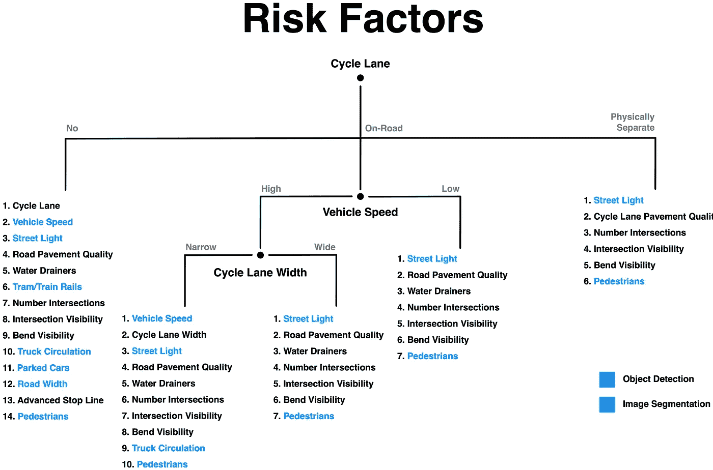

**图 3** 确定了伦敦道路上 5 种情况下骑自行车者的风险因素。

## 目标检测

OD 是一种与图像处理和计算机视觉领域密切相关的计算机技术。它用于图像注释、活动识别、人脸检测、人脸识别、视频对象共同分割和对象跟踪等任务[36]。

每个对象都有一组特殊的特征，有助于将其分类为属于特定的类。例如，当寻找圆形或矩形时，在角上弯曲或垂直的物体被搜索[36]。

用于 OD 的方法属于这两类中的一类:基于机器学习或深度学习的方法。在第一种情况下，最相关的特征列表被先验地定义*。支持向量机是一个可能的例子。相反，在深度学习方法中，可以在不指定相关特征的情况下执行端到端 OD(yolov 5)。卷积神经网络是典型的例子[36]。*

## *YOLOv5*

*YOLOv5 是 YOLO 的最新版本，最初由 Joseph Redmon 开发。第一个版本运行在一个名为 Darknet 的框架中，这个框架是为了执行 YOLO [37]而特意构建的。*

*版本 5 是第二个不是由原作者开发的模型(在版本 4 之后)，也是第一个在最先进的机器学习框架中运行的模型——py torch[6]。*

*YOLOv5 GitHub [储存库](https://github.com/ultralytics/yolov5)包含 MS Coco 数据集中的预训练模型。此外，在相同数据集上进行基准测试(图 4 ),以及关于如何使用不同数据执行或重新训练的详细文档。*

*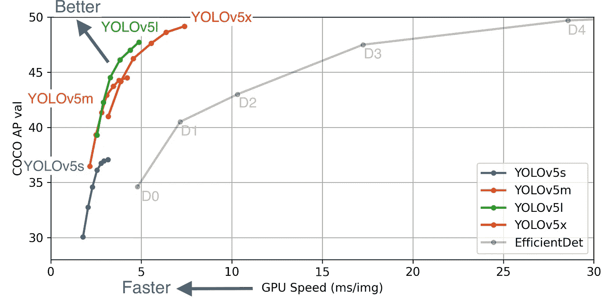*

***图 4** 最新的 YOLO 车型是版本 5(2020 年 7 月)。发布时有 4 组不同的砝码，精确度和存储要求各不相同。 *EfficientDet* (最精确的 OD 模型)的出现凸显了 YOLOv5 的检测速度，同时保持了同样的高精度[6]。*

*在表 1 中，对每套 YOLOv5 砝码的精度、速度和存储要求进行了比较。*

*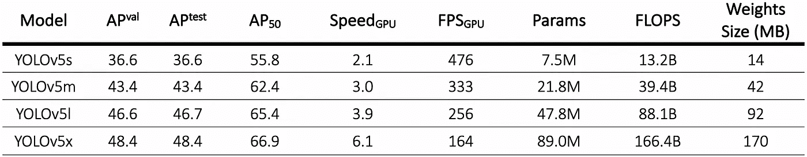*

***表 1**yolov 5 发布的所有砝码组的规格。通常，随着平均精度的提高，需要 GPU 执行更多的处理能力。改编自[6]。*

*YOLOv5 的架构由三个重要部分组成，就像任何单级物体探测器一样:模型主干、颈部和头部。第一种用于提取给定输入图像的主要特征。在版本 5 中，使用跨级局部网络。这些研究表明，使用更深的网络，处理时间有了显著的改善。模型颈部面板用于获得特征金字塔，并有助于在对象缩放上概化模型。最终的检测部分由模型的头部执行(与 YOLOv3 和 YOLOv4 中相同)。它在要素上应用锚框，并生成输出向量，包括类别概率和边界框。*

*每个潜在的检测都有一个相关的置信度得分。这表明模型对边界框内对象的存在有多确定，同时，该框是否正确地捕捉了它。*

*由于 YOLOv5x 的高精度和高速度，选择该模型来处理 GSV 数据集。*

## *图象分割法*

*在计算机视觉和图像处理中，是指将数字图像分割成多个像素段或像素组的过程。目标是将图像表示简化到可以轻松检索多个结构的程度。更准确地说，这是给图像中的每个像素分配一个标签的过程，并且具有相同标签的像素共享一些特征。因此，这种方法提供了关于某些结构的存在、它们在图像中的形状和位置的信息[38]。*

***PSPNet101***

*金字塔场景解析网络(PSPNet)是最精确的信息系统模型之一。它赢得了 ImageNet 场景解析挑战赛 2016、PASCAL VOC 2012 基准测试和 Cityscapes 基准测试。它在 PASCAL VOC 2012 上达到了 85.4%的 mIoU 准确率，在 Cityscapes 上达到了 80.2%的 mIoU 准确率[7]。从那时起，细分模型的准确性在过去的两年里达到了一个稳定的水平(图 5)。*

*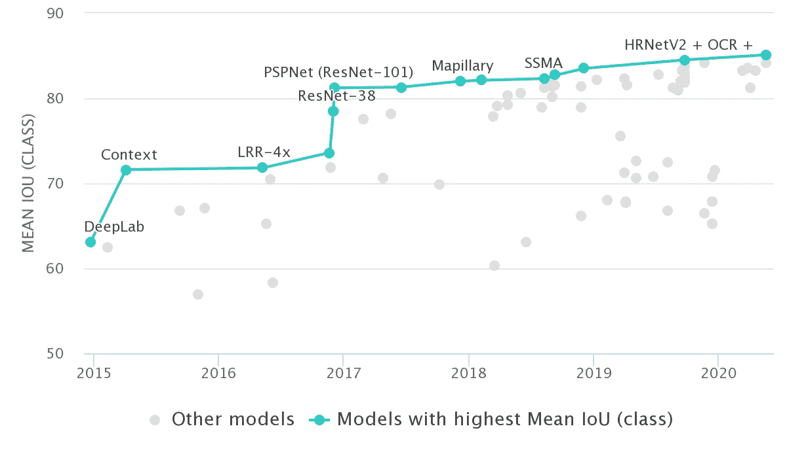*

***图 5** 信息系统模型随时间的演变。自 2017 年以来，平均 IoU 的增幅非常小[39]。*

*在接收到输入图像后，PSPNet 执行卷积神经网络(CNN)以从最后的卷积层提取特征图。然后，金字塔解析模块用于获取不同的子区域表示，接着是上采样和级联层，以创建最终的特征表示。这携带了本地和全局上下文信息。在最后一步中，该表示被送入卷积层，并获得最终的每像素预测。*

*由于 IS 模型的执行时间很长，所以它被选为速度最快、精度最高和文档最好的模型。*

## *训练数据集*

*有多个带有标记对象和分割图像的可用数据集。对于 OD 模型训练和基准测试，两个最常用且包含最多道路类别的是 MS Coco [40]和 Open Images V6 [41]。同样，对于 IS 来说，Cityscapes [42]和 ADE20K [43]是当前最先进的数据集。在表 2 中，所有 4 个项目被放在一起，并根据其相关类别进行比较，以评估骑自行车者的道路安全性。*

*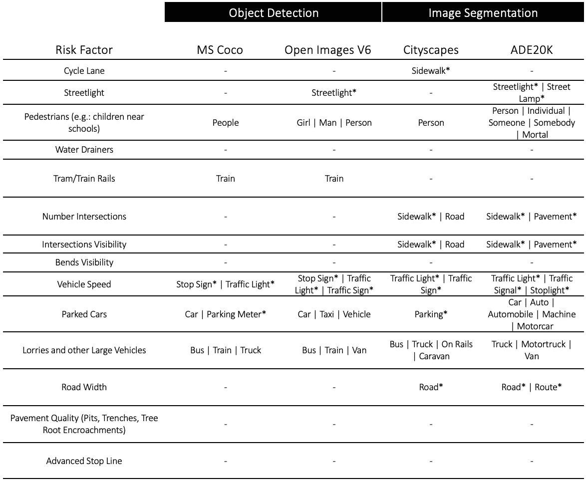*

***表 2**4 个最大 OD 和 IS 数据集之间的比较，以及评估道路安全的相关数据。*

*一些道路安全对象可以直接提取，其他的可以间接提取。这同样适用于分段结构。表 2 中不带星号的特性代表其动态行为。因此，在同一地点，它们的数量会随着时间的推移而变化。*

*在 OD 类别中，确定了以下骑自行车者风险因素:汽车和停车计时器用于计算停放的汽车。行人专用区。卡车和公共汽车为卡车流通。数字自行车运动员的自行车。交通灯和停车标志的车速，一旦他们是交通平静的因素。最后，列车*T3 因为有轨电车/火车的存在而产生了紧密的关联。对于 IS，道路、人行道和街灯分别用于检索道路和人行道宽度以及街灯。**

***可可女士***

*Microsoft Coco 是用于 OD、分段和字幕的最大和最受欢迎的数据集之一。它包含 330K 个图像，其中 200K 被标记。存在 150 万个标记对象，分布在 80 个类别中。图 6 包含一些标记对象的例子。该数据集包含几类日常物品，从家用电器到道路上最常见的物品[40]。*

*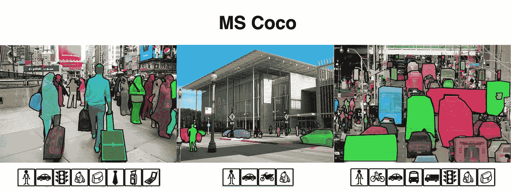*

***图 6** (上)MS Coco 数据集中带注释的图像示例。(底部)每个图像中存在的对象[40]。*

***城市景观***

*Cityscapes 数据集侧重于对城市街道场景的语义理解。它包含了来自德国、法国和瑞士 5 0 个城市的 20 000 幅粗略的注释图像和 5 000 幅精细的注释。这些照片是在几个月(夏季、春季和秋季)、良好/中等天气条件下和白天拍摄的。共有 30 类结构(图 7) [42]。*

*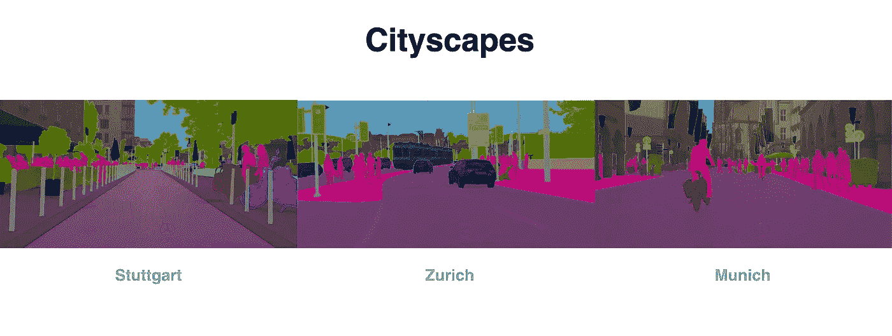*

***图 7** 城市景观中可用的三个分割图像示例【42】。*

*Coco 女士和 Cityscapes 数据集最具互补性，相关对象和道路结构的数量最多。在这两个数据集中预先训练的 YOLOv5 和 PSPNet101 模型分别用于检测对象和分割图像。*

# *方法学*

*本节将详细介绍如何使用 YOLOv5 和 PSPNet101 模型存储和处理 GSV 影像数据集。各个参数的选择。另外，用来执行它们的软件和硬件。*

## *GSV 影像数据集*

*没有考虑伦敦的道路安全分析，而是选择在 LSOA 层面进行。大伦敦可以分为多个更小的区域:输出区、中间层超级输出区和 LSOA。伦敦的每一个分区在地理尺度上都有所不同。从[伦敦数据存储库](https://data.london.gov.uk/dataset/statistical-gis-boundary-files-london)获得了包含这些部门的多个 shapefiles 的 zip 文件夹。*

*Emily Muller 在这个项目开始之前使用 Google API 获得了 GSV 影像数据集。将每个图像标识与给定的伦敦 LSOA 相关联的单独文件也是可用的。*

*由于高内存需求，本项目中使用的所有图像都存储在帝国服务器中。使用 *Globus* 平台访问研究数据存储中的图像。*

## *YOLOv5*

*为了执行 YOLOv5，使用了 Imperial 的高性能计算集群。它是使用 VPN 连接工具— *Tunnelblick* 远程访问的。*

*由于 YOLOv5 的执行速度，它使用了一个单独的 P1000 GPU。选择了最精确的砝码组— YOLOv5x。*

*定义每次检测的最小置信度为 0.5。高于标准值 0.4。仅保存包含检测到的对象和各自位置的文本文件。每一行包括每个对象的数字名称，用空格分隔的是检测框中心的坐标，以及矩形的宽度和高度的两个值。*

*使用 *Matplotlib* 和 *Seaborn* Python 可视化框架，绘制了前 15 个最常检测到的对象的相关性矩阵。使用 *SciPy pearsonr* 函数获得 Pearson 相关因子和 p 值。*

**Pandas DataFrame* 用于绘制前 15 个最常检测到的物体的相对和绝对分布直方图。*

*错误分类、局限性和未来方向分析侧重于以前确定的与道路安全相关的物体。此外，所有观察结果均来自对伦敦所有 LSA 的一幅图像的单独评估，以及整体项目经验。*

## *PSPNet101*

*尽管 Esra Suel 已经提供了执行 PSPNet101 的初步版本，但仍进行了修改以克服与 TensorFlow 新版本的不兼容性。*

*通常，IS 方法比 OD 慢。最初它是用 Python *多处理*工具来加速执行的。最后，原始 GSV 数据集被分成 13 批，在 13 个 P100 图形处理器上并行执行。通过这种方式，向 HPC 提交了 13 份工作。与其他可用的 GPU 相比，P100 因其对数值分析的高处理能力而被选中(表 3)。*

**

***表 3** 帝国高性能计算集群上可用的 GPU 类型。在这个项目中使用了 P100。*

*GSV 数据集中的所有图像都被分割。之后，实现了两个 Python 函数。它生成一个字典，将每种 RGB 颜色链接到一个给定的对象类。另一个是接收分割图像的完整数据集作为输入，并输出每个类别的标记像素的总数。使用*Pandas**data frame*Python 库分析并表示所有标签的相对和绝对分布。*

*错误分类、局限性和未来方向分析侧重于之前确定的与道路安全相关的结构。此外，所有观察结果均来自对伦敦所有 LSOAs 的一幅图像的单独评估，以及整体项目经验。*

# *结果和讨论*

*在这一节中，结果与讨论一起呈现。首先，提供了伦敦所有 LSOAs 的 GSV 影像数据集的概述。然后，分析 OD 和 IS 输出。*

## *GSV 数据集*

*GSV 数据集包含分布在大伦敦地区的 518 350 幅图像。有 512 812 张照片被认定为伦敦 LSOA。其中，478，724 个是独特的(表 4)。*

*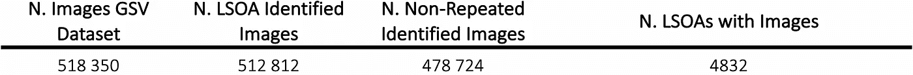*

***表 4** 并非 GSV 数据集中的所有图像都是 LSOA 识别的。因此，在分析中使用了一个较小的集合— 478 724。*

*对于每个数据点，有 4 个图像可用，范围从 0 到 360 度。有 119 681 个独特的 LSOA 识别点，每个点有四个 90 度图像(图 8)。*

*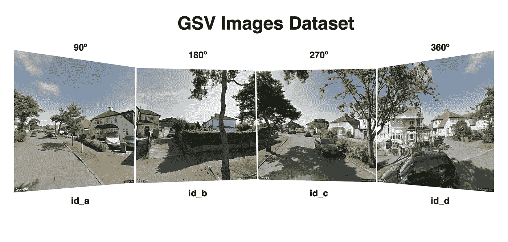*

***图 8** 对于图 9 中的每个数据点，有 4 个相关的图像。每个捕捉周围环境的 90 度角。*

*伦敦市中心附近有更多可用的图像，向外围递减。在图 9 中，显示了一个 LSOA 地图集，以及所有图像各自的地理分布。*

*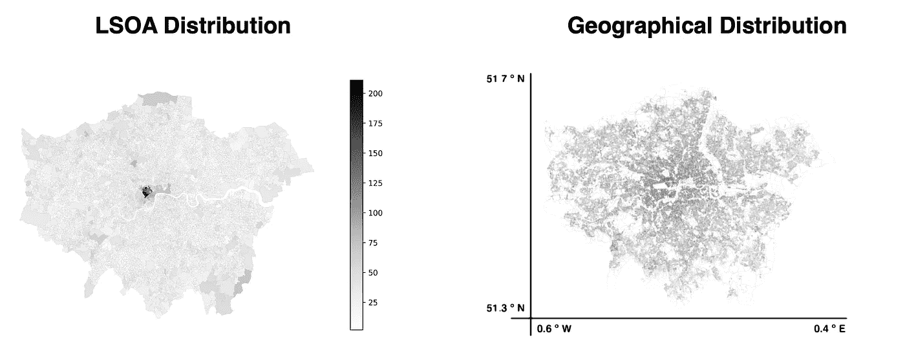*

***图 9** (左)也根据可用图像的数量进行着色。(右)同一组图像的地理分布(纬度和经度)。*

*数据点数量最多的 LSOA，211 个，位于伦敦市中心。平均而言，每个 LSOA 有 27 个数据点可用。数据集中有一个只有 1 的 LSOA(表 5)。图像数量的广泛分布损害了较少表示的 LSOAs 中对象和分割结构数量的估计精度。*

*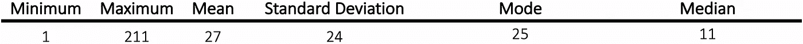*

***表 5** 伦敦所有 lso 数据集中 GSV 点的可用性。*

## *物体检测| YOLOv5*

*图 10 提供了运行 YOLOv5 后的图像示例。图像中的所有汽车、卡车和人都以高置信度值被准确地检测出来。*

*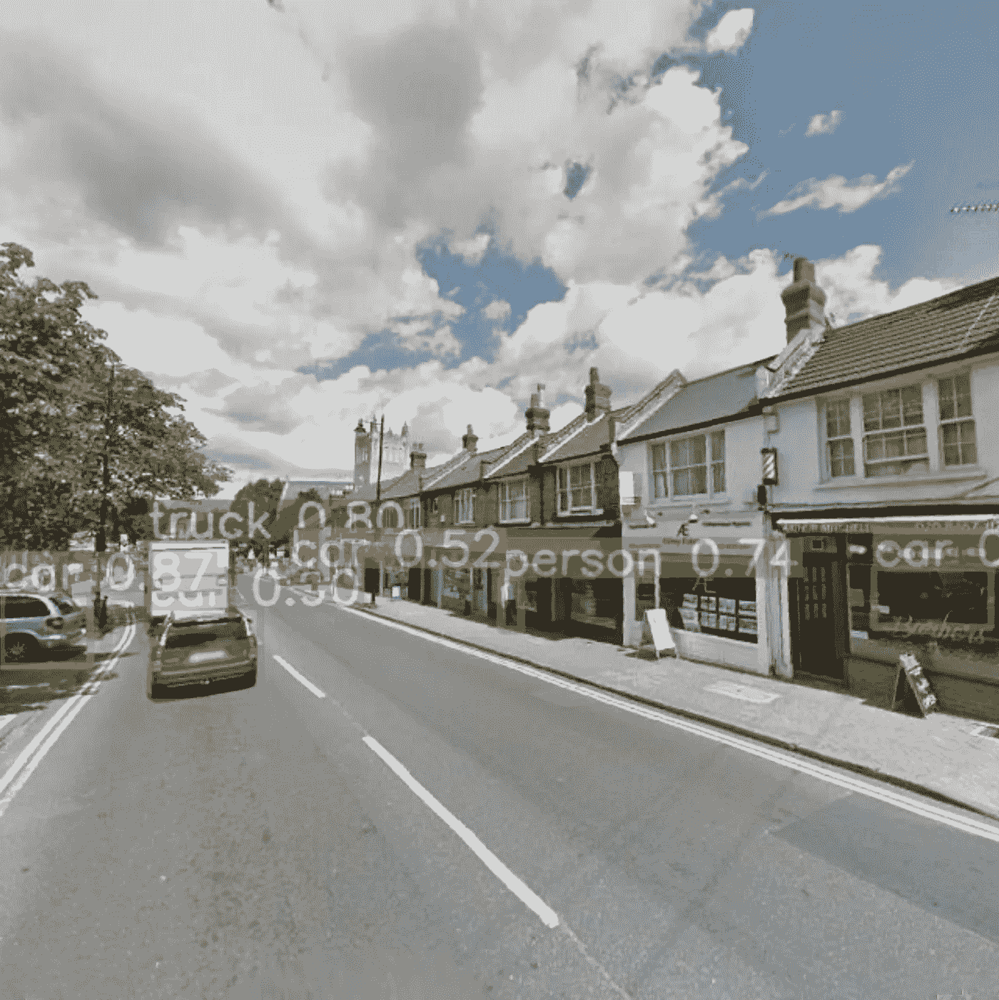*

***图 10** 执行 YOLOv5 后的 GSV 图像示例。*

*接下来，所有对象的相对和绝对分布在数据集级别呈现。*

***数据集对象分布***

*图 11 显示了前 15 个最常检测到的物体类别的相对分布。*

*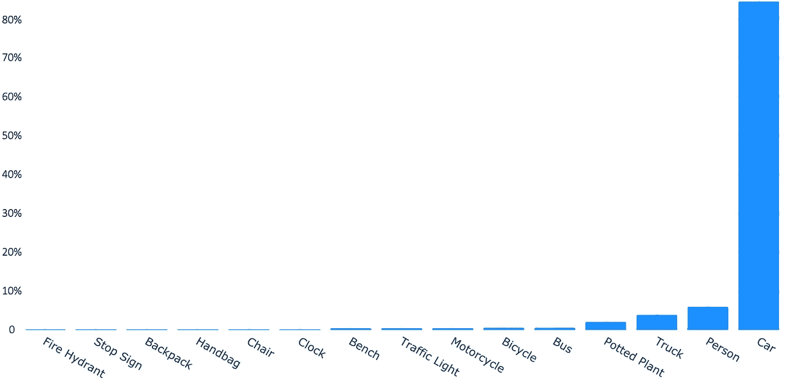*

***图 11** 在所有 LSOAs 中检测到的前 15 个对象的相对分布。*

*一旦数据集只包含街景图像，就有望检测到很大一部分汽车。伦敦是一个人口密度很高的城市，公共交通很普遍。这可以解释为什么有这么多的行人和公共汽车。盆栽植物检测与伦敦公园和绿地的数量密切相关。*

*表 6 包含在 GSV 数据集中检测到的前 15 个最常见物体的绝对数量。用绿色突出显示的是那些被认为对骑自行车者的道路安全有积极贡献的道路。红色的是负面因素。*

*除了表 6 中的彩色风险因素对象，还考虑了火车(657)和停车计时器(968)来提取图 3 中的风险因素。*

*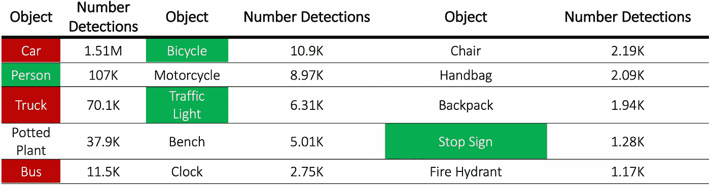*

***表 6** 前 15 个最常检测到的物体的绝对计数。用于提取骑自行车者道路安全系数的物体是有颜色的。*

***LSOA 物体分布***

*图 12 显示了与捕捉骑自行车者风险因素相关的物体的 LSOA 分布。*

*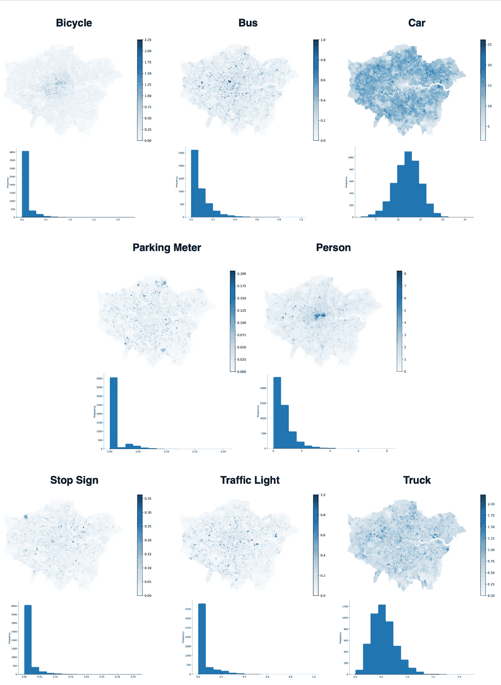*

***图 12** 检测到伦敦所有 LSOAs 上的对象分布。另外，在每个图谱的底部有各自的分布直方图。*

*大多数自行车是在伦敦市中心被发现的。一旦这是一种短距离的交通工具，他们基本上是在这个地区被发现的。公共汽车在伦敦市中心比在外围地区稍微集中一些。远离市中心的卡车数量较多。对于市中心的许多道路，根据伦敦卡车控制计划，它们的流通是被禁止的。*

> *公共汽车和卡车分布都是长尾分布，增加了意外发生的几率，使骑自行车的人面临更高的风险。*

*伦敦市中心以外的汽车分布密度要大得多。远离中心的道路有更多的车道，这可能意味着检测到这些物体的机会更高。市中心的停车计时器越少，这个地区的汽车数量就越多。在中心检测到的人数要多得多。尤其是在它所在的城市伦敦，它是历史中心和中央商业区。停止标志和交通灯基本上是在伦敦市中心之外发现的。两者具有非常相似的直方图分布。虽然，检测到的红绿灯数量几乎多了五倍。*

***相关矩阵***

*在道路安全方面，最强的正相关性是:人 x 自行车(0.52)、人 x 公共汽车(0.48)、公共汽车 x 自行车(0.25)和公共汽车 x 卡车(0.20)。负相关性最强的是:人 x 车(-0.23)和自行车 x 车(-0.20)(图 13)。*

*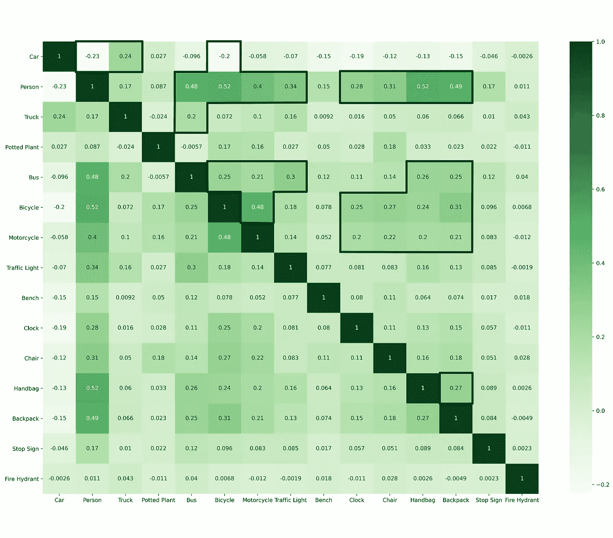*

***图 13** 前 15 位检测到的对象关联矩阵。每个像元包含皮尔逊相关系数(顶部)和相关的 p 值(底部)。*

> *就正相关而言，人 x 自行车高值表明行人和骑自行车的人在同一空间感到安全。*

*一旦公共汽车成为公共交通工具，预计周围会有很多人。因此，人员 x 公共汽车的皮尔逊系数相对较高。自行车 x 公交车和自行车 x 卡车的相关值有显著差异。*

> *这可能表明骑自行车的人在公共汽车旁边比在卡车旁边感觉更安全。*

*一旦公共汽车司机在靠近易受伤害的行人时更有经验，这就不足为奇了。公共汽车和卡车之间相对较高的相关性，以及结构相似的事实表明，有时一个可能会被错误地归类为另一个。*

> *对于负相关，人 x 汽车和自行车 x 汽车的具有统计显著性的皮尔逊系数表明，汽车高度集中的区域不利于骑自行车和步行。*

*一个不可忽视的因素是，较大的物体遮挡较小的物体可能导致较小的物体不易被探测到。因此，导致负相关。由于 GSV 图像是在离地面很高的地方拍摄的，这不太可能是经常发生的现象。*

***整体自行车安全指标***

*没有发现一种精确的度量来基于在伦敦道路上检测到的物体来估计骑车人的道路安全。虽然，根据图 12 中的对象分布，制定了一个正的和另一个负的组合安全措施。*

*影响骑车人安全的特征之一是周围其他骑车人的数量。发生这种情况是因为司机在大量出现时会更加意识到他们的存在。此外，绝大多数严重伤害是由车辆和骑自行车的人相撞造成的。人们发现，在汽车和人的存在之间存在着统计上显著的负相关关系。这样，行人越多，汽车越少。因此，骑车人受伤的风险更小。*

> **自行车*和*人*在对每张图像中这些物体的平均数量求和后，合二为一，作为一种积极的安全组合措施。*

*如果汽车是伤害率的主要来源，那么在分析某个地区的死亡率时，重型车辆就显得尤为重要。*

> *创建第二个 LSOA 地图，加入以下对象的每个图像的平均数量:*公共汽车*、*汽车*和*卡车，作为安全性的负组合测量*。*

*需要强调的是，我们无法从这两个生成的 LSOAs 中提取整体的安全性指标(图 14)。一个简单的例子是，骑自行车的人与交通隔离的道路不一定对骑自行车不安全。*

*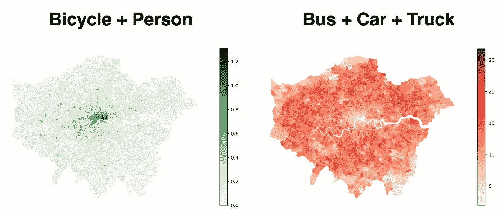*

***图 14** (左)*自行车*和*人* LSOA 分布被组合成一个组合指标，反映了骑自行车者安全性的积极得分。(右)*公交车*、*小汽车*和*卡车*分布组合成最终的地图集，展示伦敦的交通。这与骑车人的安全成反比。*

***限制和错误分类***

*所有检测到的道路安全物体都有很高的可信度(图 12)。YOLOv5 可以检测各种大小的物体，即使在部分遮挡的情况下也是如此(图 15)。此外，对象和背景之间的低对比度似乎没有导致大量的未检测。这方面的一个例子是，该算法检测到伦敦道路上的一辆汽车反射在窗户上(图 10)。然而，这被认为是一种分类错误——各种分类错误。*

*它汇编了一组 10 个随机物体检测图像，以便读者可以自己验证 YOLOv5 的准确性(图 15)。*

*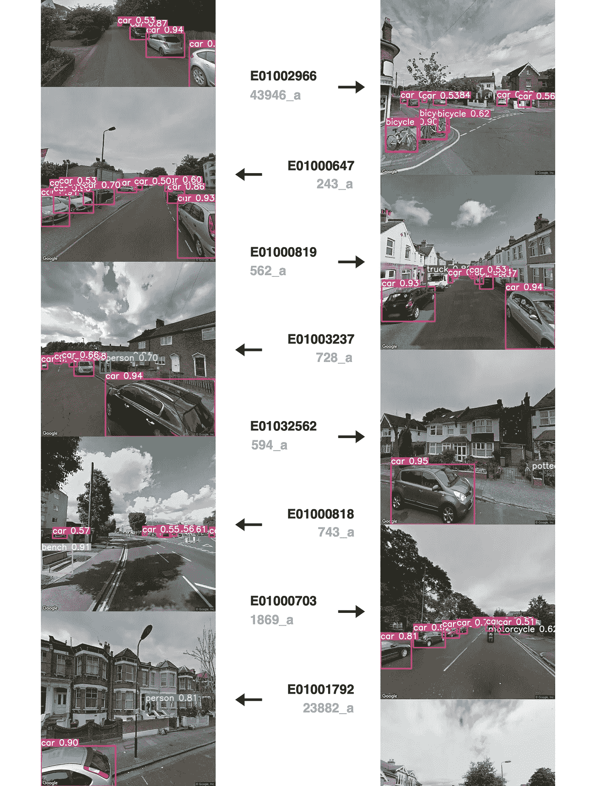*

***图 15** 来自不同 LSOAs 的十个随机选择的对象检测图像显示了在 MS Coco 类别中的高检测准确度。*

## *图像分割| PSPNet101*

*图 16 提供了一个分割图像的例子。用检测到的结构的各自标签来识别它。*

*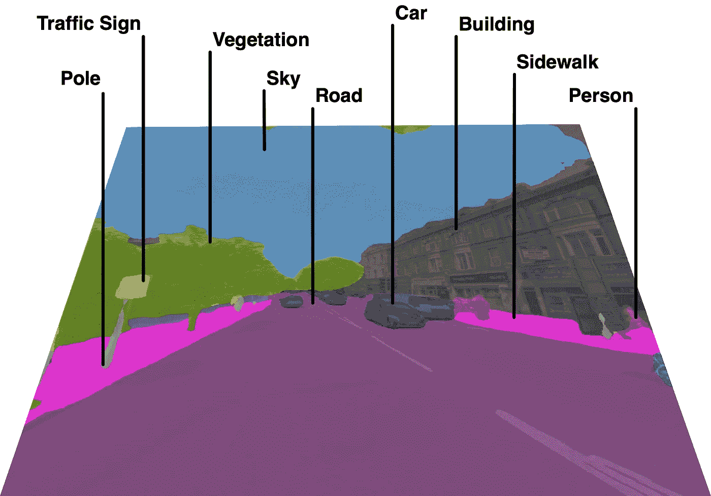*

***图 16** 使用 PSPNet101 分割后的 GSV 图像。包括了像素标签。*

*下一节将详细介绍 GSV 数据集中的绝对和相对标注分布。*

***数据集像素标签分布***

*建筑物(27%)、天空(22%)、道路(22%)、植被(18%)和汽车(6%)覆盖了所有图像总面积的 95%(图 17)。在前四种结构的情况下，这是由它们的内在尺寸来解释的。一旦这个数据集只包含从伦敦的道路上获得的图像，它就会比任何其他对象找到更多的汽车。这个像素频率数不仅与它们的大小有关，还与它们在图像中的频率有关。这样看来，OD 和 is 似乎是一致的。*

*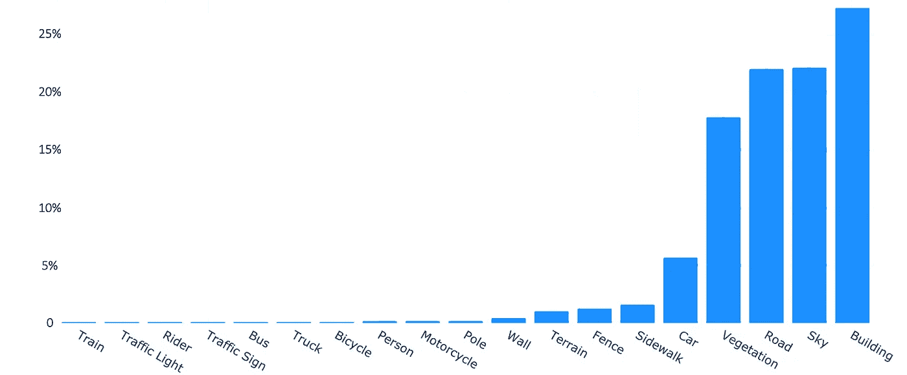*

***图 17**GSV 数据集中执行 PSPNet101 后标记像素的相对分布。*

> *跨不同类别的分割像素的相对分布还表明，不仅可以检测道路上存在的对象，而且可以检测周围环境中的对象，包括建筑物和天空中的对象。*

*虽然没有发现以下一些物体与道路安全有明显的相关性，但它们显示了使用 GSV 图像在广泛的位置检测结构的能力。嵌入建筑景观中的 2 750 个钟被错误地归类为碟形卫星天线。在同一地区，发现了 37 917 株盆栽植物。天空中发现了 234 架飞机。检测到大量标记为人行道的像素后，表明可能会捕捉到经常出现的对象(发现了 107 266 人，以及 5 013 条长凳和 1 168 个消防栓)。*

*表 7 中是由 19 个分段类别分布的所有像素标签的绝对计数。*

*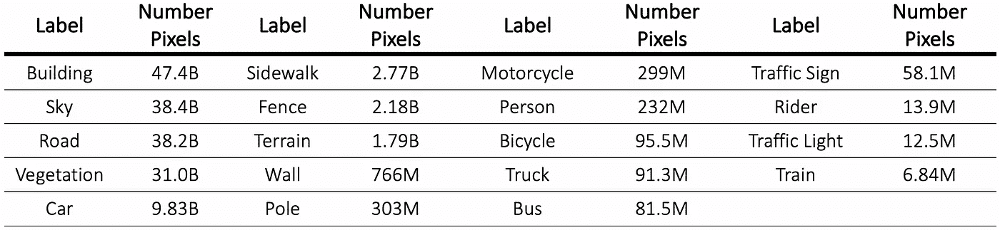*

***表 7** 在所有影像数据集中检测到的标记像素的绝对数量。*

*同样，从 IS 的角度来看，由于检测到的像素数量相对较高且形状一致，GSV 数据集似乎有助于估计道路和人行道的面积。这同样适用于路灯。尽管只有 3.03 亿像素被识别出来，但这个物体的尺寸表明，其中相当大一部分应该已经被探测到了。*

> *在对完整数据集的每个 LSOA 的一个分割图像进行单独分析后，似乎可以准确地检索道路和人行道的面积和形状。*

*正如在简介中所指出的，最后这些属性与道路安全相关，因为它们允许计算道路和人行道宽度。街灯或电线杆的存在，正如他们在城市景观中所称的，是评估道路能见度的一个代理。*

*在图 18 中，这些概念连同侧面的说明性图像一起被举例说明。*

*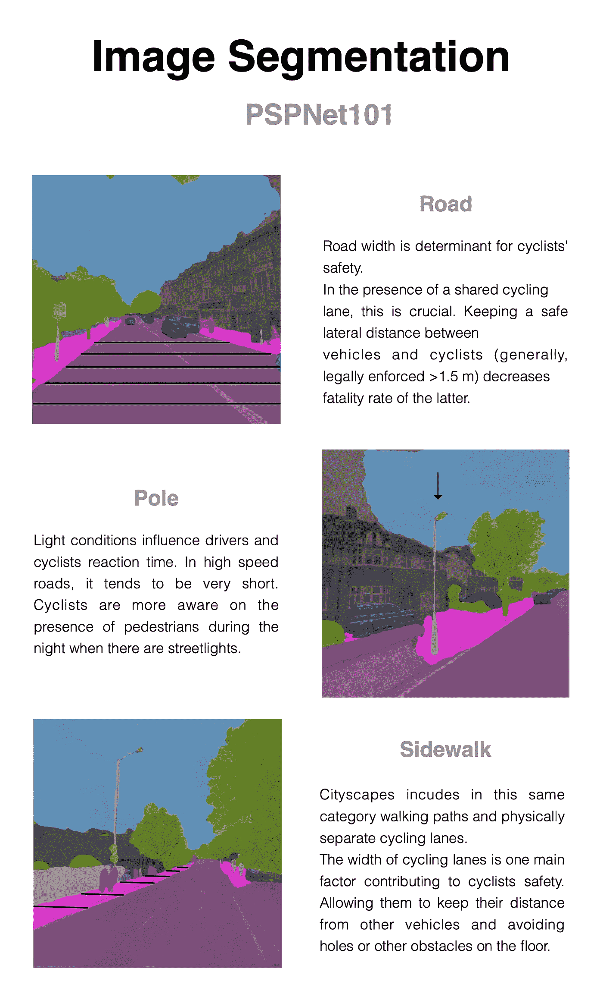*

***图 18** 信息图展示了提取道路和人行道宽度以及街灯的潜力。*

***限制和错误分类***

*由于某些结构的尺寸，PSPNet101 无法准确捕捉它们的形状。一个例子是极细，因此它们的检测受数据集中图像分辨率的影响很大。一旦对这些结构最重要的是它们的检测而不是捕捉它们的形状，这就不是特别大的问题。*

*就道路和人行道而言，有时堵塞似乎是一个问题。然而，通过考虑通常出现在这些区域中的对象，同时考虑它们的重叠区域似乎是一种有效的变通方法。具体来说，这是在路上的汽车和人行道上的人身上观察到的。通过这种方式，仍然可以提取这些结构的形状和大小的信息。*

*提取伦敦道路上这些建筑的绝对尺寸可能是一项艰巨的任务。根据拍摄图像的角度，标准可以有很大的不同。克服这个问题的一个方法是关注对象之间的相对维度(图 19)。*

*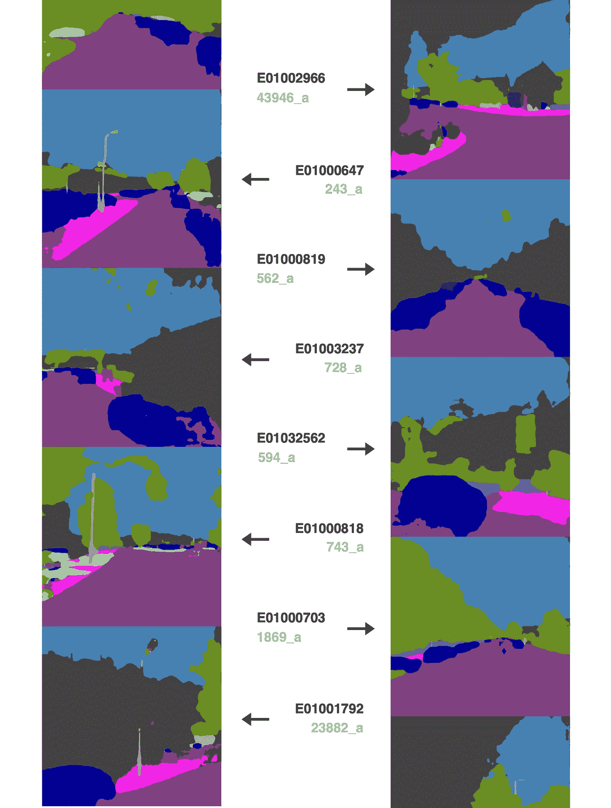*

***图 19** 来自不同 LSOAs 的随机分割图像的小样本显示了在捕捉尺寸和形状时考虑结构遮挡的重要性。*

## *未来方向*

*对于 OD 而言，在评估骑自行车者的道路安全方面向前迈出的一步是找到一个共同的道路安全指标，允许我们比较，例如，在事故或伤害率方面，物体如何不同地影响安全。在更大的数据集中训练 YOLOv5，并且比 Coco 女士有更多的对象类别。这将涉及注释额外的图像。[关于如何训练 YOLOv5 的文档](https://github.com/ultralytics/yolov5/wiki/Train-Custom-Data)非常详细且易于掌握。静态图像不能捕捉几个特征。使用包括行人、骑自行车者和车辆运动在内的视频记录将允许捕捉受图像获取时间高度影响的变量。*

*就信息系统而言，这些模型可以专门用于检测新的物体。*

> *自行车道的存在是决定骑自行车者道路安全的一个因素。没有找到任何包含这些内容的数据集。创建一个包括这一类别的对评估它们的安全性是非常重要的。*

*虽然我们没有发现人行道是否与骑自行车者的安全相关的证据，但在未来，证明存在关联，在城市景观中预先训练的 PSPNet101 将能够捕捉到它。*

*图 18 总结了可使用 PSPNet101 在 GSV 数据集中提取的所有道路安全信息(在本项目中确定)。*

# *结论*

*该项目的目标是使用 OD，从大伦敦的 GSV 影像数据集中提取骑自行车者的道路风险因素。这包括对所有 LSOAs 的图像分布的研究。确定相关的道路安全指标，以确定骑自行车者的风险因素并对其进行分级。使用 YOLOv5 和 PSPNet101 检测物体和分割图像。分析不同类别之间的对象分布和相关性。最后，找出两种方法的常见错误分类和局限性，并提出推进道路安全评价的新方法。*

*在数据集中可用的 50 万幅图像中，识别了大约 200 万个对象，标记了 2000 亿个像素。平均每个 LSOA 有 108 张图片。使用 YOLOv5，在 LSOA 水平上直接确定了以下风险因素的分布:高车辆速度、电车/火车轨道、卡车流通、停放的汽车和行人。汽车(占所有物体的 84.5%)、人(6.01%)、卡车(3.92%)、公共汽车(0.60%)、交通信号灯(0.4%)、停车标志(0.07%)、停车计时器(0.05%)和火车(0.04%)计数用于识别先前的风险因素。伦敦市中心以外的道路交通流量较高。相比之下，该区域内骑自行车者和行人的比例更高。前者被定义为一个消极的组合安全措施，第二，积极的。研究发现，汽车与公共汽车、汽车与骑自行车的人以及汽车与人之间存在显著的负相关。人 x 自行车和人 x 公交车的正相关。重型车辆(公共汽车和卡车)数量呈长尾分布。使用 PSPNet101，建筑物(27%)、天空(22%)和道路(22%)像素是最常见的。因此，在这些区域中的任何一个中的物体都可以被同等地检测到。所有的结果和实现都可以在项目的[库](https://github.com/warcraft12321/RoadSafety)中获得。*

*未来的方向包括提高 GSV 图像的可用性和分辨率。使用包含更多道路安全相关类别的数据集训练 YOLOv5 和 PSPNet101。定义一个安全度量来加权和组合(在道路级别)检测到的对象或分段结构。最后，实时处理街景图像或视频将允许更好地捕捉道路安全的动态([视频](https://www.youtube.com/watch?v=ncwcWl-zOws))。*

*YOLOv5x 实时执行。*

*[文章](https://github.com/warcraft12321/RoadSafety/blob/master/text/report.pdf) | [GitHub 资源库](https://github.com/warcraft12321/RoadSafety)*

# *参考*

*[1]“pedbikeinfo”，行人和自行车信息中心，[在线]。可用:[http://www.pedbikeinfo.org/.](http://www.pedbikeinfo.org/.)【Acedido em 2020 年 4 月 19 日】。*

*[2] C. Allan，“骑行英国的骑行统计”，2019 年 11 月。【在线】。可用:【https://www.cyclinguk.org/statistics. 【Acedido em 2020 年 8 月 19 日】。*

*[3]“20 亿英镑创造自行车和步行新时代”，英国政府，2020 年 5 月 9 日。【在线】。可用:[https://www . gov . uk/government/news/20 亿包创造骑行新时代。](https://www.gov.uk/government/news/2-billion-package-to-create-new-era-for-cycling-and-walking.)【Acedido em 2020 年 8 月 19 日】。*

*[4] S. M. Balogh，“骑自行车者的感知安全性——道路属性的作用”，瑞典斯德哥尔摩 KTH 皇家理工学院，2017 年。*

*[5]“谷歌街景报道”，维基百科，2020 年 8 月 14 日。【在线】。可用:[https://en . Wikipedia . org/wiki/Coverage _ of _ Google _ Street _ View。](https://en.wikipedia.org/wiki/Coverage_of_Google_Street_View.)[2020 年 8 月 19 日]*

*[6] G. Jocher，“YOLOv5”，Ultralytics，2020 年 7 月 23 日。【在线】。可用:[https://github.com/ultralytics/yolov5.](https://github.com/ultralytics/yolov5.)【Acedido em 2020 年 7 月 23 日】。*

*[7] J. S. X. Q. X. W. J .赵恒爽，《金字塔场景解析网络》，em *计算机视觉与模式识别*，2017。*

*[8] E. R. S .观察站，“2018 年交通安全基本事实”，欧洲委员会，2018 年。*

*[9]美国疾病预防控制中心营养部，“身体活动”，2019 年 2 月 4 日。【在线】。可用:[https://www . CDC . gov/physical activity/about-physical-activity/pdf/healthy-strong-America-2019 02 _ 508 . pdf](https://www.cdc.gov/physicalactivity/about-physical-activity/pdfs/healthy-strong-america-201902_508.pdf.)【Acedido em 19 April 2020】。*

*[10] T. f .伦敦，“伦敦之旅，报告 11”，2018 年。*

*[11]安全网，“行人和骑自行车者”，2009 年。【在线】。可用:[https://EC . Europa . eu/transport/road _ safety/sites/road safety/files/specialist/knowledge/pdf/行人. pdf](https://ec.europa.eu/transport/road_safety/sites/roadsafety/files/specialist/knowledge/pdf/pedestrians.pdf.)【Acedido em 13 May 2020】。*

*[12]“自行车设施”，iRAP，[在线]。可用:[http://toolkit.irap.org/default.asp?page=treatment&id = 1。](http://toolkit.irap.org/default.asp?page=treatment&id=1.)[2020 年 4 月 8 日]*

*[13]“道路安全委员会”，西澳大利亚政府，[在线]。可用:[https://www . RSC . wa . gov . au/RSC/media/Documents/Resources/cyclers-INFO-sheet . pdf .](https://www.rsc.wa.gov.au/RSC/media/Documents/Resources/Cyclists-INFO-SHEET.pdf.)【Acedido em 2020 年 4 月 8 日】。*

*[14]《自行车安全》，美国国家公路交通安全管理局，[在线]。可用:【https://www.nhtsa.gov/road-safety/bicycle-safety. 【Acedido em 2020 年 4 月 8 日】。*

*[15] K. T. e. al，“路线基础设施和骑自行车者受伤的风险:病例交叉研究”，*《美国公共卫生杂志》，*，第 102 卷，第 12 期，第 2336-2343 页，2012 年。*

*[16] L. Chen，C. Chen，R. Srinivasan，C. E. McKnight，R. Ewing e M. Roe，“评估纽约市自行车道的安全效果”，*《美国公共卫生杂志》，*第 102 卷，第 6 期，第 1120-1127 页，2012 年。*

*[17]“骑自行车——防止受伤”，维多利亚州政府，2013 年 11 月。【在线】。可用:[https://www . better health . vic . gov . au/health/health yling/cycling-preventing-injury。](https://www.betterhealth.vic.gov.au/health/HealthyLiving/cycling-preventing-injury.)【Acedido em 2020 年 5 月 7 日】。*

*[18]“速度和事故风险”，欧洲委员会，2020 年 5 月 8 日。【在线】。可用:[https://EC . Europa . eu/transport/road _ safety/specialist/knowledge/speed/speed _ is _ a _ central _ issue _ in _ road _ safety/speed _ and _ accident _ risk _ en。](https://ec.europa.eu/transport/road_safety/specialist/knowledge/speed/speed_is_a_central_issue_in_road_safety/speed_and_accident_risk_en.)[2020 年 5 月 8 日]*

*[19]“人体可以容忍哪些力量？，“欧盟委员会，流动性和运输，2020 年 5 月 9 日。【在线】。可用:[https://EC . Europa . eu/transport/road _ safety/specialist/knowledge/vehicle/key _ issues _ for _ vehicle _ safety _ design/what _ forces _ can _ be _ tolerated _ the _ human _ body _ en。](https://ec.europa.eu/transport/road_safety/specialist/knowledge/vehicle/key_issues_for_vehicle_safety_design/what_forces_can_be_tolerated_the_human_body_en.)【2020 年 5 月 9 日 Acedido em】。*

*[20] C. a. H. N. Tingvall，“零视野——安全和机动性的道德方法”，em *第六届 ITE 国际道路安全会议&交通执法:2000 年以后*，墨尔本，1999 年。*

*[21] E. Pasanen，“驾驶速度和行人安全”，1991 年。*

*[22] S. M. G. Ashton，“从车辆外部设计变化中获益”，em *汽车工程师学会会议录*，密歇根州底特律市，1983 年。*

*[23] V. S. M. R. e. a. Asgarzadeh M，“交叉口和街道设计对自行车-机动车碰撞严重程度的作用”，*伤害预防，*第 23 卷，第 179–185 页，2017 年。*

*[24] L. Dablanc，“欧洲大城市的货物运输:难以组织，难以现代化”，*运输研究 A 部分:政策与实践，*第 41 卷，第 3 期，第 280-285 页，2007 年。*

*[25] M. Jaller，j . hol guín-Veras e . s . Hodge，“城市中的停车:货运交通的挑战”，*交通研究记录:交通研究委员会杂志，*第 2379 卷，第 46–56 页，2013 年。*

*[26] A. Conway，N. Tavernier，V. Leal-Tavares，N. Gharamani，L. Chauvet，M. Chiu e X. Bing Yeap，“自行车友好城市中的货运”，*运输研究记录:运输研究委员会杂志，*第 2547 卷，第 91–101 页，2016 年。*

*[27] J.-K. Kim，S. Kim，g . f . Ulfarsson e . l . porre llo，“自行车-机动车事故中骑车人受伤的严重程度”，*事故分析&预防，*第 39 卷，第 2 期，第 238-251 页，2007 年。*

*[28] J. Manson、S. Cooper、A. West、E. Foster、e . Cole e . n . r . m . Tai，“重大创伤和城市骑自行车者:生理状况和伤害概况”，*《急救医学杂志》，*第 30 卷，第 1 期，第 32–37 页，2012 年。*

*[29] S. Kaplan，k . Vavatsoulas e . c . g . Prato，“与丹麦骑车人伤害严重程度相关的加重和减轻因素”，*《安全研究杂志》，*第 50 卷，第 75–82 页，2014 年。*

*[30]p . Chen e . qi . Shen，“在涉及汽车的自行车碰撞中，建筑环境对骑车人伤害严重程度的影响”，*事故分析&预防，*第 86 卷，第 239-246 页，2016 年。*

*31 p . e . al，“交通研究程序”，第 25 卷，第 999-1007 页，2017 年。*

*[32]m . McCarthy e . k . Gilbert，“1985-1992 年伦敦骑车人道路死亡:驾驶员、车辆、操纵和伤害”，*事故分析&预防，*第 28 卷，第 2 期，第 275-279 页，1996 年。*

*[33] A. S. Morgan，H. B. Dale，w . e . Lee e . p . j . Edwards，“伦敦骑自行车者的死亡:1992 年至 2006 年的趋势”， *BMC 公共卫生，*第 10 卷，n . 669，第 1-5 页，2010 年。*

*[34] P. Tuckela，w . Milczarskib e . r . mais elc，“纽约州和加利福尼亚州与自行车碰撞造成的行人伤害”，*《安全研究杂志》，*第 51 卷，第 7-13 页，2014 年。*

*[35] D .杜福尔，“欧洲委员会——智能能源欧洲”，2010 年 2 月。【在线】。可用:[https://EC . Europa . eu/energy/intelligent/projects/sites/iee-projects/files/projects/documents/presto _ fact _ sheet _ cyclers _ and _ 行人 _ en . pdf .](https://ec.europa.eu/energy/intelligent/projects/sites/iee-projects/files/projects/documents/presto_fact_sheet_cyclists_and_pedestrians_en.pdf.)【Acedido em 2020 年 5 月 11 日】。*

*[36]“对象检测”，维基百科，2020 年 7 月 24 日。【在线】。可用:[https://en.wikipedia.org/wiki/Object_detection.](https://en.wikipedia.org/wiki/Object_detection.)【Acedido em 2020 年 8 月 19 日】。*

*[37] J. Redmon，S. Divvala，r . gir shick e . a .法尔哈迪，“你只看一次:统一的实时物体检测”，em *计算机视觉与模式识别*，2016 年。*

*[38]“图像分割”，维基百科，2020 年 7 月 6 日。【在线】。可用:【https://en.wikipedia.org/wiki/Image_segmentation. 【Acedido em 2020 年 8 月 19 日】。*

*[39]“城市景观测试中的语义分割”，带代码的论文，[在线]。可用:[https://papers with code . com/sota/semantic-segmentation-on-city scapes。](https://paperswithcode.com/sota/semantic-segmentation-on-cityscapes.)[2020 年 8 月 18 日]*

*[40]m . m . s . b . l . b . r . g . j . p . p . d . r . c . l . z . p . d .宗-林逸，“微软可可:上下文中的公共对象”，em *计算机视觉和模式识别*，2014 年。*

*[41]h . r . n . a . j . u . I . k . p .-t . s . k . s . p . m . a . k . t . d . v . f . a . kuznet sova，“开放图像数据集 V4:统一图像分类、对象检测和大规模视觉关系检测”，*Resultados da procura Resultado da Web com liga es entre sites 国际计算机视觉杂志，* 2020 年。*

*[42]m . o . s . r . t . r . m . e . r . b . u . f . s . r . b . s . m . Cordts，“语义城市场景理解的城市景观数据集”，em *Proc .2016 年 IEEE 计算机视觉和模式识别会议*。*

*[43]海珠西航局，周，“通过 ADE20K 数据集进行场景解析”，em *计算机视觉与模式识别*，2017。*

*[44]“概况介绍:骑自行车者的安全”，欧洲委员会，[在线]。可用:[https://EC . Europa . eu/transport/sites/transport/files/themes/urban/doc/cycler _ safety _ one pager . pdf](https://ec.europa.eu/transport/sites/transport/files/themes/urban/doc/cyclist_safety_onepager.pdf.)【Acedido em 2020 年 4 月 8 日】。*

*[45]“自行车骑手安全”，维多利亚州交通资源，[在线]。可用:[https://www . vic roads . vic . gov . au/safety-and-road-rules/cycler-safety/bike-rider-safety。](https://www.vicroads.vic.gov.au/safety-and-road-rules/cyclist-safety/bike-rider-safety.)[2020 年 4 月 8 日]*

*[46]“驾驶和自行车安全”，伦敦交通局，[在线]。可用:[https://tfl . gov . uk/travel-information/safety/road-safety-advice/driving-and-cycling-safety。](https://tfl.gov.uk/travel-information/safety/road-safety-advice/driving-and-cycling-safety.)[2020 年 4 月 8 日]*

# *附录*

## *YOLOv5 |检测到的对象*

*该项目的主要目标之一是展示街景图像的潜力。给定一个大型数据集，可以提取大量信息。*

*在分析所有处理过的 LSOAs 图谱时，发现了两个说明这种技术潜力的类别:*飞机*和*盆栽*(图 20)。*

*在第一种情况下，在希思罗机场和伦敦金融城机场附近的区域，每幅图像中检测到更高密度的飞机。此外，所有检测到的平面都在这些结构的右侧。这种现象可以用风向西->东来解释，这使得飞机更倾向于从东->西着陆，而事实上着陆比起飞花费的时间要长得多。因此，只有右边拍摄的图像包含它们。最后，每个机场旁边的检测数量差异也很明显。由于希思罗机场的空中交通增加，大部分都在它的附近。*

*盆栽植物也经常被发现。这些主要出现在伦敦最大的公园附近的图像中。这一类别包括插在任何类型花盆中的所有植物。在执行 PSPNet101 后，植被是整个 GSV 数据集中第二大被标记的像素类型，因此捕获的盆栽植物(第四大被检测对象)的高水平就不足为奇了。*

*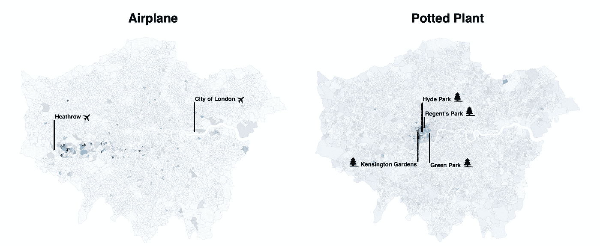*

***图 20** (左)在最近的伦敦机场附近拍摄的图像中，飞机密度与预期相符。(右图)同样，在最大的公园附近观察到盆栽植物的最大密度。*

## *YOLOv5 |限制和错误分类*

*对于我们定义为与骑车人道路安全相关的对象，错误分类的数量非常少。这是因为定义了 0.5 的高阈值来计数为检测，并且在 MS Coco 训练数据集中，最常见的对象是我们感兴趣的对象。*

*尽管如此，还是有一些物品一直被错误分类。最常见的是被检测为时钟的碟形卫星天线。根据角度的不同，臂状碟形天线很容易像一个时钟指针。在完整的 GSV 影像数据集中检测到 2750 个时钟(图 21)。其他较少表现的物体也被错误地识别。有时是因为它们的形状，另一些是因为它们的质地。前者的一个例子是探测船只而不是建筑集装箱，后者是探测长凳而不是栅栏。*

**

***图 21** 执行 YOLOv5 后发现的最常见的错误分类是检测到了时钟，而不是碟形卫星天线。*

# *项目路线图*

*图 22 详细描述了这个为期 5 个月的项目中采取的所有步骤。*

*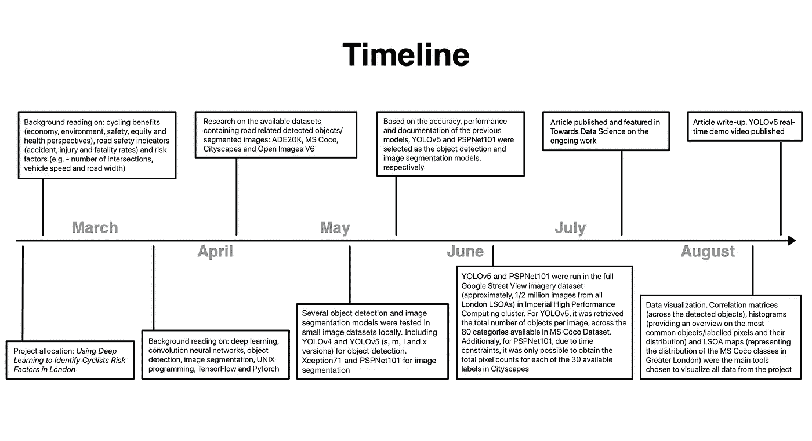*

***图 22** 项目路线图从 3 月份开始，到 8 月份提交。*

# *监督人*

*[马吉德·埃扎提](https://www.imperial.ac.uk/people/majid.ezzati) | [里基·纳特瓦尼](https://www.imperial.ac.uk/people/r.nathvani)*