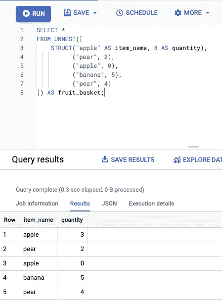
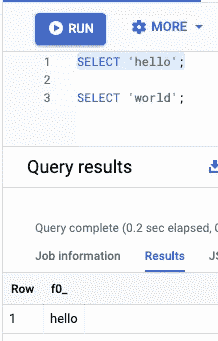
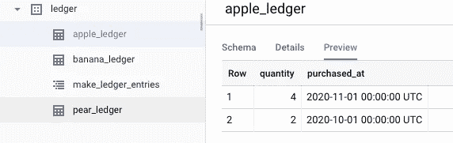

# 成为 BigQuery 超级用户

> 原文：<https://towardsdatascience.com/become-a-bigquery-power-user-94089b8cdef2?source=collection_archive---------29----------------------->

## 帮助你让这种野兽工作的 5 个技巧

BigQuery 是 Google 的分析数据库，它查询大型数据集的速度快得惊人，并且可以让你免费使用。在编写本报告时，处理的前 1TB 数据是空闲的，存储的前 10GB 数据是空闲的。在这篇文章中，我将向你展示一些技巧，告诉你如何充分利用这个神奇的系统。

[李坦](https://unsplash.com/@ktsfish?utm_source=medium&utm_medium=referral)在 [Unsplash](https://unsplash.com?utm_source=medium&utm_medium=referral) 上的照片

BigQuery 是一个分布式系统，它将分布式存储与一个计算集群结合在一起，该集群(通常)会向您的查询并行抛出 2000 个或更多的插槽(vCPUs)。使用这些提示来很好地利用这种力量。

# **提示#1:使用 Unnest** 动态生成测试数据

你会在文档中经常看到这种情况，但可能会让新读者感到困惑。

UNNEST[函数让您可以像查询一个表一样查询一个数组字段。数组的每个元素都成为表中的一行。如果数组包含基元类型，结果表将有一列。在下面的示例中，每个数组元素都是一个 STRUCT 字段，它转换为表中的列。](https://cloud.google.com/bigquery/docs/reference/standard-sql/query-syntax#unnest)

作者图片

# **提示 2:一次使用 CTE 和多个语句**

不要打开多个 BigQuery 控制台窗口，每个窗口都有自己的查询，而是在同一个控制台窗口中编写多个语句，并用分号分隔。您可以通过选择一个或多个查询并点击`RUN`来单独执行，或者不选择任何内容，然后一次性运行。

作者图片

公共表表达式(cte)对于充分利用 BigQuery 强大的多级聚合分析能力也非常有用。这涉及到 SQL `WITH`关键字来定义层内存中的临时表，这些表可以随意连接和选择。

# **提示 3:使用变量**

变量可以帮助您将文字分布在多个语句中，并使查询更容易重用。这对于在多个查询或公共表表达式(cte)之间保持日期范围过滤器非常有用。

# **提示#4:用户定义的函数**

除了已经嵌入 BigQuery 的许多[函数之外，您还可以](https://cloud.google.com/bigquery/docs/reference/standard-sql/functions-and-operators)[定义自己的临时或持久函数](https://cloud.google.com/bigquery/docs/reference/standard-sql/user-defined-functions)。函数可以用 SQL 或 Javascript 编写。后者对于从解析 JSON 到解码 URL 的任何事情都非常方便。让这些计算节点与您的自定义函数一起工作！

请记住，您不能导入模块，但可以引用存储在您的 Google 云存储桶中的库文件。

下面是两个 JS UDF 的例子，一个是利用存储在 GCS 中的库的持久函数，另一个是对数组进行集合操作的临时函数。

JS UDF 示例

# **提示 5:存储过程**

存储过程为您提供了脚本功能，允许您使用 if 和 while 语句控制执行流。

结果如下。很明显，这种能力对于数据转换和重构非常有用。

作者图片

# **结论**

BigQuery 是一个非常强大的数据仓库和分析工具。

*   使用 BigQuery 来利用 SQL 强大的数组和结构类型
*   使用 UNNEST 将数组和结构转换成表
*   将 CTE 用于多级聚合，或者代替高度嵌套的查询，并将多条语句组合在一起执行
*   使用变量来参数化查询或在连续查询之间传递数据
*   使用用户定义函数(UDF)使您的查询片段可重用，或者在查询中利用 JavaScript 的强大功能
*   存储过程可以使常见任务易于重复，并避免代码重复。

它会变得越来越好，所以请关注这个空间，获取更多有用的提示。