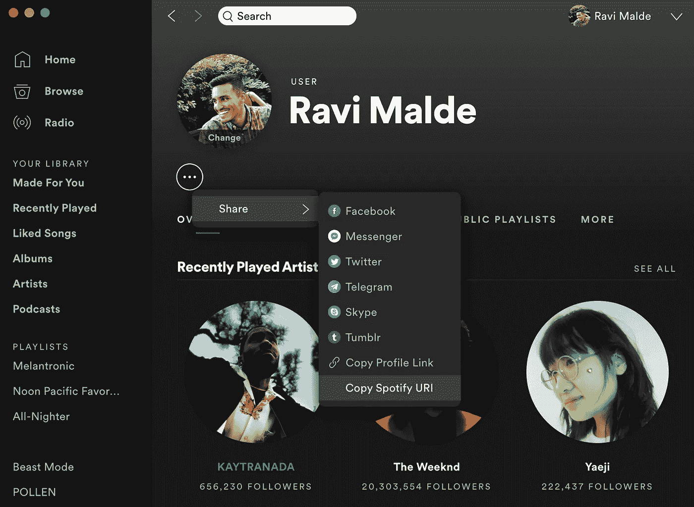

# 成为抒情天才

> 原文：<https://towardsdatascience.com/become-a-lyrical-genius-4362e7710e43?source=collection_archive---------17----------------------->

## 使用 Spotify 和 Genius APIs 抓取您的 Spotify 播放列表歌词。

照片来源:马尔特·温根([https://unsplash.com/photos/PDX_a_82obo](https://unsplash.com/photos/PDX_a_82obo)

不幸的是，我不会说唱或写歌，因此我不能教你如何成为那种抒情天才。我擅长的是向你展示如何使用 Spotify 和 Genius APIs 从你最喜欢的 Spotify 播放列表中获取歌词，并从一些网络抓取中获得一点帮助。除了我在这里概述的方法之外，还有很多其他的方法，但是这是我发现的为数不多的免费且可靠的方法之一。代码的一些部分受到了 Will Soares 在 DEV Community 上写的一篇文章的启发，所以如果你觉得这很有用，请点击这里的[并表示赞赏。](https://dev.to/willamesoares/how-to-integrate-spotify-and-genius-api-to-easily-crawl-song-lyrics-with-python-4o62)

下面是我创建的 Python 类，`GetLyrics`，已经准备好了，可以让你自己试用。只需插入 Spotify 和 Genius APIs 的个人凭据，以及 Spotify 用户和播放列表 id(本文下一节将介绍如何获取所有这些信息)，就可以开始了。

从上面的代码片段中可以看到，我们可以在一个列表中得到整个播放列表的歌词，`song_lyrics`，只需要两行代码。很好。

# 获取我们的类参数

我们需要做的第一件事是收集我们所有的输入(`GetLyrics`类参数)。为了初始化这个类，我们需要 5 样东西:

1.  Spotify 客户端 ID
2.  Spotify 客户端机密
3.  Spotify 用户 ID
4.  Spotify 播放列表 ID
5.  Genius 授权密钥

## Spotify 客户端凭据

如果你还没有注册，那么你需要在 Spotify 上注册一个开发者账户。假设你有一个个人 Spotify 账户，你所需要做的就是导航到 [Spotify 开发者仪表盘](https://developer.spotify.com/dashboard/login)并使用你的 Spotify 账户详细信息登录。

登录仪表板后，您需要创建一个应用程序。即使你没有真正地*创建一个应用程序，为了获得你的 API 证书，这也是必需的。给应用程序一个令人兴奋的名字和描述，并勾选所有适用于“你在构建什么？”问题。*

应用程序现在应该在您的仪表板上，所以让我们导航到它的页面，并注意客户端 ID 和客户端密码。这些是我们发出请求时需要的 API 凭证。

## Spotify 用户和播放列表 id

我们还需要一些与 Spotify 相关的东西。为了告诉 Spotify API 我们对哪个播放列表感兴趣，我们需要为创建播放列表的用户获取一个 Spotify URI，为播放列表本身获取一个。这是通过导航到用户主页*和*到播放列表，点击三个点，然后点击“分享”——从那里你可以将 Spotify URI 复制到你的剪贴板。

## Genius 授权密钥

我们还需要在 [Genius API 文档](https://docs.genius.com/)页面点击“授权 Genius ”,创建一个 Genius 帐户。登录后，页面右侧应该会有一个授权代码。

# 分解类

现在我们已经得到了所有的输入，希望您已经能够自己尝试使用`GetLyrics`类，我将提供该类中每个方法的分解，这样您就可以放心地使用这段代码，并修改/改进它以适合您的特定用例。

## 初始化类属性

和 Python 中的大多数类一样，我们从一个构造函数方法开始初始化我们的类属性，这样它们就可以在下面的方法中使用。

## 获取播放列表信息

上面的方法使用 [Spotipy](https://spotipy.readthedocs.io/en/2.12.0/) 库连接到 Spotify API，并返回一个 JSON 对象，该对象包含我们感兴趣的 Spotify 播放列表的大量信息。

## 获取曲目名称和艺术家

在这两个方法中，我们遍历 JSON 对象来查找播放列表中每首歌曲的名称和艺术家。然后将它们存储并返回到两个列表中，供后面的方法使用。

## 连接到 Genius API

这个方法使用`Requests`库通过我们的授权密钥连接 Genius API。然后，它检查 API 中是否有与给定曲目名称和艺术家相匹配的内容。它返回一个包含与这些匹配相关的所有信息的响应对象。

## 筛选匹配项并获得歌曲的网址

在这里，我们对前面方法中返回的 JSON 对象进行解码，然后检查哪个“hit”与艺术家姓名完全匹配。如果找到匹配，则意味着该歌曲存在于 Genius API 中，并且该曲目的信息现在存储在`remote_song_info`对象中。Genius API 不包含每首歌曲的歌词，但是它包含一个 URL，该 URL 会路由到包含歌词的网页。在下面的代码片段中，我们解析`remote_song_info`对象来查找每首歌曲的 URL。

## 网络抓取歌词

最后，我们现在可以得到一些歌词了！这个方法再次使用`Requests`库来请求在前面的方法中获得的歌曲 URL。然后我们使用`BeautifulSoup`来解析 HTML。我们两次调用`.find()`函数的原因是因为我发现 Genius 网页的结构有时会有不同的格式。大多数情况下，歌词包含在带有`class="lyrics”`的`div`元素中，但有时会变成`class="Lyrics__Container..."`。我加入了一个最终的`elif`条件，如果两个歌词对象都是`NoneTypes`，那么`lyrics`对象将被设置为`None`。这种情况很少发生，但这是由于在请求一首歌曲的 URL 时出现 404 错误，可能是因为该 URL 不再存在，但尚未从 API 中删除。

## 将所有东西包装在一起

最后，这个方法通过依次执行每个方法将所有内容联系在一起，这意味着我们只需两行代码就可以得到我们的歌词。它还有一系列的打印语句来使方法变得冗长，这样您就可以在它执行时跟踪它的进度。

> 我希望这篇文章对你有用。请在您自己的工作中随意使用这些代码，如果您有任何改进的建议，我很乐意在下面听到它们。感谢您的阅读！