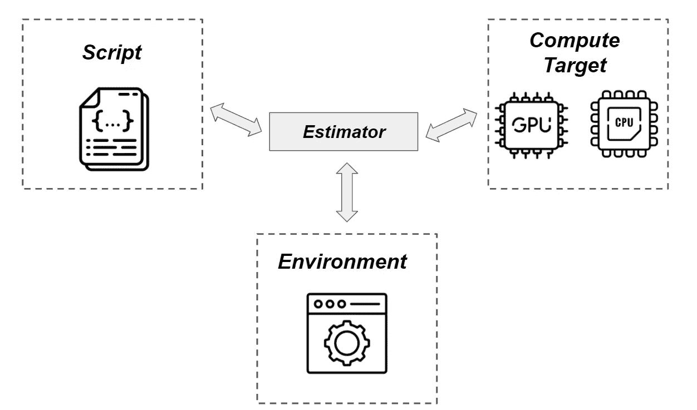
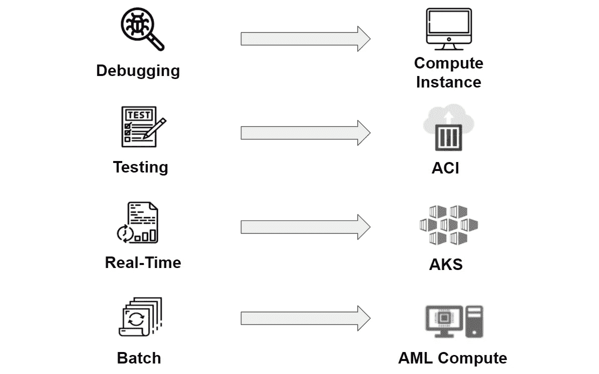

# 成为一名机器学习工程师(从你的 Jupyter 笔记本里面)

> 原文：<https://towardsdatascience.com/become-a-machine-learning-engineer-from-inside-of-your-jupyter-notebook-76a42b65c8f4?source=collection_archive---------37----------------------->

## [实践教程](https://towardsdatascience.com/tagged/hands-on-tutorials)

## 管理基础架构，培训您的模型并部署它们。

照片由[卡勒姆·威尔](https://unsplash.com/@callumlwale?utm_source=medium&utm_medium=referral)在 [Unsplash](https://unsplash.com?utm_source=medium&utm_medium=referral) 上拍摄

如果这听起来像是你的梦想，让我告诉你，这听起来也像是产品开发人员的梦想。结果:Azure ML SDK。

今天，我们将探讨如何处理云中的基础架构、环境和部署。我们将深入挖掘概念以及掌握这些技能所需的基础结构。

我知道概念本身可能感觉像空中楼阁。不过不用担心，会有足够多的代码让你觉得城堡其实就在地面上。

# 请给我上下文

如果我们谈论云提供商，有三个主要的参与者:AWS、GCP 和 Azure。谈到云计算，不难发现他们的主要客户之一是数据科学家。也许不是直接的他们，但是，惊喜！公司仍然是由人组成的。

照片由[附身摄影](https://unsplash.com/@possessedphotography?utm_source=medium&utm_medium=referral)在 [Unsplash](https://unsplash.com?utm_source=medium&utm_medium=referral) 上拍摄

所以，他们的策略很简单:让数据科学家的生活更轻松。
他们对此都有自己的方法，但今天我们将讨论 Azure。他们开发了 Azure Machine Learning，用它自己的话说就是，“[一个基于云的环境，你可以用来训练、部署、自动化、管理和跟踪 ML 模型。](https://docs.microsoft.com/en-us/azure/machine-learning/overview-what-is-azure-ml)

# 成为一名机器学习工程师

自动化、配置、管理和部署机器学习模型可能是数据科学家的噩梦。正因为如此，对能够填补这一缺口的人的需求增加了。

如果除了模型训练技能之外，你还能处理基础设施，你就离成为机器学习工程师更近了一步。如果你有兴趣跳到这个新角色，与 Azure 机器学习合作可以促进你的转变。

> 你与所有云基础设施的交互都可以通过 Python SDK 来完成，在你的 Jupyter 笔记本中编写代码会给你第一次做探索性数据分析时的感觉。

妮可·沃尔夫在 [Unsplash](https://unsplash.com?utm_source=medium&utm_medium=referral) 上的照片

# Azure ML 概述

这听起来很棒，但是它是如何工作的呢？大致来说，有三种方式可以让你与 Azure 机器学习互动:使用浏览器、Azure CLI 和 Python SDK。正如你可能已经预料到的那样，我们将使用后者。

Azureml 包的功能被分成不同的模块。如果您想要执行一个动作，您只需要调用正确的模块并添加您的输入(这将非常直观)。一次非常美妙的经历。

> 注意:如果你想在你的 Azure Machine Learning 工作空间中设置一个实例并打开一个 Jupyter 笔记本，请访问下面的帖子。

 [## Azure 机器学习服务中的数据版本控制

### 读完这篇文章后，你会明白 Azure ML 是如何处理数据的，MLOps 是如何关联的，并学习如何通过…

towardsdatascience.com](/data-versioning-in-azure-machine-learning-service-acca44a3b3a1) 

[资源](https://docs.microsoft.com/en-us/azure/azure-resource-manager/management/overview)是 Azure 内部结构的一部分。例如，如果您要创建一个工作空间，您只需要使用 *Workspace.create()* 函数导入工作空间模块，并设置参数。

> 注意:我知道脚本不在。ipynb 格式。但是我认为。py 格式看起来更干净。我希望这个细节不会让您远离真实的体验:您应该在您的 Jupyter 笔记本中编写代码。

实验意味着封装你的 ML 任务。这是一个很好的方法来分离你不同的假设并测试它们。那么，需要创建一个实验吗？同样，如果你试着猜怎么调用这个模块，我相信你会猜对的。

照片由[路易斯·里德](https://unsplash.com/@_louisreed?utm_source=medium&utm_medium=referral)在 [Unsplash](https://unsplash.com?utm_source=medium&utm_medium=referral) 上拍摄

这两个例子只是让你看看用 Azure 对话有多简单。但是今天，我们将谈论基础设施。在第一部分，我们将创建我们的基础。理解评估者是什么以及他们如何与脚本、环境和计算集群交互，将为我们到达山顶做好准备:部署。

为了探索这个主题，我们将首先访问最常见的部署类型。获得这些知识将教会我们如何为我们的需求选择正确的 Azure 服务。最后，您会惊讶地发现部署您的模型是如此简单。

# 评估者

评估者是计算目标的抽象。您有许多选项来管理评估者内部的环境。要使用它们，您必须设置不同的参数，但最重要的参数如下:

1.  **脚本**:可以直接指向存放所有模型训练代码的文件。
2.  **计算目标**:这些人将处理您为工作负载定义的工作。
3.  **环境配置**:您可以用不同的方式定义环境参数。因此，所有不同方法的共同点是，您需要选择哪种框架是处理您的工作负载所必需的。

图片作者。Flaticon 引用: [1](https://www.flaticon.com/free-icon/file_2580336?term=script&page=1&position=2) 、 [2](https://www.flaticon.com/free-icon/web-browser_3716486?term=configuration&page=1&position=9) 、 [3](https://www.flaticon.com/free-icon/cpu_543316?term=cpu&page=1&position=13) & [4](https://www.flaticon.com/free-icon/gpu_2586195?term=gpu&page=1&position=2) 。

这三个人为我们提供了多种选择。如果你学会如何将它们结合起来，你将成为一名全能的机器学习专家。

# 这在现实生活中是如何实现的？

假设您领导一个预测客户流失的项目。该团队使用随机森林分类器基于 scikit-learn 构建了一个完整的项目。由于您的模型不是深度学习模型，因此您选择了 CPU 计算目标。
您的计算目标配置应该如下所示:

这一次，我们选择了一台针对数据库工作负载进行优化的虚拟机。如果您的项目需要其他规格，[在这里](https://docs.microsoft.com/en-us/azure/machine-learning/concept-compute-target#supported-vm-series-and-sizes)您可以找到可用的选项。

Azure 计算集群的一个很酷的特性是，默认情况下，它们会根据提交的作业数量进行伸缩。这将导致不可思议的成本优化！。

对我们的随机森林来说足够好了，你不觉得吗？但是不要忘了我们的估算师！

> 注意:您必须确保数据和脚本在给定的目录中。

SKLearn 是一个预定义的估计器，配备了您最可能需要的标准软件包(pandas、numpy 和 scikit-learn 等)。正如您所看到的，您的模型将在特定的条件下进行训练，您可以在任何您认为合适的时候重新训练它，而不用担心再现性条件。

# 让自己适应变化

如你所知，生活就是改变。机器学习也是关于改变的。有时您的模型会过时，您将没有其他选择，只能调整您的基础设施以适应这些新的需求。

如果你的团队决定使用 Tensorflow 尝试一种新的深度学习模型会怎样？如果这变得更加真实会怎样:经过一些测试，他们已经意识到，事实上，新的模型比你的旧随机森林更好。不要惊慌失措。如你所见，你的工作可以简化为改变一些参数。

托尼克在 [Unsplash](https://unsplash.com?utm_source=medium&utm_medium=referral) 上拍摄的照片

您需要一个新的环境，您必须指向一个不同的脚本，并且您必须为一个 GPU 计算目标更改 CPU。不要生气。你需要对你的剧本做些小改动。

您只需更改虚拟机大小，就可以调配更好地满足您需求的新集群。很棒吧？别担心，我不会忘记评估部分。

如您所见，我们可以使用 TensorFlow 估计器来训练该模型，它也可用于快速设置。此外，我们可以指定框架版本，这对于避免兼容性版本错误非常有用。

此外，我们引用新的 GPU 计算目标，并将引用更改为新的脚本。太棒了。你完了！我甚至不愿去想这样的改变在过去意味着多少工作量。但是现在，它只是几行代码。

# 最后一个评估示例

在上一节中，我们通过指定 Azure 为我们提供的预配置选项来更改框架。但是，如果我需要的软件包在这些预配置的环境中不可用，会发生什么情况呢？

轻松点。您可以使用 Conda 或 PiPy 规范创建和注册环境。如果你想更深入地了解环境，请点击这里:

 [## Azure 机器学习的可复制环境

### 甚至不知道如何创建 docker 文件

towardsdatascience.com](/reproducible-environments-by-azure-machine-learning-34a74772c38b) 

在下面的代码中，您可以看到一个更加定制化的环境是如何工作的。在这个场景中，我们还需要两个包，Boruta 和一个新版本的 scikit-learn。剩下的代码片段对您来说应该很熟悉。

难以置信！现在，您知道了如何创建自己的定制环境，以及如何自动扩展计算目标。但是，我们不会就此止步。投产是我们的下一站。

# **部署**

在这一部分，我们将达到我们一直期待的戏剧性的高潮:模型部署。如你所知，如果一个东西不能发射，它也不能使用。学习这些概念会为你打开新的视野。管理您认为是 Linux 或 Kubernetes 专家专有的服务，现在对您来说已经变得更加容易了。

蒂姆·莫斯霍尔德在 [Unsplash](https://unsplash.com?utm_source=medium&utm_medium=referral) 上的照片

# 异步实时与同步批量评分

如果您正在考虑项目的需求，第一个区别是至关重要的。实时 web 服务是这样一种类型，它期望相对较小的批量有较快的响应时间。另一方面，批量评分期望较大的批量和较慢的响应时间。

第一个例子可能是 Uber Eats 为您的递送进行的到达时间估计。他们不知道你何时何地会向他们要食物，所以他们无法做好准备。他们一收到订单就必须处理你的信息。

对于后者，可以考虑邮寄定向优惠。他们不需要期待某个特定事件的发生来决定是否给你折扣。他们可以处理大量的信息，并随时向你发送报价。

# 为什么这种区别如此重要？

因为，根据微软[文档](https://docs.microsoft.com/en-us/azure/machine-learning/how-to-deploy-and-where?tabs=azcli)，根据用例，你应该选择一个或另一个 Azure 服务进行部署。Azure 机器学习可以用四种不同的方式处理部署:

1.  **本地 web 服务:**如果您正在调试或者对您的模型进行一些基本的测试，您可以选择在一个计算实例中部署您的模型。
2.  **Azure Container Instance(ACI)**:当您只想测试您的模型是否持续地抛出合理的值时，这个服务非常适合。它适用于需要不到 48gb RAM 的基于 CPU 的低规模工作负载。如果您的概念验证场景得到了足够的控制，那么这是测试服务是否响应良好的一个好选择。
3.  **Azure Kubernetes 服务(AKS)** :如果你正在为一个实时服务构建一个应用，你应该明确地使用这个服务。Kubernetes 的名声不是免费的:GPU 支持、灵活性和可伸缩性是他们的一些主要优势。但是你知道，灵活性总是要付出代价的。AKS 比其他服务需要更多的维护。
4.  **Azure Machine Learning Compute(AML)**:如果您要进行批量部署，解决方案是使用您用于模型训练的相同计算资源。

图片作者。微软& Flaitcon 参考资料: [1](https://docs.microsoft.com/es-es/azure/architecture/reference-architectures/containers/aks-microservices/aks-microservices) 、 [2](https://www.flaticon.com/free-icon/batch_1792305?term=batch&page=1&position=1) 、 [3](https://www.flaticon.com/free-icon/real-time_3043540?term=real%20time&page=1&position=1) 、 [4](https://www.flaticon.com/free-icon/test_2916315?term=testing&page=1&position=3) 、 [5](https://www.flaticon.com/free-icon/debugging_1541504?term=debugging&page=1&position=4) & [6](https://www.flaticon.com/search?word=compute) 。

# 够概念！我想现在就部署我的模型！

好吧，如果你现在这么兴奋，你应该得到一个好的结局。

训练完模型后，注册它是非常重要的。注册模型是一个很好的实践的原因有很多:旧模型的可再现性，跟踪您过去的模型度量，或者简单地通过它的版本调用模型。

但我现在提出这个问题是有原因的。我们将用来部署模型的方法使用注册的模型作为输入。我将向您展示“[无代码部署](https://docs.microsoft.com/en-us/azure/machine-learning/how-to-deploy-no-code-deployment)”选项，它支持特定的框架。对我们来说，好消息是 scikit-learn 模型得到了支持。

是啊！就这么简单。

使用带有几个参数的 *Model.deploy()* 是配置部署的最简单方法。在这种情况下，模型将在 Azure 容器注册中心注册。您可以使用 *service.run()，*调用您的服务，如果您更喜欢分类器的整数输出，那么会提供一个参数。否则， *predict_proba* 输出将是默认选项。

正如我之前向您解释的那样，还有其他方式来部署您的服务，使用这些方式(AKS、AML 计算)将需要提供一些额外的配置。

但我很确定最后一个要点让你大吃一惊，所以我们今天不会讨论其他选项，以便给你时间恢复(如果你支持，我们可以这样做)。

最棒的是，你可以在 Jupyter 笔记本上做任何事情！。

# 回头见！

今天够了。如果你到了这一步，我希望这能帮助你在你的云游戏中前进。如果你想处理端到端的机器学习项目，这样做是必不可少的。希望很快见到你！

# 参考

[1]由于这项技术是由 Azure 开发的，我将代码片段基于它们的文档，你可以在这里找到。

[2]这本书[掌握 Azure 机器学习](https://www.amazon.com/Mastering-Azure-Machine-Learning-end-ebook/dp/B07R53PCZC/ref=cm_cr_arp_d_product_top?ie=UTF8)对一些细节的结构化澄清很有启发。我真的依赖那本书来创造这些内容。我要感谢 Christoph krner 授权我发表这篇博客，并为此付出了时间。如果你想更好地理解 Azure 机器学习，我真的鼓励你去读那本书。

 [## 掌握 Azure 机器学习

### 如今数据量的增长需要分布式系统、强大的算法和可扩展的云…

www.packtpub.com](https://www.packtpub.com/product/mastering-azure-machine-learning/9781789807554) 

我也在 [Linkedin](http://www.linkedin.com/in/maletelier) 和 [Twitter](https://twitter.com/maletelier) 上。我很乐意与你交谈！如果你想多读一点，看看我最近的一些帖子:

 [## 想成为 Azure 数据科学家助理(DP-100)吗？让我们

### 读完本文后，您将对云认证和 DP-100 有更深刻的理解

towardsdatascience.com](/thinking-about-becoming-an-azure-data-scientist-associate-dp-100-lets-32f8766df21e)  [## 具有两个以上特征的聚类？尝试用这个来解释你的发现

### 使用 Plotly 的 line_polar 将向我们展示一种令人兴奋的聚类解释方法。此外，我们将看到…

towardsdatascience.com](/clustering-with-more-than-two-features-try-this-to-explain-your-findings-b053007d680a)