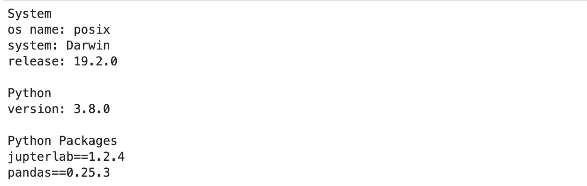
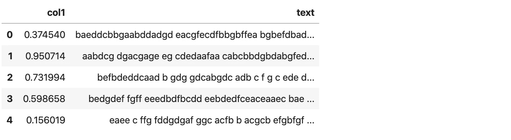
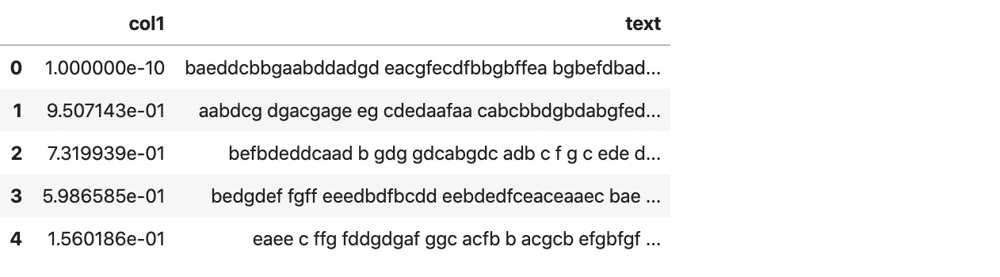
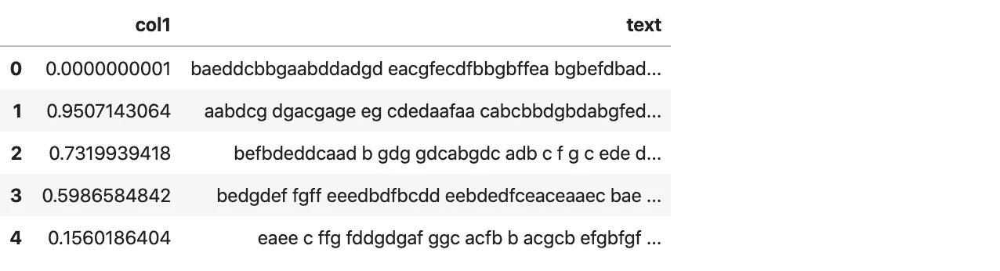
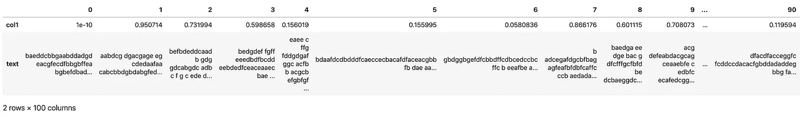
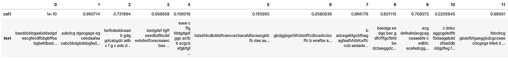
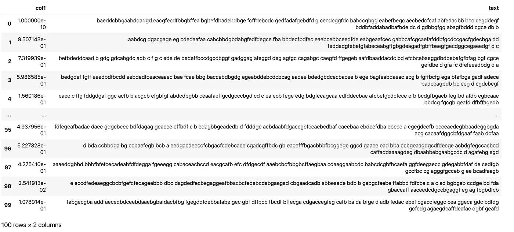
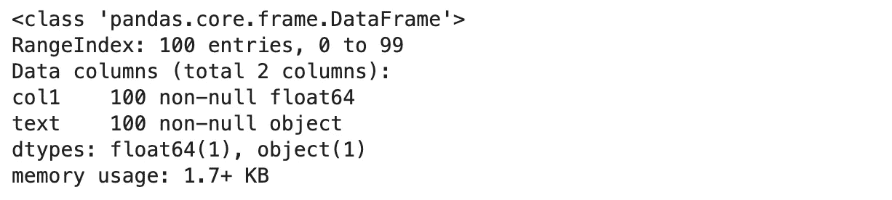

# 为熊猫超级用户显示自定义

> 原文：<https://towardsdatascience.com/become-a-pandas-power-user-with-these-display-customizations-6d3a5a5885c1?source=collection_archive---------16----------------------->

## 熊猫展示定制是熊猫经常被忽视的一部分。许多用户不知道他们可以自定义与显示相关的选项。


pandas 有一个选项系统，可以让你定制它行为的某些方面，与显示相关的选项是用户最有可能调整的。

熊猫展示定制是熊猫经常被忽视的一部分。对于大多数用户来说，缺省值已经足够好了，但是许多用户不知道显示定制，他们会找到一些替代的麻烦方法来克服它们。要成为熊猫专家，你至少应该知道显示器定制选项。

**这里有几个你可能会感兴趣的链接:**

```
- [Labeling and Data Engineering for Conversational AI and Analytics](https://www.humanfirst.ai/)- [Data Science for Business Leaders](https://imp.i115008.net/c/2402645/880006/11298) [Course]- [Intro to Machine Learning with PyTorch](https://imp.i115008.net/c/2402645/788201/11298) [Course]- [Become a Growth Product Manager](https://imp.i115008.net/c/2402645/803127/11298) [Course]- [Deep Learning (Adaptive Computation and ML series)](https://amzn.to/3ncTG7D) [Ebook]- [Free skill tests for Data Scientists & Machine Learning Engineers](https://aigents.co/skills)
```

*上面的一些链接是附属链接，如果你通过它们进行购买，我会赚取佣金。请记住，我链接课程是因为它们的质量，而不是因为我从你的购买中获得的佣金。*

**要升级你的熊猫游戏，请阅读:**

[](https://medium.com/@romanorac/pandas-data-analysis-series-b8cec5b38b22) [## 熊猫数据分析系列

### 从提示和技巧，如何不指南到与大数据分析相关的提示，熊猫文章的精选列表。

medium.com](https://medium.com/@romanorac/pandas-data-analysis-series-b8cec5b38b22) 

# 设置

```
import os
import platform
from platform import python_versionimport jupyterlab
import pandas **as** pd
import random**print**("System")
**print**("os name: %s" **%** os**.**name)
**print**("system: %s" **%** platform**.**system())
**print**("release: %s" **%** platform**.**release())
**print**()
**print**("Python")
**print**("version: %s" **%** python_version())
**print**()
**print**("Python Packages")
**print**("jupterlab==%s" **%** jupyterlab**.**__version__)
**print**("pandas==%s" **%** pd**.**__version__)seed **=** 42
random**.**seed(seed)
pd**.**np**.**random**.**seed(seed)
```



让我们定义数据集。它有 100 行和 2 列:

*   col1 具有 0 和 1 之间的随机数，
*   col2 有由 200 个字符组成的随机句子。

```
**def** **generate_sentence**(n_chars**=**200):
    **return** ''**.**join(random**.**choice('abcdefg ') **for** _ **in** range(n_chars))n **=** 100
df **=** pd**.**DataFrame(
    {
        "col1": pd**.**np**.**random**.**random_sample(n),
        "text": [generate_sentence() **for** _ **in** range(n)]
    }
)
df**.**shape(100, 2)
```



# 压制科学符号

默认情况下，pandas 用科学(指数)记数法显示小数字和大数字。如果科学记数法不是您的首选格式，您可以用一个命令禁用它。

让我们用一个小数字替换 col1 中的第一个值。熊猫被迫用科学记数法显示 col1，因为数字很小。

```
df**.**iloc[0, 0] **=** 1e-10df**.**head()
```



使用 float_format，我们可以设置想要显示的小数位数(在下面的例子中是 10)。

```
pd**.**options**.**display**.**float_format **=** '{:,.10f}'**.**formatdf**.**head()
```



使用 reset_option 命令，我们将其重置回科学记数法。

```
pd**.**reset_option('display.float_format')
```

# 要显示的最大列数/行数

当处理更大的数据集时，我们注意到 pandas 并不显示所有的列或行。显然，这是出于性能原因。虽然我不介意隐藏行，但是看不到所有的列(默认限制是 20 列)会令人沮丧。

让我们将行转换为列，以便直观地了解问题。

```
df**.**T
```



现在，让我们将最大列数设置为 100。

```
pd**.**set_option("display.max_columns", 100)df**.**T
```



要重置最大列数显示，我们可以将其设置回 20。

```
pd**.**set_option("display.max_columns", 20)
```

Pandas 还有一个 get 选项可以查看，这个值是当前设置的。

```
pd**.**get_option('display.max_columns')20
```

对于行，我们可以用 display.max_rows 做同样的事情。

# 扩展列宽

通常，在处理文本数据时，由于字符串的长度，字符串只能部分可见。Pandas 使我们能够用 max_colwidth 选项增加列宽。

```
pd**.**set_option('max_colwidth', 500)
```



# 数据帧信息

我相信您熟悉 describe 函数，它输出数据帧中每一列的汇总统计数据。info 选项类似于 meta describe 函数，因为它输出数据帧的元数据，如数据类型、非空对象和内存使用情况。

这在处理大型数据集时非常有用。

```
pd**.**set_option('large_repr', 'info')df
```



```
pd**.**reset_option('large_repr') # reset it
```

# 结论

这些是最常用的熊猫显示定制。如果你想了解更多关于显示定制的信息，请阅读 pandas 文档的[选项和设置](https://pandas.pydata.org/pandas-docs/stable/user_guide/options.html)部分。

# 在你走之前

在[推特](https://twitter.com/romanorac)上关注我，在那里我定期[发关于数据科学和机器学习的推特](https://twitter.com/romanorac/status/1328952374447267843)。


照片由[Courtney hedge](https://unsplash.com/@cmhedger?utm_source=medium&utm_medium=referral)在 [Unsplash](https://unsplash.com/?utm_source=medium&utm_medium=referral) 上拍摄