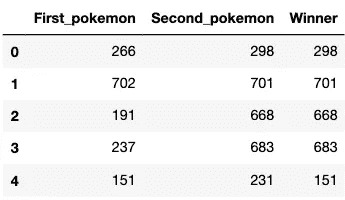
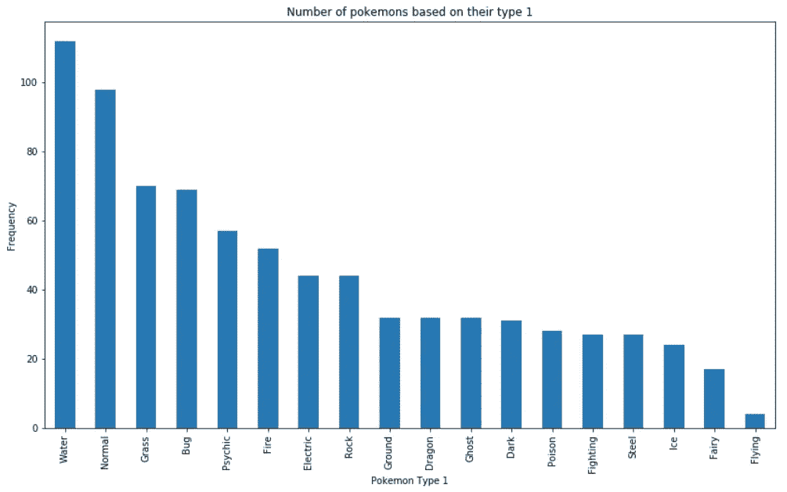
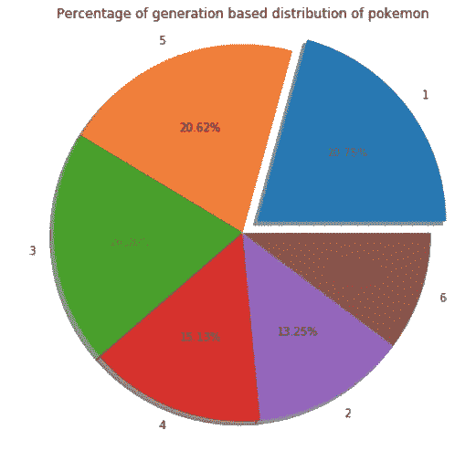
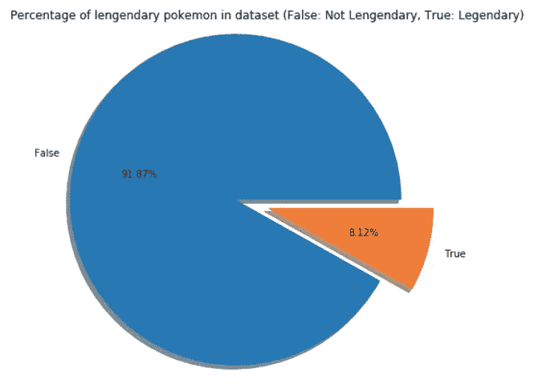
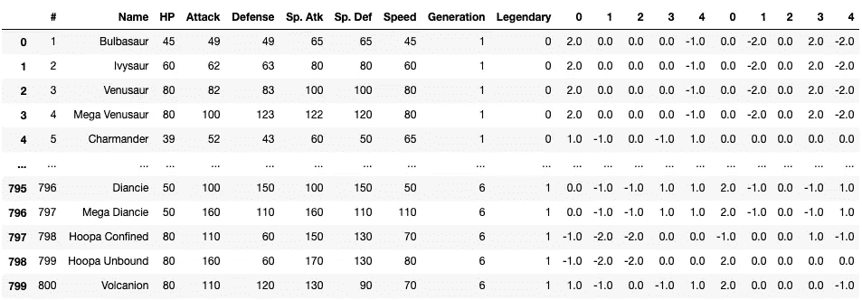
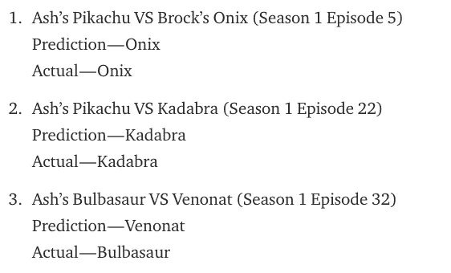

# 通过机器学习成为神奇宝贝大师

> 原文：<https://towardsdatascience.com/become-a-pok%C3%A9mon-master-with-machine-learning-f61686542ef1?source=collection_archive---------25----------------------->

## 能否借助机器学习预测口袋妖怪之战的赢家？


[口袋妖怪公司保留所有权利](https://upload.wikimedia.org/wikipedia/commons/thumb/9/98/International_Pok%C3%A9mon_logo.svg/1200px-International_Pok%C3%A9mon_logo.svg.png)

如果你是 90 年代的孩子，你一定看过口袋妖怪。你喜欢强大的口袋妖怪战斗吗？好吧，我做到了。
作为一名人工智能开发者和口袋妖怪粉丝，我想到了建立一个可以预测口袋妖怪战斗获胜者的机器学习模型。


[来源:男高音](https://media1.tenor.com/images/84c5b716f0f747acc57a8176e3e6affd/tenor.gif?itemid=4444793)

> **这个故事也将引导你:
> 1。构建机器学习模型
> 2。构建 ML 模型时需要的基本步骤。**

*参考消息:神奇宝贝是日本原版口袋妖怪的简称*

下面是我找到并用来建立机器学习模型的口袋妖怪数据集。
[https://www.kaggle.com/terminus7/pokemon-challenge](https://www.kaggle.com/terminus7/pokemon-challenge)

采取以下步骤来建立机器学习模型。

1.  数据探索
2.  数据预处理
3.  模型选择和培训
4.  预言；预测；预告

> *我已经添加了所有代码和各自的输出截图。也可以参考下面的 jupyter 笔记本。*

[https://github . com/kartikeya-Rana/pokemon _ battle/blob/master/pokemon . ipynb](https://github.com/kartikeya-rana/pokemon_battle/blob/master/Pokemon.ipynb)

```
# Import Librariesimport pandas as pd
import numpy as np
import matplotlib.pyplot as plt
from sklearn.model_selection import train_test_split
from sklearn.metrics import accuracy_score
from sklearn.ensemble import RandomForestClassifier
from sklearn.feature_extraction import FeatureHasher
from sklearn.metrics import classification_report# Load the datasetspokemon = pd.read_csv("pokemon.csv")  # Pokemon Dataset
combats = pd.read_csv("combats.csv")  # Combats Dataset
```

# 数据探索

先来看看口袋妖怪和格斗数据集的前五个词条。

```
print(pokemon.head())
```


```
print(combats.head())
```



口袋妖怪数据集是由不同的口袋妖怪和他们的能力组成的。
战斗数据集由两只口袋妖怪之间的战斗组成。
“#”号用于口袋妖怪数据集和战斗数据集之间的映射。

```
# Plot the number of pokemon present in each category of "type 1"ax = pokemon['Type 1'].value_counts().plot(kind='bar',
                                    figsize=(14,8),
                                    title="Number of pokemons based on their type 1")
ax.set_xlabel("Pokemon Type 1")
ax.set_ylabel("Frequency")
```



```
# Plot the number of pokemon present in each generation.generation =  dict(pokemon['Generation'].value_counts())
gen_counts = generation.values() # No of pokemon in each generation
gen = generation.keys()  # Type of generationfig = plt.figure(figsize=(8, 6))
fig.suptitle("Percentage of generation based distribution of pokemon")
ax = fig.add_axes([0,0,1,1])
explode = (0.1, 0, 0, 0, 0, 0)  # explode 1st slice
ax.axis('equal')plt.pie(gen_counts, labels = gen,autopct='%1.2f%%', shadow=True, explode=explode)
plt.show()
```



```
# Plot the number of legendary and non-legendary pokemongeneration =  dict(pokemon['Legendary'].value_counts())
gen_counts = generation.values() 
gen = generation.keys()fig = plt.figure(figsize=(8, 6))
fig.suptitle("Percentage of lengendary pokemons in dataset (False: Not Lengendary, True: Legendary)")
ax = fig.add_axes([0,0,1,1])
explode = (0.2, 0)  # explode 1st slice
ax.axis('equal')plt.pie(gen_counts, labels = gen,autopct='%1.2f%%', shadow=True, explode=explode)
plt.show()
```



# 数据预处理

**1。处理丢失的数据**:在一个数据集中可能有几个点的值丢失。我们不能让这些地方空着。此外，我不想删除这些样本，因为这会减少我的数据集。
数值可填写该栏中的平均值、中值或最大值。

口袋妖怪数据集的列“类型 2”包含空点。这是一个分类列，因此，我可以用该列中最常见的值来填充缺少的值。
但我选择创建另一个名为 NA 的类别(不适用)。它就像“类型 2”专栏的任何其他类别一样。

```
pokemon["Type 2"] = pokemon["Type 2"].fillna("NA")
```

**2。分类值到数值**:机器学习模型对数字起作用。我们不能给它输入字符串或单词，因此我们必须将每个分类值转换成数值。

有几种方法可以做到这一点，如标签编码器，一个热编码器，功能哈希。

```
# Convert "Legendary" column, False is converted to 0 and True is converted to 1.pokemon["Legendary"] = pokemon["Legendary"].astype(int)
```

我使用 FeatureHasher 将列“Type 1”和“Type 2”转换成数值。FeatureHasher 还解决了由于 one-hot 编码而创建的大量列的问题(如果类别的数量非常大)。

```
h1 = FeatureHasher(n_features=5, input_type='string')
h2 = FeatureHasher(n_features=5, input_type='string')
d1 = h1.fit_transform(pokemon["Type 1"])
d2 = h2.fit_transform(pokemon["Type 2"])# Convert to dataframed1 = pd.DataFrame(data=d1.toarray())
d2 = pd.DataFrame(data=d2.toarray())# Drop Type 1 and Type 2 column from Pokemon dataset and concatenate the above two dataframes.pokemon = pokemon.drop(columns = ["Type 1", "Type 2"])
pokemon = pd.concat([pokemon, d1, d2], axis=1)
```

我们的口袋妖怪数据集被转换成一个新的数据集。



我将战斗数据集的数据与口袋妖怪数据集进行了映射，并创建了一个新的训练数据集。

新训练数据集的格式将为:

```
For each row in combat dataset:
    concatenate (data of First_pokemon, data of second_pokemon, winner)Winner = 0, if first pokemon wins, else, Winner = 1Data of each pokemon will have following columns (All columns except # and Name):
[HP, Attack, Defense, Sp. Atk, Sp. Def, Speed, Generation, Legendary, 0, 1, 2, 3, 4, 0, 1, 2, 3, 4] = 18 columns.
```

比如:
战斗的第[0]排是:
first_pokemon = 266，Second_pokemon=298，Winner = 298。

因此，根据上述算法，新数据行将是:

```
First_pokemon = [50, 64, 50, 45, 50, 41, 2, 0, 0.0, -1.0, -1.0, 1.0, 1.0, 1.0, 0.0, 1.0, 1.0, 1.0]Second_pokemon = [70, 70, 40, 60, 40, 60, 3, 0, 2.0, 0.0, 0.0, 0.0, -1.0, 2.0, 0.0, 0.0, 0.0, 0.0]Winner = 1concatenate(first_pokemon, second_pokemon, winner) = [50, 64, 50, 45, 50, 41, 2, 0, 0.0, -1.0, -1.0, 1.0, 1.0, 1.0, 0.0, 1.0, 1.0, 1.0, 70, 70, 40, 60, 40, 60, 3, 0, 2.0, 0.0, 0.0, 0.0, -1.0, 2.0, 0.0, 0.0, 0.0, 0.0, 1]Code:data = []
for t in combats.itertuples():
    first_pokemon = t[1]
    second_pokemon = t[2]
    winner = t[3]

    x = pokemon.loc[pokemon["#"]==first_pokemon].values[:, 2:][0]
    y = pokemon.loc[pokemon["#"]==second_pokemon].values[:, 2:][0]
    diff = (x-y)[:6]
    z = np.concatenate((x,y))

    if winner == first_pokemon:
        z = np.append(z, [0])
    else:
        z = np.append(z, [1])

    data.append(z)# Convert list to numpy array
data = np.asarray(data)
```

**3。将数据拆分成训练和测试:**将数据集拆分成训练和测试数据集。我们将使用一些数据来训练模型，并使用剩余的数据来测试模型。

```
X = data[:, :-1].astype(int) # Input features
y = data[:, -1].astype(int) # Output label (Winner column)X_train, X_test, y_train, y_test = train_test_split(X, y, test_size=0.25, random_state=42)
```

# 模型选择、训练和预测

我选择了随机森林分类算法来构建我的模型。

```
clf = RandomForestClassifier(n_estimators=500)
model = clf.fit(X_train,y_train)
pred = model.predict(X_test)
print('Accuracy of {}:'.format(name), accuracy_score(pred, y_test))
print(classification_report(y_test, pred))
```


> 准确率 94.76%。相当不错！


[来源:男高音](https://media1.tenor.com/images/93634e880600c52dea095b1b9562e33e/tenor.gif?itemid=15646320)

# 接下来我们可以做什么来提高我们的准确性？

1.  调整随机森林的“n 估计量”超参数。
2.  尝试不同的机器学习算法，如 SVM 的 AdaBoost。
3.  试着建立一个神经网络。
4.  做特征工程，即在现有数据的基础上创建新的数据点(列)，比如增加攻防比例，特殊攻击和特殊防御。

# 准备好一些口袋妖怪战斗了吗？

我看了口袋妖怪，用我的模型预测了战斗的赢家。



[来源:期限](https://media1.tenor.com/images/409981197c355f20a378431b5273683f/tenor.gif?itemid=15601536)

> 感谢您的阅读！继续学习！

*免责声明:口袋妖怪公司保留所有口袋妖怪角色。我不是在为口袋妖怪或口袋妖怪公司的内容做广告。*

[](https://www.buymeacoffee.com/kartikeyarana)