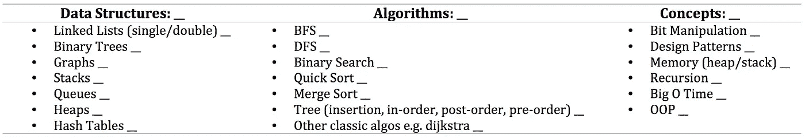

# 成为技术试听专家—第二部分

> 原文：<https://towardsdatascience.com/become-an-expert-at-the-technical-audition-part-ii-a337f979b88a?source=collection_archive---------32----------------------->

## 本周，我深入探讨了在面试准备中实施刻意练习的细节

照片由来自 [Pexels](https://www.pexels.com/photo/student-doing-homework-at-table-at-night-4384147/?utm_content=attributionCopyText&utm_medium=referral&utm_source=pexels) 的 [Kulik Stepan](https://www.pexels.com/@kulik-stepan-2564545?utm_content=attributionCopyText&utm_medium=referral&utm_source=pexels) 拍摄

在本博客系列的[第一部分](/become-an-expert-at-the-technical-interview-part-i-2f3db6273982)中，我讨论了将现场技术面试视为试听而非面试的想法，我们可以利用专业音乐人采用的练习技巧来确保我们的准备更高效，更有利于成功。

其中一种练习技巧是一种叫做*刻意练习*的方法，我将在这篇博客中深入探讨。请务必查看第三部分[,该部分概述了一个实施刻意练习的学习计划。](/a-study-plan-for-software-engineering-interviewees-b67914520489)

# 刻意练习

在第一部分，我提到了刻意练习的概念，这是安德斯·埃里克森博士创造的一个术语，被认为是许多人用来超越自己成为专家的一种方法。在这篇文章中，我将深入探讨什么是刻意练习，并建议你如何将刻意练习应用到你的技术试听准备中。

举例来说，我将把这个计划组织成一个软件工程面试(/audition)，并组织这个计划来解决 Gayle McDowell 的《破解代码面试书》中的主要话题。我在书中确定了 20 个主要话题，并将它们分为 3 个主要研究领域——你可以根据自己的需要调整列表。这 20 个主题的列表将在本文后面显示。

我还想先说一句，这个计划是一个“完美世界”计划——请记住，我们并不是生活在一个完美的世界里，你不可能总是完美地遵循一个计划——做好灵活的准备，并根据需要进行调整。

# 好吧，我同意——那么什么是刻意练习呢？

刻意练习是两件事的结合:

> **刻意练习=有目的的练习+专家指导**

所以，为了知道什么是刻意练习，我们需要理解这两个组成部分。让我们进一步细分这两个领域:

# 有目的的实践

有目的的练习由 4 个部分组成:

1.  具体，**目标**目标
2.  对特定时间段和任务的高度关注
3.  反馈
4.  频繁的操作在你能力的边缘

让我们深入探讨一下:

> **有目的的练习:**

1.  **具体、客观的目标:**

你会注意到我会在整篇文章中频繁使用“目标”这个词。这可以说是设定目标最重要的部分。你知道自己是否在进步的唯一方法是制定可衡量的目标。他们可能以二元方式来衡量:“正确”或“错误”，或者以评分系统来衡量:“1/10”为例。

来自 [Pexels](https://www.pexels.com/photo/green-typewriter-on-brown-wooden-table-4052198/?utm_content=attributionCopyText&utm_medium=referral&utm_source=pexels) 的[马库斯·温克勒](https://www.pexels.com/@markus-winkler-1430818?utm_content=attributionCopyText&utm_medium=referral&utm_source=pexels)的照片

为了能够设定你的目标，你需要了解你目前所处的位置——你的基线——以及你正在努力达到的位置——你的最终目标。

你的最终目标既大又广，因此我们需要将它分解为子目标，并对它们进行分类，使它们尽可能具体和客观。

比如说—

**最终目标:**

> 自信地成功完成现场面试。

哇哦。很宽泛，不太具体。

让我们思考一下如何在这里衡量成功，并得到更具体的。

要成功完成面试，你需要在你知道可以测试的 20 个话题上有能力。这 20 个话题可以分为 3 类(耶，现在我们开始具体了！).

因此，我们的最终目标现在变得更加具体，例如:

> 在测试的 20 个主题中获得能力。

这仍然不够具体——我们可以做得更好。比如，我们如何定义‘能力’？

**基线:**

为了确定从哪里开始以及如何构建我们的目标和学习计划，我们首先需要弄清楚我们现在对所有这些主题的立场。

请记住，我们正努力做到客观和可衡量。为了建立一个*基线*，请花些时间浏览每个主题，并在 1-3 的范围内对每个主题进行评分:

> 1 =我对此知之甚少，只能回答不到 20%的问题
> 
> 2 =我对此有些熟悉，可以回答大约 50%的问题
> 
> 3 =我对此非常有信心，可以回答至少 80%的问题

在这项任务中不要掺杂任何情绪。记住——这是客观存在的！

如果你的回答大多是 1，这个任务应该不会让你不知所措——这完全在意料之中！我们只需要建立一个基线。

> 保持客观！

我可能会这样组织:

**主题:**

将主题分类，并按 3 分制评分。(图片由作者提供)

创建一个表格，将 20 个主题按照它们的 3 个类别组织起来，并留出空间输入您的基线评分。请注意，我还在主题标题旁边放置了答案行——这是一个好主意，可以评定您对哪些类别最有信心/最没有信心。

通过我们的评级系统，我们现在已经找到了一种方法来使我们的目标更加具体和客观。

这样，我们的目标是在所有科目上都达到 3 级，因此，我们现在将“能力”定义为“达到 3 级”。每周，我们将对每个主题重新评分，以跟踪我们的进展。

太好了！我们现在已经建立了一个 ***目标*** 最终目标:

> 每个主题都达到 3 级。

接下来我们发现有目的的练习…

**2。强烈聚焦**

当我说面试准备中最困难的事情是不要被太多的话题淹没时，我是发自内心的。这就是为什么专注是一项需要磨练的关键技能。

照片由 SplitShire 从 Pexel。

高度集中包括对一个话题的隧道式关注，同时模拟“真实的面试环境”。

> 隧道视野焦点:

隧道视野焦点包括确保当你在研究一个话题时，它是你在学习期间头脑中唯一的事情。如果你在链表上工作，你**只**在专用时间内考虑链表(更具体地说，你只关注链表中已识别的问题区域——稍后会详细介绍)。试着忘记任何其他存在的话题。

> 模拟真实的面试体验:

模拟真实面试的真实环境是培训重点的一个重要部分。

在 COVID times，这实际上对我们来说更容易做到，因为你的面试地点几乎肯定是你学习的地方。

在音乐界，专业音乐人可能会预订他们试听的场地，用同样的房间、椅子和音响等来练习。作为真实的事件，或者至少，在练习的时候观想处在这个环境中。

除了模拟面试的物理环境，我们还需要训练大脑限制在面试时间间隔内。

如果你知道你的现场面试将持续 50 分钟，你应该以 50 分钟为间隔进行学习。这可以让你的大脑适应回答问题的时间框架和时间长度。不仅如此，大脑在更短的时间内更好地处理信息，让你始终保持专注。

我建议设置计时器，强迫自己在两次休息之间休息 10 分钟。我还建议为每次学习/练习设定小目标，因为这也有助于你每次坐在办公桌前时保持专注。

## 3.反馈

> 他。大多数。危急关头。部分。

对我们进展的反馈是我们决定下一步工作的方式。它驱动着我们的目标设定和每次学习的焦点。

反馈需要针对**特定的**。

照片由[驼鹿照片](https://www.pexels.com/@moose-photos-170195?utm_content=attributionCopyText&utm_medium=referral&utm_source=pexels)从[像素](https://www.pexels.com/photo/two-woman-and-one-man-looking-at-the-laptop-1036641/?utm_content=attributionCopyText&utm_medium=referral&utm_source=pexels)

例如，如果你对比特操作的理解很弱，你不知道的具体是什么？你有什么问题？路障在哪里？

如果你自己在识别困难的具体方面有困难，这就是你的“专家教练”的用武之地。

最有可能的是，你在 disposal⁴没有“技术教练”,所以我们需要在如何获得定期反馈方面更有创意一些。您的反馈将来自:

> 你自己-

将会有许多话题，你将能够自己确定你的不足之处，你将能够指出“啊，如果我知道*之类的*，我就能够克服这些”，因此你将接着去做*之类的事情。*

> 解决方案-

这将是你在学习期间的主要反馈来源。对于你做的每一道题，**详细研究解答**。突出显示解决方案中您弄错的部分，并深入探究**为什么**这是解决方案。

出于这个原因，我强烈建议不要做没有解决方案的问题——当然你可以尝试，但你将无法获得反馈(除非你有教练)。

很多人经常不做的事情其实很重要:**研究你答对的题的解答！**

如你所知，解决问题通常有很多方法，所以我们总能找到更好的方法。因此，检查一下你的解决方案是否是最佳方案(考虑时间和空间的复杂性)，如果是，把它储存在你的大脑里并记下来。如果解决方案与你的不同，并解释了为什么它可能更好，耶！你刚刚学会了一种新的做事方法，并对这个话题有了更深的理解。

希望不言而喻，以确保你得到你的解决方案从一个有点声誉的来源。你应该能够信任来自 LeetCode、HackerRank、破解代码书等平台的解决方案。如果你正在阅读论坛讨论的解决方案，请注意这些可能是非常固执己见的，并不是每个参与讨论的人都有资格发表评论，所以一定要核实论坛的建议和解决方案。

最后，理想情况下，找到详细说明“如何做”和“为什么”的完整解决方案。如果没有可用的解决方案，你可能需要用谷歌搜索来研究解决方案，并把事情拼凑在一起。这是一个更耗时的过程，但这通常会让你在这个过程中学到更多。

> 专家蔻驰-

这是刻意练习公式的第二部分，所以我将在下面的“专家蔻驰”部分谈论它！

## 4.经常在你能力的边缘操作:

把这想象成一种向前一步，向后两步的方法。

照片由[卡拉·缪斯](https://www.pexels.com/@karamuse?utm_content=attributionCopyText&utm_medium=referral&utm_source=pexels)从[派克斯](https://www.pexels.com/photo/young-female-extreme-lover-walking-on-edge-of-bridge-in-city-district-3833490/?utm_content=attributionCopyText&utm_medium=referral&utm_source=pexels)拍摄

致力于在你已经知道的和你不知道的边缘工作。这意味着研究你不理解的领域，并利用你所知道的知识来获得新的理解。

这在我们的理解中创造了凝聚力，意味着我们永远不会盲目地一个接一个地学习新的话题。做一些新的事情，同时重温前面的 2 个步骤/构建模块。

这个过程与反馈回路紧密相连。

我可以这样做:

记录下你所做的所有问题，并确保你将它们归类在相关的标题下。对于每个主题标题，有一列你答对的问题和一列你答错的问题。这里的目标是不断重新测试“错误”的问题，以便最终所有的问题都在“正确”的一堆。

**但是**，不要重考*题，除非你已经研究了*的解答，并进一步研究了那个问题区域→这是‘能力边缘的操作’部分。

一个切实可行的方法是一次做 3 个问题——1 个新问题和 2 个“错误”的旧问题。

最后，也是最重要的一点，为了持续了解你的能力优势在哪里，你需要按照我们之前提到的 3 分制对你的主题重新打分。我建议在每个周末做这件事。

即使你“知道”你没有取得任何进步，因为那一周你没有做太多的学习，重新评估仍然是重要的，因为很容易忘记你取得的一些小进步。也许只有一个题目改变分数， ***但那仍然是有形的，客观的进步。***

# 专家指导

专家指导比有目的的实践更能说明问题，然而在技术面试的背景下，这一点并不明确。要成为一名专业教练，

1.  一个人必须是他们领域的专家，并且在你的知识水平之上，
2.  他们需要能够发现需要改进的地方，并提供有效的、**客观的**反馈
3.  他们需要能够帮助培养心理表征

> 专家教练的主要作用是提供反馈。

不像运动员，舞蹈家，音乐家，软件工程师很少有 1:1 的教练！这就是我们必须在上面提到的反馈方法上有所创新的地方。把这些结合起来，充当你的“教练”。

> 寻找科技蔻驰:

如果你已经是这个领域的专业人士，并且和一群专家一起工作/社交，那么这就太棒了！找出你周围的人，他们在各自的领域表现出色，或者是你想去的地方(或者得到了你想要的工作)。

照片由 [Pexels](https://www.pexels.com/photo/man-in-gray-t-shirt-and-black-pants-holding-man-in-black-shorts-4752866/?utm_content=attributionCopyText&utm_medium=referral&utm_source=pexels) 的 [cottonbro](https://www.pexels.com/@cottonbro?utm_content=attributionCopyText&utm_medium=referral&utm_source=pexels) 拍摄

理想情况下，你需要一个善于沟通的人，当你要求反馈时，他不会拒绝你。这些人将会是你要与之进行模拟面试、阅读你的代码或讨论概念的人。如果有一个概念你不明白，让他们帮你指出题目的哪一部分是最大的空白。

如果你是这个行业的新手，你有两个选择:付费教练和有机教练。

你可以从类似[熟练](https://www.skilledinc.com/mentors)、[面试查询](https://www.interviewquery.com/coaching)等网站找到付费教练。

有机教练可以通过加入社区团体和定期参加聚会找到。这需要多一点时间(和信心)，但是不要害羞——问问团队中一个你认为“不错”的资深成员，他们是否愿意帮你检查一些代码或者进行一次模拟面试。人们比你想象的更乐于助人。

## 接收“建议”的注意事项:

我强烈建议你对选择谁做你的教练和听取谁的建议要挑剔。这适用于日常生活，不仅仅是科技！

当收到建议时，确保该人勾选以下三个***:***

1.  这个人必须是他们给出建议的领域的专家。
2.  这个人必须熟悉你的个人情况。
3.  你必须尊重这个人。

就我个人而言，我是按照这些标准生活的，每当有人抛出 advice⁵.时，我都会评估这三点这并不意味着如果某人没有勾选其中一个选项，你就无视他的观点，这只是意味着你会对他的建议有所保留。

但是我强烈建议你在评估谁会受到影响时记住这一点。尤其是在当今世界，每个人都有自己的观点⁶…

既然我们已经理解了刻意练习的方法，是时候把它们整合到学习计划中了！

查看这个博客系列的第三部分，看看我是如何将所有这些整合到一个针对软件工程面试者的具体[学习计划中的！](https://medium.com/@leana.m.critchell/a-study-plan-for-software-engineering-interviewees-b67914520489)

## 脚注

这里有一个很棒的[视频](https://www.youtube.com/watch?v=uoUHlZP094Q)(壮举。Ericsson)很好地总结了有意的实践。

我已经确定了 20 个与软件工程能力相关的主要话题，但是请根据你的需要调整、增加和减少话题！当然，如果你在为数据科学面试而学习，话题会有所不同。

不要误解我的意思，这说起来容易做起来难，一开始可能会是一项艰巨的任务——我自己也在为此奋斗！

⁴Although:这些越来越受欢迎，也越来越容易租到

⁵Don't 担心，讽刺我给建议给建议对我没有失去

⁶What:是他们说的关于[的意见](https://www.urbandictionary.com/define.php?term=Opinions%20Are%20Like%20Assholes.)吗？