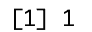
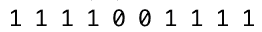
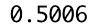
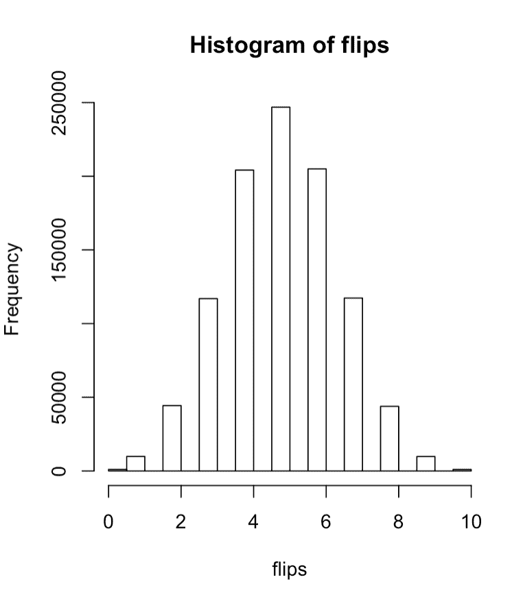

# 成为统计推断的大师

> 原文：<https://towardsdatascience.com/becoming-a-master-of-statistical-inference-230597498e07?source=collection_archive---------25----------------------->


图片来自 [Pixabay](https://pixabay.com/?utm_source=link-attribution&utm_medium=referral&utm_campaign=image&utm_content=2617145) 的 [StockSnap](https://pixabay.com/users/StockSnap-894430/?utm_source=link-attribution&utm_medium=referral&utm_campaign=image&utm_content=2617145)

# 推论的意义是什么？

推断是通过一些观察数据的样本得出关于更大人群的结论。例如，你有一些国家对总统的看法的样本，你想对大众做出一些结论。显然，你不会询问每一个公民，而是使用样本数据对潜在人群进行推断。

# 概率从何而来？

虽然推理是关键，但我们只能通过一些模型生成的数据进行推理；队列概率…概率用于从给定模型生成数据的过程。

为了以简单的方式将所有这些放在一起，请考虑以下内容:

观察/样本数据->模型->概率/数据生成->推理

# 经典的抛硬币和二项分布

是时候打破二项分布的魔力了。

掷硬币是帮助分解二项分布的经典例子。

就像我们刚才建立的一样，我们将创建一个模型，允许我们基于简单的抛硬币的想法来生成随机数据。

突击测验！任何给定的掷回正面或反面的可能性有多大？？你成功了！😉 50/50.

所以让我们跳到 R 来生成这种类型的实验。为此，R 中有一个很棒的函数叫做`rbinom`。我们将用它来模拟抛硬币。

在 R 中抛出下面的命令，看看会得到什么？第一个参数是“拉动”或运行的次数。想运行多少次就运行多少次，您会看到大约 50%的时间该函数返回 1，另外 50%返回 0。



把所有等于或大于 0.5 的都称为“正面”，我们第一次掷硬币是正面。我们再来一次，但是要 10 次。

```
rbinom(10,1,.5)
```



这次我们 80%的时候都是正面

如果你一遍又一遍地这样做，你会有 50%的机会接近头部。你也应该做越来越多的翻转。

查看给定翻转发生的时间百分比的好方法…

```
flips = rbinom(10000, 1, .5) mean(flips == 1)
```



几乎有一半的时间是正面。

现在让我们稍微改变一下。我们将在实验中抽取 100 万次，但这次每个实验将包括 10 次翻转，有 50%的可能性翻转 5 个头。

```
flips = rbinom(1000000, 10, .5)
```

当我们将`flips`传递给一个`hist()`函数时，我们得到如下结果:



大约 25%的时间里，你看到的是 5 次翻转。这个度量被称为该点的二项式密度。

模拟帮助我们回答关于分布及其行为的问题

# 累积密度

下一个概念是所谓的累积密度。类似于我们如何查看该点的二项式密度，我们可以查看该点及其上下的密度，代表累积计算。

让我们像前面一样分解同一个例子…通过声明翻转必须小于或等于 5 而不是等于 5，我们的代码对大约 50%的人群评估为真。

```
flips = rbinom(100000, 10, .5) 
mean(flips <= 5)
```

# 结论

干得好！这里面有很多需要理解的东西，但我希望这已经被证明是有用的，可以作为二项式分布的入门&如何考虑为了推断而抽样。

如果您觉得这很有用，请随时查看我在 datasciencelessons.com 的所有其他帖子&一如既往，祝您数据科学愉快！