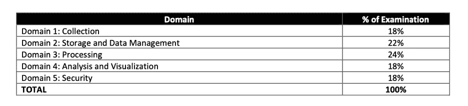
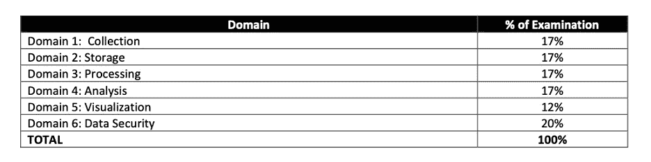

# 成为 AWS 认证数据分析专家—2020 年 4 月全新

> 原文：<https://towardsdatascience.com/becoming-an-aws-certified-data-analytics-new-april-2020-4a3ef0d9f23a?source=collection_archive---------10----------------------->

## 该认证面向设计、构建、保护和维护分析解决方案的个人。我们将介绍如何准备考试、练习测试和之前推荐的知识。

我刚刚通过了 AWS 认证数据分析专业考试(DAS-C01)，获得了我的第二个 AWS 认证。如您所知，该认证是最新的 AWS 版本(2020 年 4 月)之一，将取代 AWS 认证的大数据专业。该认证面向设计、构建、保护和维护分析解决方案的个人。

您有 3 个小时的时间来回答 65 个基于场景的问题。

由 [Bradyn Trollip](https://unsplash.com/@bradyn) 在 [Unsplash](https://unsplash.com) 上拍摄的照片

*如果你想了解更多，请访问*[***oscargarciaramos.com***](https://oscargarciaramos.com)

> [**以 50%的折扣获得为期 1 年的所有 Whizlabs 课程—立即订阅**](https://shareasale.com/r.cfm?b=1551042&u=2501293&m=43514&urllink=&afftrack=)

或者

> [**购买 100 多个 AWS 认证数据分析的独特练习题—专业考试**](https://shareasale.com/r.cfm?b=1555265&u=2501293&m=43514&urllink=&afftrack=)

# **之前推荐的 AWS 知识**

1.  AWS 认证数据分析专业(DAS-C01)考试分为及格或不及格。您有 170 分钟的时间来完成考试。它由大约 65 个问题组成。
2.  和往常一样，考试中有两种类型的问题:选择题和多选题。
3.  未回答的问题被视为不正确；猜测是没有惩罚的
4.  您的考试可能包括未评分的项目，这些项目被放在测试中以收集统计信息。这些项目在表格上没有标明，不影响你的分数。
5.  考试结果以 100-1，000 分报告，最低及格分数为 750 分。考试采用补偿评分模式，这意味着您不需要“通过”个别部分，只需通过整体考试(新)
6.  除了 2 年的 AWS 实践经验外，现在建议至少 5 年的通用数据分析技术经验才能获得该认证。(新)

# **内容大纲**

让我先来并列比较一下考试形式的变化:

**数据分析—专业**

**大数据—专业**

正如您所看到的，分析和可视化领域从 29%增加到 18%，更加重视处理(+ 8%)和存储及数据管理(+ 5%)领域。

就其本身而言，集合域的总权重增加了 1%，而安全性减少了-2%。

# 主要提示

主要服务是 EMR，红移，Kinesis 和 S3+胶水+雅典娜。这使得大约 80%的考试，而且如果你有 [**准水平认证**](https://shareasale.com/r.cfm?b=852241&u=2501293&m=50811&urllink=&afftrack=) 它将更容易通过其余的概念。

如果我不得不从头开始，我会建议花更多的时间学习最重要的概念、细节、选项和主要数据分析技术的组件，而不是练习那些肯定不同于真实考试的模拟测试。此外，截至目前，该认证的考试并不多。

我强烈建议先做 [**解决方案架构师助理**](https://shareasale.com/r.cfm?b=852241&u=2501293&m=50811&urllink=&afftrack=) ，原因如下:

*   作为进入 AWS 云世界的第一步，它要简单得多，也有用得多。
*   帮助您熟悉测试方法和节奏，以及 AWS 堆栈中的其他服务，让您真正专注于本次考试的主要数据分析技术。
*   你目前在下一次考试中获得 50%的折扣。因此，如果您选择较便宜的联营公司(150 美元)，您将获得较贵的联营公司(300 美元)的 50%。

# **如何备考**

这些是我通过考试所依赖的资源:

*   **在线课程**

毫无疑问，最优秀的课程是由 Sundog Education 的弗兰克·凯恩创建的 ***Udemy 的 AWS 认证数据分析专业 2020 (ex Big Data)*** ，夏羽·马雷克| AWS 认证解决方案架构师&开发助理弗兰克·凯恩

凭借其超过 12 小时的点播视频、全面的测试考试以及对其资源的无限访问，它是本次考试的最佳指南和最佳资源之一。

从我的角度来看，我认为有必要看两遍视频。我以 2 倍速收听，并通过浏览参考资料部分的链接白皮书和文档来复习每一堂课。

***可选:*** *您还可以报名参加云专家的 AWS 大数据专业课程，以获得所有产品和重要概念的高级概述，作为起点。目前，他们还没有推出数据分析认证的具体课程。*

*   **AWS 白皮书**

亚马逊有无数引用数据分析产品的文档。但是，我推荐数据分析学习路径中的这两篇文章，它们可以帮助您更好地理解现有的服务。就我而言，我决定阅读 Kinesis 白皮书，因为它是一种需要记住许多细节和不同实现选项的技术，例如它的生产者、消费者、加密和安全性，以及这些服务的输入和输出。

**—采用亚马逊 Kinesis 的 AWS 上的流数据解决方案(29 页)**

本[白皮书](https://d0.awsstatic.com/whitepapers/whitepaper-streaming-data-solutions-on-aws-with-amazon-kinesis.pdf)讨论了分析从批处理到实时的演变。它描述了如何使用 Amazon Kinesis Streams、Amazon Kinesis Firehose 和 Amazon Kinesis Analytics 等服务来实现实时应用程序，并提供了使用这些服务的通用设计模式。

**—AWS 上的大数据分析选项(56 页)**

本[白皮书](https://d0.awsstatic.com/whitepapers/Big_Data_Analytics_Options_on_AWS.pdf)通过提供服务概述，以及以下信息，帮助架构师、数据科学家和开发人员了解 AWS 云中可用的大数据分析选项:理想使用模式、成本模型、性能、耐用性和可用性、可扩展性和弹性、接口和反模式。

*   **AWS 培训**

**—考试准备:AWS 认证数据分析—专业(免费课程，3 小时)**

这门[课程](https://www.aws.training/Details/eLearning?id=46612)通过探索考试的主题领域，让你熟悉问题风格和考试方法，帮助你准备考试。

它以一种非常直观的方式，让你了解考试中最重要的组成部分、需要记住的最重要的细节以及考试中可能出现的问题示例。此外，它们还包括指向这些技术中通常出现的主要主题或问题的参考链接。

**这次培训**，在我看来，**必不可少**。因为这是一个如此短而有用的课程，我可以很容易地从头到尾复习 2-3 遍。

*   **模拟考试**

—去查查****。****

> **[**以 50%的折扣获得为期 1 年的所有 Whizlabs 课程—立即订阅**](https://shareasale.com/r.cfm?b=1551042&u=2501293&m=43514&urllink=&afftrack=)**

**正如我之前提到的，浏览官方 AWS 培训和认证网站上的免费样题和考试准备问题。这些问题帮助你想象考试会是什么样子，并让你评估你正在获取的知识。**

**我的情况，另外，我买了[**whiz labs**](https://shareasale.com/r.cfm?b=1555265&u=2501293&m=43514&urllink=&afftrack=)**练习测试。这些问题不遵循模型，也与官方考试问题不一致。然而，它们帮助你探索新的知识领域，这些领域你以前可能没有见过，被认为是重要的，或者在以前的材料中没有如此详细地涉及。关于 Whizlabs 的好处是，它用新的信息链接和支持材料来证明答案是正确的。****

******本次考试中您应该熟悉的流行分析服务的快速快照:******

*   ******用于流数据的 Kinesis 数据流、Kinesis 消防软管和 Kinesis 分析。******
*   ******亚马逊为卡夫卡(MSK)管理流媒体******
*   ****用于消息排队的简单队列服务(SQS)****
*   ****物联网****
*   ****AWS 数据库迁移服务(DMS)****
*   ******简单存储服务(S3)******
*   ******优化事务查询的 dynamo db******
*   ****自动气象站λ****
*   ******AWS 胶水******
*   ****使用 **Elastic MapReduce** 处理无限规模的数据，包括 Apache Spark、Hive、HBase、Presto、Zeppelin、Splunk 和 Flume****
*   ******亚马逊弹性搜索服务，**用于搜索和分析 Pb 级数据和 Kibana****
*   ******雅典娜**用于查询 S3 数据湖****
*   ******红移和红移光谱******
*   ****关系数据库服务(RDS)和极光****
*   ******Quicksight** 用于交互式可视化您的数据****
*   ****用加密保护你的数据安全， **KMS** ， **HSM** ， **IAM** ， **Cognito** ， **STS** 等等。****

# ******如何回答问题******

******采取这种方式回答问题:******

*   ****在阅读答案选项之前阅读并理解问题(假装答案选项一开始根本不存在)。****
*   ****找出问题中的关键短语和限定词。****
*   ****试着在看答案选项之前回答问题，然后看看这些答案选项是否与你的原始答案相符。****
*   ****根据你对问题的了解，排除答案选项，包括你之前强调的关键短语和限定词。****
*   ****如果你仍然不知道答案，考虑标记这个问题，然后继续问更简单的问题。但是请记住在考试时间结束前回答所有问题，因为猜错是没有惩罚的。****

# ******有用的链接******

*   ****[**获取 AWS 认证数据分析学习指南**](https://amzn.to/37vOSVt)****
*   ****[edu reka 提供的 AWS 架构师认证培训](https://shareasale.com/r.cfm?b=852241&u=2501293&m=50811&urllink=&afftrack=)掌握使用 Amazon Web Services 设计基于云的应用程序的技能。了解更多！****
*   ****[为 AWS 认证数据分析专业考试购买 100 多个独特的练习题](https://shareasale.com/r.cfm?b=1555265&u=2501293&m=43514&urllink=&afftrack=)****
*   ****[AWS 认证解决方案架构师助理考试的 17 个多小时的培训视频和 38 个实验室|立即注册](https://shareasale.com/r.cfm?b=1023388&u=2501293&m=43514&urllink=&afftrack=)****

*   ****[https://AWS . Amazon . com/certificate/certified-data-analytics-specialty/？nc1=h_ls](https://aws.amazon.com/certification/certified-data-analytics-specialty/?nc1=h_ls)****
*   ****[https://D1 . AWS static . com/training-and-certification/docs-Data-Analytics-Specialty/AWS-Certified-Data-Analytics-Specialty _ Sample-questions . pdf](https://d1.awsstatic.com/training-and-certification/docs-data-analytics-specialty/AWS-Certified-Data-Analytics-Specialty_Sample-Questions.pdf)****
*   ****[https://www.udemy.com/share/101WhCAkodeVtRQXg=/](https://www.udemy.com/share/101WhCAkodeVtRQXg=/)****
*   ****[https://d0 . AWS static . com/white papers/white paper-streaming-data-solutions-on-AWS-with-Amazon-kine sis . pdf](https://d0.awsstatic.com/whitepapers/whitepaper-streaming-data-solutions-on-aws-with-amazon-kinesis.pdf)****
*   ****[https://d0 . AWS static . com/white papers/Big _ Data _ Analytics _ Options _ on _ AWS . pdf](https://d0.awsstatic.com/whitepapers/Big_Data_Analytics_Options_on_AWS.pdf)****
*   ****[https://www.aws.training/Details/eLearning?id=46612](https://www.aws.training/Details/eLearning?id=46612)****

*****那都是乡亲。希望这篇文章对你有用。*****

*****欢迎发表评论或分享这篇文章。关注* [*me*](https://medium.com/@ogarciaramos) *未来岗位。😉*****

****祝你考试顺利！****

*****记住，如果你想了解更多，你可以在*[***oscargarciaramos.com***](https://oscargarciaramos.com)找到我****

## ****[与+1K 人一起加入我的电子邮件列表，获取更多独家内容](https://www.oscargarciaramos.com/newsletter-exclusive-content)****

**** [## AWS 认证数据分析-专业是由亚马逊网络服务培训和…

### 获得这一认证的人对如何使用 AWS 服务进行数据收集、存储…

www.youracclaim.com](https://www.youracclaim.com/badges/0b507f03-8d5d-40bf-b950-eedcfa763480/public_url)****