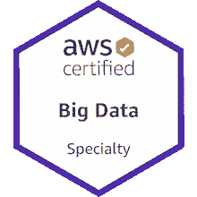

# 在 2 个月内获得 AWS 大数据专业认证

> 原文：<https://towardsdatascience.com/becoming-aws-certified-in-big-data-specialty-in-2-months-ecf77d3e06db?source=collection_archive---------28----------------------->

AWS 考试学习指南&忙碌的专业人士的小贴士

斯蒂芬·道森在 [Unsplash](https://unsplash.com?utm_source=medium&utm_medium=referral) 上拍摄的照片

我最近通过了 [AWS 大数据专业考试](https://aws.amazon.com/certification/certified-big-data-specialty/)，获得了我的第二个 AWS 认证。去年我参加了 Google Cloud 的[同等学力考试，分享了我用来通过考试的](https://cloud.google.com/certification/data-engineer)[学习资料集](https://github.com/Leverege/gcp-data-engineer-exam)。在这篇文章中，我分享了我的学习指南和我用来在短时间内获得认证的计划。在这次考试之前，我已经完成了助理解决方案架构师考试，并且拥有不到一年的 AWS 大数据产品工作经验。

# 学习计划

这个学习计划是为繁忙的专业人士在紧张的时间表成为 AWS 认证而设计的。为了真正深入了解 AWS 大数据解决方案和设计最佳实践，我会将研究计划扩展到实验室工作，获得实践经验，并通读公开的案例研究。

## 在线课程

由于我并不熟悉所有的 AWS 大数据产品，我首先报名参加了云专家的 AWS 大数据专业课程[，以获得所有产品和重要概念的高级概述。我以 2 倍速收听，并通过浏览参考资料部分的链接白皮书和文档来复习每一堂课。](https://acloud.guru/learn/aws-certified-big-data-specialty)

## Youtube re:发明视频或白皮书

AWS 有大量关于每个大数据产品的在线文档，但观看云专家或其他博客( [Simon 的帖子、](https://medium.com/@simonleewm/my-path-to-aws-big-data-speciality-certification-4baff3a8150)Ashwin 的帖子[)推荐的 re:Invent 视频或精选白皮书节省了时间，并专注于重要的设计考虑事项，而不是考试中未测试的低级细节。请仔细注意图表和比较图，以及对每个产品的限制。](https://ashwin.cloud/blog/aws-certified-big-data-specialty/)

**重要链接:**

*   [AWS re:Invent 2019:Amazon dynamo db deep dive—高级设计模式](https://aws.amazon.com/dynamodb/resources/reinvent-2019-advanced-design-patterns/)
*   [AWS re:Invent 2019:用亚马逊 Kinesis 搭建流媒体数据平台](https://www.youtube.com/watch?v=TAkcRD6OxPw)
*   [AWS re:Invent 2019:亚马逊红移的深度探索和最佳实践](https://www.youtube.com/watch?v=lj8oaSpCFTc)
*   [AWS re:Invent 2019:深入研究在亚马逊 EMR 上运行 Apache Spark](https://www.youtube.com/watch?v=aIwJlfEAlHQ)
*   【2018 年创新大会上的 AWS 大数据和分析会议

## 安全性和 Hadoop 工具集开发人员指南

您仍然需要通读每个 AWS 产品的[开发人员指南](https://docs.aws.amazon.com/index.html)中的安全部分，以记住加密选项、备份机制和跨区域复制。除非您有针对各种加密约束进行设计的实践经验，或者在工作中使用跨区域备份构建全局表，否则这一部分主要是记忆。Hadoop 生态系统也是如此。了解何时使用 Presto vs. Hive 以及流行的 Hadoop 产品的高级描述。

**重要链接:**

*   (Skim) [亚马逊 EMR 迁移指南](https://d1.awsstatic.com/whitepapers/amazon_emr_migration_guide.pdf?did=wp_card&trk=wp_card)
*   [红移安全](https://docs.aws.amazon.com/redshift/latest/dg/c_security-overview.html)
*   [DynamoDB 安全](https://docs.aws.amazon.com/amazondynamodb/latest/developerguide/security.html)

## 模拟考试

浏览 AWS 官方培训和认证网站上的免费[样题](https://d1.awsstatic.com/training-and-certification/docs-bigdata-spec/BD-S%20Sample%20Questions%20for%20Web.pdf)和[考试准备问题](https://www.aws.training/Details/Curriculum?id=21332)。我发现这些测试不太关注大数据，但仍然很好地代表了 AWS 风格的问题。我还从 [Whizlabs](https://www.whizlabs.com/aws-certified-big-data-specialty/) 买了练习题。考试形式与正式考试不一致，因此如果您在模拟考试中得分较低，也不要气馁(例如，在真正的考试中，没有多项选择题，您必须从 6 个选项中选择 4 个正确答案)。最重要的是找出不同产品或概念的知识差距。

# 学习指南

我整理了一份[学习指南](https://github.com/Yitaek/aws-big-data-exam)来复习关于 Kinesis、EMR、数据管道、DynamoDB、QuickSight、Glue、Redshift、Athena 和 AWS 机器学习服务的大量测试主题。在实际考试中，我发现 EMR、红移和 DynamoDB 依次是重点。对于每种产品，关注以下主题:

*   **Kinesis** :数据流、消防水管、视频流和数据分析的区别。KPL(聚集/收集)、KCL 和 Kinesis 代理收集数据的概念和最佳实践。
*   **DynamoDB** :表格设计(WCU/RCU，GSI/LSI)，加密和安全，使用最佳实践提高性能
*   **EMR:** Hadoop 生态系统，加密&安全选项，选择最佳格式以提高性能
*   **红移**:加载、复制、更新和删除数据的最佳实践。访问控制、加密、安全和复制选项。
*   **其他**:对每种产品及其如何适应大数据的高层次理解(例如，使用 Lambda 过滤数据或将数据路由到 S3/红移)

最后，AWS 将在 4 月份更新大数据考试，并将头衔更名为数据分析专业。然而，根据网上的考试描述，似乎涵盖的主题保持不变，但我们将看到测试人员的结果何时开始出来。

祝你考试好运！

(你可以看看我的徽章)